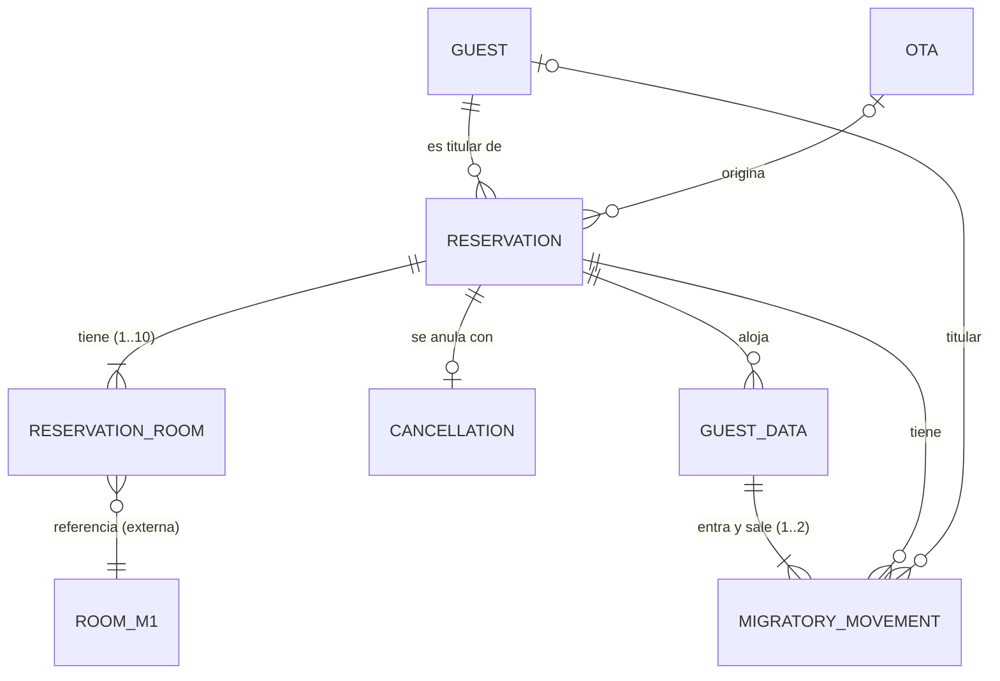
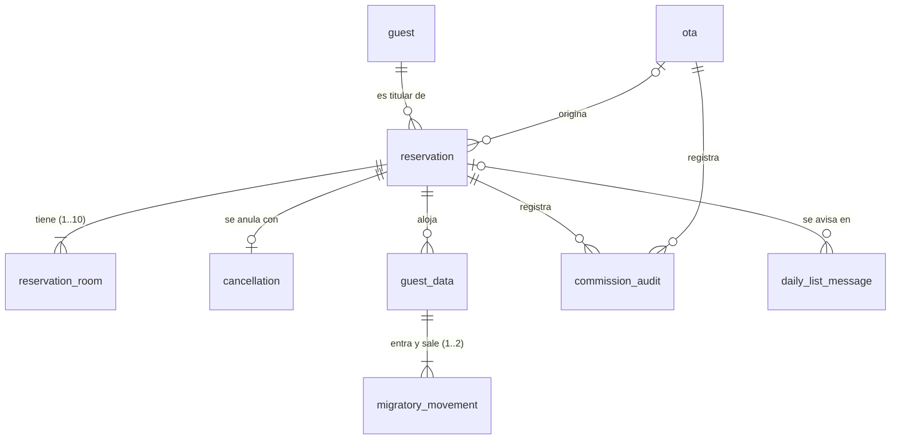

# Implementation Plan: Base del Módulo 2 (plataforma compartida)

**Date**: 2026-10-03  
**Spec**: [diccionario.md](../diccionario.md) (contrato de integración) y los `spec.md` de las 12 features  
en `specs/*/`. Este plan no implementa una feature: deja lista la base que todos los planes de
feature reutilizan.

## Summary

El Módulo 2 (Operación de Reservas y Cumplimiento Legal) es el dueño del ciclo de vida de las
reservas (`Reservation.status`) y de `ReservationRoom.stayStatus`. Registra reservas directas
(Recepcionista) y recibe las de OTA por API, las modifica, las cancela, cierra el día (No-Show),
recibe del Módulo 1 los avisos de Check-In y Check-Out por habitación (con los datos de todos los
huéspedes de la habitación), y genera el reporte SIRE.
Consulta al Módulo 1 (inventario y calendario de mantenimientos) y al Módulo 3 (tarifa dinámica), le
envía por cola la lista de reservas del día y sus actualizaciones. **No le ordena apartar ni liberar
habitaciones**: el Módulo 1, dueño del estado de las habitaciones, decide qué hace con esa lista.

Este plan fija lo que comparten las 12 features: stack, arquitectura hexagonal, estructura, modelo de
datos, contratos de integración (REST y colas), manejo uniforme de errores (siempre 4xx, nunca 500),
tareas programadas y pruebas. Cada plan de feature (`specs/[feature]/plan.md`) depende de este y solo
describe lo propio.

## Technical Context

- **Language/Version**: TypeScript (modo `strict`), con la versión que fija el proyecto generado por
  Nest CLI; se deja con versión exacta en `package.json`. Node.js 22 LTS (`.nvmrc`)
- **Framework backend**: NestJS
- **Primary Dependencies**: `@nestjs/config`, `@nestjs/typeorm` + `typeorm` + `pg`, `class-validator`,
  `class-transformer`, `@golevelup/nestjs-rabbitmq`, `@nestjs/schedule`, `@nestjs/axios`,
  `@nestjs/passport` + `@nestjs/jwt`, `@nestjs/swagger`, `nestjs-pino`, `decimal.js`, `luxon`
- **Storage**: PostgreSQL
- **Messaging**: RabbitMQ
- **Architecture**: hexagonal (puertos y adaptadores), con un solo dominio general (`src/domain/`)
- **Package manager**: pnpm (monorepo con `pnpm-workspace.yaml`)
- **Testing**: Jest, supertest, Testcontainers para Node; Vitest + Testing Library en el frontend
- **Target Platform**: servidor Linux/Windows + navegador web
- **Project Type**: web application (`backend/` + `frontend/`)
- **API**: REST, documentada con OpenAPI (`@nestjs/swagger`)
- **Frontend**: React + Vite + React Router + TanStack Query
- **Version Control**: Git + GitHub (Gitflow)
- **Performance Goals**: cualquier llamada REST responde en menos de 1 segundo en el 95 % de los
  casos, con 5 recepcionistas y hasta 5 solicitudes por segundo de las OTA a la vez, salvo que la spec
  del caso de uso fije otro tiempo. Se mantienen los tiempos de cada spec: cancelación local
  < 200 ms, Check-In/Check-Out < 500 ms, recotización < 3 s, exportación SIRE < 2 s para 500
  huéspedes, cierre del día < 1 min para 1000 reservas, página del listado < 1 s con hasta 50 000
  reservas.
- **Constraints**: tiempo máximo de espera de 1 s al Módulo 1 y de 3 s al Módulo 3 (si no responden,
  nunca se asume disponibilidad ni tarifa); ningún error sale como 500; no se escriben datos
  personales en los logs; el día operativo es el de Colombia (`America/Bogota`); disponible 24/7,
  porque las OTA reservan a cualquier hora.
- **Scale/Scope**: hasta 100 habitaciones en hasta 10 categorías, 5 recepcionistas a la vez, 5
  agencias OTA conectadas, 300 reservas nuevas por día y 50 000 reservas guardadas en total.

### Decisiones de stack

| Necesidad | Decisión | Por qué |
|---|---|---|
| Versión de TypeScript | La que trae el proyecto de `nest new`, fija y con `strict` | Es la combinación que Nest prueba; no se actualiza por separado |
| ORM | TypeORM (aprobado) | Permite escribir a mano el SQL propio de PostgreSQL (D3, bloqueo asesor, `FOR UPDATE`) dentro de las migraciones |
| Migraciones de esquema | Migraciones de TypeORM escritas en SQL, versionadas en `backend/src/migrations` | El esquema no se genera solo desde las clases: se revisa y se versiona |
| Librería de RabbitMQ | `@golevelup/nestjs-rabbitmq` (aprobado) | Exchange topic, reintentos con espera creciente y dead-letter sin armarlos a mano |
| Gestor de paquetes | pnpm (aprobado) | Instalación rápida, dependencias estrictas y filtros por paquete (`pnpm --filter backend test`) |
| Control de concurrencia | Comparación de `updatedAt` (`@UpdateDateColumn` de TypeORM, con precisión de microsegundos) al guardar | Edición y cancelación simultáneas (`CONCURRENT_UPDATE`) |
| Dinero | `decimal.js`, columnas `numeric(14,2)`, redondeo `ROUND_HALF_UP`; **nunca `number`** | Comisión exacta |
| Fechas | Fechas puras `AAAA-MM-DD` (texto `date` en la base) y `luxon` para el día operativo en `America/Bogota` | Evita corrimientos por zona horaria. Se guardan e intercambian como `AAAA-MM-DD`; las pantallas las muestran como `dd/mm/aaaa` |
| Autenticación y autorización | Passport + JWT y guards por rol | Las specs exigen interfaces seguras y que cada Ota vea solo sus reservas |
| Tareas programadas | `@nestjs/schedule` con `timeZone: 'America/Bogota'` | Envío de la lista del día (00:00), cierre del día (23:59) y reintento de avisos pendientes |
| Exclusión mutua de tareas con varias instancias | Bloqueo asesor de PostgreSQL (C10) | Evitar que dos instancias ejecuten el mismo cierre del día |
| Timeouts y reintentos REST | `@nestjs/axios` con timeout; `cockatiel` si se necesitan reintentos o corte de circuito | No asumir disponibilidad ante caídas |
| Logs y correlación | `nestjs-pino` + `AsyncLocalStorage` (identificador de correlación por solicitud) | Seguir un mensaje o una solicitud de punta a punta |

## Arquitectura hexagonal

El backend tiene **un solo dominio general** (`src/domain/`), compartido por todas las features. No hay
un dominio por módulo: las entidades del Módulo 2 (`Reservation`, `Guest`, `Ota`, `MigratoryMovement`...)
están relacionadas entre sí y sus reglas se cruzan (una cancelación cambia el estado de la reserva y
genera avisos al Módulo 1; un Check-In cambia la reserva y registra movimientos migratorios), así
que viven juntas. Las dependencias siempre apuntan hacia adentro:
`infrastructure` → `application` → `domain`.

| Capa | Contiene | Puede importar |
|---|---|---|
| `domain/` | **Todas** las entidades y objetos de valor del Módulo 2, sus relaciones, los enumerados, las reglas de negocio (invariantes y tabla de transiciones de `status`) y los errores de negocio. Ver "Modelo de dominio" | Solo TypeScript puro (y `decimal.js` para dinero). **Nada de Nest, TypeORM ni RabbitMQ** |
| `application/` | Un caso de uso por feature de las specs (puertos de entrada y servicios) y los puertos de salida (repositorios, Módulo 1, Módulo 3, publicador de eventos, reloj) | `domain/` |
| `infrastructure/in/` | Adaptadores de entrada: controladores REST, consumidores RabbitMQ, tareas programadas | `application/` (puertos de entrada) |
| `infrastructure/out/` | Adaptadores de salida: repositorios TypeORM, clientes HTTP del Módulo 1 y 3, publicadores RabbitMQ, reloj | `application/` (implementan los puertos de salida) |

Reglas:

1. Los controladores, consumidores y tareas programadas **solo llaman a un caso de uso**; no tienen
   reglas de negocio.
2. Las entidades del dominio no son las de TypeORM. El adaptador de persistencia tiene sus propias clases
   de tabla y las convierte con un mapeador.
3. Los módulos 1 y 3 se ven solo como puertos (`Module1Port`, `Module3Port`). Si cambia su API, solo se
   cambia el adaptador. Sus datos (`Room`, `MaintenanceCalendar`, `RateQuote`) son
   objetos de integración en `application/`, no entidades del dominio.
4. La inyección de dependencias de Nest une los puertos con sus adaptadores (símbolos como
   `RESERVATION_REPOSITORY`); el dominio nunca usa `@Injectable`.
5. Las dependencias entre capas se verifican en CI con `eslint-plugin-boundaries` (o
   `dependency-cruiser`): `domain/` no importa nada de `application/` ni de `infrastructure/`.
6. Los casos de uso no se llaman entre sí por sus clases internas: si uno necesita a otro (por ejemplo,
   cancelar y modificar usan "Consultar y buscar reservas"), lo usa por su puerto de entrada.

## Modelo de dominio

Todas las entidades viven en `src/domain/`. Los tipos son los del dominio (TypeScript); las tablas
están en "Modelo de datos base".

### Entidades y atributos

**Reservation** (raíz del agregado de la reserva)

| Atributo | Tipo | Regla |
|---|---|---|
| `reservationRef` | texto, único | Formato `RSV-` + 8 caracteres hexadecimales en mayúscula (por ejemplo `RSV-3F9A1C7B`). Lo genera el Módulo 2 al crear la reserva; si el generado ya existe, genera otro. Es el identificador con el que los demás módulos la referencian |
| `guestRef` | referencia a `Guest` | Titular, obligatorio |
| `guestCount` | entero | Total de personas: suma de los `guestCount` de sus habitaciones |
| `rooms` | lista de `ReservationRoom` | Entre 1 y 10, sin repetir `roomId` |
| `startDate`, `endDate` | fecha sin hora | `endDate` > `startDate`; comunes a todas las habitaciones |
| `source` | `ReservationSource` | `DIRECT` u `OTA` |
| `otaId` | referencia a `Ota` | Solo si `source` es `OTA` |
| `externalConfirmationCode` | texto | Solo `OTA`; único por agencia |
| `grossAmount`, `currency` | dinero | Solo `OTA`: valor bruto que envía la agencia (`totalAmount` en su JSON); base de la comisión |
| `commissionPercentage`, `commissionAmount` | decimal | `0` en `DIRECT`; en `OTA`, `grossAmount × commissionPercentage / 100` |
| `commissionStatus` | `CommissionStatus` | Solo `OTA` |
| `notes` | texto | Opcional, máximo 500 caracteres |
| `status` | `ReservationStatus` | Solo cambia por la tabla de transiciones |
| `statusReason` | texto | Motivo de la última transición (D6) |
| `createdAt`, `updatedAt` | fecha y hora | `updatedAt` es el control de concurrencia optimista |

**ReservationRoom** (parte del agregado `Reservation`; no existe sin su reserva)

| Atributo | Tipo | Regla |
|---|---|---|
| `roomId` | id externo | `Room.id` del Módulo 1 |
| `roomNumber` | texto | Copia del número del Módulo 1, guardada al asignarla |
| `guestCount` | entero | Personas de esa habitación: ≥ 1 y ≤ `maxCapacity` |
| `categoryRoom` | texto | Categoría de la habitación |
| `roomGrossAmount`, `currency` | dinero | Solo `DIRECT`: el `lodgingAmount` y la moneda de la cotización del Módulo 3, sin cálculos |
| `quoteId` | texto | Solo `DIRECT`: identificador de la cotización; el Módulo 3 lo usa para cobrar en el Check-Out |
| `stayStatus` | `StayStatus` | Estado de esa habitación dentro de la reserva |

**Guest** (titular de reservas)

| Atributo | Tipo | Regla |
|---|---|---|
| `id` (`guestRef`) | id | |
| `firstName`, `lastName` | texto | Obligatorios; el nombre completo (`fullName`) se arma uniéndolos |
| `documentType` | `DocumentType` | Obligatorio |
| `documentNumber` | texto | Obligatorio; identifica al huésped existente |
| `nationality` | texto | Si no es Colombia, el huésped es extranjero (se deduce, no se guarda) |
| `contactPhone`, `contactEmail` | texto | Opcionales |

**Ota** (agencia; se registra sola por su API)

| Atributo | Tipo | Regla |
|---|---|---|
| `id`, `name`, `hotelAccountId` | texto | Enviados por la OTA |
| `commissionPercentage` | decimal de 0 a 100 | Porcentaje pactado por defecto |
| `connectionStatus` | `CONNECTED` o `DISCONNECTED` | |
| `linkedAt`, `lastSyncAt` | fecha y hora | |

**Cancellation** (registro inmutable de la anulación): `cancellationId`, `reservationRef`,
`cancellationDate`, `reason` (opcional), `channel` (`RECEPTION` | `OTA_API`), `processedBy`, `status`
(`COMPLETED`).

**GuestData** (datos de cada huésped, colombiano o extranjero, guardados una sola vez por reserva):
`reservationRef`, `firstName`, `lastName`, `documentType`, `documentNumber`, `birthDate`,
`nationality`, `originPlace`, `destinationPlace` (estos dos solo son obligatorios para extranjeros;
para colombianos pueden estar vacíos). Identidad única: (`reservationRef`, `documentNumber`).
Se crea en el Check-In y no se modifica; el Check-Out solo agrega el `DEPARTURE`.

**MigratoryMovement** (entrada o salida de un huésped): `movementId`, su `GuestData`, `movementType`
(`ENTRY` | `DEPARTURE`) y `movementDate`. Sin datos personales copiados: la reserva (`reservationRef`),
el documento (`documentNumber`) y el titular (`guestRef`) se obtienen de su `GuestData`. Identidad
única: un movimiento de cada tipo por `GuestData`.

**SireExport** (histórico de descargas del archivo SIRE): `id`, `exportDate`, `exportKind` (`PERIOD` |
`SINGLE_MOVEMENT`), `recordsCount`, `dateRangeStart`, `dateRangeEnd`, `processedBy`. No marca los
movimientos.

**DailyReservationList** y **DailyReservationUpdate** (mensajes al Módulo 1): ver
`check-view-reservation`. Se guardan en `daily_list_message` para no reenviar la lista y respetar el
`sequenceNumber`.

### Enumerados (objetos de valor)

| Enumerado | Valores |
|---|---|
| `ReservationStatus` | `PENDING`, `ACTIVE`, `IN_PROGRESS`, `COMPLETED`, `CANCELLED`, `NO_SHOW` |
| `StayStatus` | `EXPECTED`, `CHECKED_IN`, `CHECKED_OUT`, `NOT_ARRIVED` |
| `ReservationSource` | `DIRECT`, `OTA` |
| `CommissionStatus` | `CALCULATED`, `RECONCILED`, `PAID`, `DISPUTED` |
| `DocumentType` | `RC`, `TI`, `CC`, `CE`, `PAS`, `NIT` |
| `MovementType` | `ENTRY`, `DEPARTURE` |
| `MigrationStatus` (derivado, no se guarda) | `AWAITING_CHECK_IN`, `COMPLETE`, `NOT_REQUIRED`, `NO_CHECK_IN` |

### Relaciones

| Relación | Cardinalidad | Notas |
|---|---|---|
| `Guest` → `Reservation` | 1 a N | Un huésped puede ser titular de varias reservas; cada reserva tiene un solo titular |
| `Reservation` → `ReservationRoom` | 1 a 1..10 | Composición: las habitaciones se crean, cambian y borran solo a través de su reserva |
| `Ota` → `Reservation` | 1 a N | Solo reservas `OTA`; `(otaId, externalConfirmationCode)` es único |
| `Reservation` → `Cancellation` | 1 a 0..1 | Solo cancelaciones explícitas (Recepcionista u OTA); el No-Show no crea `Cancellation` |
| `Reservation` → `GuestData` | 1 a N | Un `GuestData` por huésped de la reserva, único por `documentNumber` |
| `GuestData` → `MigratoryMovement` | 1 a 1..2 | Máximo un `ENTRY` y un `DEPARTURE` por huésped |
| `Reservation` → `MigratoryMovement` | 1 a N | Los movimientos de todos sus huéspedes |
| `Guest` → `MigratoryMovement` | 1 a 0..N | Cuando el huésped es el titular de la reserva; los acompañantes no son `Guest` |
| `SireExport` y `MigratoryMovement` | sin relación guardada | La exportación solo filtra por `movementDate` |
| `ReservationRoom` → `Room` (Módulo 1) | N a 1, externa | Por `roomId`; el estado físico es del Módulo 1 |



### Agregados e invariantes

- **Agregado `Reservation`** (raíz `Reservation`, con sus `ReservationRoom`). Todo cambio pasa por la
  raíz y se guarda en una sola transacción. Invariantes:
  - Entre 1 y 10 habitaciones, sin repetir `roomId`; el `guestCount` de cada habitación es ≥ 1 y ≤ su
    `maxCapacity`, y el de la reserva es la suma.
  - `status` y `stayStatus` solo cambian por la tabla de transiciones:
    - Primera habitación en `CHECKED_IN` → la reserva pasa a `IN_PROGRESS`.
    - Ninguna habitación en `EXPECTED` ni en `CHECKED_IN`, y al menos una `CHECKED_OUT` → `COMPLETED`.
    - Cierre del día sin ningún Check-In → `NO_SHOW` (sea OTA o directa); sus habitaciones pasan a
      `NOT_ARRIVED`.
  - Solo se modifican o cancelan reservas en `ACTIVE` o `PENDING`; las `OTA` solo por su API.
  - Las reservas `DIRECT` no guardan un total (se calcula al mostrarlo) y no tienen comisión; las `OTA` no tienen tarifa ni cotización por habitación.
- **`Guest`** y **`Ota`**: agregados propios; la reserva los referencia por id.
- **`Cancellation`**, **`GuestData`**, **`MigratoryMovement`**, **`SireExport`**: registros propios que referencian a la reserva por `reservationRef`. Son inmutables una
  vez creados.

### Datos externos (no son entidades del dominio)

`Room` y `MaintenanceCalendar` (Módulo 1) y `RateQuote` (Módulo 3) son objetos de integración de los
puertos. No se persisten: de `RateQuote` se copian el `lodgingAmount`, el `quoteId` y la moneda a
`ReservationRoom`. La lista `guests` del Check-In se guarda en `GuestData`.

## Comunicación entre módulos

Regla: **proactiva** (el módulo avisa un evento y no espera respuesta) → **cola RabbitMQ**;
**reactiva** (necesita un dato o confirmación inmediata) → **REST**.

| Interacción | Dirección | Mecanismo | Tipo | Feature |
|---|---|---|---|---|
| Check-In por habitación (con la lista de huéspedes) | M1 → M2 | Cola `m2.habitacion.checkin.queue` | Proactiva | `update-reservation` |
| Check-Out por habitación (con la lista de huéspedes) | M1 → M2 | Cola `m2.habitacion.checkout.queue` | Proactiva | `update-reservation` |
| Lista de reservas del día y sus actualizaciones | M2 → M1 | Cola `m1.reservas.diarias.queue` | Proactiva | `check-view-reservation` |
| Consultar inventario de habitaciones | M2 → M1 | REST GET | Reactiva | `consult-room-inventory` |
| Consultar calendario de mantenimientos | M2 → M1 | REST GET | Reactiva | `consult-maintenance-calendar` |
| Consultar % de comisión OTA | M3 → M2 | REST GET | Reactiva | `register-ota-information-commission` |
| Consultar tarifa dinámica | M2 → M3 | REST POST (cuerpo JSON) | Reactiva | `calculate-dynamic-rate` |
| Consultar las reservas de un rango de fechas (y habitación) para validar un mantenimiento o dar de baja una habitación | M1 → M2 | REST GET | Reactiva | `check-view-reservation` (FR-023) |
| Consultar una reserva por su referencia (`quoteIds`, canal y datos de la OTA) para liquidar en el Check-Out | M3 → M2 | REST GET | Reactiva | `check-view-reservation` (FR-022) |

El Módulo 1 **ya no consulta la lista de reservas** al Módulo 2 por REST: la recibe por cola. Solo
consulta las reservas entre una fecha de inicio y una de fin al registrar un mantenimiento o dar de baja una habitación (`check-view-reservation`,
FR-023); la lógica sobre esas reservas la aplica el Módulo 1. Las
interacciones M1 ↔ M3 (liquidación, tarifa base, registrar check-out) no involucran al Módulo 2.

### Convenciones de colas

- Exchange compartido: `hospitua.events` (tipo topic). Convención de nombres de cola:
  `m<módulo destino>.<recurso>.<evento>.queue`.
- Colas que **recibe** el Módulo 2 (las publica el Módulo 1):

| Cola | Routing key | Mensaje |
|---|---|---|
| `m2.habitacion.checkin.queue` | `habitacion.checkin` | Una por habitación que ingresa |
| `m2.habitacion.checkout.queue` | `habitacion.checkout` | Una por habitación que sale |

- Cola que **envía** el Módulo 2 (la consume el Módulo 1): `m1.reservas.diarias.queue`, con dos routing
  keys que se publican por el mismo canal y proceso, para conservar el orden:

| Routing key | Mensaje | `sequenceNumber` |
|---|---|---|
| `reserva.lista-del-dia` | `DailyReservationList`, una vez al día a las 00:00 | Siempre `1` |
| `reserva.lista-del-dia.actualizacion` | `DailyReservationUpdate` (`ADDED`, `UPDATED`, `REMOVED`) | Creciente dentro del día operativo |

- Mensajes JSON **planos**, sin envoltura: los campos van en la raíz y el tipo de mensaje lo da la
  routing key. Todo mensaje, en los dos sentidos, lleva `messageId` (UUID que se genera una sola vez,
  cuando ocurre el hecho, se guarda con el envío pendiente y se repite igual en los reintentos) y
  `sequenceNumber`. Las reglas de cada lado están en las specs: `check-view-reservation` (FR-018) para
  la lista del día y `update-reservation` (FR-023) para el Check-In y el Check-Out.
- Consumidores idempotentes (se ignoran los `messageId` repetidos), con reintentos y dead-letter queue.
- La publicación de la lista del día y de sus actualizaciones respeta el orden: las actualizaciones
  esperan detrás de la lista (ver `check-view-reservation`).

### Traducción de respuestas HTTP a cola (decisión C1)

Los specs describen "responde 200/400" para el Check-In y el Check-Out. Como el Módulo 1 los emite
por cola y no espera respuesta, el consumidor del Módulo 2 aplica estas reglas:

| Caso en el spec | Comportamiento del consumidor |
|---|---|
| Notificación válida | Procesa el cambio de la habitación y confirma el mensaje |
| Duplicado (mismo `messageId`, o habitación ya en `CHECKED_IN`/`CHECKED_OUT`) | Confirma sin efectos (el "200 idempotente") |
| Reserva inexistente, o en un estado que no admite el evento, o habitación ya `NOT_ARRIVED` | Lo deja en el log (sin datos personales) y confirma el mensaje, sin reintentar (el "400") |
| Payload ilegible, sin `reservationRef` o `roomId`, o con caracteres maliciosos | Envía el mensaje a la dead-letter queue, sin procesar (el "400" de payload inválido) |
| Fallo temporal (base de datos caída, por ejemplo) | Reintenta con espera creciente y, agotados los reintentos, a la dead-letter queue |

El contenido exacto de cada mensaje está en el plan de su caso de uso:

- Check-In y Check-Out: [`update-reservation/plan.md`](../update-reservation/plan.md).
- Lista del día y sus actualizaciones: [`check-view-reservation/plan.md`](../check-view-reservation/plan.md).

## Contratos REST

**El Módulo 2 expone** (rutas propuestas, se fijan en cada plan de feature):

| Recurso | Quién lo consume | Feature |
|---|---|---|
| `GET /api/reservations` con paginación de 10, filtros (búsqueda por `reservationRef`, documento o nombre; estado; canal; agencia; tipo de fecha `ARRIVAL`/`DEPARTURE`/`STAY` con `from` y `to`) y orden por `startDate` | Recepcionista, procesos internos | `check-view-reservation` |
| `GET /api/reservations/{reservationRef}` (detalle) | Recepcionista; Módulo 3 con credencial de servicio (devuelve `quoteIds`, canal y, solo si es OTA, `otaId`, `otaConfirmationCode` y `otaCommissionPercentage`; 404 si no existe) | `check-view-reservation` |
| `POST /api/reservations/direct/preview` y `POST /api/reservations/direct` (canal directo) | Recepcionista | `generate-direct-reservation` |
| `POST /api/reservations/{reservationRef}/modification-preview` y `PATCH /api/reservations/{reservationRef}` | Recepcionista (solo directas); la OTA modifica las suyas por su canal | `update-reservation` |
| `POST /api/reservations/{reservationRef}/cancellation` | Recepcionista (solo directas); la OTA cancela las suyas por su canal | `cancel-reservation` |
| `POST /api/ota/reservations` y `POST /api/ota/reservations/{reservationRef}/confirmation` (pago o garantía) | Ota | `generate-ota-reservation` |
| `GET /api/guest-stays` (vista de huéspedes alojados: paginación de 10, filtros de nacionalidad, situación y periodo, búsqueda por documento o nombre) y `GET /api/reservations/{reservationRef}/guests/{documentNumber}` (detalle de un huésped) | Recepcionista | `process-guest-data` |
| `POST /api/sire/exports` (periodo o movimiento individual; devuelve `.TXT` y cabecera `Export-Id`; es `POST` porque registra un `SireExport`, decisión D9) | Recepcionista | `export-sire-file` |
| `GET /api/otas` y `GET /api/otas/{otaId}` (solo lectura; devuelve `id`, `name`, `commissionPercentage`, estado de conexión) | Recepcionista, Módulo 3 | `register-ota-information-commission` |
| `POST /api/ota-commissions/reconciliations` (conciliación de comisiones) | Módulo 3 (finanzas) | `register-ota-information-commission` |

Las agencias OTA se registran **automáticamente** al vincular la cuenta por API: el Módulo 2 no tiene
rutas de alta ni edición manual (`POST`/`PUT /api/otas` quedan fuera).

> **Pendiente: caso de uso "Configurar OTA".** Cada OTA se tiene que configurar para integrarse con el
> Módulo 2. Un caso de uso futuro, con su propia spec y su propio plan, definirá cómo la OTA se registra
> y actualiza sus datos y su comisión, cómo avisa su desvinculación y su nueva vinculación, y por qué
> rutas modifica y cancela sus reservas. Hasta entonces, este plan solo fija las rutas de crear y
> confirmar reservas OTA.

**El Módulo 2 consume** (a través de los puertos `Module1Port` y `Module3Port`):

| Servicio | Método | Feature |
|---|---|---|
| Habitaciones vendibles por `categoryRoom` (o una por `roomId`): `id`, `roomNumber`, `categoryRoom`, `maxCapacity`; sin estado | M1 GET | `consult-room-inventory` |
| Calendario de mantenimientos por `roomId` y rango de fechas (contrato en [`consult-maintenance-calendar/plan.md`](../consult-maintenance-calendar/plan.md)) | M1 GET | `consult-maintenance-calendar` |
| Tarifa dinámica por habitación (contrato en [`calculate-dynamic-rate/plan.md`](../calculate-dynamic-rate/plan.md)) | M3 POST | `calculate-dynamic-rate` |

**Errores**: cuerpo `{ "errorCode", "message", "timestamp", "path" }` con HTTP 400 (por defecto, también
para recursos inexistentes, como piden los specs), 409 (conflicto de disponibilidad) o 429 (exportación
SIRE). La única excepción es la consulta de una reserva por referencia para el Módulo 3, que
responde 404 si no existe, como lo espera ese módulo. El diccionario prohíbe 500 y cualquier 2xx o 3xx
para un error.

## Project Structure

### Documentation (this feature)

```text
specs/
├── diccionario.md
├── base/
│   └── plan.md                  # Este archivo
└── [feature]/
    ├── spec.md
    └── plan.md                  # Referencia a specs/base/plan.md
```

### Source Code (repository root)

```text
package.json                      # scripts del monorepo
pnpm-workspace.yaml               # backend y frontend
.nvmrc                            # Node 22 LTS
docker-compose.yml                # PostgreSQL y RabbitMQ para desarrollo

backend/
├── package.json
├── nest-cli.json
├── tsconfig.json                 # strict
├── Dockerfile
└── src/
    ├── main.ts
    ├── app.module.ts
    ├── domain/                   # DOMINIO GENERAL, único para todo el Módulo 2 (TypeScript puro)
    │   ├── reservation/          #   Reservation (raíz), ReservationRoom, transiciones de status y stayStatus
    │   ├── guest/                #   Guest
    │   ├── ota/                  #   Ota, regla de comisión
    │   ├── cancellation/         #   Cancellation
    │   ├── migration/            #   GuestData, MigratoryMovement, SireExport, MigrationStatus (derivado)
    │   ├── shared/               #   enumerados, Money (decimal.js), día operativo, errores de negocio
    │   └── index.ts              #   API pública del dominio
    ├── application/
    │   ├── ports/out/            # ReservationRepository, GuestRepository, ..., Module1Port, Module3Port,
    │   │                         #   EventPublisher, Clock
    │   ├── integration/          # objetos de integración: Room, MaintenanceCalendar, RateQuote
    │   └── use-cases/            # un caso de uso por feature de las specs (puerto de entrada + servicio):
    │       ├── generate-direct-reservation/
    │       ├── generate-ota-reservation/
    │       ├── check-view-reservation/       # incluye la lista del día al Módulo 1
    │       ├── update-reservation/           # incluye Check-In, Check-Out y cierre del día
    │       ├── cancel-reservation/
    │       ├── check-room-availability/
    │       ├── consult-room-inventory/
    │       ├── consult-maintenance-calendar/
    │       ├── calculate-dynamic-rate/
    │       ├── register-ota-information-commission/
    │       ├── process-guest-data/
    │       └── export-sire-file/
    ├── infrastructure/
    │   ├── in/
    │   │   ├── rest/             # controladores REST
    │   │   ├── messaging/        # consumidores RabbitMQ (Check-In y Check-Out)
    │   │   └── jobs/             # lista del día (00:00), cierre del día (23:59), reintentos
    │   ├── out/
    │   │   ├── persistence/      # clases de tabla TypeORM, mapeadores y repositorios
    │   │   ├── module1/          # cliente HTTP del Módulo 1
    │   │   ├── module3/          # cliente HTTP del Módulo 3
    │   │   ├── messaging/        # publicadores RabbitMQ, idempotencia (processed_message)
    │   │   └── clock/            # reloj del hotel (America/Bogota)
    │   ├── config/               # configuración por entorno (@nestjs/config), RabbitMQ, TypeORM
    │   ├── security/             # JWT, guards y roles
    │   └── shared/               # ApiError, filtro global de excepciones, correlación de logs
    └── migrations/               # migraciones SQL de TypeORM
test/
    ├── unit/                     # dominio y casos de uso, sin base de datos ni cola
    ├── integration/              # Testcontainers (PostgreSQL, RabbitMQ)
    └── contract/                 # contratos REST y de mensajes

frontend/
├── package.json
├── vite.config.ts
└── src/
    ├── components/
    ├── pages/                    # pantallas de la Recepcionista (única vista del Módulo 2)
    ├── services/                 # clientes de la API del backend
    └── test/
```

**Structure Decision**: aplicación web `backend/` + `frontend/` en un monorepo pnpm. El backend se
organiza **por capas hexagonales**, con un solo `domain/` general para todo el Módulo 2: las entidades
están relacionadas y sus reglas se cruzan entre features, así que separarlas por módulo duplicaría
reglas. Las features de las specs se reflejan en `application/use-cases/`. El frontend cubre solo a la
Recepcionista; la Ota solo usa la API y el Módulo 1 tiene su propia interfaz.

## Diseño técnico base

### Modelo de datos base (PostgreSQL)

**Convenciones**

- Nombres de tablas y columnas en `snake_case`. Cada tabla tiene clave primaria `id uuid`
  (`gen_random_uuid()`), salvo donde se indica otra.
- Fechas sin hora: `date`. Fechas con hora: `timestamptz` (`updated_at` con precisión de
  microsegundos, porque es el control de concurrencia).
- Dinero: `numeric(14,2)`. Porcentajes: `numeric(5,2)` de 0 a 100 (`30.00` es el 30 %). Moneda:
  `char(3)` (código ISO 4217, por ejemplo `COP`).
- Estados y tipos: texto con un `CHECK` de los valores permitidos (no se usan tipos `enum` de
  PostgreSQL, para poder agregar valores con una migración simple).
- `nationality` guarda el nombre del país tal como llega (`Colombia`, `Venezuela`, `Estados Unidos`);
  el huésped es extranjero si no es exactamente `Colombia`. Así se exporta al SIRE.
- Extensiones creadas en la migración base: `btree_gist` (anti-solape, D3), `pg_trgm` y `unaccent`
  (búsqueda por nombre sin distinguir mayúsculas ni tildes).
- Datos que **no** se guardan en tablas: `Room` y `MaintenanceCalendar` (Módulo 1) y `RateQuote`
  (Módulo 3) viajan solo en objetos de integración; el código del hotel en SIRE (`hotelSireCode`) y el
  código de la ciudad (`hotelCityCode`) van en la configuración del sistema (variables de entorno).



**`guest`** — titular de reservas

| Columna | Tipo | Nulo | Regla |
|---|---|---|---|
| `id` | `uuid` | no | PK (`guestRef`) |
| `first_name`, `last_name` | `varchar(100)` | no | |
| `document_type` | `varchar(3)` | no | `RC`, `TI`, `CC`, `CE`, `PAS`, `NIT` |
| `document_number` | `varchar(30)` | no | |
| `nationality` | `varchar(60)` | no | Nombre del país |
| `contact_phone` | `varchar(30)` | sí | |
| `contact_email` | `varchar(254)` | sí | |
| `created_at`, `updated_at` | `timestamptz` | no | |

Único `(document_type, document_number)`. Índice trigram sobre `unaccent(first_name || ' ' || last_name)`.

**`ota`** — agencia; se registra sola por su API

| Columna | Tipo | Nulo | Regla |
|---|---|---|---|
| `id` | `uuid` | no | PK |
| `name` | `varchar(100)` | no | Único |
| `hotel_account_id` | `varchar(100)` | no | Único |
| `commission_percentage` | `numeric(5,2)` | no | De 0 a 100 |
| `connection_status` | `varchar(12)` | no | `CONNECTED`, `DISCONNECTED` |
| `linked_at` | `timestamptz` | no | Fecha de la primera vinculación; no cambia al volver a vincular |
| `last_sync_at` | `timestamptz` | no | Se actualiza con cada mensaje de la OTA |
| `created_at`, `updated_at` | `timestamptz` | no | |

**`reservation`** — raíz del agregado

| Columna | Tipo | Nulo | Regla |
|---|---|---|---|
| `id` | `uuid` | no | PK |
| `reservation_ref` | `char(12)` | no | Único; `CHECK (reservation_ref ~ '^RSV-[0-9A-F]{8}$')`; si el generado ya existe, se genera otro |
| `guest_id` | `uuid` | no | FK → `guest` |
| `source` | `varchar(6)` | no | `DIRECT`, `OTA` |
| `ota_id` | `uuid` | sí | FK → `ota`; solo `OTA` |
| `external_confirmation_code` | `varchar(50)` | sí | Solo `OTA` |
| `start_date`, `end_date` | `date` | no | `CHECK (end_date > start_date)` |
| `guest_count` | `smallint` | no | `CHECK (guest_count >= 1)`; suma de sus habitaciones |
| `status` | `varchar(12)` | no | `PENDING`, `ACTIVE`, `IN_PROGRESS`, `COMPLETED`, `CANCELLED`, `NO_SHOW` |
| `status_reason` | `varchar(200)` | sí | Motivo de la última transición (D6) |
| `notes` | `varchar(500)` | sí | |
| `gross_amount` | `numeric(14,2)` | sí | Solo `OTA`: valor bruto que envía la agencia (`totalAmount`) |
| `currency` | `char(3)` | sí | Solo `OTA`: moneda del `gross_amount` |
| `commission_percentage` | `numeric(5,2)` | no | `0` por defecto; de 0 a 100; en `OTA`, el de la agencia al registrar la reserva |
| `commission_amount` | `numeric(14,2)` | no | `0` por defecto; `CHECK (commission_amount >= 0)`; en `OTA`, `gross_amount × commission_percentage / 100` |
| `commission_status` | `varchar(10)` | sí | Solo `OTA`: `CALCULATED`, `RECONCILED`, `PAID`, `DISPUTED` |
| `created_at` | `timestamptz` | no | |
| `updated_at` | `timestamptz(6)` | no | Control de concurrencia (`@UpdateDateColumn`) |

- Único `(ota_id, external_confirmation_code)`.
- `CHECK` de canal:
  - `DIRECT`: `ota_id`, `external_confirmation_code`, `gross_amount`, `currency` y
    `commission_status` nulos, y `commission_percentage = 0` y `commission_amount = 0`.
  - `OTA`: `ota_id`, `external_confirmation_code`, `gross_amount`, `currency` y
    `commission_status` no nulos.
- Índices: `(status, start_date)`, `(end_date)`, `(guest_id)`, `(ota_id)`.

**`reservation_room`** — habitación dentro de la reserva

| Columna | Tipo | Nulo | Regla |
|---|---|---|---|
| `id` | `uuid` | no | PK |
| `reservation_id` | `uuid` | no | FK → `reservation`, borrado en cascada |
| `room_id` | `uuid` | no | `Room.id` del Módulo 1, sin FK |
| `room_number` | `varchar(10)` | no | Copia del número del Módulo 1, guardada al asignarla |
| `category_room` | `varchar(50)` | no | |
| `guest_count` | `smallint` | no | `CHECK (guest_count >= 1)`; el tope (`maxCapacity`) lo valida la aplicación, porque viene del Módulo 1 |
| `room_gross_amount` | `numeric(14,2)` | sí | Solo `DIRECT`: `lodgingAmount` de la cotización (D2) |
| `quote_id` | `varchar(64)` | sí | Solo `DIRECT` |
| `currency` | `char(3)` | sí | Solo `DIRECT` |
| `stay_status` | `varchar(12)` | no | `EXPECTED` por defecto; `EXPECTED`, `CHECKED_IN`, `CHECKED_OUT`, `NOT_ARRIVED` |
| `start_date`, `end_date` | `date` | no | Copia de las fechas de su reserva (D3) |
| `blocks_inventory` | `boolean` | no | `true` mientras la habitación ocupa inventario (D3) |

- Único `(reservation_id, room_id)`.
- `CHECK`: `room_gross_amount`, `quote_id` y `currency` van los tres o ninguno.
- **Anti-solape (D3):** `EXCLUDE USING gist (room_id WITH =, daterange(start_date, end_date, '[)') WITH &&) WHERE (blocks_inventory)`.
- Índice `(room_id)`.

**`cancellation`** — registro inmutable de la anulación

| Columna | Tipo | Nulo | Regla |
|---|---|---|---|
| `id` | `uuid` | no | PK (`cancellationId`) |
| `reservation_id` | `uuid` | no | FK → `reservation`; único (0..1 por reserva) |
| `cancellation_date` | `timestamptz` | no | |
| `reason` | `varchar(500)` | sí | |
| `channel` | `varchar(10)` | no | `RECEPTION`, `OTA_API` |
| `processed_by` | `varchar(100)` | no | Identificador de quien canceló (Recepcionista u OTA) |
| `status` | `varchar(10)` | no | Siempre `COMPLETED` |

**`guest_data`** — datos de todos los huéspedes, una vez por reserva

| Columna | Tipo | Nulo | Regla |
|---|---|---|---|
| `id` | `uuid` | no | PK |
| `reservation_id` | `uuid` | no | FK → `reservation` |
| `document_type` | `varchar(3)` | no | `RC`, `TI`, `CC`, `CE`, `PAS`, `NIT` |
| `document_number` | `varchar(30)` | no | |
| `first_name`, `last_name` | `varchar(100)` | no | |
| `birth_date` | `date` | no | |
| `nationality` | `varchar(60)` | no | Nombre del país |
| `origin_place`, `destination_place` | `varchar(100)` | sí | Vacíos para colombianos |
| `created_at` | `timestamptz` | no | Sin `updated_at`: se crea en el Check-In y no se modifica |

Único `(reservation_id, document_number)`. Índices: `(document_number)` y trigram sobre
`unaccent(first_name || ' ' || last_name)`. No hay `CHECK` de procedencia y destino: el Módulo 2 da
por hecho que el Módulo 1 los envía completos para los extranjeros (D5).

**`migratory_movement`** — entrada o salida de un huésped

| Columna | Tipo | Nulo | Regla |
|---|---|---|---|
| `id` | `uuid` | no | PK (`movementId`) |
| `guest_data_id` | `uuid` | no | FK → `guest_data` |
| `movement_type` | `varchar(9)` | no | `ENTRY`, `DEPARTURE` |
| `movement_date` | `date` | no | |
| `created_at` | `timestamptz` | no | |

Único `(guest_data_id, movement_type)`. Índice `(movement_date)` para el periodo del SIRE. La
reserva, el documento y el titular (`guestRef`) se obtienen de su `guest_data`: el titular es el
huésped cuyo documento coincide con el `guest` de la reserva.

**`sire_export`** — histórico de descargas del archivo SIRE

| Columna | Tipo | Nulo | Regla |
|---|---|---|---|
| `id` | `uuid` | no | PK (`exportId`) |
| `export_date` | `timestamptz` | no | |
| `export_kind` | `varchar(15)` | no | `PERIOD`, `SINGLE_MOVEMENT` |
| `records_count` | `integer` | no | `CHECK (records_count >= 0)` |
| `date_range_start`, `date_range_end` | `date` | sí | Obligatorios si es `PERIOD` |
| `processed_by` | `varchar(100)` | no | La Recepcionista |

Sin relación con los movimientos: la exportación solo filtra por `movement_date` (D7).

**`commission_audit`** — registro auditable de cada comisión (FR-010 de `register-ota-information-commission`)

| Columna | Tipo | Nulo | Regla |
|---|---|---|---|
| `id` | `uuid` | no | PK |
| `reservation_id` | `uuid` | no | FK → `reservation` |
| `ota_id` | `uuid` | no | FK → `ota` |
| `action` | `varchar(12)` | no | `CALCULATED`, `RECONCILED`, `PAID`, `DISPUTED` |
| `previous_status` | `varchar(10)` | sí | Estado de la comisión antes de la acción |
| `gross_amount` | `numeric(14,2)` | no | |
| `commission_percentage` | `numeric(5,2)` | no | |
| `commission_amount` | `numeric(14,2)` | no | |
| `channel` | `varchar(10)` | no | `OTA_API` (cálculo) o `MODULE3` (conciliación) |
| `performed_by` | `varchar(100)` | no | |
| `occurred_at` | `timestamptz` | no | |

Inmutable. Índice `(reservation_id)`.

**`daily_list_message`** — avisos al Módulo 1; se guardan antes de publicarse

| Columna | Tipo | Nulo | Regla |
|---|---|---|---|
| `message_id` | `uuid` | no | PK; es el `messageId` del mensaje |
| `operational_date` | `date` | no | |
| `sequence_number` | `integer` | no | `CHECK (sequence_number >= 1)`; la lista es `1` |
| `message_kind` | `varchar(6)` | no | `LIST`, `UPDATE` |
| `update_type` | `varchar(8)` | sí | Solo `UPDATE`: `ADDED`, `UPDATED`, `REMOVED` |
| `reservation_id` | `uuid` | sí | FK → `reservation`; solo `UPDATE` |
| `removal_reason` | `varchar(12)` | sí | Solo `REMOVED`: `CANCELLED`, `DATE_CHANGED`, `NO_SHOW` |
| `payload` | `jsonb` | no | El JSON exacto que se publica |
| `publish_status` | `varchar(9)` | no | `PENDING`, `PUBLISHED`, `FAILED` |
| `attempts` | `smallint` | no | `0` por defecto |
| `created_at` | `timestamptz` | no | |
| `published_at` | `timestamptz` | sí | |

- Único `(operational_date, sequence_number)`.
- Único parcial `(operational_date) WHERE message_kind = 'LIST'`: una sola lista por día.
- Índice `(publish_status, operational_date, sequence_number)` para reintentar en orden.

**`processed_message`** — mensajes recibidos del Módulo 1 (idempotencia)

| Columna | Tipo | Nulo | Regla |
|---|---|---|---|
| `message_id` | `uuid` | no | PK |
| `queue` | `varchar(60)` | no | Cola de la que llegó |
| `sequence_number` | `bigint` | no | Para detectar saltos (FR-023 de `update-reservation`) |
| `processed_at` | `timestamptz` | no | |

Se inserta en la misma transacción que el cambio que produce el mensaje.

`migrationStatus` es solo un dato de pantalla: se calcula, no se guarda.

### Reglas transversales que todos los planes de feature heredan

1. **Transiciones de `status` en un solo lugar.** La tabla de transiciones vive en el dominio
   (`PENDING`→`ACTIVE`, `ACTIVE`→`IN_PROGRESS`, `IN_PROGRESS`→`COMPLETED`, `ACTIVE`/`PENDING`→`CANCELLED`,
   `ACTIVE`/`PENDING`→`NO_SHOW`) y un único servicio de aplicación (`ReservationStatusService`) la
   aplica con bloqueo optimista. `update-reservation` lo usa para confirmación OTA, Check-In, Check-Out,
   y No-Show; `cancel-reservation` lo invoca dentro de su propia transacción.
2. **Sin órdenes de estado al Módulo 1.** El Módulo 2 no aparta ni libera habitaciones: crear,
   modificar o cancelar una reserva solo se refleja en la lista del día (`ADDED`, `UPDATED`,
   `REMOVED`) y la reserva nunca depende de una respuesta del Módulo 1. No hay saga ni compensación.
3. **Avisos al Módulo 1 con orden.** Todo aviso lleva `messageId` y `sequenceNumber` creciente dentro
   del día operativo, se publica después de confirmar el cambio y, si falla, queda pendiente y se
   reintenta en orden.
4. **Tareas programadas** (zona horaria `America/Bogota`, idempotentes, con bloqueo asesor): envío de la
   lista del día a las 00:00; cierre del día al terminar las 23:59 (No-Show:
   `NO_SHOW` para cualquier canal, sin `Cancellation`; habitaciones no llegadas pasan a
   `NOT_ARRIVED`); y reintento de los avisos pendientes. El día operativo es fijo y no es configurable.
5. **Errores uniformes.** Un filtro global de excepciones traduce toda excepción a `ApiError` 4xx; un
   conflicto de `updatedAt` (ediciones o cancelaciones simultáneas) es siempre 400 `CONCURRENT_UPDATE`.
   Ningún error no controlado sale como 500; el filtro genérico registra el detalle en el log y responde
   un error controlado sin datos de infraestructura.
6. **Clientes de otros módulos** detrás de puertos (`Module1Port`, `Module3Port`) con timeout.
   Ante fallo, cada feature decide, pero nunca se asume disponibilidad ni tarifa por defecto o a cero.
7. **Mensajería.** Mensajes planos con `messageId` y `sequenceNumber`. El consumidor registra el
   `messageId` en `processed_message` dentro de la misma transacción que el cambio. Reintentos con
   backoff y dead-letter queue.
8. **Nomenclatura del diccionario**: `Reservation.status`, `roomNumber`, `startDate`/`endDate`,
   `externalConfirmationCode`, `grossAmount`, `categoryRoom`, `reservationRef`; estados del Módulo 1
   en PascalCase (`Available`, `Reserved`, `Occupied`, ...).
9. **OTA solo lectura.** Las reservas de canal OTA solo las cambian o cancelan la propia OTA (canal
   `OTA_API`); la Recepcionista no puede. Cancelar una reserva OTA no toca la comisión.

### Decisiones de diseño tomadas al escribir los planes de feature

| # | Decisión | Origen |
|---|---|---|
| D1 | **La confirmación de una cotización no confía en el importe de la pantalla.** Al confirmar, el servidor vuelve a cotizar con el Módulo 3 y lo compara con las tarifas por habitación que vio el solicitante; si difiere, responde 400 "La tarifa cambió, vuelva a cotizar". Nunca se guarda un monto enviado por el cliente; de la `RateQuote` solo se guardan `lodgingAmount` y `quoteId` en la habitación. Lo aplican `generate-direct-reservation` y `update-reservation`. | `calculate-dynamic-rate` |
| D2 | **La tarifa se guarda por habitación, sin total guardado:** `reservation_room` guarda `room_gross_amount` (el `lodgingAmount`), `quote_id` y `currency` tal como las entrega el Módulo 3 (FR-002); el `quote_id` permite al Módulo 3 cobrar en el Check-Out exactamente el valor cotizado. Su única operación con ellas es sumarlas para mostrar el total de la reserva, que no se guarda. | `calculate-dynamic-rate` |
| D3 | **Anti-solape con una restricción de exclusión en PostgreSQL** sobre `reservation_room`. Cada habitación guarda una copia de las fechas de su reserva (`start_date`, `end_date`) y `blocks_inventory`, que vale `true` mientras la reserva está en `PENDING`, `ACTIVE` o `IN_PROGRESS` y la habitación en `EXPECTED` o `CHECKED_IN`. Restricción: `EXCLUDE USING gist (room_id WITH =, daterange(start_date, end_date, '[)') WITH &&) WHERE (blocks_inventory)`, con la extensión `btree_gist`. El rango `'[)'` deja que una salida y una llegada el mismo día no choquen. El agregado `Reservation` actualiza esas copias en la misma transacción cada vez que cambian las fechas, el `status` o el `stayStatus`. Impide dos reservas solapadas en la misma habitación aunque se guarden al mismo tiempo; una violación se traduce en 409 `NO_AVAILABILITY` (o en probar la siguiente habitación candidata). | `check-room-availability` |
| D5 | **Datos migratorios completos:** el Módulo 2 da por hecho que el Módulo 1 los envía completos y correctos; no los valida ni los devuelve. | `process-guest-data` |
| D6 | **Motivo de las transiciones:** columna `status_reason` en `reservation`. | `update-reservation` |
| D7 | **Periodo de la exportación SIRE:** se filtra por la `movementDate` del movimiento migratorio. | `process-guest-data`, `export-sire-file` |
| D8 | **API de modificación en dos pasos:** `POST .../modification-preview` (no persiste) y `PATCH` (confirma, con `updatedAt` y las tarifas esperadas por habitación). Propuesta de los planes; el spec no define su forma. | `update-reservation` |
| D9 | **La exportación SIRE es `POST`**, no `GET`, porque crea un registro `SireExport` (un `GET` no debe tener efectos). | `export-sire-file` |
| D10 | **Arquitectura hexagonal** con un solo `domain/` general para todo el Módulo 2 y las capas `application` (un caso de uso por feature) e `infrastructure` (in/out). Verificada en CI. | Este plan |
| D11 | **Migraciones escritas en SQL**, no generadas desde las clases de TypeORM, para controlar `EXCLUDE`, índices parciales y bloqueos. | Este plan |

## Estrategia de testing base

- **Unitarios** (Jest): dominio y casos de uso sin base de datos ni cola; reglas de negocio, tabla de
  transiciones, cálculo de comisión (`decimal.js`), reglas del día operativo.
- **Integración** (Jest + Testcontainers): PostgreSQL y RabbitMQ reales; concurrencia optimista
  (`updatedAt`), unicidad de `(operational_date, sequence_number)` en los avisos al Módulo 1,
  restricción anti-solape, idempotencia de consumidores (`messageId`), dead-letter.
- **Contrato**: adaptadores de `Module1Port` y `Module3Port` contra respuestas simuladas (por ejemplo
  `nock` o `msw`): éxito, rechazo, timeout y respuesta ambigua; y forma de los mensajes de cola.
- **API** (supertest): controladores con los casos de uso reales y el filtro global de errores.
- **Arquitectura**: la verificación de dependencias entre capas corre como parte de las pruebas.
- **Cada escenario Gherkin** de un `spec.md` debe tener al menos una prueba de integración en el plan
  de su feature.
- **Frontend**: Vitest + Testing Library en pantallas críticas (listado con filtros, paginación,
  modificar, cancelar, exportación SIRE).

## Phase 1: Setup (Shared Infrastructure)

- [ ] T001 Crear el monorepo pnpm: `pnpm-workspace.yaml`, `package.json` raíz, `.nvmrc` (Node 22 LTS) y las carpetas `backend/` y `frontend/`
- [ ] T002 Generar `backend/` con Nest CLI (TypeScript `strict`, versión fija) e instalar las dependencias de Technical Context
- [ ] T003 Inicializar `frontend/` con React + Vite + TypeScript
- [ ] T004 [P] Configurar ESLint, Prettier y `eslint-plugin-boundaries` (capas hexagonales) en backend y frontend
- [ ] T005 [P] Crear `docker-compose.yml` con PostgreSQL y RabbitMQ para desarrollo
- [ ] T006 Configurar `@nestjs/config` por entorno (dev, test) con variables de entorno validadas

---

## Phase 2: Foundational (Blocking Prerequisites)

**⚠️ CRÍTICO**: Ninguna feature puede empezar hasta terminar esta fase.

- [ ] T007 Definir el esquema base (tablas de Diseño técnico base), la extensión `btree_gist` y la restricción de exclusión (D3) con migraciones SQL de TypeORM
- [ ] T008 [P] Crear el dominio y la persistencia de `Reservation`, `ReservationRoom`, `Guest` y `Ota` (entidades de dominio, clases de tabla TypeORM, mapeadores y repositorios)
- [ ] T009 [P] Crear `ApiError`, los errores de negocio y el filtro global de excepciones en `shared/`
- [ ] T010 [P] Crear el reloj del hotel (`America/Bogota`, día operativo 00:00–23:59) y el módulo de dinero con `decimal.js`
- [ ] T011 Implementar `ReservationStatusService` con la tabla de transiciones en el dominio y bloqueo optimista (depende de T008, T009)
- [ ] T012 [P] Implementar los puertos `Module1Port` y `Module3Port` con sus adaptadores HTTP (timeouts) y objetos de integración
- [ ] T013 Configurar RabbitMQ con `@golevelup/nestjs-rabbitmq`: exchange `hospitua.events`, colas, routing keys, reintentos y dead-letter
- [ ] T014 Crear `processed_message` y la idempotencia por `messageId` en `messaging/`
- [ ] T015 Configurar la infraestructura de pruebas (Jest, supertest y Testcontainers de PostgreSQL y RabbitMQ)
- [ ] T016 [P] Esqueleto del frontend: enrutamiento, cliente HTTP, TanStack Query y manejo de errores de API
- [ ] T017 Configurar autenticación y autorización (Passport + JWT, guards) con los roles `RECEPTIONIST`, `OTA`, `MODULE1` y `MODULE3` (los dos últimos, de servicio a servicio)
- [ ] T018 Configurar logs (`nestjs-pino`) y correlación de solicitudes
- [ ] T019 Configurar el bloqueo asesor de PostgreSQL y el planificador (`@nestjs/schedule`, `America/Bogota`) para las tareas programadas
- [ ] T020 Configurar OpenAPI (`@nestjs/swagger`) y la verificación de dependencias entre capas en CI

**Checkpoint**: Base lista; los planes de feature pueden implementarse.

---

## Orden recomendado de los 12 planes de feature

1. **Consultas y servicios base**: `check-view-reservation`, `consult-room-inventory`,
   `consult-maintenance-calendar`, `calculate-dynamic-rate`.
2. **Disponibilidad**: `check-room-availability` (usa las tres consultas anteriores).
3. **Datos migratorios y punto de estado**: primero `process-guest-data`, y después `update-reservation`
   (modificación, Check-In, Check-Out y cierre del día; depende de disponibilidad, tarifa
   y del registro del movimiento migratorio).
4. **Creación de reservas y comisión**: `generate-direct-reservation`, `register-ota-information-commission` (antes que la de OTA) y
   `generate-ota-reservation`.
5. **Cancelación**: `cancel-reservation`.
6. **Cumplimiento legal**: `export-sire-file` (depende de `process-guest-data`).

## Dependencies & Execution Order

- **Setup (Fase 1)**: sin dependencias. **Foundational (Fase 2)**: depende de Setup y bloquea a todos
  los planes de feature.
- Los planes de feature dependen de este plan base y entre sí según el orden anterior.
- Dentro de cada feature: dominio, casos de uso, adaptadores, endpoints y pruebas de integración por escenario.

## Contradicciones detectadas y decisiones tomadas

Las contradicciones entre la especificación técnica, los specs, el diccionario y los diagramas
quedaron decididas. La tabla registra cada decisión.

| # | Contradicción | Decisión |
|---|---|---|
| C1 | Los specs dicen que el Módulo 1 "envía a la API del Módulo 2" el Check-In y el Check-Out y que este "responde HTTP 200/400". La especificación técnica y el diagrama de integración los definen como **cola**, donde no hay respuesta HTTP al Módulo 1. | **DECIDIDO: solo cola.** Reglas en "Traducción de respuestas HTTP a cola". |
| C2 | El diagrama de integración muestra "Datos de huéspedes extranjeros" como **cola separada**; los specs los recibían **dentro** de la notificación de Check-In y de Check-Out. | **DECIDIDO: dentro del Check-In y del Check-Out.** Cada notificación trae la lista `guests` con todos los huéspedes de la habitación; no hay cola separada. El Módulo 2 selecciona los extranjeros por nacionalidad al exportar el SIRE. |
| C3 | (a) "Consultar estado de canales OTA" (M3 → M2) no existe en los specs; el diagrama tiene "Consultar % de comisión OTA" (M3 → M2, REST GET). (b) "Error de huésped no encontrado" (M1 → M2) no aparece en ningún spec. | **DECIDIDO (a): se adopta como "Consultar % de comisión OTA"**, REST GET; el Módulo 2 expone `GET /api/otas/{otaId}`. **DECIDIDO (b): fuera del plan** hasta que el Módulo 1 confirme su función y exista un spec. |
| C4 | "Consultar calendario de mantenimientos" no está en la especificación técnica ni en el diagrama de integración, pero sí en los specs y el diccionario. | **DECIDIDO: REST GET reactiva (M2 → M1)**, igual que el inventario. |
| C5 | El diagrama de casos de uso muestra que "Generar reservación por OTA" incluye "Calcular tarifa dinámica"; el spec y el diccionario dicen que **no** se recalcula: usa el valor bruto que envía la OTA. | **DECIDIDO: según el spec y el diccionario.** El Módulo 2 no llama al Módulo 3 en la reserva OTA, para que la comisión cuadre con lo que cobró la agencia. |
| C6 | El diccionario nombra `grossAmount` en `Reservation`; algunos specs usaban `totalAmount`. | **DECIDIDO: un solo nombre interno, `grossAmount`** (columna `gross_amount`, solo en reservas OTA: las directas guardan la tarifa por habitación, D2). `totalAmount` queda solo como nombre del campo en el JSON que envía la OTA. |
| C7 | Fórmula de comisión sin `/100`, con validación 0–100%. | **DECIDIDO: porcentaje de 0 a 100 y se divide entre 100.** `commissionAmount = grossAmount × commissionPercentage / 100`, con `decimal.js`, 2 decimales y redondeo `ROUND_HALF_UP`; el valor queda positivo en el Módulo 2 (el signo lo aplica el Módulo 3). |
| C10 | Las tareas programadas no tienen mecanismo definido y con varias instancias podrían ejecutarse dos veces. | **DECIDIDO: `@nestjs/schedule` con bloqueo asesor de PostgreSQL** (`pg_try_advisory_lock`, consulta nativa). Si otra instancia tiene el bloqueo, se salta esa ejecución. El día operativo es fijo (00:00–23:59, Colombia). La idempotencia que piden los specs sigue siendo la garantía principal. |
| C11 | El plan estaba escrito para Java y Spring Boot. | **DECIDIDO: NestJS, TypeScript, TypeORM, `@golevelup/nestjs-rabbitmq`, pnpm y arquitectura hexagonal.** Se eliminó el proyecto Spring/Gradle del repositorio. |

## Notes

- `[P]` marca tareas paralelizables; `[US1]` (en los planes de feature) las liga a su historia de usuario.
- Cada plan de feature debe indicar en su encabezado: `Plan base: ../base/plan.md`.
- Cómo escribir el plan de cada caso de uso: [guia-planes-por-caso-de-uso.md](guia-planes-por-caso-de-uso.md).
- No se programa una feature hasta que su SPEC esté validado y su PLAN revisado.
- Commit por tarea o grupo lógico, con Gitflow.
