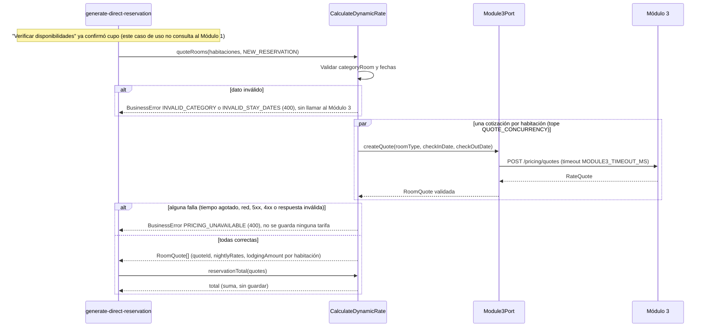
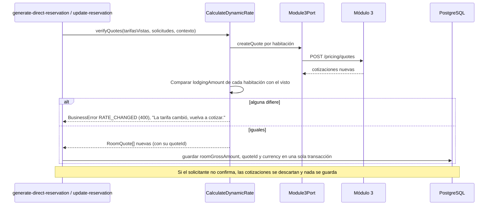
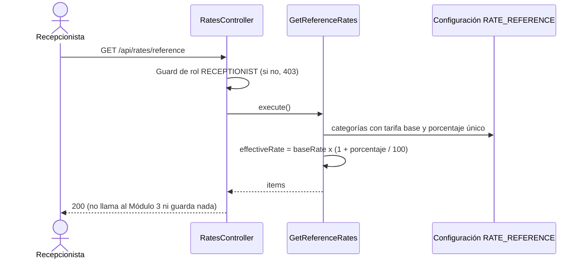

# Implementation Plan: Calcular tarifa dinámica (`calculate-dynamic-rate`)

**Plan base**: [../base/plan.md](../base/plan.md)
**Spec**: [./spec.md](spec.md)
**Guía**: [../base/guia-planes-por-caso-de-uso.md](../base/guia-planes-por-caso-de-uso.md)

## Summary

El Módulo 2 no calcula tarifas: las produce el motor de precios del Módulo 3. Este caso de uso es el
**cliente síncrono de ese motor**. Hace cuatro cosas:

1. **Cotiza una habitación** (`POST /pricing/quotes`) con su categoría y las fechas de la estadía, y
   recibe una `RateQuote` (`quoteId`, `currency`, `nightlyRates`, `lodgingAmount`).
2. **Cotiza una reserva completa, todo o nada**: una cotización por habitación; si una sola falla, no
   se guarda ninguna tarifa y no se asume ninguna por defecto ni a cero (FR-002a, FR-003, FR-004).
3. **Decide qué habitaciones hay que recotizar** cuando se modifica una reserva: todas si cambian las
   fechas; solo las nuevas o de categoría distinta si cambian las habitaciones; ninguna si solo se cambia
   una habitación por otra de la misma categoría.
4. **Muestra una tarifa de referencia por categoría** (pantalla "Tarifas"), local, sin llamar al
   Módulo 3 y sin usarse nunca como tarifa de una reserva (FR-009).

De la cotización el Módulo 2 guarda solo el `lodgingAmount` (como `roomGrossAmount`), el `quoteId` y la
`currency` en cada `ReservationRoom`. **No guarda un total**: el total de la reserva es la suma de los
`lodgingAmount` de sus habitaciones y se calcula al mostrarlo. Es la única operación aritmética con las
tarifas: no hay diferencias, IVA ni comisiones (el Módulo 3 cobra al hacer el Check-Out, exactamente lo
cotizado).

Los casos de uso que reservan o modifican (`generate-direct-reservation`, `update-reservation`) **llaman
a este** por su puerto de entrada, y la consulta del Módulo 3 por referencia (`quoteIds`, FR-010) la
atiende `check-view-reservation`.

## Resumen técnico e identificación

| Dato | Valor |
|---|---|
| Caso de uso | Calcular tarifa dinámica (`calculate-dynamic-rate`) |
| Spec | [spec.md](./spec.md), historias 1 y 2 y FR-001 a FR-010 |
| Actores | `generate-direct-reservation` y `update-reservation` (internos); Recepcionista (pantalla "Tarifas"); Módulo 3 (motor de precios) |
| Naturaleza | Cliente síncrono del Módulo 3; sin tablas propias (escribe, a través de otros casos de uso, columnas de `reservation_room`) |

| # | Capacidad | Disparador | Actor | Contrato |
|---|---|---|---|---|
| 1 | Cotizar una reserva (todo o nada) | Llamada interna (puerto de entrada) | `generate-direct-reservation`, `update-reservation` | B1 |
| 2 | Decidir qué habitaciones recotizar | Llamada interna (función de dominio) | `update-reservation` | B2 |
| 3 | Total de la reserva | Llamada interna (función de dominio) | `generate-direct-reservation`, `update-reservation` | B3 |
| 4 | Verificar tarifas al confirmar | Llamada interna (puerto de entrada) | `generate-direct-reservation`, `update-reservation` | B4 |
| 5 | Pantalla "Tarifas" | REST `GET /api/rates/reference` | Recepcionista | C1 |
| 6 | Cotización de una habitación | REST `POST` al Módulo 3 | Módulo 2 → Módulo 3 | A1 |

## Technical Context

El stack, la arquitectura hexagonal y el manejo de errores son los del [plan base](../base/plan.md).
Lo propio de este caso de uso:

- **Dependencias nuevas**: `lossless-json` (o equivalente) para leer los importes del Módulo 3 sin
  pasar por `number` (ver "Precisión del dinero").
- **Almacenamiento**: ninguno propio. Las cotizaciones **no se guardan** mientras el solicitante no
  confirma; una cotización no confirmada se descarta.
- **Configuración**: `MODULE3_BASE_URL`, `MODULE3_TIMEOUT_MS` (por defecto `3000`),
  `QUOTE_CONCURRENCY` (por defecto `5`) y la configuración de la pantalla "Tarifas" (ver C1).
- **Performance** (NFR-001): desde que se emite la solicitud hasta que se guarda la tarifa, menos de 1,5 s
  en condiciones normales.

## Contratos

### A. Cotización al Módulo 3 (Módulo 2 → Módulo 3, REST POST)

**A1. `POST {MODULE3_BASE_URL}/pricing/quotes`**: contrato **ya acordado con el equipo del Módulo 3**.
Los nombres son los de la API del Módulo 3 y equivalen a los del Módulo 2: `roomType` = `categoryRoom`,
`checkInDate` = `startDate`, `checkOutDate` = `endDate`. Se pide **una cotización por habitación**.

**Cabeceras**: `Authorization: Bearer <JWT de servicio>`, `Content-Type: application/json`.

**Solicitud**

```json
{
  "roomType": "DOBLE",
  "checkInDate": "2026-10-10",
  "checkOutDate": "2026-10-12"
}
```

La cantidad de personas (`guestCount`) **no se envía**: el precio depende de la categoría y de las
fechas.

**Respuesta (`RateQuote`)**

```json
{
  "quoteId": "Q-12345",
  "currency": "COP",
  "nightlyRates": [
    { "date": "2026-10-10", "rate": 250000 },
    { "date": "2026-10-11", "rate": 280000 }
  ],
  "lodgingAmount": 530000
}
```

Los valores del ejemplo son ilustrativos. De la respuesta, el Módulo 2 guarda en cada `ReservationRoom`
solo el `lodgingAmount` (como `roomGrossAmount`), el `quoteId` y la `currency` (decisiones D1 y D2 del
plan base). Las tarifas por noche (`nightlyRates`) se usan para mostrar el detalle antes de confirmar y
**no se guardan**.

### B. Puerto de entrada interno

Los demás casos de uso usan estos servicios. Manejan dinero con `Money` (`decimal.js`, plan base), nunca
con `number`.

```typescript
interface RoomQuoteRequest { key: string; categoryRoom: string; startDate: string; endDate: string }

interface NightlyRate { date: string; rate: Money }

interface RoomQuote {
  key: string;                 // el mismo de la solicitud (identifica la habitación en la reserva)
  quoteId: string;
  currency: string;            // 3 letras
  nightlyRates: NightlyRate[];
  lodgingAmount: Money;
}

type QuoteContext = 'NEW_RESERVATION' | 'RECALCULATION';   // decide el mensaje de error

interface CalculateDynamicRate {
  // B1: una cotización por habitación, todo o nada
  quoteRooms(requests: RoomQuoteRequest[], context: QuoteContext): Promise<RoomQuote[]>;
  // B4: vuelve a cotizar al confirmar y compara con lo que vio el solicitante (decisión D1)
  verifyQuotes(seen: { key: string; lodgingAmount: Money }[], requests: RoomQuoteRequest[], context: QuoteContext): Promise<RoomQuote[]>;
}
```

**B2. Qué habitaciones recotizar** (función pura del dominio, `roomsNeedingQuote`):

| Cambio | Habitaciones a cotizar |
|---|---|
| Cambian `startDate` o `endDate` | **Todas** las de la reserva |
| Se agrega una habitación | Solo la agregada |
| Una habitación cambia de categoría | Solo esa habitación |
| Una habitación se cambia por otra **de la misma categoría**, sin cambiar fechas | **Ninguna**: se conserva la tarifa vigente |
| Se quita una habitación | **Ninguna**: se va con su tarifa, sin llamar al Módulo 3 |
| Cambia solo `guestCount`, datos del titular o `notes` | **Ninguna** |

**B3. Total de la reserva** (función pura del dominio, `reservationTotal`): la suma de los
`lodgingAmount` de las habitaciones. **No se guarda**; se calcula al mostrarlo (FR-002). Exige que todas
las habitaciones tengan la misma `currency`; si no, `CURRENCY_MISMATCH` (400).

**B4 `verifyQuotes`** (D1 del plan base): al confirmar, el servidor vuelve a cotizar (B1) y compara el
`lodgingAmount` de cada habitación con el que vio el solicitante. Si alguno difiere, responde 400
`RATE_CHANGED` ("La tarifa cambió, vuelva a cotizar.") y no guarda nada. **Nunca se guarda un monto
enviado por el cliente**: lo que se persiste es el de la cotización nueva, con su `quoteId`.

**DTOs compartidos** para las respuestas de las vistas previas de `generate-direct-reservation` y
`update-reservation`:

```json
{
  "rooms": [
    {
      "key": "r1",
      "categoryRoom": "DOBLE",
      "nights": 2,
      "nightlyRates": [
        { "date": "2026-10-10", "rate": { "amount": "250000.00", "currency": "COP" } },
        { "date": "2026-10-11", "rate": { "amount": "280000.00", "currency": "COP" } }
      ],
      "lodgingAmount": { "amount": "530000.00", "currency": "COP" }
    }
  ],
  "total": { "amount": "530000.00", "currency": "COP" }
}
```

- El dinero viaja como **texto decimal** con dos decimales y su moneda.
- `total` aparece en la vista previa de una reserva nueva. En una modificación solo se muestran las
  habitaciones recotizadas, **sin tarifa anterior ni diferencia** (FR-007).
- El `quoteId` **no sale** hacia la pantalla.

### C. REST del Módulo 2: pantalla "Tarifas" (FR-009)

**C1. `GET /api/rates/reference`** (solo rol `RECEPTIONIST`; sin parámetros)

```json
{
  "items": [
    {
      "categoryRoom": "DOBLE",
      "baseRate": { "amount": "220000.00", "currency": "COP" },
      "seasonAdjustmentPercentage": "15.00",
      "effectiveRate": { "amount": "253000.00", "currency": "COP" }
    }
  ],
  "note": "Referencia ilustrativa. La tarifa real se obtiene al cotizar."
}
```

- **Local**: se construye con una configuración del Módulo 2 (`RATE_REFERENCE`: tarifa base por
  categoría y **un solo** porcentaje de ajuste para todas), sin llamar al Módulo 3.
- `effectiveRate = baseRate × (1 + seasonAdjustmentPercentage / 100)`, con `decimal.js`.
- **No muestra la capacidad** de las habitaciones (está en "Habitaciones") ni se persiste.
- Sus valores **nunca** se usan como `roomGrossAmount`: el tipo `ReferenceRate` es distinto de
  `RoomQuote` y no hay conversión entre ambos.

## Diagramas de secuencia

### D1. Cotizar una reserva nueva (historia 1, escenarios 1 y 2)



### D2. Confirmación: volver a cotizar y comparar (decisión D1)



### D3. Recotización al modificar una reserva (historia 2)

```mermaid
sequenceDiagram
    participant U as update-reservation
    participant C as CalculateDynamicRate
    participant D as roomsNeedingQuote (dominio)
    participant P as Module3Port

    U->>D: roomsNeedingQuote(antes, después)
    alt solo cambia una habitación por otra de la misma categoría
        D-->>U: ninguna (se conserva la tarifa; no se llama al Módulo 3)
    else hay habitaciones afectadas
        D-->>U: lista de habitaciones afectadas
        U->>C: quoteRooms(afectadas, RECALCULATION)
        C->>P: createQuote por habitación
        alt falla una
            C-->>U: BusinessError RECALCULATION_UNAVAILABLE (400): no se aplica ningún cambio y se conservan las tarifas
        else todas correctas
            C-->>U: RoomQuote[] (se muestran sin tarifa anterior ni diferencia)
        end
    end
```

### D4. Pantalla "Tarifas"



## Modelo de datos y entidades involucradas

**Este caso de uso no crea tablas.** Escribe, a través de los casos de uso que lo llaman, columnas que ya
existen en el plan base:

| Tabla | Columna | Tipo | Qué guarda |
|---|---|---|---|
| `reservation_room` | `room_gross_amount` | `numeric(14,2)` | El `lodgingAmount` de la cotización (solo `DIRECT`) |
| `reservation_room` | `quote_id` | `varchar(64)` | El `quoteId` (solo `DIRECT`) |
| `reservation_room` | `currency` | `char(3)` | La moneda de la cotización (solo `DIRECT`) |

- `room_gross_amount`, `quote_id` y `currency` van los tres o ninguno (`CHECK` del plan base).
- **No hay columna de total** en `reservation`: el total se calcula al mostrarlo.
- `nightlyRates` **no se guardan**: solo se ven en la vista previa. Después de confirmar, el detalle de
  una reserva muestra únicamente el `lodgingAmount` de cada habitación.
- Las reservas `OTA` no tienen cotización: su valor lo informa la agencia (`reservation.gross_amount`).
- Al recotizar, el `quote_id` anterior se reemplaza por el nuevo solo al confirmar.

**Estados y transiciones**: ninguno propio. Interviene `Reservation.status` (`ACTIVE` para directas) y
`updatedAt` (se actualiza al persistir una recotización), pero lo gestionan los casos de uso que llaman.

### Precisión del dinero (NFR-002)

- Los importes (`rate`, `lodgingAmount`) se leen del cuerpo JSON **como texto**, con `lossless-json` o
  un `transformResponse` de `@nestjs/axios`, y se convierten a `Money`: nunca pasan por `number`.
- Se exigen **como máximo dos decimales** (la columna es `numeric(14,2)`). Con más, se rechaza la
  respuesta (`PRICING_UNAVAILABLE`) y se registra, en vez de redondear y alterar el valor del Módulo 3.
- `lodgingAmount` debe ser **mayor que cero**: una tarifa a cero no se acepta (nunca se asume tarifa
  por defecto o a cero).
- El Módulo 2 **no verifica** que la suma de `nightlyRates` coincida con `lodgingAmount`: sería una
  operación aritmética más con las tarifas, y la única permitida es el total de la reserva.

## Reglas de validación y manejo de errores

Todo error sale con `{ "errorCode", "message", "timestamp", "path" }` y **siempre 4xx**; nunca 500.

| Situación | Origen | HTTP | `errorCode` | `message` |
|---|---|---|---|---|
| El Módulo 3 no responde, agota el tiempo o devuelve 5xx al cotizar una **reserva nueva** | Módulo 3 | 400 | `PRICING_UNAVAILABLE` | "Error 400: El servicio de cotización de tarifas no se encuentra disponible" |
| Lo mismo al **recotizar** una reserva `ACTIVE` | Módulo 3 | 400 | `RECALCULATION_UNAVAILABLE` | "No se pudo calcular la nueva tarifa en este momento. Intente más tarde." |
| Respuesta del Módulo 3 inválida (campos faltantes, `lodgingAmount` ≤ 0, más de 2 decimales, moneda inválida, fechas fuera del rango) | Módulo 3 | 400 | El de la fila anterior según el contexto | El de la fila anterior; el detalle va al log |
| `categoryRoom` vacía o con caracteres no permitidos | M2, antes de llamar | 400 | `INVALID_CATEGORY` | "La categoría indicada no es válida." |
| El Módulo 3 rechaza la categoría (no existe en su catálogo) | Módulo 3 | 400 | `INVALID_CATEGORY` | "La categoría indicada no es válida." |
| Fechas mal formadas o `endDate` no posterior a `startDate` | M2, antes de llamar | 400 | `INVALID_STAY_DATES` | "Rango de fechas inválido. Verifique las fechas seleccionadas." |
| Otro 4xx del Módulo 3 (parámetros ausentes, rango incoherente) | Módulo 3 | 400 | `INVALID_STAY_DATES` o el de indisponibilidad (ver "Puntos abiertos") | El correspondiente |
| La tarifa cambió entre la vista previa y la confirmación | M2 (`verifyQuotes`) | 400 | `RATE_CHANGED` | "La tarifa cambió, vuelva a cotizar." |
| Habitaciones de una reserva con monedas distintas al sumar el total | M2 | 400 | `CURRENCY_MISMATCH` | "Las tarifas de la reserva no tienen la misma moneda." |
| Sin token o token inválido (pantalla "Tarifas") | Guard | 401 | `UNAUTHENTICATED` | Genérico |
| Rol distinto de `RECEPTIONIST` (pantalla "Tarifas") | Guard | 403 | `FORBIDDEN` | Genérico |

- **Todo o nada** (FR-002a): si una sola cotización falla, el conjunto falla; no se guarda ninguna
  tarifa y, en una reserva nueva, no se crea la reserva ni se persiste ningún registro.
- **Nunca se asume una tarifa** por defecto, estimada, heredada ni a cero.
- **Sin reintentos automáticos** hacia el Módulo 3: quien llama decide.
- **Sin disponibilidad, no se invoca al Módulo 3** (escenario 3 de la historia 1): lo garantiza el flujo
  invocador, que verifica la disponibilidad antes; este caso de uso no consulta al Módulo 1.
- Una excepción inesperada la traduce el filtro global a 400 `REQUEST_NOT_PROCESSED`, con el detalle en
  el log y sin datos de infraestructura.

## Integraciones externas

| Módulo | Dirección | Mecanismo | Contrato | Fallo o tiempo agotado |
|---|---|---|---|---|
| Módulo 3 | M2 → M3 | REST `POST /pricing/quotes`, una vez por habitación, en paralelo con tope | A1 | `PRICING_UNAVAILABLE` o `RECALCULATION_UNAVAILABLE` (400); no se asume tarifa |
| Módulo 3 | M3 → M2 | REST `GET /api/reservations/{reservationRef}` (lista `quoteIds`) | `check-view-reservation`, C4 | Fuera de este caso de uso |

- Se accede **solo por `Module3Port`** (plan base): si cambia la API del Módulo 3, solo cambia el
  adaptador.
- Tiempo máximo de espera por llamada: `MODULE3_TIMEOUT_MS`. Las llamadas de una reserva van en paralelo
  (tope `QUOTE_CONCURRENCY`) para cumplir NFR-001; el total no suma los tiempos.
- Este caso de uso **nunca** llama al Módulo 1 (FR-006).
- No hay colas.

## Arquitectura (capas del plan base)

| Capa | Piezas de este caso de uso |
|---|---|
| `domain/` | `Money` (plan base), `roomsNeedingQuote`, `reservationTotal`, `ReferenceRate` |
| `application/integration/` | `RoomQuote`, `NightlyRate`, `RoomQuoteRequest` |
| `application/ports/out/` | `Module3Port.createQuote(roomType, checkInDate, checkOutDate)` |
| `application/use-cases/calculate-dynamic-rate/` | **Entrada**: `CalculateDynamicRate` (`quoteRooms`, `verifyQuotes`) y `GetReferenceRates` |
| `infrastructure/in/rest/` | `RatesController` (C1) |
| `infrastructure/out/module3/` | `Module3HttpAdapter`: cliente HTTP con timeout, lectura de importes sin `number`, validación de la forma de la respuesta y mapeo de errores |
| `infrastructure/config/` | `RATE_REFERENCE` y variables del Módulo 3 |

```text
backend/src/
├── domain/reservation/
│   ├── rooms-needing-quote.ts        # B2
│   └── reservation-total.ts          # B3
├── application/
│   ├── integration/room-quote.ts
│   ├── ports/out/module3.port.ts
│   └── use-cases/calculate-dynamic-rate/
│       ├── ports/in/calculate-dynamic-rate.port.ts
│       ├── calculate-dynamic-rate.service.ts   # quoteRooms, verifyQuotes (todo o nada, en paralelo)
│       ├── get-reference-rates.service.ts
│       └── quote-request.validator.ts
├── infrastructure/
│   ├── in/rest/rates.controller.ts
│   ├── out/module3/module3-http.adapter.ts
│   └── config/rate-reference.config.ts
backend/test/
├── unit/calculate-dynamic-rate/                 # B2, B3, validadores, precisión del dinero
├── integration/calculate-dynamic-rate/          # servicio con Module3Port simulado, C1
└── contract/module3-quotes.contract.test.ts    # adaptador contra respuestas simuladas (msw)
frontend/src/pages/rates/                        # pantalla "Tarifas"
```

## Phase 1: Setup

- [ ] T001 Variables `MODULE3_BASE_URL`, `MODULE3_TIMEOUT_MS` y `QUOTE_CONCURRENCY` en la configuración validada, y la dependencia `lossless-json`

## Phase 2: Foundational

- [ ] T002 [P] Objetos de integración `RoomQuote`, `NightlyRate` y `RoomQuoteRequest`
- [ ] T003 [P] Función `reservationTotal` (suma con `Money`, moneda única) con pruebas unitarias
- [ ] T004 [P] Función `roomsNeedingQuote` con una prueba por fila de la tabla de B2
- [ ] T005 [P] Validadores de `categoryRoom` y de las fechas (`AAAA-MM-DD` real y `endDate > startDate`)
- [ ] T006 `Module3Port.createQuote` y `Module3HttpAdapter`: lectura de importes sin `number`, máximo dos decimales, `lodgingAmount > 0`, validación de la forma de la respuesta, timeout y mapeo de errores
- [ ] T007 Códigos de error `PRICING_UNAVAILABLE`, `RECALCULATION_UNAVAILABLE`, `INVALID_CATEGORY` (compartido), `INVALID_STAY_DATES` (compartido), `RATE_CHANGED` y `CURRENCY_MISMATCH` con sus mensajes literales

## Phase 3: User Story 1 - Cotización de reservas nuevas (P1)

**Goal**: el Módulo 2 obtiene la tarifa de cada habitación de una reserva directa nueva.
**Independent Test**: una llamada al Módulo 3 por habitación, mapeo exacto de la cotización y bloqueo
seguro ante un Módulo 3 caído.

- [ ] T008 [US1] `CalculateDynamicRate.quoteRooms`: una cotización por habitación, en paralelo con tope, todo o nada
- [ ] T009 [US1] Selección del mensaje de error según el contexto (`NEW_RESERVATION` o `RECALCULATION`)
- [ ] T010 [US1] DTO compartido de la vista previa (`rooms` con `nightlyRates` y `total`)
- [ ] T011 [US1] Pruebas de contrato del adaptador: éxito, categoría rechazada, 400, 503, tiempo agotado, respuesta mal formada, `lodgingAmount` en cero y con más de dos decimales
- [ ] T012 [US1] Pruebas de integración de los escenarios 1 a 3 y del caso borde de categoría inexistente

## Phase 4: User Story 2 - Recotización por modificación de estadía (P1)

- [ ] T013 [US2] `CalculateDynamicRate.verifyQuotes`: volver a cotizar, comparar con lo visto y reemplazar el `quoteId` solo al confirmar (decisión D1)
- [ ] T014 [US2] Pruebas de los escenarios 1 a 4: cambio de fechas, solicitante que no confirma (se descarta), categoría cambiada o habitación agregada, y cambio por otra de la misma categoría (sin llamar al Módulo 3)
- [ ] T015 [US2] Prueba del caso borde: el Módulo 3 cae durante la recotización, no se aplica ningún cambio y se conservan las tarifas
- [ ] T016 [US2] Coordinar con los planes de `generate-direct-reservation` y `update-reservation` el uso de `quoteRooms`, `verifyQuotes`, `roomsNeedingQuote` y `reservationTotal`

## Phase 5: Pantalla "Tarifas" (FR-009)

- [ ] T017 `GetReferenceRates` y `rate-reference.config.ts` (tarifa base por categoría y un porcentaje único)
- [ ] T018 `GET /api/rates/reference` (C1) con el guard de rol
- [ ] T019 [P] Prueba de que la referencia no llama al Módulo 3, no escribe nada y no es convertible a `RoomQuote`
- [ ] T020 [P] Frontend: pantalla "Tarifas" (categoría, tarifa base, ajuste y tarifa efectiva; sin capacidad)

## Phase N: Polish

- [ ] T021 Prueba de tiempo: cotización de 10 habitaciones con el Módulo 3 simulado a 300 ms en menos de 1,5 s (NFR-001)
- [ ] T022 Verificar que ningún log escribe datos personales y que los importes se registran sin alterar
- [ ] T023 Documentar `GET /api/rates/reference` en OpenAPI (`@nestjs/swagger`)

## Pruebas por escenario

| Historia | Escenario | Qué se verifica |
|---|---|---|
| US1 | 1 cotización exitosa | Una llamada al Módulo 3 por habitación con `roomType`, `checkInDate` y `checkOutDate`; `roomGrossAmount` igual al `lodgingAmount` y `quoteId` igual al recibido |
| US1 | 2 Módulo 3 no responde | Tiempo agotado: `400` `PRICING_UNAVAILABLE` con el mensaje literal; no se asume ninguna tarifa ni a cero y no se crea la reserva |
| US1 | 3 sin disponibilidad | El flujo invocador se detiene antes; con el Módulo 3 simulado se verifica que **no recibe ninguna llamada** |
| US2 | 1 cambio de fechas | Una cotización por habitación (todas); se muestran y solo tras confirmar se guardan `roomGrossAmount` y `quoteId` nuevos |
| US2 | 2 no confirma | Se descartan las cotizaciones; la reserva queda exactamente igual |
| US2 | 3 categoría o habitación agregada | Se cotiza solo la afectada; se muestra sin tarifa anterior ni diferencia |
| US2 | 4 misma categoría | `roomsNeedingQuote` devuelve vacío; el Módulo 3 no recibe ninguna llamada |
| Casos borde | Módulo 3 cae al recotizar | `400` `RECALCULATION_UNAVAILABLE` con el mensaje literal; no se aplica ningún cambio |
| Casos borde | Categoría inexistente | `400` `INVALID_CATEGORY`, nunca 500 |
| FR-002a | Todo o nada | Una de tres cotizaciones falla: ninguna tarifa se guarda |
| D1 | Tarifa cambió | Dos llamadas con importes distintos: `400` `RATE_CHANGED` y nada se guarda |
| NFR-002 | Precisión | Importes con dos decimales se conservan exactos; con tres decimales o en cero se rechazan |
| FR-002 | Total | La suma de los `lodgingAmount` coincide y no se guarda en ninguna columna |
| FR-009 | Pantalla "Tarifas" | Resultado con la tarifa efectiva calculada; sin llamar al Módulo 3, sin capacidad y rol sin permiso: 403 |
| NFR-001 | Tiempo | 10 cotizaciones en paralelo en menos de 1,5 s con el Módulo 3 simulado a 300 ms |

## Dependencies & Execution Order

- **Depende de**: el plan base (fase 2: `Module3Port`, `Money`, configuración y filtro de errores).
- **Necesitan de este caso de uso**: `generate-direct-reservation` (cotiza y confirma) y
  `update-reservation` (recotiza). La consulta del Módulo 3 por `quoteIds` está en `check-view-reservation`.
- **Orden**: T001–T007 → US1 (T008–T012) → US2 (T013–T016) → pantalla "Tarifas" (T017–T020) → Polish.
  Va antes de `check-room-availability` y de las dos reservas porque estas lo necesitan.

## Trazabilidad: requisito → componente → tarea

| Requisito | Componente | Tarea |
|---|---|---|
| FR-001 | `Module3Port.createQuote`, `Module3HttpAdapter` | T006 |
| FR-002 | Mapeo de la cotización y `reservationTotal` | T003, T006, T008 |
| FR-002a | `quoteRooms` (todo o nada) y `roomsNeedingQuote` | T004, T008 |
| FR-003, FR-004 | Mensajes de indisponibilidad según el contexto | T007, T009, T015 |
| FR-005 | Sin diferencias, IVA ni comisiones; `nightlyRates` sin verificar | T006 |
| FR-006 | Sin llamadas al Módulo 1 | T008 |
| FR-007 | `verifyQuotes` y vista previa sin tarifa anterior | T010, T013 |
| FR-008 | Validadores y mapeo a 400 | T005, T007 |
| FR-009 | `GetReferenceRates`, C1 y la pantalla | T017–T020 |
| FR-010 | `check-view-reservation` (C4) | Plan de ese caso de uso |
| NFR-001 | Llamadas en paralelo y prueba de tiempo | T001, T021 |
| NFR-002 | Lectura sin `number` y máximo dos decimales | T006, T011 |
| SC-001 | Lo guardado es exactamente el `lodgingAmount` | T008, T011 |
| SC-002, SC-003 | Bloqueo seguro y 400 en reserva nueva y en recotización | T012, T015 |

## Puntos que este plan propone (el spec no los dice)

1. **Tiempo máximo de espera de 3 s** y **sin reintentos**; llamadas de una reserva en paralelo con tope de 5.
2. **`lodgingAmount` debe ser mayor que cero y tener como máximo dos decimales**; si no, se rechaza la
   respuesta en vez de redondear.
3. **Importes leídos como texto** (sin `number`) para cumplir NFR-002.
4. **No se verifica que `nightlyRates` sume `lodgingAmount`**, para no hacer una operación aritmética que
   el spec no permite.
5. **`verifyQuotes` guarda la cotización nueva** (con su `quoteId`), no la que vio el solicitante.
6. **Moneda única por reserva**: si las habitaciones traen monedas distintas, `CURRENCY_MISMATCH`.
7. **Pantalla "Tarifas"**: `GET /api/rates/reference`, configuración local `RATE_REFERENCE`
   (tarifa base por categoría y un porcentaje único) y `note` informativa.
8. **Los `nightlyRates` no se guardan**: tras confirmar solo queda el `lodgingAmount` de cada habitación.
9. **Códigos de error y mensajes** `RATE_CHANGED` y `CURRENCY_MISMATCH`, que el spec no define.

## Puntos abiertos

| # | Pendiente | Con quién |
|---|---|---|
| 1 | **El spec se contradice**: FR-002 permite sumar los `lodgingAmount` para mostrar el total de la reserva y FR-005 dice "ni sumas, ni diferencias". Este plan implementa FR-002 (la única suma permitida). Hay que dejar FR-005 igual que FR-002 | Equipo del Módulo 2 |
| 2 | Formato del cuerpo de error del Módulo 3 (4xx): cómo distingue categoría inexistente, rango inválido y parámetros ausentes. Mientras tanto, todo 4xx se trata como `INVALID_CATEGORY` o `INVALID_STAY_DATES` según la validación local | Módulo 3 |
| 3 | Escala de los importes (¿máximo dos decimales?) y tipo en el JSON (número o texto) | Módulo 3 |
| 4 | **Vigencia del `quoteId`**: si una cotización caduca, el Módulo 3 cobraría contra una cotización vencida. Hoy se re-cotiza al confirmar (D1), pero falta saber si el `quoteId` guardado se puede usar días después en el Check-Out | Módulo 3 |
| 5 | Autenticación de servicio hacia el Módulo 3 y límite de llamadas por segundo | Módulo 3 |
| 6 | **Origen de las categorías y de las tarifas base** de la pantalla "Tarifas": hoy una configuración local. Es el mismo problema de `consult-room-inventory` (de dónde sale la lista de categorías); conviene resolverlos juntos | Equipo del Módulo 2 y Módulo 1 |

## Notes

- `[P]` marca tareas paralelizables; `[US1]` y `[US2]` las ligan a su historia de usuario.
- Commit por tarea o grupo lógico, con Gitflow.
- Este plan no modifica el spec ni el plan base.
