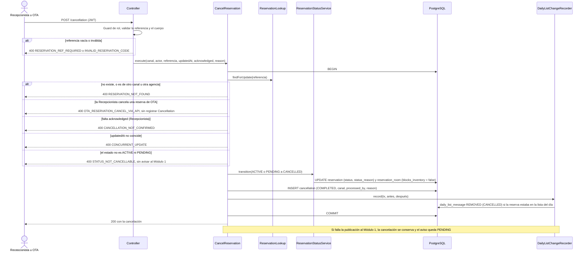

# Implementation Plan: Cancelación de reservación (`cancel-reservation`)

**Plan base**: [../base/plan.md](../base/plan.md)
**Spec**: [./spec.md](spec.md)
**Guía**: [../base/guia-planes-por-caso-de-uso.md](../base/guia-planes-por-caso-de-uso.md)

## Summary

Las reservas se cancelan por dos canales: la **Recepcionista** (reservas directas) y la **OTA** por su API
(reservas de su agencia). Este caso de uso procesa la baja de **toda la reserva**, con todas sus
habitaciones, en una sola transacción:

1. Localiza la reserva y valida el canal, el estado y la concurrencia.
2. Cambia `Reservation.status` a `CANCELLED` con `ReservationStatusService`, **sin pasar por el flujo de
   modificación**.
3. Registra una `Cancellation` inmutable para auditoría (canal `RECEPTION` u `OTA_API`).
4. Si la reserva formaba parte de la lista del día ya enviada, avisa `REMOVED` con motivo `CANCELLED`
   mediante `DailyListChangeRecorder`.

Cancelar es **gratuito**: no cobra penalidades, no llama a la liquidación del Módulo 3 y **no toca la
comisión** de una reserva de OTA (FR-006). El Módulo 2 **no libera habitaciones**: lo avisa en la lista del
día y el Módulo 1 decide qué hace.

Quitar solo una habitación de una reserva con varias **no es una cancelación**: se hace con
`update-reservation`.

## Resumen técnico e identificación

| Dato | Valor |
|---|---|
| Caso de uso | Cancelación de reservación (`cancel-reservation`) |
| Spec | [spec.md](./spec.md), historia 1 y FR-001 a FR-007 |
| Actores | Recepcionista (reservas `DIRECT`); OTA (sus propias reservas) |
| Disparador | REST: `POST /api/reservations/{reservationRef}/cancellation` (Recepcionista) y `POST /api/ota/reservations/{reservationRef}/cancellation` (OTA, ruta propuesta) |
| Naturaleza | Escribe `reservation`, `reservation_room`, `cancellation` y, por `DailyListChangeRecorder`, `daily_list_message` |

## Technical Context

El stack, la arquitectura hexagonal y el manejo de errores son los del [plan base](../base/plan.md).
Lo propio de este caso de uso:

- **Dependencias nuevas**: ninguna.
- **Almacenamiento**: `reservation`, `reservation_room`, `cancellation` (plan base).
- **Performance** (NFR-001): el procesamiento local de la cancelación, en menos de 200 ms, sin contar la
  publicación al Módulo 1.

## Contratos

### A. Cancelación por la Recepcionista: `POST /api/reservations/{reservationRef}/cancellation`

Rol `RECEPTIONIST`. **Cabeceras**: `Authorization: Bearer <JWT>`, `Content-Type: application/json`. Sin
token, 401; con otro rol, 403.

**Solicitud**

```json
{
  "updatedAt": "2026-10-08T15:42:10.123456-05:00",
  "acknowledged": true,
  "reason": "El huésped cambió de planes"
}
```

- `updatedAt`: el que la pantalla leyó de la reserva; es el control de concurrencia (obligatorio).
- `acknowledged`: debe ser `true`. Es la casilla "Entiendo que la cancelación no se puede deshacer"
  (FR-002b), que la pantalla exige antes de habilitar el botón; el servidor **también** la exige.
- `reason`: opcional, máximo 500 caracteres.

**Respuesta 200**

```json
{
  "reservationRef": "RSV-3F9A1C7B",
  "status": "CANCELLED",
  "cancellation": {
    "cancellationId": "uuid",
    "cancellationDate": "2026-10-09T10:15:20-05:00",
    "channel": "RECEPTION",
    "reason": "El huésped cambió de planes",
    "processedBy": "laura.mendez",
    "status": "COMPLETED"
  }
}
```

### B. Cancelación por la OTA: `POST /api/ota/reservations/{reservationRef}/cancellation`

Rol `OTA`. La agencia solo cancela **sus** reservas. **Ruta propuesta**: el plan base deja para el caso de
uso futuro "Configurar OTA" definir por qué rutas la OTA cancela sus reservas, pero el spec exige esta
operación (escenario 2); se implementa en la misma familia de rutas de `generate-ota-reservation`.

**Solicitud** (el propio JSON es la confirmación, sin casilla):

```json
{ "reason": "Cancelada por el huésped en la agencia" }
```

- `reason`: opcional, máximo 500 caracteres. **No** se exige `updatedAt` ni `acknowledged`; si la OTA envía
  `updatedAt`, se usa como control de concurrencia.

**Respuesta 200**: la misma de A, con `channel: "OTA_API"` y `processedBy` igual al identificador de la
agencia.

### C. Errores 400 (los mismos para A y B; el mensaje es el literal del spec cuando existe)

| `errorCode` | Cuándo | `message` |
|---|---|---|
| `RESERVATION_REF_REQUIRED` | La referencia viene vacía, solo con espacios o nula | "La referencia de la reserva es obligatoria." |
| `INVALID_RESERVATION_CODE` | La referencia no cumple el formato `RSV-` más 8 hexadecimales | "Debe proveer un código de reserva válido para la consulta." |
| `RESERVATION_NOT_FOUND` | La reserva no existe, o es de otro canal u otra agencia (para la OTA) | "La reserva no existe." |
| `OTA_RESERVATION_CANCEL_VIA_API` | La Recepcionista intenta cancelar una reserva de OTA | "La cancelación de una reserva de OTA debe llegar por la API de la agencia." |
| `STATUS_NOT_CANCELLABLE` | La reserva está en `IN_PROGRESS`, `COMPLETED`, `CANCELLED` o `NO_SHOW` | "El estado actual de la reserva no admite cancelación." |
| `CANCELLATION_NOT_CONFIRMED` | La Recepcionista no envía `acknowledged: true` | "Debe confirmar que entiende que la cancelación no se puede deshacer." |
| `CONCURRENT_UPDATE` | `updatedAt` no coincide: otra cancelación o cambio simultáneo | "Esta reserva ya fue actualizada o cancelada recientemente" |
| `REASON_TOO_LONG` | `reason` de más de 500 caracteres | "El motivo no puede superar 500 caracteres." |
| `INVALID_CHARACTERS` | Caracteres no válidos en `reason` | "El formato de los datos contiene caracteres no válidos." |
| `REQUEST_NOT_PROCESSED` | Excepción inesperada | "No fue posible procesar la solicitud." |

Sin token, `401` `UNAUTHENTICATED`; con un rol sin permiso para la ruta, `403` `FORBIDDEN`. El cuerpo es
siempre `{ "errorCode", "message", "timestamp", "path" }`. **Nunca 500.**

### D. Puertos que usa

| Puerto | De | Para qué |
|---|---|---|
| `ReservationLookup.findForUpdate` | `check-view-reservation` | Localizar la reserva con bloqueo (FR-001) |
| `ReservationStatusService.transition` | `update-reservation` | `ACTIVE` o `PENDING` → `CANCELLED` y `blocks_inventory = false` |
| `DailyListChangeRecorder.record` | `check-view-reservation` | Aviso `REMOVED` con motivo `CANCELLED` |
| `CancellationRepository` | Este caso de uso | Guardar la `Cancellation` |
| `TouchOtaSync.touch` | `register-ota-information-commission` | `lastSyncAt` con cada mensaje de la OTA |
| `Clock` | Plan base | Fecha de la cancelación |

## Reglas de negocio

1. **Quién cancela qué**: la Recepcionista, solo reservas `DIRECT` (canal `RECEPTION`); la OTA, solo las
   reservas de **su** agencia (canal `OTA_API`). Una reserva de otra agencia o directa responde como
   inexistente para la OTA.
2. **Estado**: solo `ACTIVE` o `PENDING`. Una reserva con varias habitaciones donde una ya tuvo Check-In
   está `IN_PROGRESS` y **no se puede cancelar**; las que no lleguen quedan `NOT_ARRIVED` en el cierre del
   día.
3. **Orden de las verificaciones** (la primera que falla responde):
   1. Autenticación y rol; referencia con formato válido.
   2. La reserva existe y es del canal que corresponde.
   3. Para la Recepcionista, `acknowledged: true`.
   4. **`updatedAt`** coincide (si viene). Va **antes** del estado para que la segunda de dos cancelaciones
      simultáneas reciba el mensaje de concurrencia del spec.
   5. El estado admite cancelación.
4. **Todo en una transacción** con `SELECT … FOR UPDATE` de la reserva: el cambio de estado, el
   `blocks_inventory = false` de todas las habitaciones, la fila de `Cancellation` y el mensaje de la lista
   del día se confirman **juntos**. Si algo falla, nada queda a medias.
5. **Una sola `Cancellation` por reserva**, aunque tenga varias habitaciones. La restricción única de
   `reservation_id` es el respaldo ante solicitudes simultáneas.
6. **Lista del día**: `DailyListChangeRecorder.record(tx, antes, después)` genera `REMOVED` con motivo
   `CANCELLED` **solo si la reserva pertenecía a la lista** (`ACTIVE` con llegada en el día operativo y
   lista ya enviada). Con llegada futura, o una reserva de OTA en `PENDING`, no se avisa nada.
7. **Sin efectos financieros**: ni penalidad, ni llamada al Módulo 3, ni cambio de `commissionAmount` ni de
   `commissionStatus` de una reserva de OTA (`register-ota-information-commission`, FR-007).
8. **Sin órdenes al Módulo 1**: las habitaciones no se liberan desde aquí.
9. **`processedBy`**: el identificador del usuario de la Recepcionista (del token) o el de la agencia.

## Diagramas de secuencia

### D1. Cancelación (escenarios 1, 2, 3, 5 y 6)



### D2. Dos cancelaciones simultáneas

```mermaid
sequenceDiagram
    participant A as Solicitud A
    participant B as Solicitud B
    participant U as CancelReservation
    participant DB as PostgreSQL

    A->>U: cancelar (updatedAt = T1)
    B->>U: cancelar (updatedAt = T1)
    U->>DB: A: BEGIN y SELECT reserva FOR UPDATE
    U->>DB: B: BEGIN y SELECT reserva FOR UPDATE (espera el bloqueo)
    U->>DB: A: UPDATE, INSERT cancellation y aviso, COMMIT (updated_at = T2)
    DB-->>U: B: obtiene la fila con updated_at = T2
    U->>U: B: T1 distinto de T2
    U-->>B: 400 CONCURRENT_UPDATE "Esta reserva ya fue actualizada o cancelada recientemente"
    Note over U,DB: Una sola Cancellation y un solo aviso al Módulo 1; la restricción única de cancellation.reservation_id es el respaldo
```

## Modelo de datos y entidades involucradas

**No se crean tablas.** Se usan las del plan base:

| Tabla | Qué cambia este caso de uso |
|---|---|
| `reservation` | `status = CANCELLED`, `status_reason` (`CANCELLED_BY_RECEPTION` o `CANCELLED_BY_OTA`), `updated_at` |
| `reservation_room` | `blocks_inventory = false` en todas las habitaciones; `stay_status` no cambia |
| `cancellation` | Una fila inmutable: `reservation_id` (único), `cancellation_date`, `reason`, `channel`, `processed_by`, `status = COMPLETED` |
| `daily_list_message`, `daily_sequence` | Los escribe `DailyListChangeRecorder`, en la misma transacción |

**No se tocan**: `commission_percentage`, `commission_amount`, `commission_status`, `gross_amount`,
`guest_data` ni `migratory_movement`.

- Una reserva cancelada **libera el inventario**: con `blocks_inventory = false`, la restricción
  anti-solape (D3) permite que otra reserva ocupe esas habitaciones y `check-room-availability` las ve
  libres.
- El detalle de una reserva cancelada (`check-view-reservation`) muestra su `Cancellation`.

**Transición**:

```text
ACTIVE | PENDING --cancelar (Recepcionista o OTA)--> CANCELLED      (estado final: no se deshace)
```

## Reglas de validación y manejo de errores

| Situación | Comportamiento |
|---|---|
| Cualquier error de la tabla C | Respuesta 4xx estructurada; **no se registra `Cancellation` ni se avisa al Módulo 1** |
| Cancelaciones simultáneas | La segunda recibe `CONCURRENT_UPDATE`; no hay filas ni avisos duplicados |
| Falla la publicación del aviso `REMOVED` | La reserva queda cancelada; el mensaje queda `PENDING` y se reintenta en orden (FR-020 de `check-view-reservation`) |
| Falla la base de datos durante la transacción | Todo se revierte; respuesta 400 `REQUEST_NOT_PROCESSED` sin detalles de infraestructura |
| Excepción inesperada | 400 `REQUEST_NOT_PROCESSED`; nunca 500 |

## Integraciones externas

| Módulo | Dirección | Mecanismo | Contrato | Fallo |
|---|---|---|---|---|
| OTA | OTA → M2 | REST `POST /api/ota/reservations/{reservationRef}/cancellation` | B | Respuesta 4xx estructurada |
| Módulo 1 | M2 → M1 | Lista del día (vía `DailyListChangeRecorder`) | Plan de `check-view-reservation` | Mensaje `PENDING` con reintento en orden; **la cancelación no se revierte** |

- **No hay llamadas síncronas** a otros módulos: ni al Módulo 1 ni al Módulo 3 (FR-006).
- **No se le ordena nada al Módulo 1**: lo que ocurre con la habitación lo decide él con la lista del día.
- No hay colas propias.

## Arquitectura (capas del plan base)

| Capa | Piezas de este caso de uso |
|---|---|
| `domain/cancellation/` | `Cancellation` (inmutable) y las reglas de quién cancela qué canal |
| `application/use-cases/cancel-reservation/` | **Entrada**: `CancelReservation` (un servicio para los dos canales) y el validador de la solicitud |
| `application/ports/out/` | `CancellationRepository`, `Clock` y los puertos de otros casos de uso (D) |
| `infrastructure/in/rest/` | Rutas de la Recepcionista (en `ReservationsController`) y de la OTA (en `OtaReservationsController`) |
| `infrastructure/out/persistence/` | `CancellationRepository` |

```text
backend/src/
├── domain/cancellation/
│   ├── cancellation.ts
│   └── cancellation-rules.ts              # canal permitido por source y reglas de estado
├── application/use-cases/cancel-reservation/
│   ├── ports/in/
│   ├── cancel-reservation.service.ts
│   └── cancel-request.validator.ts
└── infrastructure/
    ├── in/rest/ (rutas A y B dentro de los controladores existentes)
    └── out/persistence/cancellation.repository.ts
backend/test/
├── unit/cancel-reservation/               # reglas de canal y estado, validador
├── integration/cancel-reservation/        # Testcontainers: ambos canales, concurrencia, aviso a la lista
└── contract/                              # forma de A y B y de los errores
frontend/src/pages/reservations/cancel/    # pantalla "Cancelar reserva" con la casilla de confirmación
```

## Phase 1: Setup

- [ ] T001 Restricción única de `cancellation(reservation_id)` verificada en la migración base y `CancellationRepository`

## Phase 2: Foundational

- [ ] T002 [P] Entidad `Cancellation` y `cancellation-rules` (canal por `source`, estados cancelables) con pruebas unitarias
- [ ] T003 [P] Validador de la solicitud (referencia, `acknowledged`, `reason` de máximo 500 y caracteres válidos) con los mensajes literales
- [ ] T004 Códigos de error y mensajes de la tabla C

## Phase 3: User Story 1 - Cancelación de la reserva (P1)

**Goal**: la baja de una reserva por cualquiera de los dos canales, con aviso al Módulo 1 cuando corresponde.
**Independent Test**: una reserva `ACTIVE` con llegada hoy por cada canal (`CANCELLED`, `Cancellation` con su
canal y `REMOVED`); una con llegada futura (sin aviso); y los intentos sobre `IN_PROGRESS`, `COMPLETED`,
`CANCELLED` y `NO_SHOW`.

- [ ] T005 [US1] `CancelReservation`: localizar con bloqueo, validar canal, confirmación, `updatedAt` y estado, en ese orden
- [ ] T006 [US1] Transición a `CANCELLED` con `ReservationStatusService`, liberación de `blocks_inventory` e inserción de la `Cancellation` en una sola transacción
- [ ] T007 [US1] Llamada a `DailyListChangeRecorder` dentro de la transacción (`REMOVED` solo si estaba en la lista)
- [ ] T008 [US1] `POST /api/reservations/{reservationRef}/cancellation` (A) con el guard de rol
- [ ] T009 [US1] `POST /api/ota/reservations/{reservationRef}/cancellation` (B) con el filtro por agencia y `TouchOtaSync`
- [ ] T010 [US1] Prueba de que no se modifica ningún campo de comisión ni se llama al Módulo 3
- [ ] T011 [US1] Pruebas de integración de los escenarios 1 a 6
- [ ] T012 [US1] Pruebas de los casos borde: referencia vacía, fallo de publicación, dos cancelaciones simultáneas y reserva con un Check-In
- [ ] T013 [P] [US1] Frontend: pantalla "Cancelar reserva" con la casilla "Entiendo que la cancelación no se puede deshacer" que habilita el botón

## Phase N: Polish

- [ ] T014 Prueba de tiempo: el procesamiento local en menos de 200 ms (NFR-001)
- [ ] T015 Documentar A y B en OpenAPI (`@nestjs/swagger`)

## Pruebas por escenario

| Historia | Escenario | Qué se verifica |
|---|---|---|
| US1 | 1 Recepcionista, llegada hoy | `CANCELLED`, una `Cancellation` con canal `RECEPTION` y aviso `REMOVED` con motivo `CANCELLED` |
| US1 | 2 OTA por su API | `ACTIVE` o `PENDING` con llegada hoy: `200`, `CANCELLED`, canal `OTA_API` y `REMOVED` solo si estaba en la lista (una `PENDING` no estaba) |
| US1 | 3 llegada futura | `CANCELLED` y `Cancellation`, sin ningún aviso al Módulo 1 |
| US1 | 4 estado no cancelable | `IN_PROGRESS`, `COMPLETED`, `CANCELLED` y `NO_SHOW`: `400` `STATUS_NOT_CANCELLABLE`, sin aviso |
| US1 | 5 varias habitaciones | Una sola `Cancellation` y un solo `REMOVED` para toda la reserva |
| US1 | 6 Recepcionista sobre una de OTA | `400` `OTA_RESERVATION_CANCEL_VIA_API` y ninguna `Cancellation` |
| Casos borde | Fallo de publicación | La reserva queda cancelada y el aviso queda `PENDING`, reintentado en orden |
| Casos borde | Referencia vacía o nula | `400` "La referencia de la reserva es obligatoria." antes de la lógica de negocio |
| Casos borde | Cancelaciones simultáneas | La primera aplica; la segunda `400` `CONCURRENT_UPDATE` con el mensaje del spec; una sola `Cancellation` y un solo aviso |
| Casos borde | Varias habitaciones con un Check-In | La reserva está `IN_PROGRESS`: `400` |
| FR-002b | Confirmación | Sin `acknowledged: true`, la Recepcionista recibe `400` `CANCELLATION_NOT_CONFIRMED` |
| FR-006 | Sin efectos financieros | Una reserva de OTA cancelada conserva `commission_amount` y `commission_status`; el Módulo 3 simulado no recibe ninguna llamada |
| Seguridad | Agencia ajena | Una OTA que cancela la reserva de otra agencia o una directa: `400` `RESERVATION_NOT_FOUND` |
| NFR-001 | Tiempo | El procesamiento local en menos de 200 ms |

## Dependencies & Execution Order

- **Depende de**: `check-view-reservation` (`ReservationLookup` y `DailyListChangeRecorder`),
  `update-reservation` (`ReservationStatusService`), `register-ota-information-commission`
  (`TouchOtaSync` y la regla de no tocar la comisión), y la tabla `cancellation` del plan base.
- **Necesitan de este caso de uso**: ninguno.
- **Orden**: T001–T004 → US1 (T005–T013) → Polish.

## Trazabilidad: requisito → componente → tarea

| Requisito | Componente | Tarea |
|---|---|---|
| FR-001 | `ReservationLookup.findForUpdate` | T005 |
| FR-002, FR-002a | Reglas de estado y de canal | T002, T005 |
| FR-002b | `acknowledged` en el servidor y casilla en la pantalla | T003, T005, T013 |
| FR-003 | `ReservationStatusService` dentro de la transacción | T006 |
| FR-004a | `DailyListChangeRecorder` (`REMOVED`, `CANCELLED`) | T007 |
| FR-005 | `Cancellation` con canal y quién la procesó | T001, T006 |
| FR-006 | Sin penalidades, sin Módulo 3 y sin tocar la comisión | T010 |
| FR-007 | Mapeo a 400 y control de concurrencia | T004, T012 |
| NFR-001 | Prueba de tiempo | T014 |
| SC-001, SC-002, SC-004 | Pruebas por escenario | T011, T012 |

## Puntos que este plan propone (el spec no los dice)

1. **Ruta de cancelación de la OTA**: `POST /api/ota/reservations/{reservationRef}/cancellation`, en la
   familia de rutas de `generate-ota-reservation`. El plan base la deja al caso de uso futuro "Configurar
   OTA", pero el spec exige la operación.
2. **`acknowledged` en el cuerpo**: el spec exige la casilla en la pantalla; este plan la exige también en
   el servidor, para que la API no se pueda saltar.
3. **`updatedAt` obligatorio para la Recepcionista y opcional para la OTA.**
4. **Orden de verificaciones** con `updatedAt` antes del estado, para dar el mensaje de concurrencia del spec.
5. **`reason` opcional**, de máximo 500 caracteres.
6. **Una reserva ajena responde como inexistente para la OTA** (no se revela su existencia).
7. **`status_reason`**: `CANCELLED_BY_RECEPTION` y `CANCELLED_BY_OTA`.
8. **Códigos y mensajes** que el spec no da: `OTA_RESERVATION_CANCEL_VIA_API`, `STATUS_NOT_CANCELLABLE`,
   `CANCELLATION_NOT_CONFIRMED`, `REASON_TOO_LONG` e `INVALID_RESERVATION_CODE`.

## Puntos abiertos

| # | Pendiente | Con quién |
|---|---|---|
| 1 | **Reintento de la OTA**: si la OTA repite una cancelación que ya se aplicó, recibe `400` (la reserva ya está `CANCELLED`). Una OTA que no recibió la respuesta puede creer que falló. Conviene devolver `200` si la cancelación fue de la misma agencia | Equipo del Módulo 2 y las OTA |
| 2 | **Mensaje de `CONCURRENT_UPDATE` distinto** entre este spec ("Esta reserva ya fue actualizada o cancelada recientemente") y `update-reservation` ("...modificada por otra persona. Recargue..."). Cada plan respeta el literal de su spec con el mismo `errorCode` | Equipo del Módulo 2 |
| 3 | La OTA **cancela por la misma API desde la que envía sus reservas**; las rutas definitivas dependerán de "Configurar OTA" | Equipo del Módulo 2 |
| 4 | Una reserva de OTA en `PENDING` con llegada hoy no está en la lista del día, así que su cancelación no genera aviso. Confirmar que es lo esperado | Módulo 1 |
| 5 | El spec salta de SC-002 a SC-004 (falta SC-003) | Equipo del Módulo 2 |
| 6 | El wireframe de "Cancelar reserva" ya tiene la casilla de confirmación; falta alinear el texto del botón y el motivo opcional cuando se retome | Equipo del Módulo 2 |

## Notes

- `[P]` marca tareas paralelizables; `[US1]` las liga a su historia de usuario.
- Commit por tarea o grupo lógico, con Gitflow.
- Este plan no modifica el spec ni el plan base.
