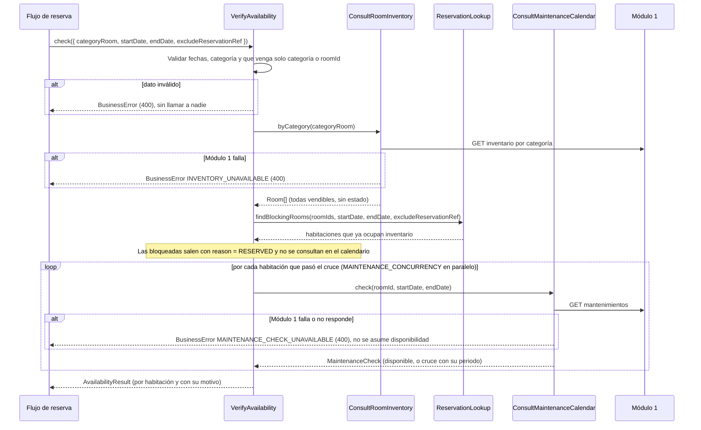
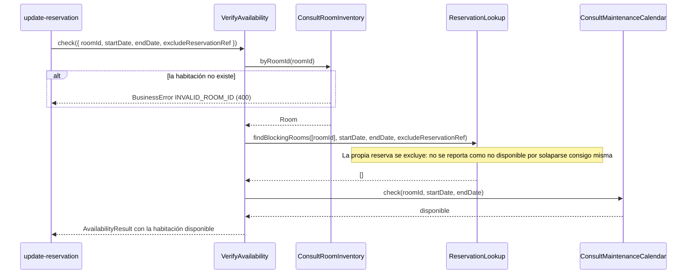
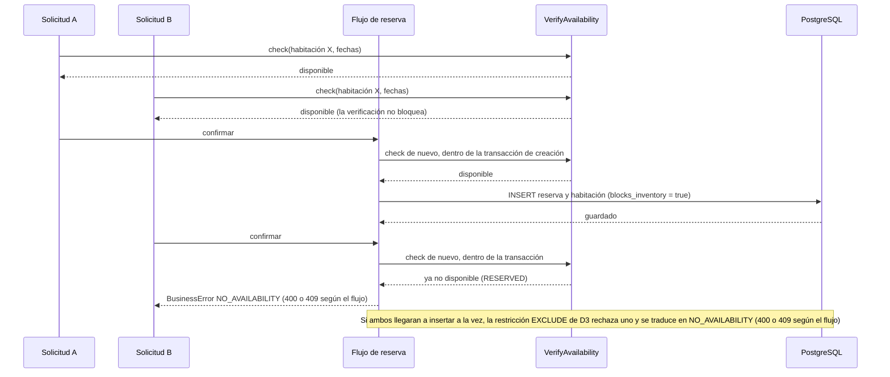

# Implementation Plan: Verificar disponibilidades (`check-room-availability`)

**Plan base**: [../base/plan.md](../base/plan.md)
**Spec**: [./spec.md](spec.md)
**Guía**: [../base/guia-planes-por-caso-de-uso.md](../base/guia-planes-por-caso-de-uso.md)

## Summary

Antes de crear o modificar una reserva hay que saber con certeza si una habitación puede ocuparse en las
fechas pedidas. Este caso de uso es **la única verificación de disponibilidad del Módulo 2**, reutilizada
por todos los flujos de reserva (`generate-direct-reservation`, `generate-ota-reservation` y
`update-reservation`). Es de solo lectura y **no bloquea** la habitación.

Combina tres fuentes, siempre en este orden:

1. **Habitaciones vendibles** del Módulo 1 (`consult-room-inventory`): por `categoryRoom` (todas las de la
   categoría) o por `roomId` (una). **No usa el estado físico de hoy.**
2. **Reservas locales del Módulo 2**: descarta las habitaciones que se cruzan con una reserva que aún
   ocupa inventario. Así se detecta también la habitación ocupada hoy por un huésped alojado.
3. **Calendario de mantenimientos** del Módulo 1 (`consult-maintenance-calendar`): solo para las
   habitaciones que pasaron el cruce.

Responde **por habitación**: cuáles están disponibles y el motivo (`RESERVED` o `MAINTENANCE`) de cada
una que no lo está. Si el Módulo 1 falla, **no asume disponibilidad**: responde un 4xx controlado.

Como la verificación no bloquea, dos verificaciones simultáneas pueden responder "disponible" para la
misma habitación. Lo que impide la sobreventa es la **restricción anti-solape de la base de datos** (D3 del
plan base) al guardar la reserva, no esta consulta.

## Resumen técnico e identificación

| Dato | Valor |
|---|---|
| Caso de uso | Verificar disponibilidades (`check-room-availability`) |
| Spec | [spec.md](./spec.md), historia 1 y FR-001 a FR-006 |
| Actores | Los flujos de reserva (internos); a través de ellos, la Recepcionista y la OTA |
| Naturaleza | Solo lectura; sin tablas propias; **sin ruta REST propia** |

| # | Capacidad | Disparador | Actor | Contrato |
|---|---|---|---|---|
| 1 | Verificar por categoría | Llamada interna (puerto de entrada) | `generate-direct-reservation`, `generate-ota-reservation`, `update-reservation` | B1 |
| 2 | Verificar una habitación | Llamada interna (puerto de entrada) | Los mismos | B1 |
| 3 | Exigir que haya habitaciones suficientes | Llamada interna (función de dominio) | Los mismos | B2 |
| 4 | Asignar habitaciones de una categoría | Llamada interna (función de dominio) | `generate-direct-reservation`, `generate-ota-reservation` | B3 |
| 5 | Cruce con reservas locales | Llamada interna (puerto de entrada de `check-view-reservation`) | Este caso de uso | A1 |

La Recepcionista ve la disponibilidad a través de la **vista previa** de `generate-direct-reservation`
(`POST /api/reservations/direct/preview`) y de `update-reservation` (`POST …/modification-preview`); la
OTA, a través de su propia respuesta. Este caso de uso no expone una ruta propia.

## Technical Context

El stack, la arquitectura hexagonal y el manejo de errores son los del [plan base](../base/plan.md).
Lo propio de este caso de uso:

- **Dependencias nuevas**: ninguna.
- **Almacenamiento**: ninguno propio. Lee `reservation` y `reservation_room` (columnas de D3).
- **Configuración**: `MAINTENANCE_CONCURRENCY` (por defecto `5`): cuántas consultas de mantenimiento van
  en paralelo.
- **Performance** (NFR-001): la verificación completa responde en menos de 2 s en condiciones normales.

## Contratos

### A. Dependencias (puertos que usa este caso de uso)

No llama directamente a ningún módulo externo: usa los puertos de entrada de otros casos de uso.

**A1. Cruce con reservas locales** (puerto de entrada `ReservationLookup` de `check-view-reservation`,
método nuevo `findBlockingRooms`):

```typescript
interface BlockingRoom { roomId: string; reservationRef: string }

findBlockingRooms(
  roomIds: string[], startDate: string, endDate: string, excludeReservationRef?: string
): Promise<BlockingRoom[]>
```

Devuelve las habitaciones de `roomIds` que **ya ocupan inventario** en el rango. Una habitación bloquea
cuando se cumplen estas tres condiciones a la vez (FR-002):

- Su reserva está en `PENDING`, `ACTIVE` o `IN_PROGRESS`.
- La habitación está en `EXPECTED` o `CHECKED_IN` (no en `CHECKED_OUT` ni `NOT_ARRIVED`).
- Su rango se cruza con el pedido, con intervalo semiabierto `[startDate, endDate)`: una salida y una
  llegada el mismo día **no** chocan.

Las reservas `COMPLETED`, `CANCELLED` y `NO_SHOW` no bloquean. Se **excluye** la reserva indicada en
`excludeReservationRef` (FR-003). En la base de datos, las tres condiciones son la columna
`reservation_room.blocks_inventory` y las copias `start_date` y `end_date` (D3), así que la consulta es:

```sql
SELECT rr.room_id, r.reservation_ref
FROM reservation_room rr
JOIN reservation r ON r.id = rr.reservation_id
WHERE rr.blocks_inventory
  AND rr.room_id = ANY(:roomIds)
  AND daterange(rr.start_date, rr.end_date, '[)') && daterange(:startDate, :endDate, '[)')
  AND (:exclude IS NULL OR r.reservation_ref <> :exclude);
```

La restricción de exclusión de D3 ya crea el índice GiST que usa esta consulta.

**A2. Inventario** (`ConsultRoomInventory.byCategory` y `byRoomId`, plan de `consult-room-inventory`):
devuelven `Room` (`id`, `roomNumber`, `categoryRoom`, `maxCapacity`) sin estado.

**A3. Mantenimientos** (`ConsultMaintenanceCalendar.check`, plan de `consult-maintenance-calendar`):
devuelve `MaintenanceCheck` con `available` y, si hay cruce, el periodo (`overlapStart`, `overlapEnd`).

### B. Puerto de entrada interno

```typescript
type UnavailabilityReason = 'RESERVED' | 'MAINTENANCE';

interface AvailabilityQuery {
  startDate: string;                       // AAAA-MM-DD
  endDate: string;                         // AAAA-MM-DD, posterior a startDate
  categoryRoom?: string;                   // exactamente uno de los dos
  roomId?: string;
  excludeReservationRef?: string;          // solo al modificar (FR-003)
  limit?: number;                          // opcional: detenerse al encontrar esta cantidad de disponibles
}

interface RoomAvailability {
  room: Room;
  available: boolean;
  reason: UnavailabilityReason | null;     // null si está disponible
  maintenance: { overlapStart: string; overlapEnd: string }[];   // solo si reason = MAINTENANCE
}

interface AvailabilityResult {
  startDate: string;
  endDate: string;
  rooms: RoomAvailability[];               // todas las consultadas, ordenadas por roomNumber
}

interface VerifyAvailability {
  check(query: AvailabilityQuery): Promise<AvailabilityResult>;      // B1
}
```

**B2. `requireAvailable(result, quantity)`** (función pura del dominio): exige `quantity` habitaciones
disponibles; si hay menos, lanza `NO_AVAILABILITY` con el motivo de las que no lo están. El código HTTP
lo decide cada flujo según su spec: **400** en la reserva directa y en la modificación, **409** en la
reserva de OTA.

**B3. `assignRooms(result, quantity, alreadyAssigned)`** (función pura del dominio): elige las `quantity`
habitaciones disponibles de **menor `roomNumber`** (orden numérico), sin repetir una ya asignada a la misma
reserva. Lo usan las dos reservas nuevas para asignar habitaciones cuando se pide solo la categoría.

**DTO compartido** que incluyen las respuestas de las vistas previas:

```json
{
  "availability": {
    "startDate": "2026-10-10",
    "endDate": "2026-10-12",
    "categoryRoom": "DOBLE",
    "availableCount": 2,
    "rooms": [
      { "roomId": "uuid", "roomNumber": "201", "available": true, "reason": null },
      { "roomId": "uuid", "roomNumber": "202", "available": false, "reason": "RESERVED" },
      { "roomId": "uuid", "roomNumber": "203", "available": false, "reason": "MAINTENANCE",
        "maintenance": [ { "overlapStart": "2026-10-11", "overlapEnd": "2026-10-12" } ] }
    ]
  }
}
```

Motivos que se muestran a la Recepcionista (FR-002a):

| `reason` | Mensaje |
|---|---|
| `RESERVED` | "La habitación ya está reservada en esas fechas." |
| `MAINTENANCE` | "La habitación estará inhabilitada por mantenimiento en esas fechas." |

No se muestra la `reservationRef` que bloquea, ni datos del huésped que la tiene.

## Diagramas de secuencia

### D1. Verificación por categoría (historia 1, escenarios 1 a 4 y 6 a 7)



### D2. Verificación de una habitación y modificación de una reserva (escenarios 1 y 5)



### D3. Doble comprobación al crear (verificaciones simultáneas)



## Modelo de datos y entidades involucradas

**Este caso de uso no crea ni modifica tablas.** Solo lee.

| Tabla | Columnas que lee | Para qué |
|---|---|---|
| `reservation_room` | `room_id`, `start_date`, `end_date`, `blocks_inventory`, `reservation_id` | Cruce de fechas con las reservas que ocupan inventario |
| `reservation` | `id`, `reservation_ref` | Excluir la reserva que se modifica |

- `blocks_inventory` vale `true` mientras la reserva está en `PENDING`, `ACTIVE` o `IN_PROGRESS` **y** la
  habitación en `EXPECTED` o `CHECKED_IN`. Es exactamente la condición de FR-002. El agregado
  `Reservation` mantiene esa columna y las copias de fechas en la misma transacción que cada cambio
  (D3), así que la consulta no repite la lógica de estados.
- `Room`, `MaintenanceCalendar` y `MaintenanceCheck` son objetos de integración: **no se persisten**.

**Estados y transiciones**: ninguno propio. Interviene el estado de la reserva y de la habitación
(`stayStatus`) solo como lectura, a través de `blocks_inventory`.

## Reglas de validación y manejo de errores

Todo error sale con `{ "errorCode", "message", "timestamp", "path" }` y **siempre 4xx**; nunca 500.

**Errores de esta verificación**

| Situación | Origen | HTTP | `errorCode` | `message` |
|---|---|---|---|---|
| Fechas mal formadas o `endDate` no posterior a `startDate` | M2, antes de consultar | 400 | `INVALID_STAY_DATES` | "Rango de fechas inválido. Verifique las fechas seleccionadas." |
| `roomId` con formato inválido o que el Módulo 1 no conoce | M2 o Módulo 1 | 400 | `INVALID_ROOM_ID` | "El identificador de la habitación es inválido." |
| `categoryRoom` inválida | M2 o Módulo 1 | 400 | `INVALID_CATEGORY` | "La categoría indicada no es válida." |
| Ni categoría ni `roomId`, o ambos a la vez | M2 | 400 | `INVALID_AVAILABILITY_QUERY` | "Debe indicar una categoría o una habitación." |
| `excludeReservationRef` con formato inválido o que no existe | M2 | 400 | `RESERVATION_NOT_FOUND` | "La reserva no existe." |
| El Módulo 1 no responde al consultar el inventario | Módulo 1 | 400 | `INVENTORY_UNAVAILABLE` | "No se pudo consultar el inventario de habitaciones en este momento. Intente de nuevo." |
| El Módulo 1 no responde al consultar los mantenimientos | Módulo 1 | 400 | `MAINTENANCE_CHECK_UNAVAILABLE` | "No es posible validar mantenimientos en este momento. Intente de nuevo." |

**Error que lanzan los flujos de reserva con el resultado** (`requireAvailable`)

| Situación | HTTP | `errorCode` | `message` |
|---|---|---|---|
| Hay menos habitaciones disponibles que las pedidas, o la habitación pedida no está disponible | **400** en `generate-direct-reservation` y `update-reservation`; **409** en `generate-ota-reservation` | `NO_AVAILABILITY` | El motivo de la no disponibilidad (tabla de motivos de B) |
| La restricción anti-solape rechaza el guardado (verificaciones simultáneas) | Igual que la fila anterior | `NO_AVAILABILITY` | "La habitación ya está reservada en esas fechas." |

- **Una habitación no disponible no es un error de esta verificación**: se devuelve con su motivo. El
  error aparece cuando el flujo invocador exige una cantidad que no se cumple.
- **No asume disponibilidad** ante cualquier fallo del Módulo 1: si falla la consulta de **una sola**
  habitación, falla toda la verificación (todo o nada), porque no se puede afirmar cuáles están libres.
- **Si una habitación está bloqueada por reserva y por mantenimiento**, se informa `RESERVED`: el
  mantenimiento solo se consulta para las que pasaron el cruce.
- **Sin reintentos automáticos** hacia el Módulo 1.
- Una excepción inesperada la traduce el filtro global a 400 `REQUEST_NOT_PROCESSED`, con el detalle en
  el log y sin datos de infraestructura.

## Integraciones externas

| Módulo | Dirección | Mecanismo | Contrato | Fallo o tiempo agotado |
|---|---|---|---|---|
| Módulo 1 | M2 → M1 | Inventario por categoría o `roomId` (vía `consult-room-inventory`) | Plan de ese caso de uso | `INVENTORY_UNAVAILABLE` (400) |
| Módulo 1 | M2 → M1 | Mantenimientos por habitación (vía `consult-maintenance-calendar`) | Plan de ese caso de uso | `MAINTENANCE_CHECK_UNAVAILABLE` (400) |

- Este caso de uso **no** llama al Módulo 3 ni a otros módulos, y no usa colas.
- Las consultas de mantenimiento van en paralelo con tope `MAINTENANCE_CONCURRENCY` para cumplir
  NFR-001 con categorías de varias habitaciones.
- Si el flujo invocador solo necesita `quantity` habitaciones, puede pasar `limit` para detener las
  consultas de mantenimiento en cuanto encuentre esa cantidad de disponibles.

## Arquitectura (capas del plan base)

| Capa | Piezas de este caso de uso |
|---|---|
| `domain/reservation/` | `requireAvailable` (B2) y `assignRooms` (B3) |
| `application/use-cases/check-room-availability/` | **Entrada**: `VerifyAvailability` (`check`); validadores de la consulta |
| `application/use-cases/check-view-reservation/` | `ReservationLookup.findBlockingRooms` (A1, método nuevo en el plan de ese caso de uso) |
| `infrastructure/out/persistence/` | Consulta `findBlockingRooms` sobre `reservation_room` |

```text
backend/src/
├── domain/reservation/
│   ├── require-available.ts          # B2
│   └── assign-rooms.ts               # B3
├── application/use-cases/check-room-availability/
│   ├── ports/in/verify-availability.port.ts
│   ├── verify-availability.service.ts
│   └── availability-query.validator.ts
└── infrastructure/out/persistence/blocking-rooms.query.ts
backend/test/
├── unit/check-room-availability/          # B2, B3, validadores
├── integration/check-room-availability/   # servicio con Testcontainers (PostgreSQL) y puertos del Módulo 1 simulados
└── contract/                              # reutiliza los contratos de inventario y mantenimientos
```

## Phase 1: Setup

- [ ] T001 Variable `MAINTENANCE_CONCURRENCY` en la configuración validada

## Phase 2: Foundational

- [ ] T002 [P] Validador de la consulta (fechas reales, `endDate > startDate`, exactamente categoría o `roomId`, formato de `excludeReservationRef`)
- [ ] T003 [P] Funciones de dominio `requireAvailable` y `assignRooms` (orden numérico de `roomNumber`), con pruebas unitarias
- [ ] T004 `ReservationLookup.findBlockingRooms` y su consulta SQL sobre `reservation_room` (A1), con pruebas de integración contra PostgreSQL
- [ ] T005 Códigos de error `INVALID_AVAILABILITY_QUERY` y `NO_AVAILABILITY` con sus mensajes

## Phase 3: User Story 1 - Consulta y validación de disponibilidad (P1)

**Goal**: los flujos de reserva saben qué habitaciones están disponibles y por qué no lo están las demás.
**Independent Test**: habitaciones libres, bloqueadas por mantenimiento, cruzadas con otra reserva,
ocupadas hoy y liberadas dentro de una reserva en curso.

- [ ] T006 [US1] `VerifyAvailability.check` por categoría: inventario → cruce con reservas → mantenimiento, en ese orden
- [ ] T007 [US1] `check` por `roomId`, con verificación de que la habitación existe
- [ ] T008 [US1] Exclusión de la propia reserva en una modificación (FR-003)
- [ ] T009 [US1] Consultas de mantenimiento en paralelo con tope, y todo o nada ante un fallo
- [ ] T010 [US1] Opción `limit` para detener las consultas al alcanzar la cantidad necesaria
- [ ] T011 [US1] DTO compartido `availability` con los motivos y sus mensajes
- [ ] T012 [US1] Pruebas de integración de los escenarios 1 a 7
- [ ] T013 [US1] Pruebas de los casos borde: Módulo 1 sin responder, fechas inválidas, `roomId` inválido y verificaciones simultáneas

## Phase 4: Integración con los flujos de reserva

- [ ] T014 Coordinar con los planes de `generate-direct-reservation`, `generate-ota-reservation` y `update-reservation` la llamada a `check`, la segunda comprobación dentro de la transacción y la traducción de la violación de la restricción de exclusión a `NO_AVAILABILITY`
- [ ] T015 Prueba de la restricción anti-solape: dos inserciones simultáneas de la misma habitación, una falla con `NO_AVAILABILITY`

## Phase N: Polish

- [ ] T016 Prueba de tiempo: una categoría de 20 habitaciones con el Módulo 1 simulado a 150 ms responde en menos de 2 s (NFR-001)
- [ ] T017 Verificar que ningún log escribe datos personales

## Pruebas por escenario

| Historia | Escenario | Qué se verifica |
|---|---|---|
| US1 | 1 habitación libre | Sin reservas ni mantenimientos: `available: true`; el flujo puede continuar |
| US1 | 2 mantenimiento | El Módulo 1 simulado devuelve un cruce: `reason: MAINTENANCE` con el periodo |
| US1 | 3 reserva cruzada | Una reserva `ACTIVE` solapada: `reason: RESERVED` |
| US1 | 4 ocupada hoy | Habitación en `CHECKED_IN` de una reserva `IN_PROGRESS` que se cruza: `RESERVED` |
| US1 | 5 modificar fechas | Con `excludeReservationRef`, la propia reserva no bloquea y queda disponible |
| US1 | 6 reservas históricas | Solapadas solo con `COMPLETED`, `CANCELLED` y `NO_SHOW`: disponible |
| US1 | 7 habitación liberada | En `NOT_ARRIVED` o `CHECKED_OUT` dentro de una reserva `IN_PROGRESS`: no bloquea |
| Casos borde | Módulo 1 sin responder | Tiempo agotado en el calendario: `400` `MAINTENANCE_CHECK_UNAVAILABLE` con el mensaje literal; no se asume disponibilidad |
| Casos borde | Fechas inválidas | `400` `INVALID_STAY_DATES`, sin llamar a ningún módulo |
| Casos borde | `roomId` inválido | `400` `INVALID_ROOM_ID` |
| Casos borde | Verificaciones simultáneas | Ambas responden disponible; al crear, la segunda falla con `NO_AVAILABILITY` (D3) |
| FR-004 | Sin estado físico | El inventario simulado no trae estado y una habitación "ocupada hoy" en el Módulo 1 se sigue evaluando solo con las reservas |
| FR-002a | Por habitación | Una categoría con tres habitaciones devuelve cada una con su motivo |
| Contrato | Intervalo semiabierto | Salida y llegada el mismo día no chocan; un día de solape sí |
| NFR-001 | Tiempo | Categoría de 20 habitaciones con el Módulo 1 simulado a 150 ms en menos de 2 s |

## Dependencies & Execution Order

- **Depende de**: `consult-room-inventory` y `consult-maintenance-calendar` (sus puertos), `check-view-reservation`
  (`ReservationLookup.findBlockingRooms`) y la restricción anti-solape (D3) del plan base.
- **Necesitan de este caso de uso**: `generate-direct-reservation`, `generate-ota-reservation` y
  `update-reservation`.
- **Orden**: T001–T005 → US1 (T006–T013) → integración (T014–T015) → Polish. Va antes de las reservas
  porque estas lo llaman.

## Trazabilidad: requisito → componente → tarea

| Requisito | Componente | Tarea |
|---|---|---|
| FR-001 | `check` y `ConsultMaintenanceCalendar` | T006, T007, T009 |
| FR-002 | `findBlockingRooms` (reservas que ocupan inventario) | T004, T006 |
| FR-002a | `AvailabilityResult` por habitación y DTO compartido | T011 |
| FR-003 | `excludeReservationRef` | T002, T008 |
| FR-004 | Inventario sin estado; ocupación solo con reservas | T006 |
| FR-005 | Todo o nada ante fallos del Módulo 1 | T009 |
| FR-006 | Validadores y mapeo a 400 | T002, T005, T013 |
| NFR-001 | Concurrencia con tope, `limit` y prueba de tiempo | T001, T009, T010, T016 |
| SC-001 | Los tres flujos llaman a `check` antes de confirmar | T014 |
| SC-002 | Doble comprobación y restricción anti-solape | T014, T015 |
| SC-003 | Todo error es 400 | T005, T013 |

## Puntos que este plan propone (el spec no los dice)

1. **Sin ruta REST propia**: la disponibilidad se ve a través de las vistas previas de los flujos.
2. **`findBlockingRooms`** como método nuevo de `ReservationLookup` (`check-view-reservation`), para que
   este caso de uso no use las clases internas de otro (regla 6 de la arquitectura).
3. **Una falla en una habitación hace fallar toda la verificación**, en vez de devolver resultados
   parciales.
4. **Si hay reserva y mantenimiento, el motivo es `RESERVED`**: el calendario solo se consulta para las
   habitaciones que pasaron el cruce, como dice el spec.
5. **Opción `limit`** para detener las consultas de mantenimiento al alcanzar la cantidad necesaria.
6. **`assignRooms`**: la habitación de menor `roomNumber` (orden numérico), como pide el spec de OTA, y
   la misma regla para la reserva directa, que el spec no define.
7. **`excludeReservationRef` inexistente** responde `400` `RESERVATION_NOT_FOUND`.
8. **Motivos y mensajes** `RESERVED` y `MAINTENANCE`, y códigos `INVALID_AVAILABILITY_QUERY` y `NO_AVAILABILITY`.

## Puntos abiertos

| # | Pendiente | Con quién |
|---|---|---|
| 1 | **400 o 409 según el flujo**: los specs de `generate-direct-reservation` y `update-reservation` dicen **HTTP 400** ante la falta de disponibilidad, y el de `generate-ota-reservation` dice **HTTP 409**, como la sección "Errores" del plan base. Este plan deja que cada flujo siga su spec. Conviene unificar los tres en un solo código | Equipo del Módulo 2 |
| 2 | **Costo de los mantenimientos**: una consulta por habitación candidata. Con categorías grandes puede acercarse al límite de 2 s. Conviene que el Módulo 1 permita consultar por categoría o por varias habitaciones | Módulo 1 |
| 3 | La asignación "de menor `roomNumber`" para la reserva directa: el spec dice que la Recepcionista no elige la habitación pero no cómo se asigna | Equipo del Módulo 2 |
| 4 | El mensaje de error cuando el Módulo 1 falla al consultar el **inventario** durante la verificación: el spec de este caso de uso solo define el de mantenimientos. Se usa el de `consult-room-inventory` | Equipo del Módulo 2 |
| 5 | El wireframe muestra la disponibilidad al escribir en "Nueva reserva directa". Eso exige que la vista previa se pueda consultar al cambiar categoría y fechas; se define en el plan de `generate-direct-reservation` | Equipo del Módulo 2 |

## Notes

- `[P]` marca tareas paralelizables; `[US1]` las liga a su historia de usuario.
- Commit por tarea o grupo lógico, con Gitflow.
- Este plan no modifica el spec ni el plan base.
