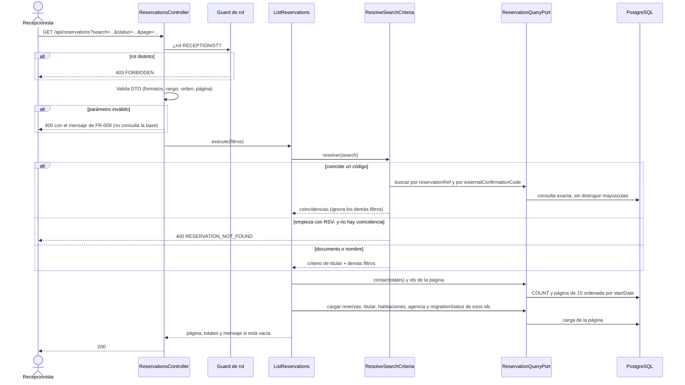
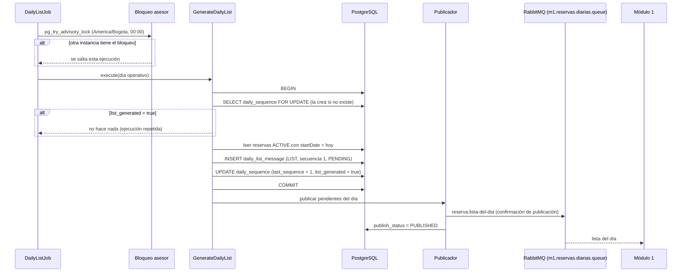
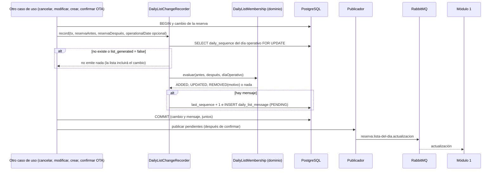
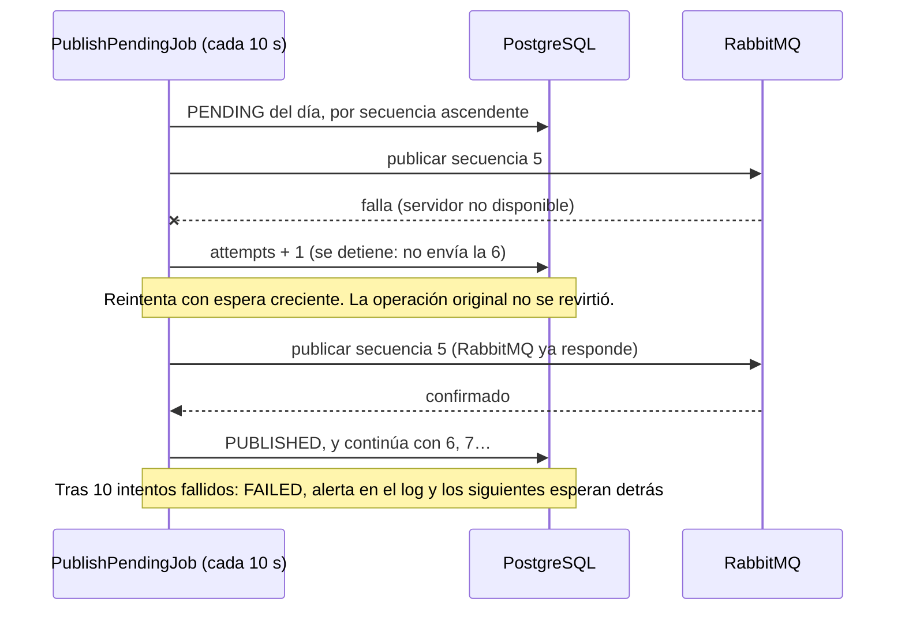
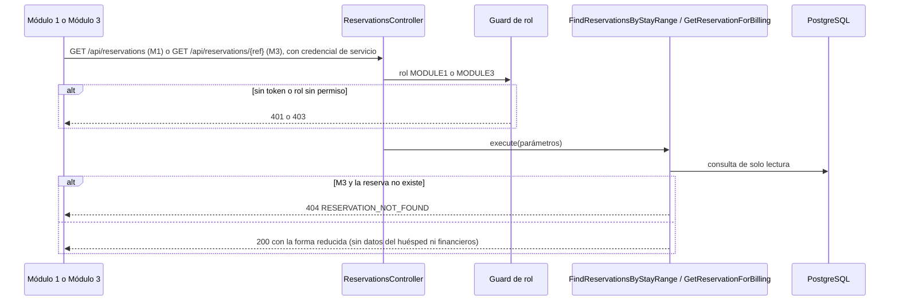

# Implementation Plan: Consultar Reservas

**Date**: 2026-10-09  
**Plan base**: [../base/plan.md](../base/plan.md)  
**Spec**: [spec.md](./spec.md)  
**Guía**: [../base/guia-planes-por-caso-de-uso.md](../base/guia-planes-por-caso-de-uso.md)

## Summary

Este caso de uso es la **única vía de lectura de reservas** del Módulo 2 y la que informa al Módulo 1 de
las llegadas del día. Hace cinco cosas:

1. **Listado, filtros, orden y paginación de a 10** para la Recepcionista (historia 1).
2. **Búsqueda por código y detalle completo** de una reserva (historia 2).
3. **Búsqueda por titular** (documento exacto o nombre parcial) desde el mismo cuadro de búsqueda
   (historia 3).
4. **Lista del día al Módulo 1**: un envío único a las 00:00 por la cola `m1.reservas.diarias.queue`
   (historia 4).
5. **Actualizaciones de la lista** (`ADDED`, `UPDATED`, `REMOVED`) cada vez que otro caso de uso cambia una
   reserva que forma parte de la lista del día (historia 5).

Además expone dos consultas de solo lectura para otros módulos, sin pantalla: la del **Módulo 3** por
`reservationRef` (FR-022) y la del **Módulo 1** por rango de fechas (FR-023).

Es de solo lectura sobre las reservas: no cambia ningún `status` ni ningún estado de habitación
(FR-008, FR-021). Lo único que escribe son sus propios mensajes al Módulo 1 (`daily_list_message`).

**Enfoque técnico**: casos de uso de consulta con un único puerto de lectura (`ReservationQueryPort`) y
filtros construidos con TypeORM `QueryBuilder`; el envío al Módulo 1 usa el patrón *outbox* (el mensaje se
guarda en la misma transacción que el cambio y un publicador lo envía en orden), para no perder ni
desordenar mensajes si RabbitMQ falla (FR-019, FR-020).

## Resumen técnico e identificación

| Dato | Valor |
|---|---|
| Caso de uso | Consultar reservas (`check-view-reservation`) |
| Spec | [spec.md](./spec.md), historias 1 a 5 y FR-001 a FR-023 |
| Actores | Recepcionista (pantalla); Módulo 1 (consulta por fechas y consumidor de la lista del día); Módulo 3 (consulta por referencia); procesos internos del Módulo 2 (búsqueda interna y cambios de la lista) |
| Naturaleza | Solo lectura sobre `Reservation`; escribe únicamente sus propios mensajes (`daily_list_message`, `daily_sequence`) |

**Disparadores** (cada capacidad de este caso de uso se activa de una forma distinta):

| # | Capacidad | Disparador | Actor | Contrato |
|---|---|---|---|---|
| 1 | Listado y búsqueda | REST `GET /api/reservations` | Recepcionista | C1 |
| 2 | Resumen del día | REST `GET /api/reservations/day-summary` | Recepcionista | C2 |
| 3 | Detalle de una reserva | REST `GET /api/reservations/{reservationRef}` | Recepcionista | C3 |
| 4 | Consulta para liquidar | REST `GET /api/reservations/{reservationRef}` | Módulo 3 | C4 |
| 5 | Reservas por fechas | REST `GET /api/reservations` | Módulo 1 | C5 |
| 6 | Lista del día | Tarea programada a las 00:00 (y al arrancar) | Sistema | Mensaje `reserva.lista-del-dia` |
| 7 | Actualización de la lista | Llamada interna de otro caso de uso, dentro de su transacción | Otros casos de uso del Módulo 2 | Mensaje `reserva.lista-del-dia.actualizacion` |
| 8 | Publicación de pendientes | Después de confirmar una transacción y tarea cada 10 s | Sistema | Colas del Módulo 1 |

## Technical Context

Todo el contexto técnico (lenguaje, framework, dependencias, almacenamiento, pruebas) es el del
[plan base](../base/plan.md#technical-context). Lo propio de este caso de uso:

- **Extensiones de PostgreSQL**: `unaccent` y `pg_trgm` (búsqueda por nombre sin tildes ni mayúsculas).
- **Dependencias nuevas**: ninguna.
- **Performance Goals** (del spec): búsqueda por código < 500 ms (NFR-001); una página del listado < 1 s
  con 50 000 reservas (NFR-002); lista del día publicada < 1 min con 500 reservas (NFR-004); cada
  actualización publicada < 5 s tras confirmar el cambio (NFR-005).
- **Constraints**: solo lectura sobre las reservas; los datos personales del titular no se escriben en
  los logs (NFR-003); nunca HTTP 500 (SC-004).

## Alcance y límites

| Dentro de este caso de uso | Fuera (lo hace otro caso de uso) |
|---|---|
| Listar, filtrar, buscar y mostrar el detalle | Modificar o cancelar la reserva (`update-reservation`, `cancel-reservation`); aquí solo se habilitan o no los botones |
| Armar y publicar la lista del día y sus actualizaciones | Decidir *cuándo* hay un cambio: los demás casos de uso llaman al puerto `DailyListChangeRecorder` dentro de su transacción |
| Calcular `migrationStatus` para mostrarlo | Registrar los movimientos migratorios (`process-guest-data`) |
| Consulta por referencia del Módulo 3 y por fechas del Módulo 1 | Cobrar o liquidar (Módulo 3); validar mantenimientos o bajas (Módulo 1): esa lógica es de ellos |
| El resumen del día (FR-005a) | La ocupación física: es del Módulo 1 |

## Contratos REST

Rutas y reglas generales del plan base: prefijo `/api`, JSON, autenticación JWT, errores con cuerpo
`{ "errorCode", "message", "timestamp", "path" }` y siempre 4xx (nunca 500). Roles: `RECEPTIONIST`,
`MODULE1` y `MODULE3` (los dos últimos, de servicio a servicio). La `OTA` no tiene acceso a nada de
este caso de uso (FR-011).

**Autorización de fondo**: sin token, `401` (`UNAUTHENTICATED`); con un rol sin permiso, `403`
(`FORBIDDEN`). Son 4xx, así que respetan la regla del diccionario.

### C1. `GET /api/reservations` (Recepcionista): listado y búsqueda

Un único cuadro de búsqueda (`search`) cubre código de reserva, código de la OTA, documento y nombre.

**Query params**

| Parámetro | Tipo | Obligatorio | Regla |
|---|---|---|---|
| `search` | texto | No | Ver "Algoritmo de búsqueda". Si viene, no puede estar vacío ni ser solo espacios |
| `status` | `PENDING` \| `ACTIVE` \| `IN_PROGRESS` \| `COMPLETED` \| `CANCELLED` \| `NO_SHOW` | No | Sin valor: todos los estados |
| `source` | `DIRECT` \| `OTA` | No | |
| `otaId` | id de agencia | No | Solo con `source=OTA` (ver "Puntos que este plan propone") |
| `dateFrom`, `dateTo` | `AAAA-MM-DD` | Ambos o ninguno | Rango inclusivo; cruce: `startDate ≤ dateTo` y `endDate > dateFrom`; máximo 366 días |
| `order` | `asc` \| `desc` | No | Por `startDate`. Por defecto `desc` |
| `page` | entero ≥ 1 | No | Por defecto `1`. Tamaño fijo de 10 (no hay `pageSize`) |

**Respuesta 200**

```json
{
  "items": [
    {
      "reservationRef": "RSV-3F9A1C7B",
      "externalConfirmationCode": null,
      "guest": { "fullName": "Valentina Ospina", "documentNumber": "1144093552" },
      "rooms": [ { "roomNumber": "204", "categoryRoom": "DOBLE" } ],
      "source": "DIRECT",
      "otaName": null,
      "startDate": "2026-10-23",
      "endDate": "2026-10-25",
      "status": "ACTIVE",
      "migrationStatus": "AWAITING_CHECK_IN",
      "actions": { "canModify": true, "canCancel": true }
    }
  ],
  "page": 1,
  "pageSize": 10,
  "totalItems": 45,
  "totalPages": 5,
  "message": null
}
```

- Una reserva con varias habitaciones aparece **una sola vez**, con todas en `rooms`.
- `externalConfirmationCode` y `otaName` solo vienen con valor en reservas `OTA`.
- `actions.canModify` y `actions.canCancel` son `true` solo si la reserva es `DIRECT` y está `ACTIVE` o
  `PENDING` (FR-005).
- Sin resultados: `200` con `items: []`, `totalItems: 0`, `totalPages: 0` y
  `message: "No se encontraron reservas con los filtros aplicados."` (FR-010).
- Si `page` supera `totalPages`, se devuelve la **última página válida** y `page` refleja la que se
  devolvió (caso borde del spec).
- No viene ningún dato financiero (FR-015 y la lista del día).

**Errores 400** (mensajes literales de FR-009, validados **antes** de tocar la base):

| `errorCode` | Cuándo | `message` |
|---|---|---|
| `INVALID_RESERVATION_CODE` | `search` vacío, solo espacios, con caracteres no permitidos o de más de 40 | "Debe proveer un código de reserva válido para la consulta." |
| `RESERVATION_NOT_FOUND` | `search` empieza con `RSV-` y no hay coincidencia | "La reserva no existe." |
| `INVALID_STATUS` | `status` fuera del enumerado | "El estado indicado no es válido." |
| `INVALID_CHANNEL` | `source` fuera del enumerado | "El canal indicado no es válido." |
| `INVALID_DATE` | `dateFrom` o `dateTo` mal formada o inexistente (por ejemplo `2026-02-30`) | "La fecha indicada no es válida." |
| `INCOMPLETE_DATE_RANGE` | Solo una de las dos fechas | "Debe completar ambas fechas del rango." |
| `INVALID_DATE_RANGE` | `dateFrom` > `dateTo` | "La fecha inicial no puede ser posterior a la fecha final." |
| `DATE_RANGE_TOO_LARGE` | Más de 366 días | "El rango de fechas no puede superar 366 días." |
| `INVALID_SORT_ORDER` | `order` distinto de `asc`/`desc` | "El orden indicado no es válido." |
| `INVALID_PAGE` | `page` < 1 o no entero | "El número de página debe ser 1 o mayor." |
| `NAME_SEARCH_TOO_SHORT` | Texto sin dígitos de menos de 3 caracteres | "La búsqueda por nombre requiere al menos 3 caracteres." |

**Orden de validación** (el primero que falle responde): formato de `search` → `status` → `source` →
fechas (formato, completitud, orden, 366 días) → `order` → `page` → longitud del nombre.

### C2. `GET /api/reservations/day-summary` (Recepcionista): resumen del día

```json
{ "operationalDate": "2026-10-09", "expectedArrivals": 2, "expectedDepartures": 0 }
```

- `expectedArrivals`: reservas `ACTIVE` o `PENDING` con `startDate` igual al día operativo.
- `expectedDepartures`: reservas `IN_PROGRESS` con `endDate` igual al día operativo.
- Solo datos del Módulo 2 (FR-005a). Nunca ocupación física. Es una ruta fija, declarada **antes** que
  `/{reservationRef}` para que no se confunda con una referencia.

### C3. `GET /api/reservations/{reservationRef}` (Recepcionista): detalle completo (FR-006)

**Respuesta 200**

```json
{
  "reservationRef": "RSV-3F9A1C7B",
  "status": "ACTIVE",
  "source": "DIRECT",
  "externalConfirmationCode": null,
  "otaName": null,
  "startDate": "2026-10-23",
  "endDate": "2026-10-25",
  "nights": 2,
  "guestCount": 3,
  "notes": "",
  "createdAt": "2026-10-01T09:14:00-05:00",
  "rooms": [
    {
      "roomNumber": "204",
      "categoryRoom": "DOBLE",
      "guestCount": 3,
      "roomGrossAmount": { "amount": "713000.00", "currency": "COP" },
      "stayStatus": "EXPECTED"
    }
  ],
  "guest": {
    "firstName": "Valentina", "lastName": "Ospina", "documentType": "CC", "documentNumber": "1144093552",
    "nationality": "Colombia", "contactPhone": "+57 300 000 0000", "contactEmail": "valentina@correo.com"
  },
  "cancellation": null
}
```

- `roomGrossAmount` es `null` en reservas `OTA`. El dinero va como **texto decimal** (`decimal.js`),
  nunca como número.
- `cancellation` solo viene en reservas `CANCELLED` por solicitud explícita:
  `{ "cancellationDate", "channel", "reason", "processedBy" }`. El No-Show no tiene `Cancellation`.
- Si la reserva no existe: `400` `RESERVATION_NOT_FOUND`, "La reserva no existe." (regla del plan base:
  los recursos inexistentes son 400). Si `reservationRef` no cumple el formato permitido:
  `400` `INVALID_RESERVATION_CODE`.

### C4. `GET /api/reservations/{reservationRef}` (Módulo 3): consulta para liquidar (FR-022)

**Misma ruta que C3, respuesta distinta según el rol.** Con rol `MODULE3` el controlador llama al caso
de uso `GetReservationForBilling` y entrega solo esto:

```json
{
  "reservationRef": "RSV-3F9A1C7B",
  "channel": "DIRECT",
  "quoteIds": ["8b1f6c0e-7d1a-4c0b-9d5e-2f4f3b6a1c11"]
}
```

```json
{
  "reservationRef": "RSV-8D02E5A4",
  "channel": "OTA",
  "quoteIds": [],
  "otaId": "ota-booking",
  "otaConfirmationCode": "4417829013",
  "otaCommissionPercentage": 15.00
}
```

- `quoteIds`: el `quoteId` de cada `ReservationRoom`, una cotización por habitación. Va **vacía** en
  reservas `OTA`, que no tienen cotización.
- `otaId`, `otaConfirmationCode` y `otaCommissionPercentage` **solo** si `channel` es `OTA`
  (`otaCommissionPercentage` es el `commissionPercentage` congelado en la reserva).
- No incluye otros datos financieros ni del huésped.
- Si la reserva no existe: **`404`** `RESERVATION_NOT_FOUND`. Es la única respuesta 404 del Módulo 2:
  el Módulo 3 la espera así (ver el plan base, sección "Errores").
- Cualquier otro rol que no sea `RECEPTIONIST` ni `MODULE3`: `403`.

### C5. `GET /api/reservations` (Módulo 1): reservas por fechas (FR-023)

**Misma ruta que C1, comportamiento distinto con rol `MODULE1`**: el controlador llama a
`FindReservationsByStayRange`. Sirve al Módulo 1 para validar un mantenimiento al registrarlo o dar de
baja una habitación; la lógica sobre esas reservas es suya.

| Parámetro | Obligatorio | Regla |
|---|---|---|
| `dateFrom`, `dateTo` | Sí, ambos | `AAAA-MM-DD`; mismo cruce de FR-003; máximo 366 días |
| `roomId` | No | Id de habitación del Módulo 1 |

Cualquier otro parámetro (`search`, `status`, `source`, `page`...) con este rol: `400`
`UNSUPPORTED_PARAMETER`.

**Respuesta 200** (sin paginar; solo reservas `PENDING`, `ACTIVE` o `IN_PROGRESS`):

```json
{
  "items": [
    {
      "reservationRef": "RSV-3F9A1C7B",
      "status": "ACTIVE",
      "startDate": "2026-10-23",
      "endDate": "2026-10-25",
      "rooms": [ { "roomId": "a4c2…", "roomNumber": "204", "categoryRoom": "DOBLE" } ]
    }
  ]
}
```

- Con `roomId`, cada reserva trae **todas** sus habitaciones (no solo la filtrada), para que el Módulo 1
  vea el panorama completo.
- Sin datos financieros ni del huésped. Solo lectura: no cambia nada.
- Errores `400`: `INCOMPLETE_DATE_RANGE`, `INVALID_DATE`, `INVALID_DATE_RANGE`, `DATE_RANGE_TOO_LARGE`
  (mismos mensajes que C1) y `INVALID_ROOM_ID` ("El identificador de la habitación es inválido.").

### Resumen de rutas y roles

| Ruta | `RECEPTIONIST` | `MODULE1` | `MODULE3` | `OTA` |
|---|---|---|---|---|
| `GET /api/reservations` | Listado (C1) | Por fechas (C5) | 403 | 403 |
| `GET /api/reservations/day-summary` | Sí (C2) | 403 | 403 | 403 |
| `GET /api/reservations/{reservationRef}` | Detalle (C3) | 403 | Para liquidar (C4) | 403 |

## Algoritmo de búsqueda

Una sola función de aplicación, `ResolveSearchCriteria`, convierte `search` en un criterio (así el
resultado es el mismo para la pantalla y para los demás casos de uso, FR-007):

1. **Normalizar**: quitar espacios de los extremos y colapsar los repetidos.
2. **Validar**: no vacío, máximo 40 caracteres y solo letras (con tildes y `ñ`), dígitos, espacios
   internos y guion. Si no, `INVALID_RESERVATION_CODE`.
3. **Código** (prioridad): buscar **en paralelo** coincidencia exacta, sin distinguir mayúsculas, con
   `reservationRef` **y** con `externalConfirmationCode`. Si hay una o más coincidencias, el listado se
   acota a ellas e **ignora** `status`, `source`, `otaId`, `dateFrom` y `dateTo`. Pueden ser varias filas
   (un código que es `reservationRef` de una y `externalConfirmationCode` de otra, o el mismo código de
   dos agencias): se listan todas.
4. **Referencia interna sin coincidencia**: si el texto empieza con `RSV-` (sin distinguir mayúsculas) y
   el paso 3 no encontró nada, `RESERVATION_NOT_FOUND`.
5. **Documento**: si tiene al menos un dígito, se interpreta como `documentNumber` con coincidencia
   **exacta**, y se combina con los demás filtros.
6. **Nombre**: si no tiene dígitos, se interpreta como `fullName` con coincidencia **parcial**, sin
   distinguir mayúsculas ni tildes; mínimo 3 caracteres (si no, `NAME_SEARCH_TOO_SHORT`). Se combina con
   los demás filtros.

Nunca se envían documento y nombre a la vez: el paso 5 o el 6, no ambos.

## Mensajería hacia el Módulo 1

Cola de salida única del Módulo 2 (la define el plan base): exchange `hospitua.events`, cola
`m1.reservas.diarias.queue`, dos routing keys por el mismo canal y proceso para conservar el orden. Este
es el contrato **ya acordado con el equipo del Módulo 1**; el plan lo adopta tal cual.

| Routing key | Mensaje | Cuándo | `sequenceNumber` |
|---|---|---|---|
| `reserva.lista-del-dia` | Lista del día | Una vez por día operativo a las 00:00 | Siempre `1` |
| `reserva.lista-del-dia.actualizacion` | Actualización `ADDED`, `UPDATED` o `REMOVED` | Cada cambio confirmado que afecta la lista | `2, 3, 4…` dentro del día operativo |

- Los mensajes son **JSON planos**, sin envoltura: el `messageId` (UUIDv4) es la única clave para
  descartar duplicados y el `sequenceNumber` marca el orden.
- Las fechas sin hora van como `AAAA-MM-DD`; las fechas con hora, en ISO 8601 con zona horaria
  (`updatedAt` con microsegundos, porque es el control de concurrencia). Los valores de los ejemplos son
  ilustrativos.
- La lista y sus actualizaciones llevan el detalle de FR-014 de la spec. El campo `source` viaja como
  `DIRECTA` para las reservas directas o con el nombre de la agencia (por ejemplo `BOOKING`) para las
  `OTA`.

### Lista del día (FR-013, FR-014)

Routing key `reserva.lista-del-dia`, una vez por día operativo a las 00:00:

```json
{
  "messageId": "UUIDv4",
  "sequenceNumber": 1,
  "operationalDate": "2026-10-09",
  "generatedAt": "2026-10-09T00:00:02-05:00",
  "totalReservations": 1,
  "totalRooms": 1,
  "totalGuests": 2,
  "reservations": [
    {
      "reservationRef": "RSV-3F9A1C7B",
      "status": "ACTIVE",
      "source": "DIRECTA",
      "startDate": "2026-10-09",
      "endDate": "2026-10-12",
      "guestCount": 2,
      "notes": "Llegada tarde",
      "updatedAt": "2026-10-08T15:42:10.123456-05:00",
      "rooms": [
        { "roomId": "uuid", "roomNumber": "201", "categoryRoom": "DOBLE", "guestCount": 2 }
      ],
      "guest": {
        "guestRef": "uuid",
        "firstName": "Ana",
        "lastName": "Pérez",
        "fullName": "Ana Pérez",
        "documentType": "CC",
        "documentNumber": "123",
        "nationality": "Colombia",
        "contactPhone": "+57 300 000 0000",
        "contactEmail": "ana@correo.com"
      }
    }
  ]
}
```

- Una reserva `OTA` lleva además `externalConfirmationCode`, y su `source` es el nombre de la agencia.
- Si no hay reservas, la lista se envía con `"reservations": []` y los tres totales en `0`.
- Solo reservas `ACTIVE` con `startDate` igual al día operativo. Las `PENDING` de OTA no viajan; las que
  ya están `IN_PROGRESS` por una llegada anticipada tampoco.
- `totalGuests` es la suma de los `guestCount` de las reservas; `totalRooms`, el número de habitaciones.
- Un teléfono o correo que no exista viaja `null`; no impide el envío.
- **Nunca** `grossAmount`, comisión ni tarifas (FR-015), ni número de noches.

### Actualización `ADDED` o `UPDATED` (FR-016)

Routing key `reserva.lista-del-dia.actualizacion`. El campo `reservation` lleva el detalle completo y
vigente de FR-014, no solo lo que cambió:

```json
{
  "messageId": "UUIDv4",
  "sequenceNumber": 2,
  "operationalDate": "2026-10-09",
  "updateType": "UPDATED",
  "occurredAt": "2026-10-09T09:15:00-05:00",
  "reservationRef": "RSV-3F9A1C7B",
  "reservation": {
    "reservationRef": "RSV-3F9A1C7B",
    "status": "ACTIVE",
    "source": "DIRECTA",
    "startDate": "2026-10-09",
    "endDate": "2026-10-13",
    "guestCount": 2,
    "notes": "Llegada tarde",
    "updatedAt": "2026-10-09T09:15:00.000000-05:00",
    "rooms": [
      { "roomId": "uuid", "roomNumber": "201", "categoryRoom": "DOBLE", "guestCount": 2 }
    ],
    "guest": {
      "guestRef": "uuid",
      "firstName": "Ana",
      "lastName": "Pérez",
      "fullName": "Ana Pérez",
      "documentType": "CC",
      "documentNumber": "123",
      "nationality": "Colombia",
      "contactPhone": "+57 300 000 0000",
      "contactEmail": "ana@correo.com"
    }
  }
}
```

### Actualización `REMOVED` (FR-016)

Misma routing key. No lleva `reservation`; `removalReason` es `CANCELLED`, `DATE_CHANGED` o `NO_SHOW`:

```json
{
  "messageId": "UUIDv4",
  "sequenceNumber": 3,
  "operationalDate": "2026-10-09",
  "updateType": "REMOVED",
  "occurredAt": "2026-10-09T23:59:00-05:00",
  "reservationRef": "RSV-8D02E5A4",
  "removalReason": "NO_SHOW"
}
```

Una actualización pendiente de un día anterior se envía con la `operationalDate` a la que pertenece, no
con la del momento del envío.

### Contrato con el Módulo 1 (lo que debe garantizar quien consume)

- Descartar los `messageId` repetidos.
- Aplicar los mensajes en orden de `sequenceNumber` dentro de cada `operationalDate`; ante varios
  cambios de la misma reserva, quedarse con el de mayor secuencia.
- No responder: es una notificación proactiva.

## Cuándo una reserva "entra", "cambia" o "sale" de la lista

La regla vive en el **dominio** (`DailyListMembership`), no en cada caso de uso, y la usa el puerto
`DailyListChangeRecorder`. Los demás casos de uso lo llaman **dentro de su transacción**, con la reserva
antes y después del cambio.

Una reserva **pertenece a la lista** si `startDate` es el día operativo y `status` es `ACTIVE`. El día
operativo es el **en curso**, salvo que quien llama indique otro: el cierre del día de `update-reservation`
corre después de las 00:00 y pasa la fecha del día que acaba de terminar, para que el `REMOVED` por
`NO_SHOW` use la secuencia y la `operationalDate` de la lista a la que pertenecía.

| Antes | Después | Resultado |
|---|---|---|
| No pertenece | Pertenece | `ADDED` (creación directa para hoy, confirmación OTA con llegada hoy, cambio de llegada a hoy) |
| Pertenece | Pertenece y cambió algún campo de FR-014 | `UPDATED` |
| Pertenece | Pertenece y no cambió ningún campo de FR-014 | Nada (escenario 8: un cambio que no afecta no genera mensaje) |
| Pertenece | `status` = `CANCELLED` | `REMOVED` con `CANCELLED` |
| Pertenece | `startDate` distinto del día operativo | `REMOVED` con `DATE_CHANGED` |
| Pertenece | `status` = `NO_SHOW` | `REMOVED` con `NO_SHOW` |
| Pertenece | `status` = `IN_PROGRESS` o `COMPLETED` | **Nada**: Check-In y Check-Out los ejecuta el Módulo 1 (FR-017) |
| No pertenece | No pertenece | Nada (llegada futura u otro día) |

"Cambió un campo de FR-014" se decide comparando la proyección de la reserva (la misma que viaja en el
mensaje) antes y después; así no se envían actualizaciones vacías.

**No se envía nada mientras la lista del día no se haya generado**: la reserva quedará incluida cuando la
lista se arme con los datos vigentes (caso borde del spec).

## Secuencia, orden y fallas de publicación

### Tablas

`daily_list_message` ya está definida en el plan base: guarda cada mensaje con su `payload` antes de
publicarlo, con `message_kind` (`LIST` o `UPDATE`), `update_type`, `reservation_id`, `removal_reason`,
`publish_status` (`PENDING`, `PUBLISHED`, `FAILED`) y `attempts`. Este caso de uso la usa tal cual: el
único parcial `(operational_date) WHERE message_kind = 'LIST'` es el respaldo de que la lista sale una
sola vez por día, y el índice `(publish_status, operational_date, sequence_number)` sirve para reintentar
en orden. La causa de cada fallo no tiene columna: se escribe en el log, sin datos personales.

Lo único que este plan agrega al modelo de datos es **`daily_sequence`** (se documenta también en el
plan base): una fila por día operativo que serializa la numeración.

| Columna | Notas |
|---|---|
| `operational_date` (PK) | |
| `last_sequence` | Último `sequenceNumber` asignado; `0` hasta que sale la lista |
| `list_generated` | `true` cuando ya existe la lista (secuencia 1) |

### Por qué hace falta `daily_sequence`

Dos cambios simultáneos de reservas distintas podrían tomar el mismo número, y una reserva creada justo
a las 00:00 podría perderse entre la lista y la primera actualización. La fila del día se bloquea con
`SELECT … FOR UPDATE`:

- **Cambio de una reserva** (en la transacción del otro caso de uso): bloquea la fila de hoy. Si
  `list_generated` es `false`, no emite nada (la lista incluirá el cambio). Si es `true`, toma
  `last_sequence + 1`, lo guarda y inserta el mensaje `PENDING` **en la misma transacción** que el cambio.
- **Proceso de las 00:00**: bloquea la misma fila (la crea si no existe), lee las reservas ya
  confirmadas, arma la lista, inserta el mensaje con secuencia 1, y marca `list_generated = true`.

Como ambos pasan por el mismo bloqueo, ningún cambio queda "entre medio": o entra en la lista o genera su
`ADDED`/`UPDATED`.

### Publicación en orden

1. **Después de confirmar** la transacción (hook de confirmación), un publicador intenta enviar los
   mensajes `PENDING` del día. Así se cumple la meta de menos de 5 s (NFR-005) en condiciones normales.
2. Una tarea cada 10 s (`@nestjs/schedule`, con bloqueo asesor) reintenta los pendientes.
3. Siempre se publica **por `operational_date` y `sequence_number` ascendente** y **se detiene en el
   primer fallo**: un mensaje nunca se publica antes que uno anterior.
4. Reintentos con espera creciente (por ejemplo 5 s, 15 s, 45 s, 2 min, 5 min). Tras 10 intentos el
   mensaje pasa a `FAILED`, se registra una alerta (log de nivel `error` con el `messageId`, sin datos
   personales) para revisión humana, y los siguientes **esperan detrás**: no se salta la secuencia.
5. Un mensaje `FAILED` se reencola a mano (comando de administración) una vez resuelta la causa; no hay
   ruta REST para eso.
6. Si la publicación falla, la operación que originó el cambio **no se revierte** (FR-020).

### Tareas programadas (zona horaria `America/Bogota`, con bloqueo asesor)

| Tarea | Horario | Qué hace |
|---|---|---|
| `GenerateDailyList` | 00:00 todos los días | Arma y guarda la lista del día con secuencia 1 y dispara su publicación |
| Recuperación al arrancar | Al iniciar la aplicación | Si es un día operativo y `list_generated` es `false`, genera la lista (cubre un reinicio o una caída a las 00:00) |
| `PublishPendingDailyMessages` | Cada 10 s | Publica en orden los mensajes `PENDING` |

`GenerateDailyList` es **idempotente**: si `list_generated` ya es `true`, no hace nada (historia 4,
escenario 4). El respaldo definitivo es la restricción única `(operational_date, sequence_number)`.

## Diagramas de secuencia

### D1. Listado y búsqueda (C1)



### D2. Lista del día a las 00:00



### D3. Actualización cuando otro caso de uso cambia una reserva



### D4. Falla de publicación y reanudación en orden



### D5. Consulta de otros módulos (C4 y C5)



## Datos y consultas

### Modelo de datos y entidades involucradas

Este caso de uso **no cambia ningún estado**: lee las entidades del dominio y escribe solo sus mensajes.

| Tabla | Uso | Qué se toca |
|---|---|---|
| `reservation` | Lectura | `reservation_ref`, `status`, `source`, `start_date`, `end_date`, `guest_count`, `notes`, `created_at`, `updated_at`, `external_confirmation_code`, `ota_id`, `commission_percentage` (solo para C4) |
| `reservation_room` | Lectura | `room_id`, `room_number`, `category_room`, `guest_count`, `stay_status`, `room_gross_amount` y `quote_id` (solo `DIRECT`) |
| `guest` | Lectura | Titular: nombres, documento, nacionalidad, contacto |
| `ota` | Lectura | `name` para mostrar la agencia y generar `source` |
| `cancellation` | Lectura | Solo en el detalle de una reserva cancelada por solicitud explícita |
| `guest_data`, `migratory_movement` | Lectura | Solo para `migrationStatus` (`EXISTS` de movimientos de extranjeros) |
| `daily_list_message` | Escritura | Un mensaje por lista y por actualización, con su `payload` y su estado de publicación |
| `daily_sequence` | Escritura | Una fila por día operativo (nueva en este plan) |

**Estados y transiciones**: ninguna. El `Reservation.status` y el `stayStatus` solo se leen. Lo único con
ciclo de vida propio es el mensaje:

```text
PENDING --publicado--> PUBLISHED
PENDING --10 intentos fallidos--> FAILED --reencolado a mano--> PENDING
```

### Índices y extensiones (migraciones en SQL, decisión D11)

| Qué | Para qué |
|---|---|
| `CREATE EXTENSION unaccent; CREATE EXTENSION pg_trgm;` | Búsqueda por nombre |
| Índice único `reservation(lower(reservation_ref))` | Búsqueda por código sin distinguir mayúsculas |
| Índice `reservation(lower(external_confirmation_code))` | Idem; no es único (dos agencias pueden repetirlo) |
| Índice `reservation(status, start_date)` | Filtro por estado y lista del día |
| Índice `reservation(start_date, end_date)` | Cruce de fechas |
| Índice `reservation_room(room_id)` | Consulta del Módulo 1 por `roomId` |
| Índice `guest(document_number_normalized)` | Documento exacto |
| Índice GIN `gin_trgm_ops` sobre `immutable_unaccent(lower(first_name \|\| ' ' \|\| last_name))` | Nombre parcial |

- `immutable_unaccent` es un envoltorio `IMMUTABLE` de `unaccent` (PostgreSQL exige que la función de un
  índice lo sea).
- `document_number_normalized` es una columna generada (mayúsculas, sin puntos ni espacios) para que
  `1.144.093.552` y `1144093552` coincidan. Cuando el texto buscado se normaliza igual, la comparación es
  exacta.

### Consulta del listado

1. Una consulta cuenta los totales con los mismos filtros.
2. Otra trae los **ids de la página** (`ORDER BY start_date`, con `reservation_ref` como desempate, `LIMIT 10 OFFSET …`).
3. Una tercera carga reserva, titular, habitaciones y agencia de esos ids, y calcula `migrationStatus` solo
   para esas 10.

Así se evita duplicar filas por habitación (SC-003) y se mantiene el costo de la página, no el de la tabla.

### `migrationStatus` (FR-005b)

Función pura en el dominio: `deriveMigrationStatus(status, hasForeignMovement)`.

| `status` | Resultado |
|---|---|
| `ACTIVE`, `PENDING` | `AWAITING_CHECK_IN` |
| `CANCELLED`, `NO_SHOW` | `NO_CHECK_IN` |
| `IN_PROGRESS`, `COMPLETED` con movimientos de huéspedes extranjeros | `COMPLETE` |
| `IN_PROGRESS`, `COMPLETED` sin ellos | `NOT_REQUIRED` |

`hasForeignMovement` se consulta una sola vez por página con `EXISTS` sobre `migratory_movement` unido a
`guest_data` (nacionalidad distinta de `Colombia`). No se guarda.

## Reglas de validación y manejo de errores

Todo error sale con el cuerpo `{ "errorCode", "message", "timestamp", "path" }` y **siempre 4xx**. El
filtro global del plan base traduce cualquier excepción inesperada a un 4xx controlado y deja el detalle
en el log, sin datos personales ni de infraestructura. **Este caso de uso nunca responde 500.**

### Errores del cliente (REST)

| Situación | HTTP | `errorCode` | Dónde se detecta |
|---|---|---|---|
| Sin token o token inválido | 401 | `UNAUTHENTICATED` | Guard de autenticación |
| Rol sin permiso (incluida la `OTA`) | 403 | `FORBIDDEN` | Guard de rol |
| Filtro con formato inválido (estado, canal, fechas, orden, página, código, nombre) | 400 | Los de la tabla de C1 | DTO, antes de consultar |
| `RSV-…` sin coincidencia, o referencia inexistente en el detalle | 400 | `RESERVATION_NOT_FOUND` | `ResolveSearchCriteria` y `GetReservationDetail` |
| Referencia inexistente en la consulta del Módulo 3 | 404 | `RESERVATION_NOT_FOUND` | `GetReservationForBilling` |
| Parámetro ajeno con rol `MODULE1` | 400 | `UNSUPPORTED_PARAMETER` | DTO del Módulo 1 |
| `roomId` con formato inválido | 400 | `INVALID_ROOM_ID` | DTO del Módulo 1 |
| Agencia sin canal `OTA` | 400 | `AGENCY_REQUIRES_OTA_CHANNEL` | DTO |
| Texto con caracteres de inyección en cualquier filtro | 400 | `INVALID_RESERVATION_CODE` | Validación de formato; nunca llega a la base |

**Sin resultados no es un error**: responde 200 con la lista vacía y el mensaje (FR-010).

### Errores internos

| Situación | Respuesta | Qué más pasa |
|---|---|---|
| Excepción inesperada o base de datos caída durante una consulta | 400 `REQUEST_NOT_PROCESSED`, "No fue posible procesar la solicitud." | Se registra con el identificador de correlación; sin datos personales |
| Tiempo agotado en una consulta | 400 `REQUEST_NOT_PROCESSED` | Se registra la duración |

### Errores de la cola (no hay cliente al que responder)

| Situación | Comportamiento |
|---|---|
| RabbitMQ no disponible al publicar | El mensaje queda `PENDING`; reintento con espera creciente (5 s, 15 s, 45 s, 2 min, 5 min); la operación original **no** se revierte |
| 10 intentos fallidos | `FAILED`, alerta en el log (nivel `error`, con `messageId`), y los mensajes siguientes del día esperan detrás |
| Publicación sin confirmación del broker en 5 s | Se cuenta como intento fallido |
| Dos instancias generan la lista a la vez | Una toma el bloqueo asesor y la otra se salta; la restricción única del plan base es el respaldo |
| Reinicio a las 00:00 | La recuperación al arrancar genera la lista si falta |

## Integraciones externas

Este caso de uso **no hace ninguna llamada síncrona a otros módulos**: ni al Módulo 1 ni al Módulo 3. Solo
publica por cola y responde consultas. No necesita `Module1Port` ni `Module3Port`.

| Módulo | Dirección | Mecanismo | Contrato | Fallo o tiempo agotado |
|---|---|---|---|---|
| Módulo 1 | M2 → M1 | Cola `m1.reservas.diarias.queue` (`reserva.lista-del-dia` y `reserva.lista-del-dia.actualizacion`) | "Mensajería hacia el Módulo 1" | Reintento en orden, `FAILED` con alerta y bloqueo de los siguientes |
| Módulo 1 | M1 → M2 | REST `GET /api/reservations` con `dateFrom`, `dateTo` y `roomId` | C5 | Es una consulta que ellos hacen; el Módulo 2 responde 4xx controlado y nunca 500 |
| Módulo 3 | M3 → M2 | REST `GET /api/reservations/{reservationRef}` | C4 | Idem; 404 si no existe |

**Compromisos con cada módulo**

- **Módulo 1**: descarta `messageId` repetidos, aplica en orden por `sequenceNumber`, no responde.
- **Módulo 3**: llama con credencial de servicio (rol `MODULE3`) y espera 404 si la reserva no existe.
- **Autenticación de servicio** de ambos: definida en el plan base (JWT de servicio a servicio).

## Arquitectura (capas del plan base)

| Capa | Piezas de este caso de uso |
|---|---|
| `domain/reservation/` | `DailyListMembership` (cuándo entra, cambia o sale), `ReservationProjection` (el detalle de FR-014), `deriveMigrationStatus` |
| `application/use-cases/check-view-reservation/` | **Entrada**: `ListReservations`, `GetReservationDetail`, `GetDaySummary`, `GetReservationForBilling`, `FindReservationsByStayRange`, `GenerateDailyList`, `PublishPendingDailyMessages`, `DailyListChangeRecorder` |
| `application/ports/out/` | `ReservationQueryPort` (solo lectura), `DailyMessageRepository`, `DailySequenceRepository`, `DailyListPublisher`, `Clock` |
| `infrastructure/in/rest/` | `ReservationsController` (C1–C5), con DTO validados con `class-validator` y guards por rol |
| `infrastructure/in/jobs/` | `DailyListJob` (00:00 y al arrancar), `PublishPendingJob` (cada 10 s) |
| `infrastructure/out/persistence/` | `TypeOrmReservationQuery` (`QueryBuilder`), repositorios de `daily_list_message` y `daily_sequence` |
| `infrastructure/out/messaging/` | `RabbitDailyListPublisher` (exchange `hospitua.events`, confirmación de publicación) |

**Servicio interno (FR-007)**: los demás casos de uso buscan reservas por el puerto de entrada
`ReservationLookup` (`findByRef`, `findByCode`, `findForUpdate`), que devuelve la reserva completa con
`updatedAt` y comisión, y `findBlockingRooms(roomIds, startDate, endDate, excludeReservationRef?)`, que
usa `check-room-availability` para saber qué habitaciones ya ocupan inventario (su contrato está en el
plan de ese caso de uso). No usan la ruta REST ni las clases internas de este caso de uso (regla 6 de la
arquitectura).

**Integración con otros casos de uso**: `cancel-reservation`, `update-reservation`,
`generate-direct-reservation` y `generate-ota-reservation` llaman a `DailyListChangeRecorder.record(tx,
before, after, operationalDate?)` dentro de su transacción (`operationalDate` es opcional y por defecto
es el día operativo en curso). Cada uno de esos planes debe listar esa llamada.

## Project Structure

```text
specs/check-view-reservation/
├── spec.md
└── plan.md                          # Este archivo

backend/src/
├── domain/reservation/
│   ├── daily-list-membership.ts     # entra / cambia / sale de la lista
│   ├── reservation-projection.ts    # detalle de FR-014
│   └── migration-status.ts          # deriveMigrationStatus
├── application/use-cases/check-view-reservation/
│   ├── ports/in/                    # un puerto por caso de uso
│   ├── list-reservations.service.ts
│   ├── resolve-search-criteria.ts
│   ├── get-reservation-detail.service.ts
│   ├── get-reservation-for-billing.service.ts
│   ├── find-reservations-by-stay-range.service.ts
│   ├── get-day-summary.service.ts
│   ├── generate-daily-list.service.ts
│   ├── daily-list-change-recorder.service.ts
│   └── publish-pending-daily-messages.service.ts
├── infrastructure/in/rest/reservations.controller.ts
├── infrastructure/in/jobs/daily-list.job.ts
├── infrastructure/in/jobs/publish-pending.job.ts
├── infrastructure/out/persistence/reservation-query.repository.ts
├── infrastructure/out/persistence/daily-message.repository.ts
├── infrastructure/out/messaging/rabbit-daily-list.publisher.ts
└── migrations/                      # extensiones, índices, daily_sequence

backend/test/
├── unit/                            # membresía, migrationStatus, criterios de búsqueda
├── integration/                     # listado, búsqueda, lista del día, publicación en orden
└── contract/                        # C1–C5 y forma de los mensajes de cola

frontend/src/pages/reservations/     # listado con filtros, detalle, resumen del día
```

**Structure Decision**: sin código nuevo fuera de las carpetas del plan base. Las consultas viven en
`application/use-cases/check-view-reservation/` y el único acoplamiento con otros casos de uso es el puerto
`DailyListChangeRecorder`.

## Phase 1: Setup

- [ ] T001 Migración SQL: extensiones `unaccent` y `pg_trgm`, `immutable_unaccent`, columna generada `document_number_normalized` y los índices de "Datos y consultas"
- [ ] T002 [P] Migración SQL: tabla `daily_sequence` (la de `daily_list_message` ya viene del plan base)

## Phase 2: Foundational

- [ ] T003 [P] `deriveMigrationStatus` y `DailyListMembership` en el dominio, con pruebas unitarias de cada fila de las dos tablas
- [ ] T004 [P] `ReservationProjection` (el detalle de FR-014) y su mapeo a la forma del mensaje
- [ ] T005 `ReservationQueryPort` y su implementación TypeORM: filtros, orden, paginación y cruce de fechas
- [ ] T006 `ResolveSearchCriteria` (algoritmo de búsqueda) con pruebas unitarias de cada caso
- [ ] T007 DTO de entrada con validación y el orden de validación; mensajes literales de FR-009 en un solo archivo de constantes
- [ ] T008 Guards por rol para `RECEPTIONIST`, `MODULE1` y `MODULE3`, y el 403 para `OTA`

## Phase 3: User Story 1 - Listado con filtros, orden y paginación (P1)

**Goal**: la Recepcionista ve todas las reservas de a 10 y las acota por estado, canal, agencia y fechas.  
**Independent Test**: 45 reservas en los seis estados y ambos canales; cada filtro y las combinaciones
devuelven exactamente lo esperado, con totales y páginas correctos.

- [ ] T009 [US1] Caso de uso `ListReservations` y `GET /api/reservations` (C1) sin búsqueda
- [ ] T010 [US1] Fila del listado: una reserva por fila, habitaciones agrupadas, `actions`, `migrationStatus`
- [ ] T011 [US1] Ajuste de página al último valor válido y respuesta vacía con mensaje
- [ ] T012 [US1] `GET /api/reservations/day-summary` (C2)
- [ ] T013 [US1] Pruebas de integración de los escenarios 1 a 9 (ver tabla de pruebas)
- [ ] T014 [P] [US1] Frontend: listado, filtros, orden, paginación y resumen del día

## Phase 4: User Story 2 - Búsqueda por código y detalle (P1)

**Goal**: encontrar una reserva por `reservationRef` o código de la OTA y ver todo su detalle.

- [ ] T015 [US2] Búsqueda por código en paralelo (referencia y código de la OTA) que ignora los demás filtros
- [ ] T016 [US2] `GetReservationDetail` y `GET /api/reservations/{reservationRef}` para `RECEPTIONIST` (C3), con `Cancellation` y datos de Check-In/Check-Out
- [ ] T016a [US2] `ReservationLookup.findBlockingRooms` (lo usa `check-room-availability`), con su consulta sobre `reservation_room`
- [ ] T017 [US2] Errores `RESERVATION_NOT_FOUND` e `INVALID_RESERVATION_CODE` sin llegar a la base de datos cuando el formato es inválido
- [ ] T018 [US2] Pruebas de integración de los escenarios 1 a 6
- [ ] T019 [P] [US2] Frontend: pantalla de detalle

## Phase 5: User Story 3 - Búsqueda por titular (P2)

- [ ] T020 [US3] Documento exacto normalizado y nombre parcial sin tildes (`pg_trgm`), combinables con estado, canal y fecha
- [ ] T021 [US3] Error `NAME_SEARCH_TOO_SHORT`
- [ ] T022 [US3] Pruebas de integración de los escenarios 1 a 4

## Phase 6: User Story 4 - Lista del día al Módulo 1 (P1)

**Goal**: el Módulo 1 recibe, cada día operativo, una sola lista con las reservas `ACTIVE` que llegan.

- [ ] T023 [US4] `GenerateDailyList` con bloqueo de `daily_sequence`, secuencia 1 y mensaje `PENDING`
- [ ] T024 [US4] `DailyListJob` a las 00:00 (`America/Bogota`) y recuperación al arrancar
- [ ] T025 [US4] `RabbitDailyListPublisher` con confirmación de publicación y el orden por secuencia
- [ ] T026 [US4] `PublishPendingDailyMessages`, reintentos con espera creciente y paso a `FAILED` con alerta
- [ ] T027 [US4] Pruebas de integración de los escenarios 1 a 4 y del envío vacío

## Phase 7: User Story 5 - Actualizaciones de la lista (P1)

- [ ] T028 [US5] `DailyListChangeRecorder` con la tabla de membresía y la asignación de secuencia bajo bloqueo
- [ ] T029 [US5] Publicación inmediata tras confirmar la transacción y respaldo por la tarea de 10 s
- [ ] T030 [US5] Pruebas de integración de los escenarios 1 a 8, incluida la caída de RabbitMQ y la reanudación en orden
- [ ] T031 [US5] Coordinar con los planes de `generate-direct-reservation`, `generate-ota-reservation`, `update-reservation` y `cancel-reservation` la llamada a `DailyListChangeRecorder`

## Phase 8: Consultas de otros módulos

- [ ] T032 `GetReservationForBilling` para `MODULE3` en la misma ruta (C4), con `404`
- [ ] T033 `FindReservationsByStayRange` para `MODULE1` en `GET /api/reservations` (C5)
- [ ] T034 Pruebas de contrato de C4 y C5 contra la forma exacta de las respuestas

## Phase N: Polish

- [ ] T035 Verificar que ningún log escribe datos personales del titular (NFR-003)
- [ ] T036 Prueba de carga: 50 000 reservas y una página en menos de 1 s; 500 reservas en la lista en menos de 1 min
- [ ] T037 Documentar las rutas en OpenAPI (`@nestjs/swagger`), incluidos los dos comportamientos de `GET /api/reservations` por rol

## Pruebas por escenario

Cada escenario Gherkin tiene al menos una prueba de integración (regla del plan base).

| Historia | Escenarios | Qué se verifica |
|---|---|---|
| US1 | 1 sin filtros | 45 reservas: página 1 de 10, total 45, 5 páginas, `startDate` descendente |
| US1 | 2, 3 estado, canal y agencia | Solo las reservas del estado o la agencia; agencia y código OTA en cada fila |
| US1 | 4 rango de estadía | Se muestran las dos que se cruzan y se excluye la tercera (`startDate ≤ dateTo` y `endDate > dateFrom`) |
| US1 | 5 combinados | Estado, canal y un solo día (`dateFrom = dateTo`) |
| US1 | 6, 7 orden y páginas | Orden ascendente conserva filtros; página 3 de 25 devuelve 5 filas, 3 páginas |
| US1 | 8 sin resultados | `200`, `items: []`, `totalItems: 0` y el mensaje |
| US1 | 9 filtros inválidos | Un caso por fila de la tabla de errores de C1, sin ejecutar la consulta |
| US2 | 1, 2 código | Por `reservationRef` y por código de la OTA; detalle completo |
| US2 | 3 ignora filtros | Reserva `CANCELLED` con filtro `ACTIVE`: aparece |
| US2 | 4 cancelada | El detalle trae `Cancellation` |
| US2 | 5 inexistente | `RSV-…` sin coincidencia: `400` "La reserva no existe."; sin ese formato cae a documento o nombre |
| US2 | 6 código inválido | Vacío, solo espacios, caracteres inválidos: `400` sin consultar la base (se verifica con un espía en el puerto) |
| US3 | 1–3 | Documento (tres reservas), nombre parcial `gomez`, documento más estado |
| US3 | 4 | Nombre de menos de 3 caracteres: `400` |
| US4 | 1–4 | Lista con 3 reservas, 4 habitaciones y 8 personas; solo `ACTIVE` de hoy; día vacío; ejecución repetida no duplica |
| US5 | 1–6 | `ADDED` (directa y OTA), `UPDATED` con 2 habitaciones y 4 personas, `REMOVED` por `CANCELLED`, `DATE_CHANGED` y `NO_SHOW` |
| US5 | 7 orden | `UPDATED` y luego `REMOVED` con secuencias crecientes |
| US5 | 8 sin efecto | Reserva con llegada en una semana: no se genera mensaje |
| Casos borde | Varios | Coincidencia doble de código, varias agencias con el mismo código, página inexistente, 367 días, inyección en filtros, caída de RabbitMQ y reanudación, Check-In sin mensaje, `PENDING` OTA fuera de la lista |
| FR-022 / FR-023 | Sin Gherkin | Pruebas de contrato de C4 y C5: forma exacta, `404` y `403` |
| FR-011 | Acceso | La `OTA` recibe `403` en el listado, la búsqueda, el resumen y el detalle; el Módulo 1 recibe `403` en todo salvo `GET /api/reservations` por fechas (C5); el Módulo 3 solo accede al detalle por referencia (C4) |

## Dependencies & Execution Order

- **Depende de**: el plan base completo (fase 2: esquema, mensajería, roles, bloqueo asesor).
- **Antes que este caso de uso**: ninguno. Es el primero del orden recomendado.
- **Necesitan de este caso de uso**: `check-room-availability`, `update-reservation`, `cancel-reservation`
  y `generate-*` usan `ReservationLookup` (FR-007) y `DailyListChangeRecorder`.
- **Orden interno**: fases 1 y 2 → US1 → US2 → US3 → US4 → US5 → consultas de otros módulos. US4 y US5
  son independientes de las pantallas (US1 a US3) y pueden hacerse en paralelo.

## Puntos que este plan propone (el spec no los dice)

Cada uno se puede cambiar sin romper el resto; se anotan para que no pasen desapercibidos.

1. **`otaId` sin `source=OTA`** responde `400` `AGENCY_REQUIRES_OTA_CHANNEL`, "La agencia solo aplica a
   reservas del canal OTA." El spec solo dice que la agencia aplica "cuando el canal es OTA".
2. **Caracteres permitidos en `search`**: el spec dice "letras, dígitos y guion", pero un nombre como
   "María José" lleva espacio y tilde. Este plan permite letras Unicode, dígitos, espacios internos y
   guion. Conviene ajustar la redacción de FR-009.
3. **Consulta del Módulo 1 (C5)**: sin paginación, máximo 366 días y `400` `UNSUPPORTED_PARAMETER` ante
   parámetros ajenos. El Módulo 1 confirmó `dateFrom`, `dateTo` y `roomId`; los campos devueltos y el
   límite son propuesta.
4. **Rutas compartidas por rol** (`GET /api/reservations` y `GET /api/reservations/{reservationRef}`): el
   Módulo 1 y el Módulo 3 acordaron esas rutas. La alternativa, rutas separadas por módulo, evitaría
   respuestas distintas por rol; se descartó para no renegociar lo ya confirmado.
5. **Mensajes `FAILED` bloquean a los siguientes** del mismo día hasta que alguien los reencole, para no
   dejar huecos en la secuencia. La alternativa (saltar el fallido) rompería la regla de orden de FR-018.
6. **`daily_sequence`** es una tabla nueva que el plan base no listaba; se agrega allí.

## Puntos abiertos

| # | Pendiente | Con quién |
|---|---|---|
| 1 | Regla para convertir `Ota.name` en el `source` de la lista (`Booking.com` → `BOOKING`): ¿mayúsculas sin dominio, o un código propio de la agencia? | Módulo 1 |
| 2 | Tipo de `otaCommissionPercentage` en la respuesta C4 (número o texto) y su escala (0 a 100) | Módulo 3 |
| 3 | Campos exactos que espera el Módulo 1 en C5 | Módulo 1 |
| 4 | Autenticación de servicio de `MODULE1` y `MODULE3` (credencial, caducidad) | Módulos 1 y 3 |

## Trazabilidad: requisito → componente → tarea

| Requisito | Componente | Tarea |
|---|---|---|
| FR-001, FR-003a | `ListReservations`, `ReservationQueryPort` (paginación de 10 y orden) | T005, T009 |
| FR-002, FR-003 | Filtros de estado y de cruce de fechas en `ReservationQueryPort` | T005, T009 |
| FR-004 | `ResolveSearchCriteria` (documento, nombre, canal, agencia) | T006, T020 |
| FR-005 | Fila del listado y `actions` | T010 |
| FR-005a | `GetDaySummary` y `GET /api/reservations/day-summary` | T012 |
| FR-005b | `deriveMigrationStatus` | T003, T010 |
| FR-006 | `GetReservationDetail` y búsqueda por código | T015, T016 |
| FR-007, FR-008 | Puerto `ReservationLookup` (solo lectura) | T016 |
| FR-009, FR-010 | DTO, mensajes literales y respuesta vacía | T007, T011, T017, T021 |
| FR-011 | Guards por rol | T008 |
| FR-012, FR-013 | `GenerateDailyList`, `DailyListJob` | T023, T024 |
| FR-014, FR-015 | `ReservationProjection` | T004 |
| FR-016, FR-017 | `DailyListMembership`, `DailyListChangeRecorder` | T003, T028 |
| FR-018, FR-019, FR-020 | `daily_sequence`, publicador y reintentos | T002, T025, T026, T029 |
| FR-021 | El caso de uso no cambia ningún estado | T030 |
| FR-022 | `GetReservationForBilling` (C4) | T032 |
| FR-023 | `FindReservationsByStayRange` (C5) | T033 |
| NFR-001, NFR-002 | Índices y prueba de carga | T001, T036 |
| NFR-003 | Logs sin datos personales | T035 |
| NFR-004, NFR-005 | Generación de la lista y publicación inmediata | T023, T029, T036 |
| SC-001 a SC-008 | Las pruebas por escenario | T013, T018, T022, T027, T030 |

## Notes

- `[P]` marca tareas paralelizables; `[US#]` las liga a su historia de usuario.
- Commit por tarea o grupo lógico, con Gitflow.
- Este plan no cambia el spec ni el plan base, salvo los dos ajustes indicados en el plan base (filtros
  del listado y la tabla `daily_sequence`).
