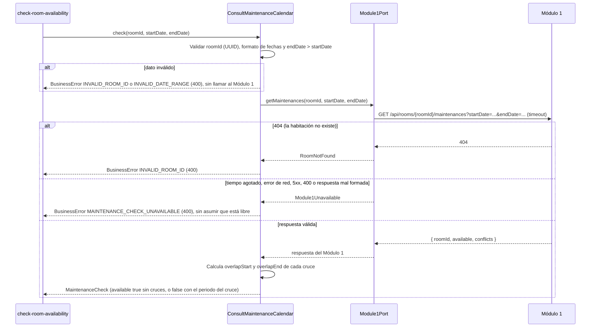
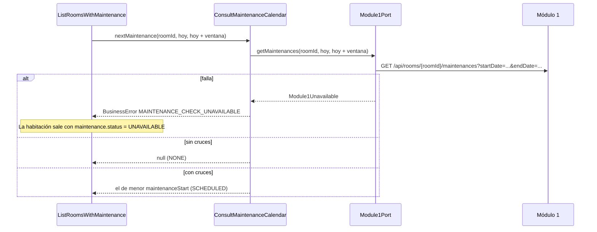

# Implementation Plan: Consultar calendario de mantenimientos (`consult-maintenance-calendar`)

**Plan base**: [../base/plan.md](../base/plan.md)
**Spec**: [./spec.md](spec.md)
**Guía**: [../base/guia-planes-por-caso-de-uso.md](../base/guia-planes-por-caso-de-uso.md)

## Summary

Una habitación puede estar libre hoy y aun así no poder reservarse para unas fechas futuras porque el
Módulo 1 programó un mantenimiento. Este caso de uso es la **consulta síncrona y de solo lectura** al
calendario de mantenimientos del Módulo 1 para **una habitación y un rango de fechas**. Responde si hay
algún mantenimiento que se cruce con la estadía y, si lo hay, el periodo del cruce.

Lo usan dos consumidores internos:

1. **"Verificar disponibilidades"** (`check-room-availability`): antes de confirmar cualquier reserva
   nueva o modificada, una consulta por cada habitación candidata. **Todos los mantenimientos bloquean**.
2. **Pantalla "Habitaciones"** (`consult-room-inventory`): el mantenimiento próximo de cada habitación.

No persiste nada y no crea, modifica ni cancela mantenimientos: son del Módulo 1. **Si el Módulo 1 no
responde, no asume que la habitación está libre**: bloquea la validación con un 4xx controlado.

## Resumen técnico e identificación

| Dato | Valor |
|---|---|
| Caso de uso | Consultar calendario de mantenimientos (`consult-maintenance-calendar`) |
| Spec | [spec.md](./spec.md), historia 1 y FR-001 a FR-006 |
| Actores | Caso de uso "Verificar disponibilidades" (interno); caso de uso "Consultar inventario de habitaciones" para la pantalla; Módulo 1 (dueño de los datos) |
| Naturaleza | Solo lectura; sin tablas propias; **sin ruta REST propia** |

| # | Capacidad | Disparador | Actor | Contrato |
|---|---|---|---|---|
| 1 | Validar una habitación en un rango | Llamada interna (puerto de entrada) | `check-room-availability` | B1 |
| 2 | Mantenimiento próximo de una habitación | Llamada interna (puerto de entrada) | `consult-room-inventory` (pantalla) | B2 |
| 3 | Lectura del calendario | REST `GET` al Módulo 1 | Módulo 2 → Módulo 1 | A1 |

## Technical Context

El stack, la arquitectura hexagonal y el manejo de errores son los del [plan base](../base/plan.md).
Lo propio de este caso de uso:

- **Dependencias nuevas**: ninguna.
- **Almacenamiento**: ninguno. El calendario no se guarda ni se cachea: cada reserva se valida contra la
  programación vigente (SC-001 y SC-002).
- **Configuración**: `MODULE1_BASE_URL` y `MODULE1_TIMEOUT_MS` (por defecto `2000`), compartidas con
  `consult-room-inventory`.
- **Performance** (NFR-001): cada consulta se completa en menos de 1 s en condiciones normales.

## Contratos

### A. Consulta al Módulo 1 (Módulo 2 → Módulo 1, REST GET)

Contrato **ya acordado con el equipo del Módulo 1** (borrador de este plan). La ruta exacta falta
fijarla; este plan propone la siguiente y se confirma con ese equipo.

**A1. Mantenimientos de una habitación en un rango**:
`GET {MODULE1_BASE_URL}/api/rooms/{roomId}/maintenances?startDate=AAAA-MM-DD&endDate=AAAA-MM-DD` (ruta propuesta)

Se consulta **una vez por cada habitación candidata** de la categoría pedida.

**Respuesta con cruce:**

```json
{
  "roomId": "uuid",
  "available": false,
  "conflicts": [
    { "maintenanceStart": "2026-10-10", "maintenanceEnd": "2026-10-12" }
  ]
}
```

**Respuesta sin cruce:**

```json
{
  "roomId": "uuid",
  "available": true,
  "conflicts": []
}
```

**Reglas del contrato** (acordadas):

- Hay cruce si el mantenimiento se solapa total o parcialmente con el rango consultado. **Todos los
  mantenimientos bloquean la reserva.**
- Un mantenimiento que termina justo antes de la fecha de llegada no es cruce.
- `conflicts` trae el inicio y el fin de cada mantenimiento que se cruza; **no trae el motivo**.
- Errores del Módulo 1: **404** si la habitación no existe; **400** si el `roomId` tiene formato
  inválido o el rango de fechas es inválido. Nunca 500.
- Cada consulta responde en menos de 1 segundo en condiciones normales.
- Si el Módulo 1 falla o no responde, el Módulo 2 no asume que la habitación está libre: responde un
  error controlado (HTTP 400) a quien consulta.
- Autenticación de servicio a servicio (JWT de servicio), igual que el resto de integraciones.
- Los valores de los ejemplos son ilustrativos.

### B. Puerto de entrada interno

No hay ruta REST para este caso de uso. Los demás casos de uso lo llaman por el puerto de entrada
`ConsultMaintenanceCalendar`, que devuelve objetos de integración (no entidades de TypeORM):

```typescript
interface MaintenanceConflict {
  maintenanceStart: string;   // AAAA-MM-DD, tal como lo informa el Módulo 1
  maintenanceEnd: string;     // AAAA-MM-DD
  overlapStart: string;       // primer día de la estadía afectado
  overlapEnd: string;         // último día de la estadía afectado
}

interface MaintenanceCheck {
  roomId: string;
  available: boolean;                  // false si hay al menos un cruce
  conflicts: MaintenanceConflict[];    // [] si available
}

interface ConsultMaintenanceCalendar {
  // B1: valida una habitación para una estadía
  check(roomId: string, startDate: string, endDate: string): Promise<MaintenanceCheck>;
  // B2: el mantenimiento más cercano dentro de una ventana (la pantalla "Habitaciones")
  nextMaintenance(roomId: string, fromDate: string, toDate: string): Promise<MaintenanceConflict | null>;
}
```

- `overlapStart` y `overlapEnd` los calcula el Módulo 2 con el rango pedido para cumplir FR-003 ("el
  periodo del cruce"); el Módulo 1 solo informa los mantenimientos completos.
- `nextMaintenance` hace una consulta `check` con la ventana pedida y devuelve el cruce de menor
  `maintenanceStart`, o `null` si no hay.
- Ambos lanzan `BusinessError` (que el filtro global convierte en 400) con los códigos de "Reglas de
  validación y manejo de errores". Ninguno modifica nada (FR-004).

### Cómo se determina el cruce

El **Módulo 1 decide** si hay cruce (campo `available`). El Módulo 2 usa esta lectura de las fechas solo
para calcular el periodo del cruce y para defenderse de respuestas incoherentes:

| Concepto | Interpretación |
|---|---|
| Estadía | Ocupa las noches de `startDate` hasta el día anterior a `endDate` (`endDate` es la salida) |
| Mantenimiento | Bloquea los días de `maintenanceStart` a `maintenanceEnd`, ambos incluidos |
| Hay cruce | `maintenanceStart < endDate` y `maintenanceEnd ≥ startDate` |
| `overlapStart` | El mayor entre `maintenanceStart` y `startDate` |
| `overlapEnd` | El menor entre `maintenanceEnd` y el día anterior a `endDate` |

Ejemplo: estadía del 2026-10-11 al 2026-10-14 y mantenimiento del 2026-10-10 al 2026-10-12: cruce del
2026-10-11 al 2026-10-12. Un mantenimiento que termina el 2026-10-10 **no** cruza (escenario 3).

## Diagramas de secuencia

### D1. Validación de una habitación (escenarios 1, 2 y 3)



### D2. Mantenimiento próximo para la pantalla "Habitaciones"



## Modelo de datos y entidades involucradas

**Este caso de uso no crea ni modifica tablas.** El calendario es del Módulo 1.

| Elemento | Dónde vive | Notas |
|---|---|---|
| `MaintenanceCalendar` (`roomId`, `maintenanceStart`, `maintenanceEnd`) | Objeto de integración en `application/integration/` | Del Módulo 1; no se persiste (plan base, "Datos externos") |
| `MaintenanceCheck`, `MaintenanceConflict` | Objetos de integración | Resultado de la consulta, con el periodo del cruce |
| `ReservationRoom.roomId` | `reservation_room.room_id` | Solo se usa como parámetro de la consulta; este caso de uso no lo lee ni lo escribe |

**Estados y transiciones**: ninguno. No interviene `Reservation.status` ni `stayStatus`.

## Reglas de validación y manejo de errores

Todo error sale con `{ "errorCode", "message", "timestamp", "path" }` y **siempre 4xx**; nunca 500.

| Situación | Origen | HTTP | `errorCode` | `message` |
|---|---|---|---|---|
| `roomId` vacío o con formato inválido (no es un UUID) | M2, antes de llamar al Módulo 1 | 400 | `INVALID_ROOM_ID` | "El identificador de la habitación es inválido." |
| El Módulo 1 responde 404 (la habitación no existe) | Módulo 1 | 400 | `INVALID_ROOM_ID` | "El identificador de la habitación es inválido." |
| Fecha mal formada o inexistente, o `endDate` no posterior a `startDate` | M2, antes de llamar al Módulo 1 | 400 | `INVALID_DATE_RANGE` | "Rango de fechas inválido. Verifique las fechas seleccionadas." |
| Tiempo agotado o error de red | Módulo 1 | 400 | `MAINTENANCE_CHECK_UNAVAILABLE` | "No es posible validar mantenimientos en este momento. Intente de nuevo." |
| El Módulo 1 responde 5xx | Módulo 1 | 400 | `MAINTENANCE_CHECK_UNAVAILABLE` | El mismo |
| El Módulo 1 responde 400 (cuando el Módulo 2 ya validó, es una incoherencia) | Módulo 1 | 400 | `MAINTENANCE_CHECK_UNAVAILABLE` | El mismo; el detalle va al log |
| Respuesta con campos faltantes, fechas inválidas o `available` incoherente con `conflicts` | Módulo 1 | 400 | `MAINTENANCE_CHECK_UNAVAILABLE` | El mismo; el detalle va al log |

- **Nunca se asume disponibilidad** (FR-005): cualquier fallo o duda bloquea la validación. Si el Módulo 1
  dice `available: true` pero trae `conflicts`, o dice `available: false` sin `conflicts`, se trata como
  respuesta incoherente y se bloquea.
- **Sin reintentos automáticos** hacia el Módulo 1: ante un fallo se informa y quien llama decide.
- Una excepción inesperada la traduce el filtro global a 400 `REQUEST_NOT_PROCESSED`, con el detalle en
  el log y sin datos de infraestructura.
- El error de "Verificar disponibilidades" que envuelve a esta consulta lo define su propio plan.

## Integraciones externas

| Módulo | Dirección | Mecanismo | Contrato | Fallo o tiempo agotado |
|---|---|---|---|---|
| Módulo 1 | M2 → M1 | REST GET de mantenimientos por habitación y rango | A1 | `MAINTENANCE_CHECK_UNAVAILABLE` (400); no se asume disponibilidad |

- Se accede **solo por `Module1Port`** (plan base): si cambia la API del Módulo 1, solo cambia el
  adaptador.
- Tiempo máximo de espera por llamada: `MODULE1_TIMEOUT_MS`.
- No hay colas en este caso de uso.

## Arquitectura (capas del plan base)

| Capa | Piezas de este caso de uso |
|---|---|
| `application/integration/` | `MaintenanceCalendar`, `MaintenanceCheck`, `MaintenanceConflict` |
| `application/ports/out/` | `Module1Port.getMaintenances(roomId, startDate, endDate)` (el puerto lo comparten los demás casos de uso del Módulo 1) |
| `application/use-cases/consult-maintenance-calendar/` | **Entrada**: `ConsultMaintenanceCalendar` (`check`, `nextMaintenance`); cálculo del periodo del cruce; validadores |
| `infrastructure/out/module1/` | `Module1HttpAdapter`: cliente HTTP con timeout, mapeo de 404, 400 y 5xx, y validación de la forma de la respuesta |

```text
backend/src/
├── application/
│   ├── integration/maintenance-calendar.ts
│   ├── ports/out/module1.port.ts                    # getMaintenances (compartido)
│   └── use-cases/consult-maintenance-calendar/
│       ├── ports/in/consult-maintenance-calendar.port.ts
│       ├── consult-maintenance-calendar.service.ts
│       ├── overlap.ts                               # periodo del cruce
│       └── maintenance-request.validator.ts
└── infrastructure/out/module1/module1-http.adapter.ts
backend/test/
├── unit/consult-maintenance-calendar/                # cruce, contiguo, validadores
├── integration/consult-maintenance-calendar/         # servicio con Module1Port simulado
└── contract/module1-maintenance.contract.test.ts    # adaptador contra respuestas simuladas (msw)
```

## Phase 1: Setup

- [ ] T001 Variables `MODULE1_BASE_URL` y `MODULE1_TIMEOUT_MS` en la configuración validada (compartidas con `consult-room-inventory`; si ya existen, no se repiten)

## Phase 2: Foundational

- [ ] T002 [P] Objetos de integración `MaintenanceCalendar`, `MaintenanceCheck` y `MaintenanceConflict`
- [ ] T003 [P] Validadores de `roomId` (UUID) y de las fechas (`AAAA-MM-DD` real y `endDate > startDate`)
- [ ] T004 [P] Función `overlap` del periodo del cruce, con pruebas unitarias de cruce parcial, total, contiguo y de un solo día
- [ ] T005 `Module1Port.getMaintenances` y su método en `Module1HttpAdapter` con timeout, mapeo de errores y validación de la forma de la respuesta
- [ ] T006 Códigos de error `INVALID_ROOM_ID` (compartido), `INVALID_DATE_RANGE` y `MAINTENANCE_CHECK_UNAVAILABLE` con sus mensajes literales

## Phase 3: User Story 1 - Detección de mantenimientos que cruzan una estadía (P1)

**Goal**: "Verificar disponibilidades" sabe si una habitación estará inhabilitada en las fechas pedidas.
**Independent Test**: una habitación sin mantenimientos, una con un cruce y una con un mantenimiento
contiguo, más los fallos del Módulo 1.

- [ ] T007 [US1] `ConsultMaintenanceCalendar.check`: validación, llamada al Módulo 1 y construcción de `MaintenanceCheck`
- [ ] T008 [US1] Detección de respuestas incoherentes del Módulo 1 (`available` contra `conflicts`) y bloqueo
- [ ] T009 [US1] Mapeo de 404, 400, 5xx, tiempo agotado y error de red a los códigos de error
- [ ] T010 [US1] Pruebas de contrato del adaptador: sin cruce, con uno y con varios cruces, contiguo, 404, 400, 503, tiempo agotado, respuesta mal formada
- [ ] T011 [US1] Pruebas de integración de los escenarios 1 a 3 y de los tres casos borde de error

## Phase 4: Mantenimiento próximo (pantalla "Habitaciones")

- [ ] T012 `ConsultMaintenanceCalendar.nextMaintenance` con la ventana de fechas y el cruce de menor inicio
- [ ] T013 [P] Pruebas del caso: sin cruces devuelve `null`, varios cruces devuelve el más cercano, fallo se propaga como `MAINTENANCE_CHECK_UNAVAILABLE`

## Phase N: Polish

- [ ] T014 Verificar que la consulta responde en menos de 1 s con el Módulo 1 simulado a 200 ms (NFR-001) y que ningún log escribe datos personales

## Pruebas por escenario

| Historia | Escenario | Qué se verifica |
|---|---|---|
| US1 | 1 sin mantenimientos | El Módulo 1 simulado responde `available: true` y `conflicts: []`; el resultado es `available: true` |
| US1 | 2 mantenimiento que cruza | `available: false` con el periodo del cruce (`overlapStart` y `overlapEnd`) calculado sobre el rango pedido; cruce parcial y total |
| US1 | 3 mantenimiento contiguo | Termina justo antes de la llegada: sin cruce, la habitación puede reservarse |
| Casos borde | Módulo 1 no responde | Tiempo agotado: `400` `MAINTENANCE_CHECK_UNAVAILABLE` con el mensaje del spec; no se asume libre |
| Casos borde | Fechas inválidas | Salida anterior a la llegada, fecha inexistente o mal formada: `400` `INVALID_DATE_RANGE`, sin llamar al Módulo 1 |
| Casos borde | `roomId` inválido o inexistente | Formato inválido: `400` sin llamar al Módulo 1; 404 del Módulo 1: `400` `INVALID_ROOM_ID` |
| Casos borde | Mantenimiento posterior a la reserva | Fuera de alcance: esta consulta solo valida en el momento de reservar; no hay prueba de reubicación |
| Contrato | Módulo 1 | Respuestas con campos faltantes, `available` incoherente, fechas mal formadas, 400, 404, 503 y lenta (más del tiempo máximo) |
| NFR-001 | Tiempo | Con el Módulo 1 simulado a 200 ms, la consulta responde en menos de 1 s |
| SC-001, SC-002 | Cobertura | Se verifica en `check-room-availability`: toda reserva nueva o modificada pasa por esta consulta y ninguna se confirma con un cruce |

## Dependencies & Execution Order

- **Depende de**: el plan base (fase 2: `Module1Port`, configuración y filtro de errores).
- **Necesitan de este caso de uso**: `check-room-availability` (lo llama por cada habitación candidata) y
  `consult-room-inventory` (la pantalla "Habitaciones", con `nextMaintenance`).
- **Orden**: T001–T006 → US1 (T007–T011) → T012–T013 → Polish. Es independiente de `consult-room-inventory`;
  conviene hacerlo antes de `check-room-availability`.

## Trazabilidad: requisito → componente → tarea

| Requisito | Componente | Tarea |
|---|---|---|
| FR-001 | `ConsultMaintenanceCalendar.check`, `Module1Port.getMaintenances` | T005, T007 |
| FR-002 | Contrato de cruce (el Módulo 1 decide) y defensa ante respuestas incoherentes | T008 |
| FR-003 | `MaintenanceCheck` con `overlapStart` y `overlapEnd` | T004, T007 |
| FR-004 | Solo `GET` en el adaptador; ningún método de escritura | T005 |
| FR-005 | Todo fallo o duda bloquea la validación | T008, T009 |
| FR-006 | Validadores y mapeo a 400 | T003, T006, T009 |
| NFR-001 | Timeout configurable y prueba de tiempo | T001, T014 |
| SC-001, SC-002 | Verificación en `check-room-availability` | Plan de ese caso de uso |
| SC-003 | Mapeo a 400 de todo fallo | T009, T011 |

## Puntos que este plan propone (el spec no los dice)

1. **Ruta del Módulo 1**: `GET /api/rooms/{roomId}/maintenances?startDate=…&endDate=…`. El borrador la deja
   sin fijar.
2. **Lectura de las fechas** (mantenimiento inclusivo en ambos extremos; estadía hasta el día anterior a
   la salida) para calcular el periodo del cruce. El borrador solo dice que un mantenimiento que termina
   justo antes de la llegada no cruza.
3. **El periodo del cruce lo calcula el Módulo 2** (`overlapStart` y `overlapEnd`), porque el spec lo pide
   (FR-003) y el contrato del Módulo 1 devuelve el mantenimiento completo.
4. **Respuesta incoherente del Módulo 1 = bloqueo**, igual que un fallo.
5. **Un 400 del Módulo 1 tras haber validado en el Módulo 2** se trata como indisponibilidad y no como
   dato inválido del usuario.
6. **Tiempo máximo de espera de 2 s** y **sin reintentos**, igual que `consult-room-inventory`.
7. **Mantenimiento próximo = el más cercano dentro de la ventana** que define `consult-room-inventory`
   (30 días).

## Puntos abiertos

| # | Pendiente | Con quién |
|---|---|---|
| 1 | Ruta definitiva, autenticación de servicio y confirmar que `maintenanceEnd` es inclusivo | Módulo 1 |
| 2 | **Una consulta por habitación** puede ser costosa (una por candidata, y una por habitación en la pantalla). Conviene que el Módulo 1 acepte consultar por categoría o por varias habitaciones | Módulo 1 |
| 3 | El spec (Key Entities) lista el `reason` del mantenimiento, pero el contrato acordado **no lo trae**. Hay que decidir si se ajusta el spec o se pide el motivo | Equipo del Módulo 2 y Módulo 1 |
| 4 | El spec lista `status` (`Available`, `Reserved`, `Occupied`) en `Room`, pero `consult-room-inventory` ya dice que el inventario no trae estado. Ajustar el spec cuando se permita | Equipo del Módulo 2 |
| 5 | Un mantenimiento programado **después** de crear la reserva no se detecta aquí; el Módulo 1 gestiona la reubicación. Falta acordar cómo avisa el Módulo 1 al Módulo 2 si cancelan reservas por esa causa | Módulo 1 |

## Notes

- `[P]` marca tareas paralelizables; `[US1]` las liga a su historia de usuario.
- Commit por tarea o grupo lógico, con Gitflow.
- Este plan no modifica el spec ni el plan base.
