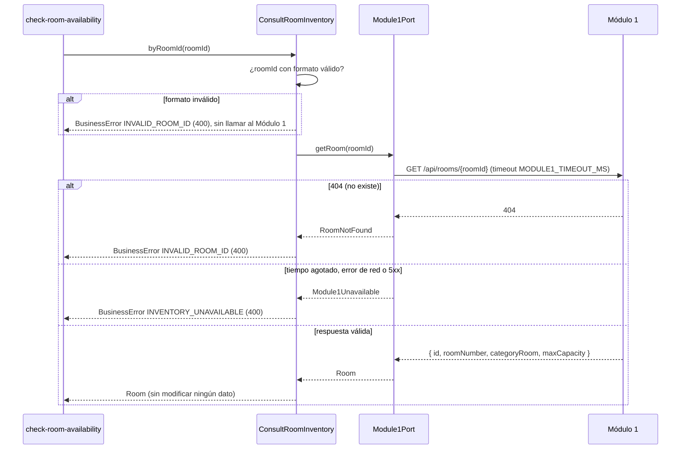
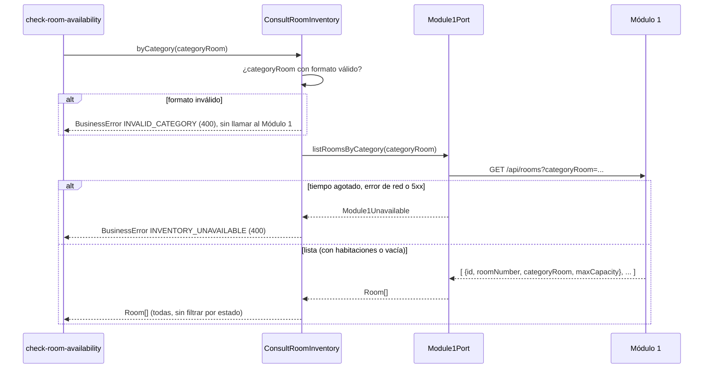
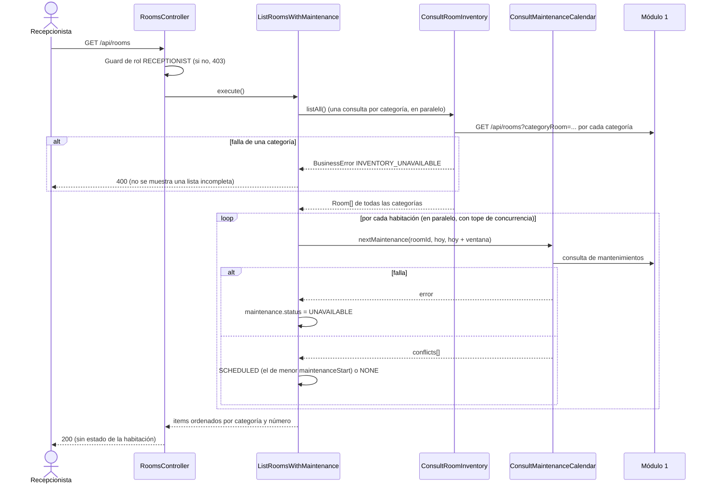

# Implementation Plan: Consultar inventario de habitaciones (`consult-room-inventory`)

**Plan base**: [../base/plan.md](../base/plan.md)
**Spec**: [./spec.md](spec.md)
**Guía**: [../base/guia-planes-por-caso-de-uso.md](../base/guia-planes-por-caso-de-uso.md)

## Summary

El Módulo 2 no guarda un inventario de habitaciones: el Módulo 1 es su dueño exclusivo y todas las
habitaciones que entrega son vendibles. Este caso de uso es la **consulta síncrona, de solo lectura y en
tiempo real** al inventario del Módulo 1, con dos usos:

1. **Insumo de "Verificar disponibilidades"** (`check-room-availability`): por `roomId` (una habitación)
   o por `categoryRoom` (todas las de la categoría), sin filtrar por estado.
2. **Pantalla "Habitaciones" de la Recepcionista** (FR-006): lista todas las habitaciones de todas las
   categorías con su capacidad y, si tiene, su mantenimiento próximo (dato de
   `consult-maintenance-calendar`). No muestra el estado de la habitación.

No persiste nada y no cambia ninguna `Room`. Si el Módulo 1 falla, no asume habitaciones: responde un
4xx controlado.

## Resumen técnico e identificación

| Dato | Valor |
|---|---|
| Caso de uso | Consultar inventario de habitaciones (`consult-room-inventory`) |
| Spec | [spec.md](./spec.md), historia 1 y FR-001 a FR-006 |
| Actores | Caso de uso "Verificar disponibilidades" (interno); Recepcionista (pantalla); Módulo 1 (dueño de los datos) |
| Naturaleza | Solo lectura; sin tablas propias |

| # | Capacidad | Disparador | Actor | Contrato |
|---|---|---|---|---|
| 1 | Consulta puntual por `roomId` | Llamada interna (puerto de entrada) | `check-room-availability` | B1 |
| 2 | Consulta por `categoryRoom` | Llamada interna (puerto de entrada) | `check-room-availability` | B2 |
| 3 | Pantalla "Habitaciones" | REST `GET /api/rooms` | Recepcionista | C1 |
| 4 | Lectura del inventario | REST `GET` al Módulo 1 | Módulo 2 → Módulo 1 | A1 y A2 |

## Technical Context

El stack, la arquitectura hexagonal y el manejo de errores son los del [plan base](../base/plan.md).
Lo propio de este caso de uso:

- **Dependencias nuevas**: ninguna (cliente HTTP `@nestjs/axios` del plan base).
- **Almacenamiento**: ninguno. El inventario no se guarda ni se cachea para "Verificar disponibilidades"
  (SC-001: las habitaciones se obtienen en el momento de la consulta).
- **Configuración**: `MODULE1_BASE_URL` y `MODULE1_TIMEOUT_MS` (por defecto `2000`), validadas al
  arrancar con `@nestjs/config`. Se comparten con `consult-maintenance-calendar`.
- **Performance** (NFR-001, SC-002): una consulta al Módulo 1 se completa en menos de 1 s en condiciones
  normales; el tiempo máximo de espera es mayor (ver "Puntos que este plan propone").

## Contratos

### A. Consulta al Módulo 1 (Módulo 2 → Módulo 1, REST GET)

Contrato **ya acordado con el equipo del Módulo 1** (borrador de este plan). Lo único que falta fijar es
la ruta exacta; este plan propone las siguientes y se confirman con ese equipo.

**A1. Una habitación por `roomId`**: `GET {MODULE1_BASE_URL}/api/rooms/{roomId}` (ruta propuesta)

```json
{ "id": "uuid", "roomNumber": "201", "categoryRoom": "DOBLE", "maxCapacity": 2 }
```

**A2. Todas las habitaciones de una categoría**: `GET {MODULE1_BASE_URL}/api/rooms?categoryRoom=DOBLE` (ruta propuesta)

```json
[
  { "id": "uuid", "roomNumber": "201", "categoryRoom": "DOBLE", "maxCapacity": 2 },
  { "id": "uuid", "roomNumber": "202", "categoryRoom": "DOBLE", "maxCapacity": 3 }
]
```

**Reglas del contrato** (acordadas):

- Por cada habitación: `id`, `roomNumber`, `categoryRoom` y `maxCapacity`. **Sin estado**: todas son
  vendibles.
- Una categoría sin habitaciones devuelve una lista vacía.
- Errores del Módulo 1 (los mismos de la consulta de mantenimientos): **404** si la habitación no existe;
  **400** si el `roomId` o la `categoryRoom` tienen formato inválido. Nunca 500.
- Autenticación de servicio a servicio (JWT de servicio), igual que el resto de integraciones.
- Los valores de los ejemplos son ilustrativos.

### B. Puerto de entrada interno (lo usa "Verificar disponibilidades")

No hay ruta REST para este uso: otros casos de uso lo llaman por el puerto de entrada
`ConsultRoomInventory`, que no devuelve entidades de TypeORM sino el objeto de integración `Room`.

```typescript
interface Room { id: string; roomNumber: string; categoryRoom: string; maxCapacity: number }

interface ConsultRoomInventory {
  byRoomId(roomId: string): Promise<Room>;               // B1
  byCategory(categoryRoom: string): Promise<Room[]>;     // B2: [] si la categoría no tiene habitaciones
  listAll(): Promise<Room[]>;                            // B3: todas las categorías (pantalla)
}
```

- `byRoomId` y `byCategory` lanzan `BusinessError` (que el filtro global convierte en 400) con los
  códigos de "Reglas de validación y manejo de errores".
- No filtran por estado ni modifican nada (FR-001 a FR-004).

### C. REST del Módulo 2: pantalla "Habitaciones" (FR-006)

**C1. `GET /api/rooms`** (solo rol `RECEPTIONIST`; sin parámetros; sin paginar)

**Respuesta 200**

```json
{
  "items": [
    {
      "id": "uuid",
      "roomNumber": "201",
      "categoryRoom": "DOBLE",
      "maxCapacity": 2,
      "maintenance": {
        "status": "SCHEDULED",
        "maintenanceStart": "2026-10-20",
        "maintenanceEnd": "2026-10-22"
      }
    },
    {
      "id": "uuid",
      "roomNumber": "202",
      "categoryRoom": "DOBLE",
      "maxCapacity": 3,
      "maintenance": { "status": "NONE", "maintenanceStart": null, "maintenanceEnd": null }
    }
  ],
  "total": 2
}
```

- Ordenadas por `categoryRoom` y luego por `roomNumber`.
- `maintenance.status`: `SCHEDULED` (hay un mantenimiento próximo; trae el más cercano), `NONE` (no tiene)
  o `UNAVAILABLE` (no se pudo consultar el calendario de esa habitación; no se asume que no tiene).
- **No incluye estado de la habitación** ni datos de reservas (FR-006).
- Sin habitaciones: `200` con `items: []`, `total: 0`.
- Si el inventario falla: `400` `INVENTORY_UNAVAILABLE`.

**Cabeceras**: `Authorization: Bearer <JWT>`; respuesta `Content-Type: application/json`.

## Diagramas de secuencia

### D1. Consulta puntual por `roomId` (historia 1, escenario 1)



### D2. Listado por categoría (escenarios 2 y 3)



### D3. Pantalla "Habitaciones" (C1)



## Modelo de datos y entidades involucradas

**Este caso de uso no crea ni modifica tablas.** El inventario es del Módulo 1 y no se copia.

| Elemento | Dónde vive | Notas |
|---|---|---|
| `Room` (`id`, `roomNumber`, `categoryRoom`, `maxCapacity`) | Objeto de integración en `application/integration/` | Del Módulo 1; no se persiste (plan base, "Datos externos") |
| `ReservationRoom.roomId` | Tabla `reservation_room`, columna `room_id` | Solo referencia al `Room.id` del Módulo 1, sin FK; este caso de uso no la lee ni la escribe |

**Estados y transiciones**: ninguno. No hay `Reservation.status` ni `stayStatus` en juego. El
`maxCapacity` que devuelve se usa en otros casos de uso para validar el `guestCount` de cada habitación.

## Reglas de validación y manejo de errores

Todo error sale con `{ "errorCode", "message", "timestamp", "path" }` y **siempre 4xx**; nunca 500.

| Situación | Origen | HTTP | `errorCode` | `message` |
|---|---|---|---|---|
| `roomId` vacío o con formato inválido (no es un UUID) | M2, antes de llamar al Módulo 1 | 400 | `INVALID_ROOM_ID` | "El identificador de la habitación es inválido." |
| El Módulo 1 responde 404 (la habitación no existe) | Módulo 1 | 400 | `INVALID_ROOM_ID` | "El identificador de la habitación es inválido." |
| `categoryRoom` vacía o con caracteres no permitidos | M2, antes de llamar | 400 | `INVALID_CATEGORY` | "La categoría indicada no es válida." |
| El Módulo 1 responde 400 | Módulo 1 | 400 | `INVALID_ROOM_ID` o `INVALID_CATEGORY` (según la consulta) | Los de arriba |
| Tiempo agotado, error de red o respuesta 5xx del Módulo 1 | Módulo 1 | 400 | `INVENTORY_UNAVAILABLE` | "No se pudo consultar el inventario de habitaciones en este momento. Intente de nuevo." |
| Respuesta del Módulo 1 con campos faltantes o de tipo incorrecto (por ejemplo, `maxCapacity` no entero o menor que 1) | Módulo 1 | 400 | `INVENTORY_UNAVAILABLE` | El mismo; el detalle va al log |
| Sin token o con token inválido | Guard | 401 | `UNAUTHENTICATED` | Genérico |
| Rol distinto de `RECEPTIONIST` en `GET /api/rooms` | Guard | 403 | `FORBIDDEN` | Genérico |

- **Una categoría sin habitaciones no es un error**: devuelve una lista vacía (escenario 3).
- **Una habitación ocupada hoy se devuelve igual**: es vendible; si está libre en unas fechas lo decide
  "Verificar disponibilidades".
- **Sin reintentos automáticos** hacia el Módulo 1: ante un fallo se informa y quien llama decide. Esto
  evita demorar la validación previa a una reserva.
- Una excepción inesperada la traduce el filtro global a 400 `REQUEST_NOT_PROCESSED`, con el detalle
  en el log y sin datos de infraestructura.

## Integraciones externas

| Módulo | Dirección | Mecanismo | Contrato | Fallo o tiempo agotado |
|---|---|---|---|---|
| Módulo 1 | M2 → M1 | REST GET (inventario por `roomId` y por `categoryRoom`) | A1 y A2 | `INVENTORY_UNAVAILABLE` (400); no se asume ninguna habitación |
| Módulo 1 (indirecto) | M2 → M1 | REST GET de mantenimientos, vía `consult-maintenance-calendar` | Plan de ese caso de uso | La habitación sale con `maintenance.status = UNAVAILABLE`; no rompe la pantalla |

- Se accede **solo por `Module1Port`** (plan base): si cambia la API del Módulo 1, solo cambia el
  adaptador.
- Tiempo máximo de espera por llamada: `MODULE1_TIMEOUT_MS`.
- No hay colas en este caso de uso. No se publica ni se consume ningún mensaje.

## Arquitectura (capas del plan base)

| Capa | Piezas de este caso de uso |
|---|---|
| `application/integration/` | `Room` |
| `application/ports/out/` | `Module1Port.getRoom(roomId)` y `Module1Port.listRoomsByCategory(categoryRoom)` (el puerto lo comparten los demás casos de uso del Módulo 1) |
| `application/use-cases/consult-room-inventory/` | **Entrada**: `ConsultRoomInventory` (`byRoomId`, `byCategory`, `listAll`) y `ListRoomsWithMaintenance`; validadores de `roomId` y `categoryRoom` |
| `infrastructure/in/rest/` | `RoomsController` (C1) |
| `infrastructure/out/module1/` | `Module1HttpAdapter`: cliente HTTP con timeout, mapeo de 404, 400 y 5xx a errores de negocio, y validación de la forma de la respuesta |

```text
backend/src/
├── application/
│   ├── integration/room.ts
│   ├── ports/out/module1.port.ts                    # getRoom, listRoomsByCategory (compartido)
│   └── use-cases/consult-room-inventory/
│       ├── ports/in/consult-room-inventory.port.ts
│       ├── consult-room-inventory.service.ts
│       ├── list-rooms-with-maintenance.service.ts
│       └── room-id.validator.ts
├── infrastructure/
│   ├── in/rest/rooms.controller.ts
│   └── out/module1/module1-http.adapter.ts
backend/test/
├── unit/consult-room-inventory/                      # validadores y servicio con Module1Port simulado
├── integration/consult-room-inventory/               # controlador + filtro global de errores
└── contract/module1-inventory.contract.test.ts       # adaptador contra respuestas simuladas (msw)
frontend/src/pages/rooms/                             # pantalla "Habitaciones"
```

## Phase 1: Setup

- [ ] T001 Variables `MODULE1_BASE_URL` y `MODULE1_TIMEOUT_MS` en la configuración validada (compartida con `consult-maintenance-calendar`)

## Phase 2: Foundational

- [ ] T002 [P] Objeto de integración `Room` y validadores de `roomId` (UUID) y `categoryRoom`
- [ ] T003 [P] Puerto `Module1Port` (`getRoom`, `listRoomsByCategory`) y su adaptador HTTP con timeout, mapeo de errores y validación de la forma de la respuesta
- [ ] T004 Códigos de error `INVALID_ROOM_ID`, `INVALID_CATEGORY` e `INVENTORY_UNAVAILABLE` con sus mensajes literales

## Phase 3: User Story 1 - Consulta del inventario en tiempo real (P1)

**Goal**: "Verificar disponibilidades" obtiene las habitaciones vendibles del Módulo 1 por `roomId` o por
categoría.
**Independent Test**: una habitación conocida, una categoría con varias y una sin habitaciones, más los
fallos del Módulo 1.

- [ ] T005 [US1] `ConsultRoomInventory.byRoomId` con validación previa y mapeo del 404 del Módulo 1 a 400
- [ ] T006 [US1] `ConsultRoomInventory.byCategory`, incluida la lista vacía
- [ ] T007 [US1] Mapeo de tiempo agotado, error de red y 5xx a `INVENTORY_UNAVAILABLE`
- [ ] T008 [US1] Pruebas de contrato del adaptador: éxito, 404, 400, tiempo agotado, 5xx y respuesta mal formada
- [ ] T009 [US1] Pruebas de integración de los escenarios 1 a 3 y de los dos casos borde de error

## Phase 4: Pantalla "Habitaciones" (FR-006)

- [ ] T010 `ConsultRoomInventory.listAll` (una consulta por categoría, en paralelo) y el origen de la lista de categorías (ver "Puntos abiertos")
- [ ] T011 `ListRoomsWithMaintenance`: mantenimiento próximo por habitación con `ConsultMaintenanceCalendar`, tope de concurrencia y estado `UNAVAILABLE` por habitación
- [ ] T012 `GET /api/rooms` (C1) con el guard de rol y el orden por categoría y número
- [ ] T013 [P] Pruebas de integración de C1: éxito, categoría con falla, calendario con falla, sin habitaciones, rol sin permiso
- [ ] T014 [P] Frontend: pantalla "Habitaciones" (número, categoría, capacidad y mantenimiento próximo; sin estado)

## Phase N: Polish

- [ ] T015 Verificar que ningún log escribe datos personales y que la consulta puntual responde en menos de 1 s con el Módulo 1 simulado
- [ ] T016 Documentar `GET /api/rooms` en OpenAPI (`@nestjs/swagger`)

## Pruebas por escenario

| Historia | Escenario | Qué se verifica |
|---|---|---|
| US1 | 1 consulta puntual | El Módulo 1 simulado devuelve la habitación; el servicio entrega `id`, `roomNumber`, `categoryRoom` y `maxCapacity` y no llama a ningún método de escritura |
| US1 | 2 listado por categoría | Devuelve todas las habitaciones de la categoría, sin filtrar por estado |
| US1 | 3 categoría sin habitaciones | Lista vacía, sin error |
| Casos borde | Módulo 1 no responde | Tiempo agotado: `400` `INVENTORY_UNAVAILABLE` con el mensaje del spec, nunca 500 |
| Casos borde | `roomId` inexistente o inválido | Formato inválido: `400` sin llamar al Módulo 1; 404 del Módulo 1: `400` `INVALID_ROOM_ID` |
| Casos borde | Habitación ocupada hoy | Se devuelve igual (el Módulo 1 simulado no envía estado) |
| FR-006 | Pantalla | Todas las categorías, sin campo de estado, con `SCHEDULED`, `NONE` y `UNAVAILABLE`; falla de inventario: 400, no una lista parcial |
| NFR-001 | Tiempo | Con el Módulo 1 simulado a 200 ms, la consulta puntual responde en menos de 1 s |
| Contrato | Módulo 1 | Respuestas con `maxCapacity` inválido, campo faltante, lista vacía, 404, 400 y 503 |

## Dependencies & Execution Order

- **Depende de**: el plan base (fase 2: `Module1Port`, configuración, filtro de errores, guards).
- **Necesitan de este caso de uso**: `check-room-availability` (la usa como insumo) y, para el
  `maxCapacity`, `generate-direct-reservation`, `generate-ota-reservation` y `update-reservation`.
- **Depende para la pantalla**: `consult-maintenance-calendar` (mantenimiento próximo).
- **Orden**: T001–T004 → US1 (T005–T009) → pantalla (T010–T014) → Polish. La pantalla se puede dejar
  para después de `consult-maintenance-calendar`.

## Trazabilidad: requisito → componente → tarea

| Requisito | Componente | Tarea |
|---|---|---|
| FR-001 | `byRoomId`, `Module1Port.getRoom` | T003, T005 |
| FR-002 | `byCategory`, `Module1Port.listRoomsByCategory` | T003, T006 |
| FR-003 | Solo `GET` en el adaptador; ningún método de escritura | T003 |
| FR-004 | Puerto de entrada `ConsultRoomInventory` | T005, T006 |
| FR-005 | Mapeo de errores y códigos 400 | T004, T007 |
| FR-006 | `listAll`, `ListRoomsWithMaintenance`, `GET /api/rooms`, pantalla | T010–T014 |
| NFR-001, SC-002 | Timeout configurable y prueba de tiempo | T001, T015 |
| SC-001 | Sin caché ni copia local del inventario | T003 |
| SC-003 | Mapeo a 400 de todo fallo | T007, T009 |

## Puntos que este plan propone (el spec no los dice)

1. **Rutas del Módulo 1**: `GET /api/rooms/{roomId}` y `GET /api/rooms?categoryRoom=…`. El borrador deja
   la ruta "por acordar".
2. **Tiempo máximo de espera de 2 s** (`MODULE1_TIMEOUT_MS`). El spec pide responder en menos de 1 s
   "en condiciones normales", pero no dice cuándo se considera agotado el tiempo.
3. **Sin reintentos** hacia el Módulo 1 en esta consulta.
4. **Mantenimiento próximo = el más cercano dentro de los siguientes 30 días.** El spec dice "si tiene un
   mantenimiento próximo" sin definir la ventana.
5. **Falla parcial en la pantalla**: si falla el inventario, 400 y no se muestra una lista incompleta; si
   falla solo el calendario de una habitación, esa fila sale con `maintenance.status = UNAVAILABLE` en
   vez de asumir que no tiene mantenimiento.
6. **Mensaje y código para `categoryRoom` inválida** (`INVALID_CATEGORY`, "La categoría indicada no es
   válida."): el spec solo define el mensaje del `roomId`.
7. **Sin caché** del inventario, ni siquiera para la pantalla, porque el spec exige tiempo real.

## Puntos abiertos

| # | Pendiente | Con quién |
|---|---|---|
| 1 | **Origen de la lista de categorías** para la pantalla (FR-006 dice "una vez por categoría" pero no de dónde sale esa lista). Opciones: un endpoint del Módulo 1 que las liste, o una lista configurada en el Módulo 2 | Módulo 1 |
| 2 | Forma canónica de `categoryRoom` (por ejemplo `DOBLE`, en mayúsculas y sin tildes) y su patrón de validación | Módulo 1 |
| 3 | Rutas definitivas del inventario y autenticación de servicio | Módulo 1 |
| 4 | Costo de la pantalla: una consulta por categoría más una de mantenimientos por habitación. Si el hotel crece, conviene que el Módulo 1 acepte consultar mantenimientos por categoría (B6 de las decisiones anteriores) | Módulo 1 |
| 5 | El wireframe de "Habitaciones" muestra una columna "Estado hoy"; el spec dice que la pantalla no muestra estado. Se alinea cuando se retome el wireframe | Equipo del Módulo 2 |

## Notes

- `[P]` marca tareas paralelizables; `[US1]` las liga a su historia de usuario.
- Commit por tarea o grupo lógico, con Gitflow.
- Este plan no modifica el spec ni el plan base.
