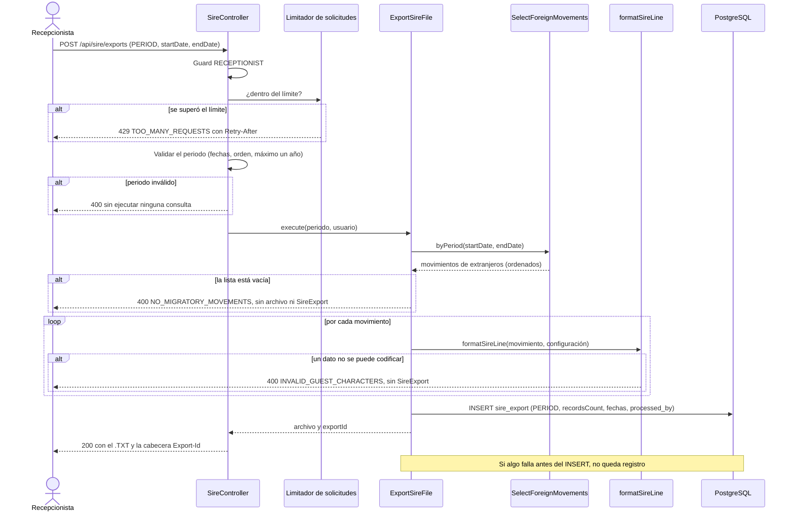
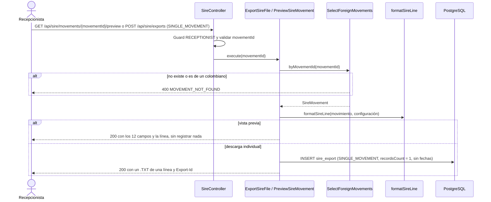
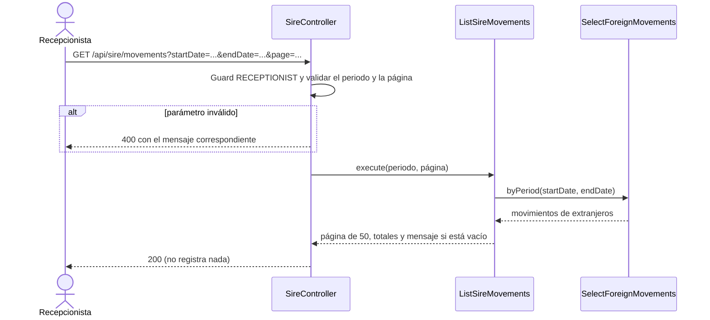

# Implementation Plan: Exportar archivo SIRE (`export-sire-file`)

**Plan base**: [../base/plan.md](../base/plan.md)
**Spec**: [./spec.md](spec.md)
**Guía**: [../base/guia-planes-por-caso-de-uso.md](../base/guia-planes-por-caso-de-uso.md)

## Summary

El hotel debe reportar a Migración Colombia, a través de SIRE, a los huéspedes extranjeros que aloja, con su
tipo de movimiento (entrada o salida). Este caso de uso genera el **archivo plano `.TXT` de cargue de
hospedaje** que la Recepcionista descarga y envía a Migración por su cuenta: el Módulo 2 **no envía nada** a
Migración.

Ofrece cuatro operaciones, todas exclusivas de la Recepcionista:

1. **Exportar un periodo**: una línea por cada movimiento (`ENTRY` y `DEPARTURE`) de los huéspedes
   **extranjeros**, con 12 campos en el orden del spec. Registra una `SireExport`.
2. **Listar los movimientos del periodo**, uno por huésped y tipo de movimiento.
3. **Previsualizar** la línea de un movimiento, sin registrar nada.
4. **Descargar un solo movimiento** (descarga individual), que registra su propia `SireExport`.

Los movimientos los entrega `process-guest-data` (`SelectForeignMovements`); este caso de uso **no llama a
los Módulos 1 ni 3** y opera solo sobre datos locales. No lleva cuenta de lo que ya se descargó: el mismo
periodo o movimiento se puede descargar las veces que haga falta.

## Resumen técnico e identificación

| Dato | Valor |
|---|---|
| Caso de uso | Exportar archivo SIRE (`export-sire-file`) |
| Spec | [spec.md](./spec.md), historia 1 y FR-001 a FR-010 |
| Actor principal | Recepcionista |
| Disparador | REST: `POST /api/sire/exports`, `GET /api/sire/movements` y `GET /api/sire/movements/{movementId}/preview` |
| Naturaleza | Genera un archivo y escribe `sire_export`; lee movimientos y datos de huéspedes |

| # | Capacidad | Disparador | Contrato |
|---|---|---|---|
| 1 | Exportar el periodo | `POST /api/sire/exports` con `exportKind: PERIOD` | A |
| 2 | Descargar un movimiento | `POST /api/sire/exports` con `exportKind: SINGLE_MOVEMENT` | A |
| 3 | Listar los movimientos del periodo | `GET /api/sire/movements` | B |
| 4 | Previsualizar un movimiento | `GET /api/sire/movements/{movementId}/preview` | C |

## Technical Context

El stack, la arquitectura hexagonal y el manejo de errores son los del [plan base](../base/plan.md).
Lo propio de este caso de uso:

- **Dependencias nuevas**: ninguna. El límite de solicitudes se implementa con un limitador propio en
  memoria (ver "Puntos que este plan propone").
- **Almacenamiento**: `sire_export` (plan base). Los movimientos y los datos de huéspedes se leen a través
  de `SelectForeignMovements` (`process-guest-data`).
- **Configuración del formato** (el spec pide tomarla de configuración, no fijarla en el código), validada
  al arrancar con `@nestjs/config`:

| Variable | Qué es | Valor por defecto |
|---|---|---|
| `SIRE_HOTEL_CODE` | Campo 1: código del hotel en SIRE | (obligatoria) |
| `SIRE_CITY_CODE` | Campo 2: código de la ciudad del hotel | (obligatoria) |
| `SIRE_FIELD_SEPARATOR` | Separador de campos | Tabulador |
| `SIRE_DATE_FORMAT` | Formato de las fechas (campos 9 y 12) | `dd/MM/yyyy` |
| `SIRE_LINE_BREAK` | Fin de línea | `CRLF` |
| `SIRE_FILE_ENCODING` | Codificación del archivo | `utf-8` |
| `SIRE_MAX_PERIOD_DAYS` | Máximo del periodo | `366` |
| `SIRE_MAX_RECORDS` | Máximo de líneas por archivo | `50000` |
| `SIRE_RATE_LIMIT_PER_MINUTE` y `SIRE_MAX_CONCURRENT` | Límites de solicitudes | `10` y `3` |

- **Performance** (NFR-001): generar el archivo en menos de 2 s para consultas de hasta 500 movimientos.
- **Privacidad** (NFR-002): el archivo y los logs no se mezclan: **nunca** se escriben datos personales en
  los logs; el acceso es solo de la Recepcionista y cada descarga queda en `sire_export`.

## Contratos

Rol `RECEPTIONIST` en las tres rutas. **Cabeceras**: `Authorization: Bearer <JWT>`. Sin token, `401`; con
otro rol (OTA, Módulo 1 o Módulo 3), `403`.

### A. Exportar: `POST /api/sire/exports`

Es `POST` y no `GET` porque **registra** una `SireExport` (decisión D9 del plan base).

**Solicitud, periodo completo**

```json
{ "exportKind": "PERIOD", "startDate": "2026-10-01", "endDate": "2026-10-31" }
```

**Solicitud, un solo movimiento**

```json
{ "exportKind": "SINGLE_MOVEMENT", "movementId": "uuid" }
```

- `startDate` y `endDate`: obligatorios en `PERIOD`, inclusivos, formato `AAAA-MM-DD`, máximo un año
  (`SIRE_MAX_PERIOD_DAYS`). Se comparan con la `movementDate` de cada movimiento (decisión D7).
- `movementId`: obligatorio en `SINGLE_MOVEMENT`; debe ser un movimiento de un huésped extranjero.

**Respuesta `200 OK`**: **únicamente el archivo**, sin advertencias mezcladas (FR-008).

```text
HTTP/1.1 200 OK
Content-Type: text/plain; charset=utf-8
Content-Disposition: attachment; filename="SIRE_3f9a1c7b-....txt"
Export-Id: 3f9a1c7b-7d1a-4c0b-9d5e-2f4f3b6a1c11
Access-Control-Expose-Headers: Export-Id, Content-Disposition

123456<TAB>11001<TAB>PAS<TAB>X99<TAB>Estados Unidos<TAB>SMITH<TAB>JOHN<TAB>E<TAB>09/10/2026<TAB>Miami, Estados Unidos<TAB>Cartagena, Colombia<TAB>12/05/1990
123456<TAB>11001<TAB>PAS<TAB>X99<TAB>Estados Unidos<TAB>SMITH<TAB>JOHN<TAB>S<TAB>12/10/2026<TAB>Miami, Estados Unidos<TAB>Cartagena, Colombia<TAB>12/05/1990
```

- El `Export-Id` es el `id` de la `SireExport` registrada.
- Una línea por movimiento, con los 12 campos, en orden (ver "Formato de la línea").
- El separador, el formato de fecha, el fin de línea y la codificación salen de la configuración.

### B. Listar los movimientos: `GET /api/sire/movements`

| Parámetro | Tipo | Obligatorio | Regla |
|---|---|---|---|
| `startDate`, `endDate` | `AAAA-MM-DD` | Sí, ambos | Mismas reglas del periodo de A |
| `page` | entero ≥ 1 | No | Por defecto `1`; tamaño fijo de 50 |

**Respuesta 200**

```json
{
  "items": [
    {
      "movementId": "uuid",
      "reservationRef": "RSV-3F9A1C7B",
      "guest": {
        "fullName": "John Smith", "documentType": "PAS", "documentNumber": "X99",
        "nationality": "Estados Unidos"
      },
      "movementType": "ENTRY",
      "movementDate": "2026-10-09"
    }
  ],
  "page": 1,
  "pageSize": 50,
  "totalItems": 6,
  "totalPages": 1,
  "message": null
}
```

- Un elemento por **huésped y tipo de movimiento**, solo de **extranjeros**; los colombianos no aparecen.
- Un periodo sin extranjeros devuelve `200` con `items: []`, `totalItems: 0` y el mensaje "No hay
  movimientos migratorios que reportar en ese periodo." (listar no es un error; solo la exportación lo es).
- No registra nada.

### C. Previsualizar: `GET /api/sire/movements/{movementId}/preview`

**Respuesta 200** (la línea tal como saldría en el archivo; **no crea una `SireExport`**):

```json
{
  "movementId": "uuid",
  "reservationRef": "RSV-3F9A1C7B",
  "fields": [
    { "position": 1, "name": "Código del hotel", "value": "123456" },
    { "position": 2, "name": "Código de la ciudad", "value": "11001" },
    { "position": 3, "name": "Tipo de documento", "value": "PAS" },
    { "position": 4, "name": "Número de documento", "value": "X99" },
    { "position": 5, "name": "Nacionalidad", "value": "Estados Unidos" },
    { "position": 6, "name": "Apellidos", "value": "SMITH" },
    { "position": 7, "name": "Nombres", "value": "JOHN" },
    { "position": 8, "name": "Tipo de movimiento", "value": "E" },
    { "position": 9, "name": "Fecha del movimiento", "value": "09/10/2026" },
    { "position": 10, "name": "Lugar de procedencia", "value": "Miami, Estados Unidos" },
    { "position": 11, "name": "Lugar de destino", "value": "Cartagena, Colombia" },
    { "position": 12, "name": "Fecha de nacimiento", "value": "12/05/1990" }
  ],
  "line": "123456\t11001\tPAS\tX99\tEstados Unidos\tSMITH\tJOHN\tE\t09/10/2026\tMiami, Estados Unidos\tCartagena, Colombia\t12/05/1990"
}
```

### D. Errores 400 (y 429)

| HTTP | `errorCode` | Cuándo | `message` |
|---|---|---|---|
| 400 | `PERIOD_TOO_LARGE` | Periodo de más de un año, o más de `SIRE_MAX_RECORDS` líneas | "El periodo solicitado excede el límite permitido. Por favor exporte periodos más cortos." |
| 400 | `INVALID_DATE` | Fecha mal formada o inexistente | "La fecha indicada no es válida." |
| 400 | `INCOMPLETE_DATE_RANGE` | Falta `startDate` o `endDate` | "Debe completar ambas fechas del periodo." |
| 400 | `INVALID_DATE_RANGE` | `startDate` posterior a `endDate` | "La fecha inicial no puede ser posterior a la fecha final." |
| 400 | `NO_MIGRATORY_MOVEMENTS` | El periodo no tiene movimientos de extranjeros (**no se genera archivo ni `SireExport`**) | "No hay movimientos migratorios que reportar en ese periodo." |
| 400 | `INVALID_GUEST_CHARACTERS` | Un dato del huésped no se puede codificar en el archivo | "Caracteres no válidos en el registro del huésped." |
| 400 | `INVALID_EXPORT_KIND` | `exportKind` distinto de `PERIOD` o `SINGLE_MOVEMENT` | "El tipo de exportación no es válido." |
| 400 | `MOVEMENT_NOT_FOUND` | El `movementId` no existe, es de un colombiano o tiene formato inválido | "El movimiento no existe." |
| 400 | `INVALID_PAGE` | `page` menor que 1 | "El número de página debe ser 1 o mayor." |
| **429** | `TOO_MANY_REQUESTS` | Se superó el límite de solicitudes de exportación | "Se superó el límite de solicitudes de exportación. Intente de nuevo en unos segundos." |
| 401, 403 | `UNAUTHENTICATED`, `FORBIDDEN` | Sin token, o rol distinto de `RECEPTIONIST` | Genérico |

El cuerpo es siempre `{ "errorCode", "message", "timestamp", "path" }`; en 429 se agrega la cabecera
`Retry-After`. **Nunca 500**: una excepción inesperada sale como 400 `REQUEST_NOT_PROCESSED`.

### Formato de la línea (FR-005)

Doce campos, en este orden, separados por `SIRE_FIELD_SEPARATOR`:

| # | Campo | De dónde sale | Regla |
|---|---|---|---|
| 1 | Código del hotel | `SIRE_HOTEL_CODE` | Configuración |
| 2 | Código de la ciudad | `SIRE_CITY_CODE` | Configuración |
| 3 | Tipo de documento | `guest_data.document_type` | Tal cual: `RC`, `TI`, `CC`, `CE`, `PAS` o `NIT` |
| 4 | Número de documento | `guest_data.document_number` | Tal cual |
| 5 | Nacionalidad | `guest_data.nationality` | Tal cual: el nombre del país |
| 6 | Apellidos | `guest_data.last_name` | En mayúsculas |
| 7 | Nombres | `guest_data.first_name` | En mayúsculas |
| 8 | Tipo de movimiento | `movement_type` | `E` para `ENTRY` y `S` para `DEPARTURE` |
| 9 | Fecha del movimiento | `movement_date` | Con `SIRE_DATE_FORMAT` |
| 10 | Lugar de procedencia | `guest_data.origin_place` | Tal cual; vacío si es nulo |
| 11 | Lugar de destino | `guest_data.destination_place` | Tal cual; vacío si es nulo |
| 12 | Fecha de nacimiento | `guest_data.birth_date` | Con `SIRE_DATE_FORMAT` |

- **Los datos no se completan ni se corrigen**: salen tal como llegaron del Módulo 1, y por eso el archivo
  corresponde a los movimientos recibidos, sin modificaciones.
- El formato de línea es una **función pura** (`formatSireLine`), que usan el archivo, la vista previa y
  la descarga individual, para que las tres coincidan exactamente.

## Reglas de negocio

1. **Solo extranjeros**: nacionalidad distinta de `Colombia`. La selección la hace
   `SelectForeignMovements` (`process-guest-data`); este caso de uso no vuelve a filtrar.
2. **Todos los huéspedes de la reserva**, no solo el titular, **sin depender del estado actual de la
   reserva**: un huésped que ya salió y una reserva `COMPLETED` entran igual si sus movimientos caen en el
   periodo.
3. **Una línea por movimiento**: un huésped que ingresó y salió dentro del periodo aparece **dos veces**
   (entrada y salida, con sus fechas); uno que solo ingresó aparece con su entrada, y su salida irá en el
   periodo en que ocurra.
4. **Reservas `CANCELLED` o `NO_SHOW`**: no tienen movimientos (nunca hubo Check-In), así que no aparecen.
5. **Sin cuenta de lo descargado** (FR-006): no se marca ningún movimiento; el mismo periodo o movimiento se
   descarga cuantas veces haga falta, y cada descarga es una `SireExport` nueva.
6. **Orden estable** de las líneas: `movementDate`, `reservationRef`, `documentNumber` y `movementType`
   (`ENTRY` antes que `DEPARTURE`), el que entrega `SelectForeignMovements`.
7. **Todo o nada al generar**: el archivo se arma **completo en memoria** antes de registrar nada. Si falla
   a mitad (por ejemplo, un carácter que no se puede codificar), **no queda `SireExport`** y la respuesta es
   400.
8. **Registro** (FR-007): la `SireExport` se inserta con `exportDate`, `exportKind`, `recordsCount`, las
   fechas del periodo (solo en `PERIOD`) y `processedBy` (el usuario de la Recepcionista). La descarga
   individual tiene `recordsCount = 1` y no lleva fechas.
9. **Sin envío a Migración**: el sistema entrega el archivo y nada más.
10. **Límite de solicitudes**: un limitador por usuario y de concurrencia evita agotar la memoria con
    exportaciones repetidas o simultáneas.

## Diagramas de secuencia

### D1. Exportar el periodo (historia 1, escenarios 1 a 5)



### D2. Descarga individual y vista previa (escenarios 6 y 7)



### D3. Listado de los movimientos del periodo (B)



## Modelo de datos y entidades involucradas

**No se crean tablas.** Se usa `sire_export` del plan base:

| Columna | Qué guarda |
|---|---|
| `id` | El `exportId`, que viaja en la cabecera `Export-Id` |
| `export_date` | Fecha y hora de la descarga |
| `export_kind` | `PERIOD` o `SINGLE_MOVEMENT` |
| `records_count` | Cantidad de líneas del archivo (`1` en la descarga individual) |
| `date_range_start`, `date_range_end` | Solo en `PERIOD`; sin fechas en `SINGLE_MOVEMENT` |
| `processed_by` | La Recepcionista que la ejecutó |

- Las restricciones `CHECK` del plan base garantizan la coherencia: `SINGLE_MOVEMENT` con `records_count = 1`
  y sin fechas, y `PERIOD` con las dos fechas y `date_range_start <= date_range_end`. El límite de un año lo
  valida la aplicación.
- **No hay relación con los movimientos** (D7): la exportación solo filtra por `movement_date`. No se marca
  ningún movimiento como descargado.
- `sire_export` es un registro de auditoría: **no se modifica ni se borra**.
- Lee `migratory_movement` y `guest_data` solo a través de `SelectForeignMovements`; el índice
  `(movement_date)` del plan base sostiene el filtro del periodo.

**Estados y transiciones**: ninguno. No interviene `Reservation.status`.

## Reglas de validación y manejo de errores

Todo error sale con `{ "errorCode", "message", "timestamp", "path" }` y **siempre 4xx**; nunca 500.

| Situación | Comportamiento |
|---|---|
| Periodo inválido, invertido o de más de un año | 400 **sin ejecutar ninguna consulta** |
| Periodo sin extranjeros | 400 `NO_MIGRATORY_MOVEMENTS`; no se genera archivo ni se registra `SireExport` |
| Carácter que no se puede codificar, o un dato que contiene el separador de campos o un salto de línea | 400 `INVALID_GUEST_CHARACTERS`; no se registra nada |
| Falla la generación a mitad del proceso | No queda `SireExport`; 400 `REQUEST_NOT_PROCESSED` |
| Solicitudes que superan el límite | 429 con `Retry-After`; no se consulta la base de datos |
| Periodo que produciría más de `SIRE_MAX_RECORDS` líneas | 400 `PERIOD_TOO_LARGE` (evita agotar la memoria) |
| Excepción inesperada | 400 `REQUEST_NOT_PROCESSED`, sin detalles de infraestructura |

- La respuesta de éxito contiene **solo el archivo** (FR-008): las advertencias y los errores nunca se
  mezclan con él.
- Si la conexión se corta después de registrar la `SireExport`, la descarga queda registrada igual (es el
  registro auditable de que se generó).

## Integraciones externas

**Ninguna.** Este caso de uso **no llama a los Módulos 1 ni 3** ni a Migración Colombia, y no usa colas:
opera sobre datos locales. Solo usa el puerto interno `SelectForeignMovements` de `process-guest-data`.

## Arquitectura (capas del plan base)

| Capa | Piezas de este caso de uso |
|---|---|
| `domain/migration/` | `SireExport` (inmutable) y `formatSireLine` (función pura) |
| `application/use-cases/export-sire-file/` | **Entrada**: `ExportSireFile`, `ListSireMovements`, `PreviewSireMovement`; validador del periodo |
| `application/ports/out/` | `SireExportRepository`, `SelectForeignMovements` (de `process-guest-data`), `SireConfig` y `Clock` |
| `infrastructure/in/rest/` | `SireController` |
| `infrastructure/in/security/` | `SireRateLimiter` (por usuario y de concurrencia) |
| `infrastructure/out/persistence/` | `SireExportRepository` |
| `infrastructure/config/` | `sire.config.ts` (las variables `SIRE_*`) |

```text
backend/src/
├── domain/migration/
│   ├── sire-export.ts
│   └── sire-line.ts                     # formatSireLine: 12 campos, E/S, fechas, separador
├── application/use-cases/export-sire-file/
│   ├── ports/in/
│   ├── export-sire-file.service.ts
│   ├── list-sire-movements.service.ts
│   ├── preview-sire-movement.service.ts
│   └── sire-period.validator.ts
├── infrastructure/
│   ├── in/rest/sire.controller.ts
│   ├── in/security/sire-rate-limiter.ts
│   ├── out/persistence/sire-export.repository.ts
│   └── config/sire.config.ts
backend/test/
├── unit/export-sire-file/               # formatSireLine, validador del periodo, codificación
├── integration/export-sire-file/        # Testcontainers: exportación, registro, límites
└── contract/                            # formato exacto de la línea y del archivo
frontend/src/pages/sire/                 # pantalla "Exportar SIRE"
```

## Phase 1: Setup

- [ ] T001 Variables `SIRE_*` en la configuración validada (el hotel y la ciudad obligatorios; falla al arrancar si faltan)

## Phase 2: Foundational

- [ ] T002 [P] `formatSireLine`: los 12 campos en orden, `E` y `S`, mayúsculas en nombres, fechas con el formato configurado, vacíos para los nulos, y detección de caracteres no codificables o que contienen el separador (con pruebas unitarias de cada campo)
- [ ] T003 [P] Validador del periodo (obligatorio, fechas reales, orden, máximo un año) con los mensajes literales
- [ ] T004 `SireExportRepository` (solo inserción y lectura)
- [ ] T005 `SireRateLimiter` (por usuario y concurrencia) y su respuesta `429` con `Retry-After`
- [ ] T006 Códigos de error y mensajes de la tabla D

## Phase 3: User Story 1 - Generación y exportación de SIRE (P2)

**Goal**: la Recepcionista descarga el archivo de los movimientos de extranjeros de un periodo, o de un
solo movimiento.
**Independent Test**: un periodo con extranjeros que ingresaron y salieron: una línea por movimiento con los
12 campos, una segunda exportación del mismo periodo y un periodo sin extranjeros.

- [ ] T007 [US1] `ExportSireFile` para `PERIOD`: seleccionar, formatear todo en memoria, insertar `SireExport` y entregar el archivo con `Export-Id`
- [ ] T008 [US1] `POST /api/sire/exports` (A) con el guard de rol, la cabecera `Content-Disposition` y la exposición de las cabeceras
- [ ] T009 [US1] Descarga individual (`SINGLE_MOVEMENT`) con su propia `SireExport` de un registro
- [ ] T010 [US1] `ListSireMovements` y `GET /api/sire/movements` (B) con paginación
- [ ] T011 [US1] `PreviewSireMovement` y `GET /api/sire/movements/{movementId}/preview` (C), sin registrar nada
- [ ] T012 [US1] Pruebas de integración de los escenarios 1 a 7
- [ ] T013 [US1] Pruebas de los casos borde: más de un año, periodo invertido o mal formado, caracteres no codificables, límite de solicitudes (429), falla a mitad de la generación sin registro, reservas `CANCELLED` y `NO_SHOW` ausentes, huésped con dos líneas
- [ ] T014 [US1] Prueba de contrato del archivo: líneas, separador, fin de línea, codificación y fechas exactos
- [ ] T015 [P] [US1] Frontend: pantalla "Exportar SIRE" (periodo, atajos de 7 y 30 días, listado, vista previa, descarga individual y del periodo)

## Phase N: Polish

- [ ] T016 Prueba de tiempo: 500 movimientos en menos de 2 s (NFR-001) y un archivo grande (`SIRE_MAX_RECORDS`) sin agotar la memoria
- [ ] T017 Verificar que ningún log escribe datos personales de los huéspedes (NFR-002)
- [ ] T018 Documentar A, B y C en OpenAPI (`@nestjs/swagger`)

## Pruebas por escenario

| Historia | Escenario | Qué se verifica |
|---|---|---|
| US1 | 1 exportación de entradas y salidas | Dos extranjeros con `ENTRY` y `DEPARTURE` en el periodo: 4 líneas con los 12 campos, tipo y fecha, y una `SireExport` con `recordsCount = 4` |
| US1 | 2 huésped que ingresó y no sale | Solo su línea de entrada; su salida irá en el periodo en que ocurra |
| US1 | 3 grupo mixto | Una línea por cada extranjero (no solo el titular) y ninguna del colombiano |
| US1 | 4 descarga repetida | El mismo periodo dos veces: el mismo contenido y dos `SireExport` distintas |
| US1 | 5 periodo sin extranjeros | `400` `NO_MIGRATORY_MOVEMENTS`; no se genera archivo ni `SireExport` |
| US1 | 6 vista previa | Los 12 campos y la línea tal como saldría, sin crear `SireExport` |
| US1 | 7 descarga individual | Un `.TXT` de una línea y una `SireExport` con `recordsCount = 1`, las veces que se pida |
| Casos borde | Más de un año | `400` `PERIOD_TOO_LARGE` con el mensaje literal |
| Casos borde | Periodo invertido o mal formado | `400` sin ejecutar ninguna consulta |
| Casos borde | Caracteres corruptos | `400` `INVALID_GUEST_CHARACTERS` con el mensaje literal y sin registro |
| Casos borde | Solicitudes simultáneas | Más de las permitidas: `429` con `Retry-After`, sin error de memoria |
| Casos borde | Falla a mitad del proceso | No queda `SireExport` |
| Casos borde | `CANCELLED` y `NO_SHOW` | No aparecen: nunca tuvieron movimientos |
| Casos borde | Mismo huésped, entrada y salida | Dos líneas con sus fechas |
| FR-005 | Formato | `E` y `S`, mayúsculas en nombres y apellidos, vacío para procedencia o destino nulos, fechas con el formato configurado |
| FR-008 | Respuesta | Solo el archivo y la cabecera `Export-Id`; sin advertencias mezcladas |
| NFR-002 | Acceso | OTA, Módulo 1 y Módulo 3: `403`; y ningún log con datos personales |
| NFR-001 | Tiempo | 500 movimientos en menos de 2 s |

## Dependencies & Execution Order

- **Depende de**: `process-guest-data` (`SelectForeignMovements` y los datos de `guest_data` y
  `migratory_movement`), la tabla `sire_export` y los roles del plan base.
- **Necesitan de este caso de uso**: ninguno.
- **Orden**: T001–T006 → US1 (T007–T015) → Polish. Es el **último** del orden recomendado del plan base.

## Trazabilidad: requisito → componente → tarea

| Requisito | Componente | Tarea |
|---|---|---|
| FR-001 | Guard `RECEPTIONIST` y ninguna llamada a Migración | T008 |
| FR-002 | Validador del periodo y filtro por `movementDate` | T003, T007 |
| FR-003, FR-004 | `SelectForeignMovements` (todos los huéspedes extranjeros) | T007 |
| FR-005 | `formatSireLine` y la configuración `SIRE_*` | T001, T002, T014 |
| FR-006 | Sin marcar movimientos | T007, T012 |
| FR-007 | `SireExport` por cada descarga | T004, T007, T009 |
| FR-008 | Respuesta solo con el archivo y `Export-Id` | T008 |
| FR-009 | Mapeo a 400 y límite de solicitudes (429) | T005, T006, T013 |
| FR-010 | Listado, vista previa y descarga individual | T009, T010, T011 |
| NFR-001 | Prueba de tiempo | T016 |
| NFR-002 | Rol exclusivo y logs sin datos personales | T008, T017 |
| SC-001 a SC-003 | Pruebas por escenario | T012, T013, T014 |

## Puntos que este plan propone (el spec no los dice)

1. **Dos rutas de lectura nuevas**: `GET /api/sire/movements` (listar) y
   `GET /api/sire/movements/{movementId}/preview` (previsualizar), porque el spec exige la lista y la
   vista previa (FR-010) pero el plan base solo tenía `POST /api/sire/exports`.
2. **Listado paginado de 50**: el spec no dice cómo se pagina el listado de la pantalla.
3. **Un periodo sin extranjeros en el listado devuelve `200` vacío**, y solo la exportación responde `400`.
4. **Configuración `SIRE_*`**: valores por defecto (tabulador, `dd/MM/yyyy`, `CRLF`, `utf-8`) mientras no se
   confirme el manual de cargue de SIRE.
5. **Tope de `SIRE_MAX_RECORDS` líneas** por archivo, para no agotar la memoria.
6. **Límite de solicitudes propio**, en memoria por instancia: 10 por minuto por usuario y 3 simultáneas.
7. **Rechazar (400) un dato que contenga el separador o un salto de línea**, porque rompería el formato
   de la línea.
8. **Nombres y apellidos en mayúsculas** en el archivo (como las demás entidades de SIRE), aunque el spec
   dice "tal cual" solo para tipo de documento y nacionalidad.
9. **Códigos y mensajes** que el spec no da: `INVALID_DATE`, `INCOMPLETE_DATE_RANGE`,
   `INVALID_DATE_RANGE`, `INVALID_EXPORT_KIND`, `MOVEMENT_NOT_FOUND`, `TOO_MANY_REQUESTS`.

## Puntos abiertos

| # | Pendiente | Con quién |
|---|---|---|
| 1 | **Formato exacto de SIRE**: separador, formato de fecha, fin de línea, codificación, si lleva una línea de encabezado y si los nombres van en mayúsculas. El spec lo remite al manual del portal de SIRE. Mientras tanto se usan los valores por defecto de la configuración | Equipo del Módulo 2 |
| 2 | **Límite de solicitudes con varias instancias**: el limitador en memoria no se comparte entre instancias. Si el backend corre en más de una, habría que moverlo a la base de datos o a un servicio compartido | Equipo del Módulo 2 |
| 3 | El spec nombra la dependencia como **"Procesar datos de huéspedes extranjeros"** (FR-004), pero el caso de uso se llama "Procesar datos de huéspedes" | Equipo del Módulo 2 |
| 4 | **Huésped repetido entre reservas**: un huésped con dos estadías aparece con las líneas de ambas. Confirmar que Migración las espera así | Equipo del Módulo 2 |
| 5 | **Hasta cuándo se conservan las `SireExport`**: son un registro auditable; el spec no fija retención | Equipo del Módulo 2 |
| 6 | La **numeración del spec** salta de FR-008 a FR-010 y luego FR-009 | Equipo del Módulo 2 |

## Notes

- `[P]` marca tareas paralelizables; `[US1]` las liga a su historia de usuario.
- Commit por tarea o grupo lógico, con Gitflow.
- Este plan no modifica el spec ni el plan base.
