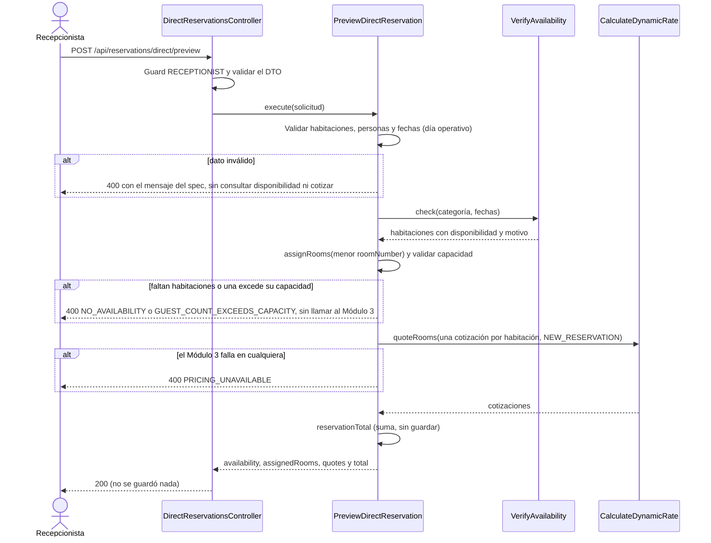
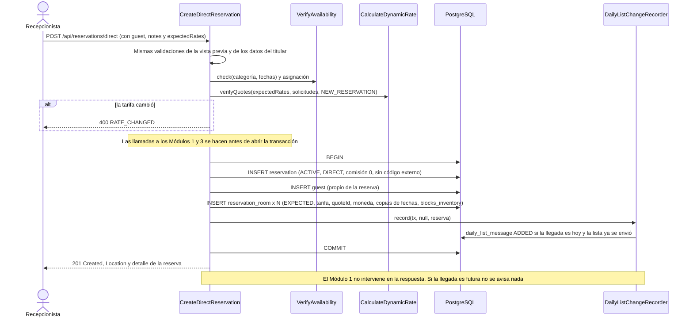
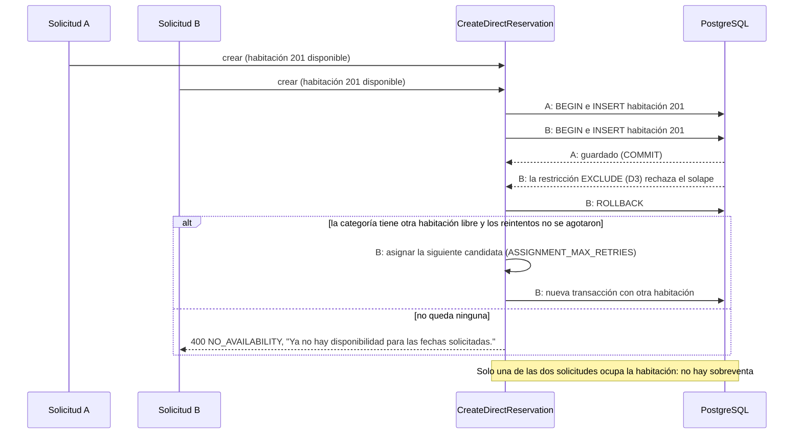

# Implementation Plan: Generar reservación directa (`generate-direct-reservation`)

**Plan base**: [../base/plan.md](../base/plan.md)
**Spec**: [./spec.md](spec.md)
**Guía**: [../base/guia-planes-por-caso-de-uso.md](../base/guia-planes-por-caso-de-uso.md)

## Summary

La Recepcionista registra, a pedido del huésped, una reserva de canal directo: una categoría, entre 1 y
10 habitaciones de esa categoría, las fechas de la estadía y las personas de cada habitación. El sistema
**asigna las habitaciones concretas**, verifica la disponibilidad de cada una, obtiene la tarifa de cada
habitación del Módulo 3, muestra el resultado y, al confirmar, crea la reserva **directamente en `ACTIVE`**,
sin cobro (el pago del 100 % se hace en el Check-Out, que ejecuta el Módulo 1).

Es una API en **dos pasos**, igual que la modificación (decisión D8 del plan base):

1. **Vista previa** (`POST /api/reservations/direct/preview`): no guarda nada. Asigna habitaciones, verifica
   disponibilidad y cotiza.
2. **Creación** (`POST /api/reservations/direct`): vuelve a cotizar y a comparar con lo que vio el
   solicitante (decisión D1), y crea la reserva en una sola transacción. Responde `201`.

Orquesta tres casos de uso: `check-room-availability` (disponibilidad y asignación),
`calculate-dynamic-rate` (tarifas) y `check-view-reservation` (aviso `ADDED` a la lista del día). **No le
ordena nada al Módulo 1**: la reserva se crea sin depender de él.

## Resumen técnico e identificación

| Dato | Valor |
|---|---|
| Caso de uso | Generar reservación directa (`generate-direct-reservation`) |
| Spec | [spec.md](./spec.md), historia 1 y FR-001 a FR-010 |
| Actor principal | Recepcionista |
| Disparador | REST: `POST /api/reservations/direct/preview` y `POST /api/reservations/direct` |
| Naturaleza | Escribe `reservation`, `reservation_room` y `guest`; no tiene colas propias |

## Technical Context

El stack, la arquitectura hexagonal y el manejo de errores son los del [plan base](../base/plan.md).
Lo propio de este caso de uso:

- **Dependencias nuevas**: ninguna.
- **Almacenamiento**: `reservation`, `reservation_room`, `guest` (plan base).
- **Configuración**: `ASSIGNMENT_MAX_RETRIES` (por defecto `3`): reintentos de asignación cuando la base
  rechaza una habitación por solape.
- **Performance** (NFR-001): el cruce local con las reservas se completa en menos de 200 ms.

## Contratos

### A. Vista previa: `POST /api/reservations/direct/preview`

Rol `RECEPTIONIST`. **Cabeceras**: `Authorization: Bearer <JWT>`, `Content-Type: application/json`. Sin
token, 401; con otro rol, 403. **No guarda nada.**

**Solicitud**

```json
{
  "startDate": "2026-10-12",
  "endDate": "2026-10-15",
  "categoryRoom": "DOBLE",
  "rooms": [
    { "guestCount": 2 },
    { "guestCount": 2 }
  ]
}
```

- `categoryRoom`: **una sola** para toda la reserva; no se mezclan categorías (para eso existe "Actualizar
  reservación").
- `rooms`: una entrada por habitación (entre 1 y 10), con su `guestCount`. La cantidad de habitaciones es
  la longitud de la lista.
- `roomId` es **opcional** en cada entrada. La pantalla no lo envía: el sistema asigna. Si viene, se
  verifica esa habitación concreta, que debe ser de `categoryRoom`.

**Respuesta 200**

```json
{
  "availability": {
    "startDate": "2026-10-12",
    "endDate": "2026-10-15",
    "categoryRoom": "DOBLE",
    "availableCount": 3,
    "rooms": [
      { "roomId": "uuid", "roomNumber": "201", "available": true, "reason": null },
      { "roomId": "uuid", "roomNumber": "202", "available": true, "reason": null },
      { "roomId": "uuid", "roomNumber": "203", "available": false, "reason": "RESERVED" }
    ]
  },
  "assignedRooms": [
    { "position": 1, "roomId": "uuid", "roomNumber": "201", "maxCapacity": 2, "guestCount": 2 },
    { "position": 2, "roomId": "uuid", "roomNumber": "202", "maxCapacity": 2, "guestCount": 2 }
  ],
  "quotes": {
    "rooms": [
      {
        "key": "1",
        "categoryRoom": "DOBLE",
        "nights": 3,
        "nightlyRates": [
          { "date": "2026-10-12", "rate": { "amount": "250000.00", "currency": "COP" } }
        ],
        "lodgingAmount": { "amount": "750000.00", "currency": "COP" }
      }
    ],
    "total": { "amount": "1500000.00", "currency": "COP" }
  },
  "reservation": { "guestCount": 4 }
}
```

- `availability` y `quotes` usan los DTO compartidos de `check-room-availability` y
  `calculate-dynamic-rate`.
- `assignedRooms`: las habitaciones de **menor `roomNumber`** disponibles, sin repetir (`assignRooms`).
- `quotes.total` es la suma de los `lodgingAmount` y **no se guarda**. El `quoteId` no sale hacia la
  pantalla.
- Se cotiza **una vez por habitación**, aunque sean de la misma categoría: cada habitación guarda su
  propio `quoteId`.
- Si no hay disponibilidad suficiente, la vista previa responde **400** (ver errores), no un 200 con
  resultados parciales.

### B. Creación: `POST /api/reservations/direct`

Mismo rol y cabeceras. **Solicitud** = la de la vista previa más el titular, las observaciones y las
tarifas que el solicitante vio:

```json
{
  "startDate": "2026-10-12",
  "endDate": "2026-10-15",
  "categoryRoom": "DOBLE",
  "rooms": [ { "guestCount": 2 }, { "guestCount": 2 } ],
  "guest": {
    "firstName": "Valentina",
    "lastName": "Ospina",
    "documentType": "CC",
    "documentNumber": "1144093552",
    "nationality": "Colombia",
    "contactPhone": "+57 300 000 0000",
    "contactEmail": "valentina@correo.com"
  },
  "notes": "Llegada después de las 8 p. m.",
  "expectedRates": [
    { "position": 1, "lodgingAmount": "750000.00" },
    { "position": 2, "lodgingAmount": "750000.00" }
  ]
}
```

- `guest`: `firstName`, `lastName`, `documentType` (`RC`, `TI`, `CC`, `CE`, `PAS` o `NIT`),
  `documentNumber` y `nationality` (texto libre con el nombre del país; el huésped es extranjero si no es
  exactamente `Colombia`) son obligatorios; `contactPhone` y `contactEmail` son opcionales.
- `notes`: opcional, máximo 500 caracteres.
- `expectedRates`: el `lodgingAmount` de cada habitación que vio el solicitante, por `position`. El
  servidor **vuelve a cotizar** y compara (decisión D1); si difiere, `RATE_CHANGED`. **Nunca se guarda un
  monto enviado por el cliente.**

**Respuesta `201 Created`**, con la cabecera `Location: /api/reservations/{reservationRef}` y el detalle
de la reserva con la forma de `check-view-reservation` (C3):

```json
{
  "reservationRef": "RSV-3F9A1C7B",
  "status": "ACTIVE",
  "source": "DIRECT",
  "externalConfirmationCode": null,
  "startDate": "2026-10-12",
  "endDate": "2026-10-15",
  "nights": 3,
  "guestCount": 4,
  "notes": "Llegada después de las 8 p. m.",
  "createdAt": "2026-10-09T09:14:00-05:00",
  "rooms": [
    {
      "roomNumber": "201", "categoryRoom": "DOBLE", "guestCount": 2,
      "roomGrossAmount": { "amount": "750000.00", "currency": "COP" },
      "stayStatus": "EXPECTED"
    }
  ],
  "guest": { "firstName": "Valentina", "lastName": "Ospina", "documentType": "CC", "documentNumber": "1144093552",
             "nationality": "Colombia", "contactPhone": "+57 300 000 0000", "contactEmail": "valentina@correo.com" },
  "cancellation": null
}
```

La reserva se guarda con `source` `DIRECT`, `commissionPercentage` y `commissionAmount` en `0`,
`externalConfirmationCode` en `null`, y **sin total** ni IVA. El `201` se responde una vez persistida, **sin
esperar al Módulo 1** (FR-007).

### C. Errores 400 (los mismos para A y B; el mensaje es el literal del spec)

| `errorCode` | Cuándo | `message` |
|---|---|---|
| `START_DATE_IN_PAST` | `startDate` anterior al día operativo en curso | "La fecha de entrada no puede ser anterior a hoy." |
| `INVALID_STAY_DATES` | Fechas vacías, inexistentes o salida no posterior a la entrada | "La fecha de salida debe ser posterior a la de entrada." |
| `INVALID_ROOM_COUNT` | Cero o más de 10 habitaciones | "Una reserva debe tener entre 1 y 10 habitaciones." |
| `ROOM_ALREADY_IN_RESERVATION` | La misma habitación dos veces | "La habitación ya forma parte de la reserva." |
| `INVALID_GUEST_COUNT` | `guestCount` no es un entero positivo | "La cantidad de personas debe ser un número entero mayor que cero." |
| `GUEST_COUNT_TOO_LOW` | `guestCount` igual a 0 | "Cada habitación debe tener al menos una persona." |
| `GUEST_COUNT_EXCEEDS_CAPACITY` | `guestCount` mayor que el `maxCapacity` | "La cantidad de personas supera la capacidad de la habitación." |
| `NO_AVAILABILITY` | No hay habitaciones disponibles suficientes | "Error 400: La habitación no está disponible para el rango de fechas solicitado" |
| `NO_AVAILABILITY` | Una habitación pedida por `roomId` no está disponible | "Error 400: La habitación {roomNumber} no está disponible para el rango de fechas solicitado" |
| `NO_AVAILABILITY` | Otra solicitud tomó la última habitación | "Ya no hay disponibilidad para las fechas solicitadas." |
| `PRICING_UNAVAILABLE` | El Módulo 3 no responde al cotizar | "Error 400: El servicio de cotización de tarifas no se encuentra disponible. Por favor intente más tarde" |
| `RATE_CHANGED` | La tarifa cambió entre la vista previa y la creación | "La tarifa cambió, vuelva a cotizar." |
| `NOTES_TOO_LONG` | `notes` de más de 500 caracteres | "Las observaciones no pueden superar 500 caracteres." |
| `INVALID_CHARACTERS` | Caracteres no válidos en `notes` o en los datos del titular | "El formato de los datos contiene caracteres no válidos." |
| `GUEST_DATA_REQUIRED` | Falta un dato obligatorio del titular | "Los datos del titular son obligatorios." |
| `INVALID_DOCUMENT_TYPE` | `documentType` fuera de `RC`, `TI`, `CC`, `CE`, `PAS`, `NIT` | "El tipo de documento no es válido." |
| `INVALID_EMAIL` | `contactEmail` con formato inválido | "El correo electrónico no es válido." |
| `INVALID_CATEGORY`, `INVENTORY_UNAVAILABLE`, `MAINTENANCE_CHECK_UNAVAILABLE`, `INVALID_ROOM_ID` | Categoría inválida o fallos del Módulo 1 | Los de `consult-room-inventory` y `consult-maintenance-calendar` |

### D. Puertos que usa

| Puerto | De | Para qué |
|---|---|---|
| `VerifyAvailability.check` y `assignRooms` | `check-room-availability` | Disponibilidad y asignación de habitaciones |
| `CalculateDynamicRate.quoteRooms` y `verifyQuotes`, y `reservationTotal` | `calculate-dynamic-rate` | Tarifas por habitación, confirmación y total |
| `ConsultRoomInventory` | `consult-room-inventory` | `maxCapacity` de cada habitación asignada (viene en `Room`) |
| `ReservationStatusService` | `update-reservation` | Estado inicial `ACTIVE` y `stayStatus` `EXPECTED` |
| `DailyListChangeRecorder.record` | `check-view-reservation` | Aviso `ADDED` de la lista del día |
| `Clock` | Plan base | Día operativo en curso |

## Reglas de negocio

1. **Una categoría por reserva**, entre 1 y 10 habitaciones distintas, cada una con un `guestCount`
   entero entre 1 y su `maxCapacity`. El `guestCount` de la reserva es la suma.
2. **Orden de validación** (el primero que falle responde):
   1. Estructura del cuerpo y formatos.
   2. Cantidad de habitaciones (1 a 10) y `guestCount` entero positivo.
   3. **Fechas**: entrada no anterior al día operativo en curso (el `Clock`, no una fecha fija: si hoy es
      el 28, el 27 se rechaza y el 28 se acepta; mañana el mínimo es el 29) y salida posterior. **Antes de
      consultar disponibilidad ni cotizar** (FR-001a).
   4. `notes` (máximo 500) y caracteres válidos en `notes` y en los datos del titular (solo en la creación
      se exigen los datos del titular).
   5. Disponibilidad y asignación (`check-room-availability`).
   6. Capacidad de cada habitación asignada.
   7. Cotización (`calculate-dynamic-rate`, contexto `NEW_RESERVATION`), una por habitación, todo o nada.
   8. Solo en la creación: comparación con `expectedRates`.
3. **No se cotiza si no hay disponibilidad** (escenario 2): el flujo se detiene antes de llamar al
   Módulo 3.
4. **La reserva solo se crea si todas las habitaciones están disponibles y cotizadas.** No existe una
   reserva con habitaciones sin valor (caso borde).
5. **Estado inicial `ACTIVE`**, sin paso de cobro ni estado intermedio, y una `ReservationRoom` en
   `EXPECTED` por habitación.
6. **Titular propio de la reserva**: se crea un `guest` nuevo ligado a esta reserva (el plan base no
   comparte titulares entre reservas).
7. **Referencia**: `RSV-` más 8 caracteres hexadecimales en mayúsculas; si ya existe, se genera otra (hasta
   5 intentos).
8. **Aviso de la lista del día**: dentro de la transacción, `DailyListChangeRecorder.record(tx, null,
   reserva)`. Si la llegada es hoy y la lista ya se envió, genera `ADDED`; si aún no se envió, la reserva
   viaja en la lista; si la llegada es futura, no se avisa nada.

## Diagramas de secuencia

### D1. Vista previa (A)



### D2. Creación exitosa (B, escenarios 1, 4 y 5)



### D3. Última habitación tomada por otra solicitud (concurrencia)



## Modelo de datos y entidades involucradas

**No se crean tablas.** Escribe en las del plan base:

| Tabla | Qué guarda |
|---|---|
| `reservation` | `reservation_ref` generada, `source = DIRECT`, `status = ACTIVE`, `start_date`, `end_date`, `guest_count` (suma), `notes`, `commission_percentage = 0`, `commission_amount = 0`; `ota_id`, `external_confirmation_code`, `gross_amount`, `currency` y `commission_status` en `NULL` |
| `reservation_room` | Una por habitación: `room_id`, `room_number`, `category_room`, `guest_count`, `room_gross_amount`, `quote_id`, `currency` (juntos), `stay_status = EXPECTED`, copias `start_date` y `end_date`, `blocks_inventory = true` |
| `guest` | Un titular nuevo ligado a la reserva (`reservation_id`) |
| `daily_list_message`, `daily_sequence` | Los escribe `DailyListChangeRecorder` en la misma transacción |

- Las restricciones `CHECK` del canal `DIRECT` del plan base garantizan comisión `0` y los campos de OTA
  en `NULL`.
- **El total no se guarda**: se calcula al mostrarlo (`reservationTotal`).
- Los `nightlyRates` **no se guardan**: solo se ven en la vista previa.
- La restricción `EXCLUDE` de D3 sobre `reservation_room` impide el solape aun con solicitudes
  simultáneas.

**Estado**: la reserva nace en `ACTIVE` y la habitación en `EXPECTED`; el estado inicial lo establece el
dominio con `ReservationStatusService`.

## Reglas de validación y manejo de errores

Todo error sale con `{ "errorCode", "message", "timestamp", "path" }` y **siempre 4xx**; nunca 500.

| Situación | HTTP | `errorCode` |
|---|---|---|
| Errores de validación y de integración de la tabla C | 400 | Los de la tabla C |
| Sin token o token inválido | 401 | `UNAUTHENTICATED` |
| Rol distinto de `RECEPTIONIST` | 403 | `FORBIDDEN` |
| Excepción inesperada | 400 | `REQUEST_NOT_PROCESSED` |

- **Todo o nada**: si falla la disponibilidad, la cotización de una sola habitación o el guardado, **no se
  crea ninguna reserva** ni se persiste ningún registro (la transacción se revierte).
- **No se asume ninguna tarifa** por defecto, estimada ni a cero.
- **Concurrencia**: la violación de la restricción de exclusión (código `23P01` de PostgreSQL) se traduce
  en reintento con otra habitación o en `NO_AVAILABILITY`; nunca en 500.
- La referencia duplicada (violación de unicidad de `reservation_ref`) se resuelve generando otra.
- Los fallos del Módulo 1 o 3 se informan sin detalles de infraestructura.

## Integraciones externas

| Módulo | Dirección | Mecanismo | Contrato | Fallo o tiempo agotado |
|---|---|---|---|---|
| Módulo 1 | M2 → M1 | Inventario y mantenimientos (vía `VerifyAvailability`) | Planes de `consult-room-inventory` y `consult-maintenance-calendar` | `INVENTORY_UNAVAILABLE` o `MAINTENANCE_CHECK_UNAVAILABLE` (400); no se crea la reserva |
| Módulo 3 | M2 → M3 | `POST /pricing/quotes`, por habitación (vía `CalculateDynamicRate`) | Plan de `calculate-dynamic-rate` | `PRICING_UNAVAILABLE` (400); no se crea la reserva |
| Módulo 1 | M2 → M1 | Lista del día (vía `DailyListChangeRecorder`) | Plan de `check-view-reservation` | Mensaje `PENDING` con reintento en orden; **la creación no se revierte** |

- **No se le ordena nada al Módulo 1**: ni apartar ni liberar habitaciones (FR-007).
- Las llamadas a los Módulos 1 y 3 se hacen **antes** de abrir la transacción de base de datos, para no
  mantenerla abierta esperando a un servicio externo.
- No hay colas propias.

## Arquitectura (capas del plan base)

| Capa | Piezas de este caso de uso |
|---|---|
| `domain/reservation/` | Creación del agregado `Reservation` con sus invariantes (1 a 10 habitaciones, capacidad, fechas, estado inicial), generación de `reservationRef` |
| `application/use-cases/generate-direct-reservation/` | **Entrada**: `PreviewDirectReservation` y `CreateDirectReservation`; validador de la solicitud |
| `application/ports/out/` | `ReservationRepository`, `Clock` y los puertos de otros casos de uso (D) |
| `infrastructure/in/rest/` | `DirectReservationsController` |
| `infrastructure/out/persistence/` | Repositorio con la inserción del agregado y la traducción del error `23P01` |

```text
backend/src/
├── domain/reservation/
│   ├── reservation.ts                      # fábrica createDirect(...) con sus invariantes
│   └── reservation-ref.ts                  # RSV- + 8 hexadecimales
├── application/use-cases/generate-direct-reservation/
│   ├── ports/in/
│   ├── preview-direct-reservation.service.ts
│   ├── create-direct-reservation.service.ts
│   └── direct-reservation-request.validator.ts
├── infrastructure/in/rest/direct-reservations.controller.ts
└── infrastructure/out/persistence/reservation.repository.ts
backend/test/
├── unit/generate-direct-reservation/       # invariantes, validador, referencia
├── integration/generate-direct-reservation/ # Testcontainers: creación, concurrencia, aviso a la lista
└── contract/                                # forma de los DTO REST
frontend/src/pages/reservations/new/         # pantalla "Nueva reserva directa"
```

## Phase 1: Setup

- [ ] T001 Variable `ASSIGNMENT_MAX_RETRIES` en la configuración validada

## Phase 2: Foundational

- [ ] T002 [P] Fábrica `Reservation.createDirect` con sus invariantes y pruebas unitarias (habitaciones, capacidad, fechas, estado inicial, comisión `0`)
- [ ] T003 [P] Generador de `reservationRef` con reintento ante duplicado
- [ ] T004 [P] Validador de la solicitud (formatos, enteros, `notes`, caracteres, titular) con los mensajes literales
- [ ] T005 `ReservationRepository.insertDirect` en una transacción, con traducción del error `23P01` y de la unicidad de `reservation_ref`
- [ ] T006 Códigos de error y mensajes de la tabla C

## Phase 3: User Story 1 - Creación de reserva directa (P1)

**Goal**: la Recepcionista crea una reserva directa confirmada, con disponibilidad y tarifas del Módulo 3.
**Independent Test**: habitaciones disponibles y Módulo 3 simulado; reserva en `ACTIVE` con tarifa por
habitación, comisión `0` y aviso `ADDED` solo con llegada hoy; y los bloqueos por falta de disponibilidad
y por caída del Módulo 3.

- [ ] T007 [US1] `PreviewDirectReservation` y `POST /api/reservations/direct/preview` (A): validaciones, disponibilidad, asignación, capacidad y cotización
- [ ] T008 [US1] `CreateDirectReservation` y `POST /api/reservations/direct` (B): `verifyQuotes`, transacción, `201` y `Location`
- [ ] T009 [US1] Reintento de asignación ante el rechazo por solape y `NO_AVAILABILITY` cuando no hay otra habitación
- [ ] T010 [US1] Llamada a `DailyListChangeRecorder` dentro de la transacción (`ADDED` solo con llegada hoy y lista ya enviada)
- [ ] T011 [US1] Pruebas de integración de los escenarios 1 a 7 y 9
- [ ] T012 [US1] Pruebas de todos los casos borde (fechas, habitaciones, personas, `notes`, Módulo 3 parcial, concurrencia)
- [ ] T013 [US1] Prueba de concurrencia: dos solicitudes simultáneas por la última habitación; solo una se crea
- [ ] T014 [P] [US1] Frontend: pantalla "Nueva reserva directa" (disponibilidad y tarifa al cambiar categoría, habitaciones y fechas; confirmar)

## Phase N: Polish

- [ ] T015 Prueba de tiempo: el cruce local con las reservas en menos de 200 ms con 50 000 reservas (NFR-001)
- [ ] T016 Verificar que los logs no escriben datos personales del titular
- [ ] T017 Documentar A y B en OpenAPI (`@nestjs/swagger`)

## Pruebas por escenario

| Historia | Escenario | Qué se verifica |
|---|---|---|
| US1 | 1 creación exitosa | Reserva `ACTIVE`, `roomGrossAmount` y `quoteId` por habitación, comisión `0`, código externo `null`; con llegada hoy y lista ya enviada, aviso `ADDED` |
| US1 | 2 habitación no disponible | `400` `NO_AVAILABILITY` con el mensaje literal; **el Módulo 3 no recibe ninguna llamada** |
| US1 | 3 Módulo 3 caído | Tiempo agotado: `400` `PRICING_UNAVAILABLE` con el mensaje literal; no se crea ni se guarda nada |
| US1 | 4 llegada futura | `201` y ningún mensaje al Módulo 1 |
| US1 | 5 grupo con varias habitaciones | Una `Reservation` con dos `ReservationRoom` en `EXPECTED`, cada una con su tarifa y sin total |
| US1 | 6 una habitación no disponible | Habitación pedida por `roomId` con mantenimiento: `400` que nombra la habitación 102 y no se crea nada |
| US1 | 7 personas fuera de capacidad | 3 personas: "La cantidad de personas supera la capacidad de la habitación."; 0: "Cada habitación debe tener al menos una persona." |
| US1 | 9 fecha anterior a hoy | Con el reloj simulado: el día anterior se rechaza, el mismo día se acepta, y al día siguiente el mínimo avanza |
| Casos borde | Fechas | Salida anterior, vacía o inexistente: `400` sin consultar disponibilidad ni cotizar |
| Casos borde | Concurrencia | Dos creaciones por la última habitación: una `201`, la otra `NO_AVAILABILITY` (o toma otra habitación libre) |
| Casos borde | Habitaciones | Repetida: "La habitación ya forma parte de la reserva."; cero o más de 10: "Una reserva debe tener entre 1 y 10 habitaciones." |
| Casos borde | Personas | No entero o negativo: "La cantidad de personas debe ser un número entero mayor que cero." |
| Casos borde | Módulo 3 parcial | Cotiza unas y falla otra: no se crea la reserva |
| Casos borde | `notes` | Más de 500 o con caracteres no válidos: los dos mensajes del spec |
| FR-002, FR-006 | Persistencia | Sin columna de total, sin IVA y con comisión `0` (las restricciones `CHECK` del canal `DIRECT`) |
| D1 | Tarifa cambió | Dos cotizaciones con importes distintos: `RATE_CHANGED` y nada se guarda |
| NFR-001 | Tiempo | El cruce local en menos de 200 ms |

## Dependencies & Execution Order

- **Depende de**: `check-room-availability`, `calculate-dynamic-rate`, `consult-room-inventory`,
  `consult-maintenance-calendar`, `check-view-reservation` (`DailyListChangeRecorder`) y
  `update-reservation` (`ReservationStatusService`), y la restricción anti-solape (D3).
- **Necesitan de este caso de uso**: ninguno.
- **Orden**: T001–T006 → US1 (T007–T014) → Polish. Va después de `check-room-availability` y de
  `update-reservation`, que son las que usa.

## Trazabilidad: requisito → componente → tarea

| Requisito | Componente | Tarea |
|---|---|---|
| FR-001 | `VerifyAvailability` de cada habitación, todo o nada | T007, T008 |
| FR-001a | Validación de fechas con el `Clock` | T004, T011 |
| FR-002 | Invariantes de habitaciones, capacidad y `notes` | T002, T004 |
| FR-003, FR-004 | `quoteRooms` y bloqueo ante un Módulo 3 caído | T007, T008, T012 |
| FR-005 | Estado inicial `ACTIVE` y habitaciones `EXPECTED` | T002, T008 |
| FR-006 | Persistencia de tarifa, `quoteId`, comisión `0` y código `null` | T005, T008 |
| FR-007 | La creación no depende del Módulo 1 y responde `201` | T008 |
| FR-009 | `DailyListChangeRecorder` dentro de la transacción | T010 |
| FR-010 | Mapeo a 400 de toda validación e integración | T006, T012 |
| NFR-001 | Índice GiST de D3 y prueba de tiempo | T015 |
| SC-001 a SC-004 | Pruebas por escenario y de concurrencia | T011, T013 |

## Puntos que este plan propone (el spec no los dice)

1. **Una API en dos pasos** (vista previa y creación) y `expectedRates` por `position`, igual que
   `update-reservation` (decisión D8).
2. **`roomId` opcional** en cada habitación de la solicitud: sin él se asigna; con él se verifica esa
   habitación. El flujo del spec asigna automáticamente, pero los escenarios 5 y 6 hablan de habitaciones
   concretas (101 y 102).
3. **Asignación por menor `roomNumber`**, la misma regla que el spec de OTA.
4. **Reintento de asignación** (hasta 3) cuando la base rechaza una habitación por solape, antes de
   responder `NO_AVAILABILITY`.
5. **Las llamadas a los Módulos 1 y 3 van antes de abrir la transacción**; dentro solo está la inserción.
6. **Titular nuevo por reserva** y códigos y mensajes para los datos del titular que el spec no define
   (`GUEST_DATA_REQUIRED`, `INVALID_DOCUMENT_TYPE`, `INVALID_EMAIL`).
7. **Mensajes de disponibilidad**: el literal del spec cuando es general y el mismo con el número de
   habitación cuando se pidió una habitación concreta.

## Puntos abiertos

| # | Pendiente | Con quién |
|---|---|---|
| 1 | **Doble envío**: como las habitaciones se asignan solas, dos envíos iguales del formulario crean **dos reservas** en habitaciones distintas. Conviene una cabecera `Idempotency-Key` con una tabla pequeña que la guarde, o deshabilitar el botón en la pantalla | Equipo del Módulo 2 |
| 2 | **Mensaje de caída del Módulo 3**: este spec dice "...no se encuentra disponible. Por favor intente más tarde" y `calculate-dynamic-rate` (escenario 2) lo dice sin la última frase. Este plan usa el de este spec en la creación; conviene alinear los dos specs | Equipo del Módulo 2 |
| 3 | El flujo del spec asigna habitaciones automáticamente, pero los escenarios 5 y 6 nombran habitaciones concretas. Confirmar si la API debe aceptar `roomId` | Equipo del Módulo 2 |
| 4 | Una habitación con mantenimiento programado **entre** la verificación y el guardado no se detecta (el calendario no se consulta dentro de la transacción) | Equipo del Módulo 2 |
| 5 | Si el titular debe poder reutilizar datos de una reserva anterior (por documento). Hoy se escriben completos en cada reserva | Equipo del Módulo 2 |
| 6 | La Recepcionista no elige el número de habitación: confirmar si necesita poder hacerlo para alguna petición del huésped (por ejemplo, una habitación en un piso) | Equipo del Módulo 2 |

## Notes

- `[P]` marca tareas paralelizables; `[US1]` las liga a su historia de usuario.
- Commit por tarea o grupo lógico, con Gitflow.
- Este plan no modifica el spec ni el plan base.
