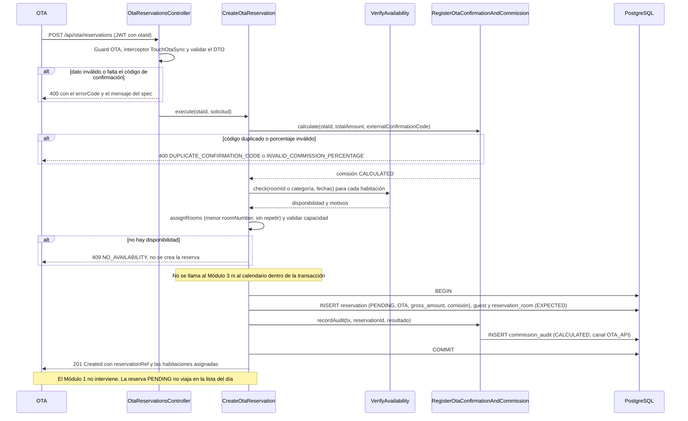
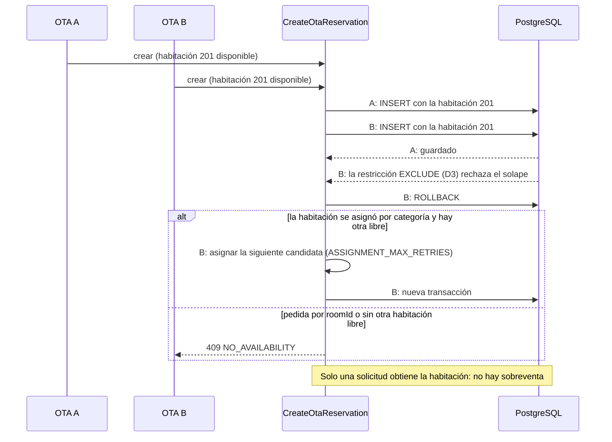
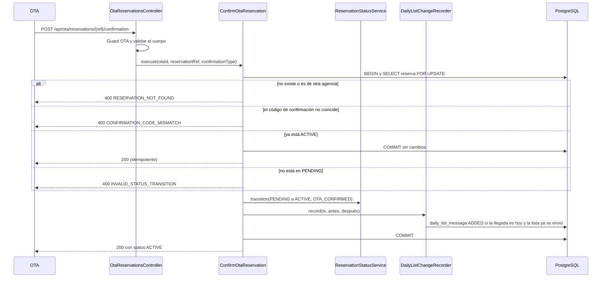

# Implementation Plan: Generar reservación por OTA (`generate-ota-reservation`)

**Plan base**: [../base/plan.md](../base/plan.md)
**Spec**: [./spec.md](spec.md)
**Guía**: [../base/guia-planes-por-caso-de-uso.md](../base/guia-planes-por-caso-de-uso.md)

## Summary

Las agencias de viaje en línea (OTA) envían sus reservas de sistema a sistema, sin pantalla y en cualquier
momento del día. Este caso de uso es **la API de integración** que las recibe. Tiene dos operaciones:

1. **Crear la reserva** (`POST /api/ota/reservations`): valida el payload, verifica la disponibilidad de
   cada habitación, asigna las habitaciones que se pidieron solo por categoría, calcula la comisión de la
   agencia y guarda la reserva en **`PENDING`**, a la espera de que la agencia confirme el pago o la
   garantía. Responde `201` sin depender del Módulo 1.
2. **Confirmar el pago o la garantía**
   (`POST /api/ota/reservations/{reservationRef}/confirmation`): pasa la reserva de `PENDING` a `ACTIVE`
   mediante `ReservationStatusService`, y avisa a la lista del día del Módulo 1 (`ADDED`) si la llegada es
   hoy y la lista ya se envió.

Diferencias con la reserva directa: **no se cotiza** (no interviene `calculate-dynamic-rate`): el valor
bruto (`totalAmount`) viene de la agencia y se guarda tal cual; la reserva **no tiene tarifa por
habitación**; y el conflicto de disponibilidad responde **HTTP 409**.

**No le ordena nada al Módulo 1.** La reserva `PENDING` no viaja en la lista del día hasta que la agencia la
confirme. Las reservas de OTA solo las modifica y cancela la propia agencia por su API, cuyas rutas
definirá el caso de uso futuro "Configurar OTA" (plan base).

## Resumen técnico e identificación

| Dato | Valor |
|---|---|
| Caso de uso | Generar reservación por OTA (`generate-ota-reservation`) |
| Spec | [spec.md](./spec.md), historia 1 y FR-001 a FR-009 |
| Actor principal | La OTA (rol `OTA`, sistema externo) |
| Disparador | REST: `POST /api/ota/reservations` y `POST /api/ota/reservations/{reservationRef}/confirmation` |
| Naturaleza | Escribe `reservation`, `reservation_room`, `guest` y `commission_audit`; no usa colas |

## Technical Context

El stack, la arquitectura hexagonal y el manejo de errores son los del [plan base](../base/plan.md).
Lo propio de este caso de uso:

- **Dependencias nuevas**: ninguna.
- **Almacenamiento**: `reservation`, `reservation_room`, `guest`, `commission_audit` (plan base).
- **Autenticación**: JWT de servicio con el rol `OTA` y el `otaId` de la agencia como dato del token. Cada
  agencia **solo ve y confirma sus propias reservas**.
- **Configuración**: `ASSIGNMENT_MAX_RETRIES` (compartida con `generate-direct-reservation`).
- **Performance** (NFR-001): crear la reserva en menos de 1,5 s en condiciones normales.

## Contratos

### A. Crear la reserva: `POST /api/ota/reservations`

Rol `OTA`. **Cabeceras**: `Authorization: Bearer <JWT>`, `Content-Type: application/json`. Sin token, 401;
con otro rol, 403.

**Solicitud**

```json
{
  "externalConfirmationCode": "4417829013",
  "startDate": "2026-10-20",
  "endDate": "2026-10-22",
  "rooms": [
    { "categoryRoom": "DOBLE", "guestCount": 2 },
    { "categoryRoom": "DOBLE", "guestCount": 2 }
  ],
  "guest": {
    "firstName": "John",
    "lastName": "Miller",
    "documentType": "PAS",
    "documentNumber": "US5519302",
    "nationality": "Estados Unidos",
    "contactPhone": "+1 305 555 0100",
    "contactEmail": "john@correo.com"
  },
  "notes": "Cuna para bebé",
  "totalAmount": "1012000.00",
  "currency": "COP"
}
```

- `externalConfirmationCode`: **obligatorio**, texto no vacío de hasta 50 caracteres; único por agencia.
- `rooms`: entre 1 y 10 habitaciones **distintas**. Cada una trae `roomId` **o** `categoryRoom`, y su
  `guestCount`. Las que traen solo `categoryRoom` las asigna el sistema.
- `guest`: `firstName`, `lastName`, `documentType` (`RC`, `TI`, `CC`, `CE`, `PAS` o `NIT`),
  `documentNumber` y `nationality` obligatorios; `contactPhone` y `contactEmail` opcionales.
- `totalAmount`: valor bruto **de toda la reserva** (todas las habitaciones), mayor que cero y con como
  máximo dos decimales; se acepta como texto o número y se lee **sin pasar por `number`**.
- `currency`: moneda del `totalAmount`, 3 letras.
- `notes`: opcional, máximo 500 caracteres.

**Respuesta `201 Created`**, con la cabecera `Location: /api/ota/reservations/{reservationRef}`:

```json
{
  "reservationRef": "RSV-8D02E5A4",
  "externalConfirmationCode": "4417829013",
  "status": "PENDING",
  "rooms": [
    { "roomId": "uuid", "roomNumber": "201" },
    { "roomId": "uuid", "roomNumber": "202" }
  ],
  "createdAt": "2026-10-09T09:14:00-05:00"
}
```

- `reservationRef` es el identificador interno generado (`RSV-` más 8 caracteres hexadecimales).
- La respuesta **no incluye** importes ni la comisión: son del hotel y de la conciliación.
- La reserva se guarda con `source` `OTA`, `status` `PENDING`, el `totalAmount` en `gross_amount` y su
  moneda, `commissionPercentage` y `commissionAmount` calculados, `commissionStatus` `CALCULATED`, y cada
  habitación en `EXPECTED`, **sin tarifa por habitación**.

### B. Confirmar el pago o la garantía: `POST /api/ota/reservations/{reservationRef}/confirmation`

Rol `OTA`. La agencia solo puede confirmar **sus** reservas.

**Solicitud**

```json
{
  "confirmationType": "PAYMENT",
  "externalConfirmationCode": "4417829013"
}
```

- `confirmationType`: `PAYMENT` o `GUARANTEE`.
- `externalConfirmationCode`: opcional; si viene, debe coincidir con el de la reserva.

**Respuesta 200**

```json
{ "reservationRef": "RSV-8D02E5A4", "status": "ACTIVE" }
```

- Pasa de `PENDING` a `ACTIVE` con `ReservationStatusService` (motivo `OTA_CONFIRMED`).
- **Idempotente**: si la reserva ya está `ACTIVE`, responde 200 sin efectos (la agencia puede reintentar).
- Si la llegada es hoy y la lista del día ya se envió, genera el aviso `ADDED` (`DailyListChangeRecorder`,
  dentro de la misma transacción). Con llegada futura no avisa nada.

### C. Errores (los mismos de A y B; el mensaje es el literal del spec cuando existe)

El conflicto de disponibilidad es **409**; todo lo demás es **400**.

| HTTP | `errorCode` | Cuándo | `message` |
|---|---|---|---|
| 400 | `EXTERNAL_CONFIRMATION_CODE_REQUIRED` | Falta `externalConfirmationCode` o viene vacío | "El código de confirmación externo es obligatorio." |
| 400 | `DUPLICATE_CONFIRMATION_CODE` | El código ya está registrado para esa agencia | "El código de confirmación ya está registrado para esta agencia." |
| 400 | `INVALID_STAY_DATES` | Fechas mal formadas, inexistentes o salida no posterior a la entrada | "La fecha de salida debe ser posterior a la de entrada." |
| 400 | `START_DATE_IN_PAST` | `startDate` anterior al día operativo en curso | "La fecha de entrada no puede ser anterior a hoy." |
| 400 | `INVALID_ROOMS` | Lista vacía, más de 10, o el mismo `roomId` repetido | "Una reserva debe tener entre 1 y 10 habitaciones distintas." |
| 400 | `INVALID_ROOMS` | Una habitación sin `roomId` ni `categoryRoom` | "La habitación en la posición {n} no indica ni roomId ni categoryRoom." |
| 400 | `INVALID_GUEST_COUNT` | Falta `guestCount` o no es un entero mayor que cero | "La cantidad de personas debe ser un número entero mayor que cero." |
| 400 | `INVALID_GUEST_COUNT` | `guestCount` mayor que el `maxCapacity` | "La cantidad de personas supera la capacidad de las habitaciones de la reserva." |
| 400 | `INVALID_NOTES` | `notes` de más de 500 caracteres | "Las observaciones no pueden superar 500 caracteres." |
| 400 | `INVALID_CHARACTERS` | Patrones de inyección o caracteres no válidos en el titular o en `notes` | "El formato de los datos contiene caracteres no válidos." |
| 400 | `INVALID_GUEST_DATA` | Falta un dato obligatorio del titular o `documentType` inválido | "Los datos del titular no son válidos: {campos}." |
| 400 | `INVALID_TOTAL_AMOUNT` | `totalAmount` ausente, no positivo, con más de 2 decimales o con formato inválido | "El valor total no es válido." |
| 400 | `INVALID_CURRENCY` | `currency` ausente o que no son 3 letras | "La moneda no es válida." |
| 400 | `INVALID_COMMISSION_PERCENTAGE` | El porcentaje de la agencia está fuera de 0 a 100 | "El porcentaje de comisión no es válido." |
| 400 | `RESERVATION_NOT_FOUND` | La reserva no existe o es de otra agencia (confirmación) | "La reserva no existe." |
| 400 | `CONFIRMATION_CODE_MISMATCH` | El código de la confirmación no coincide con el de la reserva | "El código de confirmación no coincide con el de la reserva." |
| 400 | `INVALID_STATUS_TRANSITION` | La reserva no está en `PENDING` ni `ACTIVE` (por ejemplo `CANCELLED`) | "La transición de estado no está permitida." |
| 400 | `INVENTORY_UNAVAILABLE`, `MAINTENANCE_CHECK_UNAVAILABLE`, `INVALID_CATEGORY`, `INVALID_ROOM_ID` | Categoría o `roomId` inválidos, o fallos del Módulo 1 | Los de `consult-room-inventory` y `consult-maintenance-calendar` |
| **409** | `NO_AVAILABILITY` | Una habitación o una categoría no tiene disponibilidad, o la tomó otra solicitud | "No hay disponibilidad para la habitación seleccionada: {roomNumber o categoryRoom}" |
| 401 | `UNAUTHENTICATED` | Sin token o token inválido | Genérico |
| 403 | `FORBIDDEN` | Rol distinto de `OTA` | Genérico |

El cuerpo del error es siempre `{ "errorCode", "message", "timestamp", "path" }`. Una excepción inesperada
sale como 400 `REQUEST_NOT_PROCESSED`; **nunca 500**.

### D. Puertos que usa

| Puerto | De | Para qué |
|---|---|---|
| `VerifyAvailability.check`, `assignRooms` y `requireAvailable` | `check-room-availability` | Disponibilidad y asignación |
| `RegisterOtaConfirmationAndCommission.calculate` y `recordAudit` | `register-ota-information-commission` | Comisión, duplicado del código y auditoría |
| `ReservationStatusService.transition` | `update-reservation` | `PENDING` al crear y `PENDING → ACTIVE` al confirmar |
| `DailyListChangeRecorder.record` | `check-view-reservation` | Aviso `ADDED` al confirmar |
| `TouchOtaSync.touch` | `register-ota-information-commission` | `lastSyncAt` con cada mensaje de la OTA |
| `Clock` | Plan base | Día operativo en curso |

## Reglas de negocio

1. **Orden de validación** al crear (la primera falla responde):
   1. Autenticación y rol `OTA` (con el `otaId` del token).
   2. Estructura del JSON y campos obligatorios, incluido el `externalConfirmationCode`.
   3. Habitaciones (1 a 10 distintas, `roomId` o `categoryRoom`) y `guestCount` entero positivo.
   4. Fechas, `notes`, caracteres válidos, datos del titular, `totalAmount` y `currency`.
   5. Código de confirmación no repetido y porcentaje de la agencia válido
      (`RegisterOtaConfirmationAndCommission.calculate`).
   6. Disponibilidad y asignación (`check-room-availability`): primero las habitaciones pedidas por
      `roomId`, luego las pedidas por categoría con la de menor `roomNumber`, **sin repetir** una habitación
      ya asignada a la misma reserva.
   7. Capacidad de cada habitación asignada.
   8. Guardado en una transacción.
2. **Todo o nada**: si una sola habitación no está disponible, **no se crea la reserva** ni se guarda nada
   parcial; el error indica qué habitación o categoría falló.
3. **Sin cotización**: este caso de uso **no llama al Módulo 3** (decisión C5 del plan base). El valor
   bruto se guarda tal cual lo envía la agencia, para que la comisión cuadre con lo que ella cobró.
4. **La comisión se calcula sobre el `totalAmount` completo, una sola vez** (`register-ota-information-commission`).
5. **Estado inicial `PENDING`**: la reserva ocupa inventario desde su registro (`blocks_inventory`), pero
   **no viaja en la lista del día** hasta que se confirme.
6. **Confirmación**: solo `PENDING → ACTIVE`; después de la creación este caso de uso no cambia el
   `status` por su cuenta (FR-006).
7. **Reserva que nunca se confirma**: queda en `PENDING`; se puede cancelar por la vía estándar o la marca
   `NO_SHOW` el cierre del día si su fecha de inicio pasa sin ingreso (`update-reservation`).
8. **Titular propio de la reserva**: se crea un `guest` nuevo ligado a esta reserva.
9. **Cada agencia solo ve sus reservas**: toda consulta y confirmación se filtra por el `otaId` del token.
10. **`lastSyncAt`**: cada mensaje de la OTA actualiza su última sincronización (interceptor).

## Diagramas de secuencia

### D1. Creación de una reserva OTA (historia 1, escenarios 1, 4, 5 y 6)



### D2. Disponibilidad tomada por otra solicitud (concurrencia, caso borde)



### D3. Confirmación del pago o la garantía (historia 1, escenario 2)



## Modelo de datos y entidades involucradas

**No se crean tablas.** Escribe en las del plan base:

| Tabla | Qué guarda |
|---|---|
| `reservation` | `reservation_ref`, `source = OTA`, `ota_id`, `external_confirmation_code`, `status = PENDING` (luego `ACTIVE`), `start_date`, `end_date`, `guest_count` (suma), `notes`, `gross_amount` y `currency` (el `totalAmount` de la agencia), `commission_percentage`, `commission_amount`, `commission_status = CALCULATED` |
| `reservation_room` | Una por habitación: `room_id`, `room_number`, `category_room`, `guest_count`, `stay_status = EXPECTED`, copias de fechas y `blocks_inventory = true`; **`room_gross_amount`, `quote_id` y `currency` en `NULL`** (la OTA no tiene tarifa por habitación) |
| `guest` | Un titular nuevo ligado a la reserva |
| `commission_audit` | La fila `CALCULATED` de la comisión (la escribe `register-ota-information-commission`) |

- Las restricciones `CHECK` del canal `OTA` del plan base obligan a que la reserva lleve `ota_id`,
  `external_confirmation_code`, `gross_amount`, `currency` y `commission_status`.
- La restricción única `(ota_id, external_confirmation_code)` respalda el rechazo de duplicados aun con
  solicitudes simultáneas.
- La restricción `EXCLUDE` de D3 impide el solape de habitaciones; una `PENDING` **bloquea inventario**.

**Estados**: la reserva nace en `PENDING` y pasa a `ACTIVE` con la confirmación:

```text
(nueva) --crear--> PENDING --confirmación de la OTA--> ACTIVE    (luego: Check-In, cancelación, No-Show, ...)
```

## Reglas de validación y manejo de errores

| Situación | Comportamiento |
|---|---|
| Cualquier error de la tabla C | Respuesta JSON estructurada 4xx (409 solo para la disponibilidad); **no se crea nada** |
| Violación de la restricción de exclusión (`23P01`) | Reintento con otra habitación si se pidió por categoría; si no, 409 `NO_AVAILABILITY` |
| Violación de unicidad de `(ota_id, external_confirmation_code)` (solicitud simultánea) | 400 `DUPLICATE_CONFIRMATION_CODE` |
| Violación de unicidad de `reservation_ref` | Se genera otra referencia |
| Fallo del Módulo 1 al verificar disponibilidad | 400 con el error de `consult-room-inventory` o `consult-maintenance-calendar`; no se asume disponibilidad |
| Datos con patrones de inyección | 400 `INVALID_CHARACTERS`; el valor crudo **nunca se almacena** |
| Excepción inesperada | 400 `REQUEST_NOT_PROCESSED`, sin detalles de infraestructura |

- **Sanear antes de persistir**: los datos del titular y `notes` se validan contra un conjunto de
  caracteres permitido; los demás campos se consultan con parámetros, nunca concatenados.
- **Respuesta estructurada siempre**: incluso ante un JSON ilegible se responde `400` con el cuerpo
  `{ errorCode, message, timestamp, path }`.

## Integraciones externas

| Módulo | Dirección | Mecanismo | Contrato | Fallo o tiempo agotado |
|---|---|---|---|---|
| OTA | OTA → M2 | REST `POST /api/ota/reservations` y `.../confirmation` | A y B | Respuesta 4xx estructurada |
| Módulo 1 | M2 → M1 | Inventario y mantenimientos (vía `VerifyAvailability`) | Planes de `consult-room-inventory` y `consult-maintenance-calendar` | 400; no se crea la reserva |
| Módulo 1 | M2 → M1 | Lista del día (vía `DailyListChangeRecorder`, solo al confirmar) | Plan de `check-view-reservation` | Mensaje `PENDING` con reintento; **la confirmación no se revierte** |

- **No se llama al Módulo 3** en este caso de uso (decisión C5 del plan base).
- **No se le ordena nada al Módulo 1** (FR-007).
- Las llamadas al Módulo 1 se hacen **antes** de abrir la transacción de base de datos.
- No hay colas propias.

## Arquitectura (capas del plan base)

| Capa | Piezas de este caso de uso |
|---|---|
| `domain/reservation/` | Fábrica `Reservation.createOta(...)` con sus invariantes y el estado inicial `PENDING` |
| `application/use-cases/generate-ota-reservation/` | **Entrada**: `CreateOtaReservation` y `ConfirmOtaReservation`; validador y saneador del payload |
| `application/ports/out/` | `ReservationRepository`, `Clock` y los puertos de otros casos de uso (D) |
| `infrastructure/in/rest/` | `OtaReservationsController`; guard del rol `OTA` con el `otaId` |
| `infrastructure/out/persistence/` | Repositorio compartido con `generate-direct-reservation` |

```text
backend/src/
├── domain/reservation/
│   └── reservation.ts                           # createOta(...), compartido con createDirect
├── application/use-cases/generate-ota-reservation/
│   ├── ports/in/
│   ├── create-ota-reservation.service.ts
│   ├── confirm-ota-reservation.service.ts
│   └── ota-reservation-request.validator.ts
├── infrastructure/in/rest/ota-reservations.controller.ts
└── infrastructure/security/ota-auth.guard.ts    # rol OTA y otaId del token
backend/test/
├── unit/generate-ota-reservation/               # validador, saneador, fábrica
├── integration/generate-ota-reservation/        # Testcontainers: creación, confirmación, concurrencia
└── contract/                                    # forma de los DTO y de los errores
```

## Phase 1: Setup

- [ ] T001 Guard del rol `OTA` con el `otaId` del token y su aplicación a las dos rutas

## Phase 2: Foundational

- [ ] T002 [P] Fábrica `Reservation.createOta` con sus invariantes (habitaciones, estado `PENDING`, sin tarifa por habitación) y pruebas unitarias
- [ ] T003 [P] Validador y saneador del payload (estructura, `externalConfirmationCode`, habitaciones, `guestCount`, fechas, `notes`, titular, `totalAmount` leído sin `number`, `currency`) con los mensajes literales
- [ ] T004 [P] Reutilizar el repositorio de inserción del agregado de `generate-direct-reservation` para el canal `OTA`
- [ ] T005 Códigos de error de la tabla C, con el 409 para `NO_AVAILABILITY`

## Phase 3: User Story 1 - Procesamiento de la reserva por API externa (P1)

**Goal**: la OTA envía su reserva y queda registrada con su comisión; al confirmar el pago pasa a `ACTIVE`.
**Independent Test**: payload con una habitación disponible: `PENDING`, código guardado, comisión exacta y
`ACTIVE` tras la confirmación; y los rechazos sin disponibilidad, sin código y con fechas incoherentes.

- [ ] T006 [US1] `CreateOtaReservation` y `POST /api/ota/reservations` (A): validación, código duplicado y comisión
- [ ] T007 [US1] Asignación por categoría con menor `roomNumber`, sin repetir, y mezcla de `roomId` y categoría; capacidad de las habitaciones asignadas
- [ ] T008 [US1] Transacción de creación, `recordAudit`, `201` y `Location`
- [ ] T009 [US1] Reintento de asignación ante el rechazo por solape y `409 NO_AVAILABILITY`
- [ ] T010 [US1] `ConfirmOtaReservation` y `POST …/confirmation` (B): `ReservationStatusService`, idempotencia, `DailyListChangeRecorder` y filtro por agencia
- [ ] T011 [US1] Interceptor `TouchOtaSync` en las dos rutas
- [ ] T012 [US1] Pruebas de integración de los escenarios 1 a 8
- [ ] T013 [US1] Pruebas de los casos borde: fechas, inyección, concurrencia entre dos OTA, `PENDING` sin confirmar, habitaciones vacías, repetidas o sin identificar, `guestCount`, `notes`, una habitación no disponible
- [ ] T014 [US1] Prueba de que la creación no llama al Módulo 3 y no ordena nada al Módulo 1

## Phase N: Polish

- [ ] T015 Prueba de tiempo: crear la reserva en menos de 1,5 s con el Módulo 1 simulado a 200 ms (NFR-001)
- [ ] T016 Verificar que los logs no escriben datos personales del titular
- [ ] T017 Documentar A y B en OpenAPI (`@nestjs/swagger`)

## Pruebas por escenario

| Historia | Escenario | Qué se verifica |
|---|---|---|
| US1 | 1 creación exitosa | `201`, reserva `PENDING`, `externalConfirmationCode` guardado, `commissionAmount` exacto, `CALCULATED`, respuesta con las habitaciones asignadas |
| US1 | 2 confirmación | `PENDING → ACTIVE` con `200`; con llegada hoy y lista ya enviada, aviso `ADDED`; reintento: `200` sin efectos |
| US1 | 3 sin disponibilidad | Mantenimiento o reserva cruzada: `409` `NO_AVAILABILITY`, no se crea la reserva |
| US1 | 4 sin código externo | Ausente o vacío: `400` `EXTERNAL_CONFIRMATION_CODE_REQUIRED` |
| US1 | 5 llegada futura | `201` y ningún mensaje al Módulo 1; viaja en la lista del día de su llegada, ya confirmada |
| US1 | 6 varias habitaciones por categoría | Asigna 201 y 202, una sola `Reservation` con dos `ReservationRoom`, comisión sobre el `totalAmount` completo |
| US1 | 7 categoría sin suficientes habitaciones | Una sola `SUITE` libre y dos pedidas: `409` `NO_AVAILABILITY` |
| US1 | 8 personas fuera de capacidad | `400` `INVALID_GUEST_COUNT` con "La cantidad de personas supera la capacidad de las habitaciones de la reserva." |
| Casos borde | Fechas | Salida anterior o formato inválido: `400` estructurado, nunca 500 |
| Casos borde | Inyección | Patrones maliciosos: `400` `INVALID_CHARACTERS` y el valor crudo no se almacena |
| Casos borde | Concurrencia | Dos OTA piden la misma habitación: una `201` y la otra `409` |
| Casos borde | `PENDING` sin confirmar | Permanece `PENDING`; el cierre del día la marca `NO_SHOW` (`update-reservation`) |
| Casos borde | Habitaciones | Lista vacía, más de 10 o `roomId` repetido: `INVALID_ROOMS`; sin `roomId` ni `categoryRoom`: `INVALID_ROOMS` con la posición |
| Casos borde | `guestCount` y `notes` | `INVALID_GUEST_COUNT` e `INVALID_NOTES` |
| Casos borde | Una habitación no disponible | `409` que indica la habitación o categoría; no se crean reservas parciales |
| FR-005 | Sin cotización | El Módulo 3 simulado no recibe ninguna llamada |
| Seguridad | Agencia ajena | Confirmar una reserva de otra OTA: `400` `RESERVATION_NOT_FOUND` |
| NFR-001 | Tiempo | Crear en menos de 1,5 s |

## Dependencies & Execution Order

- **Depende de**: `check-room-availability`, `register-ota-information-commission`, `update-reservation`
  (`ReservationStatusService`), `check-view-reservation` (`DailyListChangeRecorder`), el repositorio de
  inserción del agregado y la restricción anti-solape (D3).
- **Necesitan de este caso de uso**: ninguno.
- **Orden**: T001–T005 → US1 (T006–T014) → Polish. Va después de `register-ota-information-commission`, que
  calcula la comisión.

## Trazabilidad: requisito → componente → tarea

| Requisito | Componente | Tarea |
|---|---|---|
| FR-001 | `POST /api/ota/reservations`, guard `OTA` | T001, T006 |
| FR-002 | Validación del `externalConfirmationCode` | T003, T006 |
| FR-003, FR-003a | `VerifyAvailability`, asignación y reglas de habitaciones | T003, T007 |
| FR-004 | `RegisterOtaConfirmationAndCommission` y `source = OTA` | T006, T008 |
| FR-005 | Sin cotización; `totalAmount` leído sin `number` | T003, T014 |
| FR-006 | `ConfirmOtaReservation` y `ReservationStatusService` | T010 |
| FR-007 | Sin órdenes al Módulo 1 | T014 |
| FR-007a | `DailyListChangeRecorder` al confirmar | T010 |
| FR-009 | Mapeo a 4xx (409 para disponibilidad) | T005, T013 |
| NFR-001 | Prueba de tiempo | T015 |
| SC-001 a SC-003 | Pruebas por escenario | T012, T013 |

## Puntos que este plan propone (el spec no los dice)

1. **Ruta y cuerpo de la confirmación** (`confirmationType` `PAYMENT` o `GUARANTEE`, y
   `externalConfirmationCode` opcional): el spec solo dice que la OTA "notifica la confirmación".
2. **La confirmación es idempotente** (ya `ACTIVE`: `200` sin efectos) y rechaza otros estados.
3. **Rechazar una fecha de entrada anterior a hoy** (`START_DATE_IN_PAST`). El spec solo habla de fechas
   incoherentes; sin esta regla una reserva en el pasado quedaría `PENDING` sin cerrarse.
4. **Códigos y mensajes** que el spec no da: `EXTERNAL_CONFIRMATION_CODE_REQUIRED`, `INVALID_GUEST_DATA`,
   `INVALID_TOTAL_AMOUNT`, `INVALID_CURRENCY`, `CONFIRMATION_CODE_MISMATCH` y el detalle de
   `NO_AVAILABILITY` (la habitación o categoría).
5. **`totalAmount` positivo con máximo dos decimales**, leído sin `number`, igual que las tarifas.
6. **Reintento de asignación** (hasta 3) cuando la base rechaza una habitación asignada por categoría.
7. **Una agencia solo confirma sus reservas**: una reserva ajena responde como inexistente.
8. **La respuesta de creación no trae importes ni comisión.**

## Puntos abiertos

| # | Pendiente | Con quién |
|---|---|---|
| 1 | **OTA desconectada que envía una reserva**: el spec no dice si se acepta. Este plan la acepta y actualiza `lastSyncAt` (el mensaje es evidencia de conexión), pero hay que decidirlo | Equipo del Módulo 2 |
| 2 | **Reintentos de la OTA**: un webhook reenviado con el mismo `externalConfirmationCode` se rechaza con `400` (`register-ota-information-commission` FR-005). Una OTA que no reciba la respuesta puede reintentar y creer que falló. Conviene devolver la reserva existente si el payload es idéntico | Equipo del Módulo 2 y las OTA |
| 3 | **Códigos de error distintos entre casos de uso** para lo mismo: aquí `INVALID_ROOMS` y `INVALID_GUEST_COUNT`; en la reserva directa `INVALID_ROOM_COUNT`, `GUEST_COUNT_TOO_LOW` y `GUEST_COUNT_EXCEEDS_CAPACITY`. Cada plan respeta el literal de su spec | Equipo del Módulo 2 |
| 4 | **409 aquí y 400 en la reserva directa y en la modificación** para la falta de disponibilidad. Cada plan sigue su spec | Equipo del Módulo 2 |
| 5 | **Identificación de habitaciones**: una OTA no conoce los `roomId` del Módulo 1; lo habitual es pedir por `categoryRoom`. Confirmar con cada agencia cómo identifica las habitaciones | OTA |
| 6 | **Formato de `totalAmount`** (número o texto) y lista de monedas aceptadas | OTA |
| 7 | **Cancelación y modificación por la OTA**: sus rutas las definirá "Configurar OTA" (plan base); mientras tanto no existen | Equipo del Módulo 2 |
| 8 | Qué respuesta espera la OTA cuando la lista de habitaciones mezcla habitaciones pedidas por `roomId` y por categoría | OTA |

## Notes

- `[P]` marca tareas paralelizables; `[US1]` las liga a su historia de usuario.
- Commit por tarea o grupo lógico, con Gitflow.
- Este plan no modifica el spec ni el plan base.
