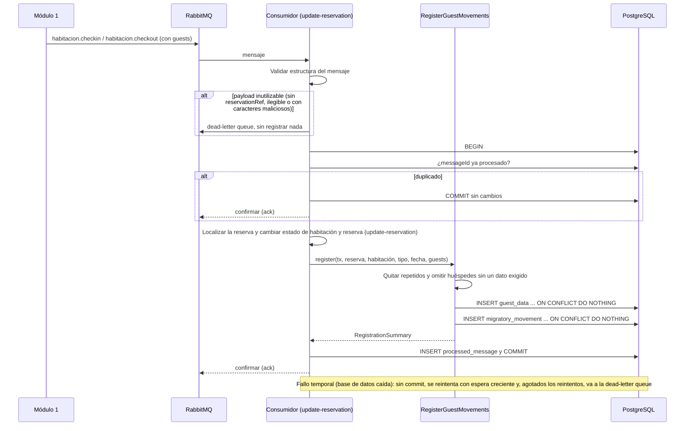
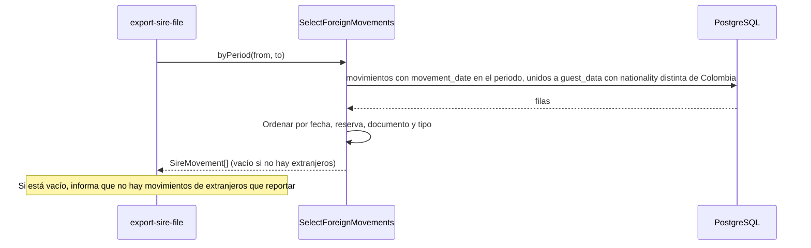
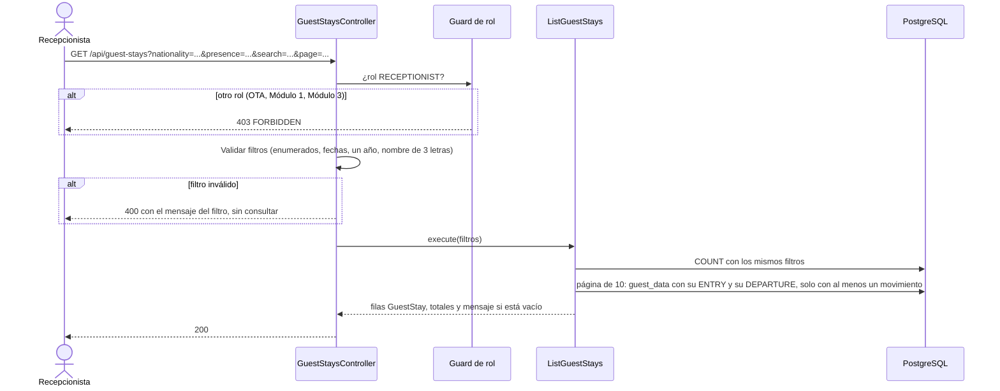

# Implementation Plan: Procesar datos de huéspedes (`process-guest-data`)

**Plan base**: [../base/plan.md](../base/plan.md)
**Spec**: [./spec.md](spec.md)
**Guía**: [../base/guia-planes-por-caso-de-uso.md](../base/guia-planes-por-caso-de-uso.md)

## Summary

La ley exige reportar a Migración Colombia a los huéspedes extranjeros. El Módulo 1 captura los datos en
persona y los envía al Módulo 2, **ya completos y correctos**, dentro de las notificaciones de Check-In y
Check-Out de cada habitación (una lista `guests` con **todos** los huéspedes, colombianos y extranjeros).
El Módulo 2 no los captura, valida ni corrige. Este caso de uso hace tres cosas:

1. **Registra** los datos de cada huésped una sola vez por reserva (`GuestData`) y un movimiento de entrada
   o de salida (`MigratoryMovement`) por huésped, sin duplicar aunque la notificación se repita.
2. **Selecciona a los extranjeros** (nacionalidad distinta de `Colombia`) para "Exportar archivo SIRE", sin
   guardar esa marca aparte.
3. **Ofrece a la Recepcionista la vista de huéspedes alojados** (solo lectura): listado, filtros,
   búsqueda y detalle de cada huésped.

**Quién consume la cola**: según el plan base, los consumidores de `m2.habitacion.checkin.queue` y
`m2.habitacion.checkout.queue` son de `update-reservation`, que cambia el estado de la habitación y de la
reserva. Ese consumidor **llama a este caso de uso por su puerto de entrada, dentro de la misma
transacción** que el cambio de estado y que el registro del `messageId` en `processed_message`. Este plan
define esa llamada, las reglas de registro y los contratos REST de la vista; el formato exacto de los
mensajes está en el plan de `update-reservation`.

## Resumen técnico e identificación

| Dato | Valor |
|---|---|
| Caso de uso | Procesar datos de huéspedes (`process-guest-data`) |
| Spec | [spec.md](./spec.md), historias 1 a 3 y FR-001 a FR-017 |
| Actores | Módulo 1 (envía los datos, por cola); Recepcionista (vista de huéspedes alojados); `update-reservation` (consumidor); `export-sire-file` (consume la selección) |
| Naturaleza | Escribe `guest_data` y `migratory_movement` (inmutables) y lee para la vista y el SIRE |

| # | Capacidad | Disparador | Actor | Contrato |
|---|---|---|---|---|
| 1 | Registrar los huéspedes de un Check-In o Check-Out | Llamada interna dentro de la transacción del consumidor | `update-reservation` (mensaje del Módulo 1) | B1 |
| 2 | Seleccionar movimientos de extranjeros | Llamada interna | `export-sire-file` | B2 |
| 3 | Listado de huéspedes alojados | REST `GET /api/guest-stays` | Recepcionista | C1 |
| 4 | Detalle de un huésped | REST `GET /api/reservations/{reservationRef}/guests/{documentNumber}` | Recepcionista | C2 |

## Technical Context

El stack, la arquitectura hexagonal y el manejo de errores son los del [plan base](../base/plan.md).
Lo propio de este caso de uso:

- **Dependencias nuevas**: ninguna. La búsqueda por nombre usa las extensiones `unaccent` y `pg_trgm` que
  ya crea la migración base.
- **Almacenamiento**: `guest_data` y `migratory_movement` (ya definidas en el plan base).
- **Performance**: registrar una notificación con hasta 10 huéspedes en menos de 500 ms (NFR-001); una
  página de la vista en menos de 1 s con 50 000 movimientos (NFR-003).
- **Privacidad** (NFR-002): el documento y la fecha de nacimiento **nunca** se escriben en los logs.

## Contratos

### A. Mensajes del Módulo 1 (los define y consume `update-reservation`)

| Cola | Routing key | Qué trae |
|---|---|---|
| `m2.habitacion.checkin.queue` | `habitacion.checkin` | `messageId`, `sequenceNumber`, `reservationRef`, `roomId`, `movementType` `ENTRY`, `movementDate` (`checkInDate`) y `guests` |
| `m2.habitacion.checkout.queue` | `habitacion.checkout` | Lo mismo con `movementType` `DEPARTURE` y `movementDate` (`checkOutDate`) |

Cada huésped de `guests` trae `firstName`, `lastName`, `documentType` (`RC`, `TI`, `CC`, `CE`, `PAS` o
`NIT`), `documentNumber`, `birthDate` y `nationality` (nombre del país; un colombiano se escribe
exactamente `Colombia`); `originPlace` y `destinationPlace` solo son obligatorios para extranjeros. El
`movementType` y el `movementDate` van a nivel de mensaje y valen para todos los huéspedes de la lista.
El JSON exacto está en [`update-reservation/plan.md`](../update-reservation/plan.md).

### B. Puertos de entrada internos

**B1. Registrar los huéspedes de una notificación** (`RegisterGuestMovements`):

```typescript
interface GuestPayload {
  firstName: string; lastName: string; documentType: string; documentNumber: string;
  birthDate: string; nationality: string; originPlace?: string; destinationPlace?: string;
}

interface RegisterGuestMovementsCommand {
  reservationId: string;                 // la reserva ya fue localizada por quien llama
  roomId: string;
  movementType: 'ENTRY' | 'DEPARTURE';
  movementDate: string;                  // AAAA-MM-DD
  guests: GuestPayload[];
}

interface RegistrationSummary {
  received: number;                      // huéspedes únicos en la lista
  registered: number;                    // movimientos nuevos creados
  alreadyRegistered: number;             // ya existían (reenvío o cambio de habitación)
  foreign: number;                       // extranjeros entre los recibidos
  skipped: number;                       // omitidos por faltarles un dato que la base exige
}

interface RegisterGuestMovements {
  register(tx: Transaction, command: RegisterGuestMovementsCommand): Promise<RegistrationSummary>;
}
```

- **Corre dentro de la transacción del consumidor**: recibe la transacción abierta y no hace `commit`.
- El `RegistrationSummary` se lo devuelve a `update-reservation`, que lo usa para su respuesta de log y,
  si se acuerda, para los conteos por habitación (ver "Puntos abiertos").

**B2. Seleccionar extranjeros para el SIRE** (`SelectForeignMovements`, la usa `export-sire-file`):

```typescript
interface SireMovement {
  movementId: string;
  reservationRef: string;
  movementType: 'ENTRY' | 'DEPARTURE';
  movementDate: string;
  guest: {
    firstName: string; lastName: string; documentType: string; documentNumber: string;
    birthDate: string; nationality: string; originPlace: string | null; destinationPlace: string | null;
  };
}

interface SelectForeignMovements {
  byPeriod(from: string, to: string): Promise<SireMovement[]>;        // FR-008
  byMovementId(movementId: string): Promise<SireMovement | null>;     // exportación de un movimiento individual
}
```

- `byPeriod` filtra por la **`movementDate` del movimiento** (decisión D7), con `from` y `to` incluidos.
- Devuelve **solo extranjeros**; los movimientos de colombianos se conservan pero no se entregan.
- Orden estable para el archivo: `movementDate`, `reservationRef`, `documentNumber` y `movementType`
  (`ENTRY` antes que `DEPARTURE`). Un periodo sin extranjeros devuelve `[]`; `export-sire-file` informa que
  no hay nada que reportar.
- Sin ningún dato modificado ni completado (SC-002).

### C. REST del Módulo 2: vista de huéspedes alojados

Roles: solo `RECEPTIONIST`. La `OTA`, el Módulo 1 y el Módulo 3 reciben **403** (escenario 9 de la
historia 3). Sin token, 401.

**C1. `GET /api/guest-stays`**

| Parámetro | Tipo | Obligatorio | Regla |
|---|---|---|---|
| `nationality` | `ALL` \| `FOREIGN` \| `COLOMBIAN` | No | Por defecto `ALL` |
| `presence` | `ALL` \| `IN_HOTEL` \| `CHECKED_OUT` | No | `IN_HOTEL`: con entrada y sin salida; `CHECKED_OUT`: con salida |
| `dateFrom`, `dateTo` | `AAAA-MM-DD` | Ambos o ninguno | Rango inclusivo, máximo un año (366 días) |
| `search` | texto | No | Con al menos un dígito: `documentNumber` exacto; sin dígitos: nombre o apellido parcial, mínimo 3 caracteres, sin distinguir mayúsculas ni tildes |
| `page` | entero ≥ 1 | No | Por defecto `1`; tamaño fijo de 10 |

**Respuesta 200**

```json
{
  "items": [
    {
      "reservationRef": "RSV-3F9A1C7B",
      "guest": {
        "firstName": "John", "lastName": "Smith",
        "documentType": "PAS", "documentNumber": "X99",
        "nationality": "Estados Unidos", "isForeign": true
      },
      "entryDate": "2026-10-09",
      "exitDate": null,
      "inHotel": true
    }
  ],
  "page": 1,
  "pageSize": 10,
  "totalItems": 1,
  "totalPages": 1,
  "message": null
}
```

- **Una fila por huésped y reserva** (`GuestStay`): un huésped con varias estadías aparece varias veces.
- Orden: `entryDate` de la más reciente a la más antigua; las filas sin entrada (solo salida) se ordenan
  por su `exitDate`.
- `exitDate` es `null` y `inHotel` es `true` cuando no tiene salida (la pantalla muestra "En el hotel").
- Solo aparecen huéspedes **con al menos un movimiento**: las reservas `CANCELLED`, `NO_SHOW`, `PENDING` o
  `ACTIVE` sin Check-In no tienen huéspedes aquí (FR-016).
- Sin resultados: `200` con `items: []`, `totalItems: 0` y
  `message: "No hay huéspedes que coincidan con los filtros."`.
- Una página que no existe se ajusta a la última válida.
- Es **solo lectura**: no hay ninguna ruta para crear, editar o borrar.

**Errores 400** (validados antes de consultar):

| `errorCode` | Cuándo | `message` |
|---|---|---|
| `INVALID_NATIONALITY_FILTER` | `nationality` fuera del enumerado | "El filtro de nacionalidad no es válido." |
| `INVALID_PRESENCE_FILTER` | `presence` fuera del enumerado | "El filtro de situación no es válido." |
| `INVALID_DATE` | Fecha mal formada o inexistente | "La fecha indicada no es válida." |
| `INCOMPLETE_DATE_RANGE` | Solo una de las dos fechas | "Debe completar ambas fechas del rango." |
| `INVALID_DATE_RANGE` | `dateFrom` posterior a `dateTo` | "La fecha inicial no puede ser posterior a la fecha final." |
| `DATE_RANGE_TOO_LARGE` | Más de un año | "El rango de fechas no puede superar un año." |
| `NAME_SEARCH_TOO_SHORT` | Nombre de menos de 3 caracteres | "La búsqueda por nombre requiere al menos 3 caracteres." |
| `INVALID_SEARCH` | Búsqueda vacía o con caracteres no permitidos | "La búsqueda no es válida." |
| `INVALID_PAGE` | `page` menor que 1 | "El número de página debe ser 1 o mayor." |

**C2. `GET /api/reservations/{reservationRef}/guests/{documentNumber}`**: detalle de un huésped en una
reserva.

```json
{
  "reservationRef": "RSV-3F9A1C7B",
  "reservationLink": "/api/reservations/RSV-3F9A1C7B",
  "guest": {
    "documentType": "PAS", "documentNumber": "X99",
    "firstName": "John", "lastName": "Smith", "birthDate": "1990-05-12",
    "nationality": "Estados Unidos", "isForeign": true,
    "originPlace": "Miami, Estados Unidos", "destinationPlace": "Cartagena, Colombia"
  },
  "movements": [
    { "movementType": "ENTRY", "movementDate": "2026-10-09" },
    { "movementType": "DEPARTURE", "movementDate": "2026-10-12" }
  ]
}
```

- Lo vacío (por ejemplo `originPlace` de un colombiano) viaja `null`; la pantalla muestra una raya "—".
- `movements` va ordenado por fecha; puede traer solo la entrada o solo la salida.
- Huésped o reserva inexistente (o sin movimientos): `400` `GUEST_NOT_FOUND`, "El huésped no existe en esa
  reserva." (regla del plan base: los recursos inexistentes son 400).
- `reservationRef` o `documentNumber` con formato inválido: `400` `INVALID_RESERVATION_CODE`, "Debe
  proveer un código de reserva válido para la consulta." (el mismo de `check-view-reservation`).

## Reglas de registro (B1)

Orden de las operaciones de `register`, todo en la transacción del llamador:

1. **Validar la estructura** de la notificación (ver "Errores"). Si es inutilizable, se rechaza **antes**
   de registrar nada.
2. **Quitar repetidos**: si el mismo `documentNumber` viene dos veces en la lista, se procesa una vez
   (el primero).
3. **Omitir** (y registrar una alerta sin datos personales) al huésped al que le falte un campo que la
   base exige (`documentType`, `documentNumber`, `firstName`, `lastName`, `birthDate`, `nationality`). No
   afecta a los demás huéspedes (FR-007, SC-004).
4. **Guardar los datos** de los demás con una sola sentencia
   `INSERT INTO guest_data … ON CONFLICT (reservation_id, document_number) DO NOTHING`: si el huésped ya
   existe en esa reserva (Check-Out, o cambio de habitación) **no se modifica** (FR-017).
5. **Registrar el movimiento** con
   `INSERT INTO migratory_movement … ON CONFLICT (guest_data_id, movement_type) DO NOTHING`: un solo
   `ENTRY` y un solo `DEPARTURE` por huésped y reserva, aunque la notificación se repita o el huésped
   cambie de habitación (FR-005).
6. **Devolver el `RegistrationSummary`**.

- **El tipo de movimiento y la fecha vienen del mensaje** y valen para todos los huéspedes de la lista.
- **Extranjero** = `nationality` distinta de `Colombia` (comparación exacta). Esa marca **no se guarda**:
  se deduce al consultar. Una nacionalidad vacía no se trata como extranjera.
- **`DEPARTURE` sin `ENTRY`**: el spec dice que no debería ocurrir. Como el mensaje trae todos los datos
  del huésped, se crea su `GuestData` y se registra el `DEPARTURE`, con un aviso en el log (ver "Puntos
  que este plan propone").
- **Titular**: un movimiento es del titular cuando el documento del huésped coincide con el del `Guest`
  de la reserva; se obtiene al consultar, no se guarda.
- **Cada estadía tiene sus movimientos**: una notificación nueva nunca sobrescribe los de otra reserva.
- **Idempotencia en dos niveles**: el `messageId` en `processed_message` (lo hace el consumidor) y las
  restricciones únicas, que protegen incluso si dos habitaciones de la misma reserva llegan a la vez.

## Diagramas de secuencia

### D1. Check-In o Check-Out de una habitación (historia 1)



### D2. Selección de extranjeros para el SIRE (historia 2)



### D3. Listado de huéspedes alojados (historia 3, escenarios 1 a 9)



## Modelo de datos y entidades involucradas

**No se crean tablas**: se usan `guest_data` y `migratory_movement` del plan base.

| Tabla | Uso | Notas |
|---|---|---|
| `guest_data` | Escritura (una vez) y lectura | Único `(reservation_id, document_number)`, sin el tipo de documento; sin `updated_at`: no se modifica |
| `migratory_movement` | Escritura (una vez) y lectura | Único `(guest_data_id, movement_type)`; índice `(movement_date)` para el periodo del SIRE |
| `reservation` y `guest` | Lectura | La reserva para el enlace y el titular (documento que coincide con el `Guest`) |
| `processed_message` | Lo escribe el consumidor | Idempotencia por `messageId`, en la misma transacción |

- **`GuestStay` es derivada y no se guarda**: una fila por `guest_data`, con su `ENTRY` y su `DEPARTURE`.
- **Los datos personales no se copian** en los movimientos: se obtienen del `guest_data`.
- **Los registros son inmutables**: este caso de uso no hace `UPDATE` ni `DELETE`.

**Migraciones que este plan necesita** (SQL, decisión D11):

| Qué | Para qué |
|---|---|
| Columna generada `document_number_normalized` en `guest_data` (mayúsculas, sin puntos ni espacios) e índice sobre ella | Documento exacto en la vista, igual que en `check-view-reservation` |
| Índice `migratory_movement(guest_data_id)` | Unir la entrada y la salida de cada huésped (ya cubierto por el único `(guest_data_id, movement_type)`) |

**Estados y transiciones**: este caso de uso no cambia `Reservation.status` ni `stayStatus`; los cambia
`update-reservation` en la misma transacción. El único ciclo es el del movimiento:

```text
(sin movimiento) --Check-In--> ENTRY --Check-Out--> ENTRY + DEPARTURE   (no se modifica ninguno)
```

### Consulta de la vista (resumen)

```sql
SELECT gd.*, r.reservation_ref,
       e.movement_date AS entry_date, d.movement_date AS exit_date
FROM guest_data gd
JOIN reservation r ON r.id = gd.reservation_id
LEFT JOIN migratory_movement e ON e.guest_data_id = gd.id AND e.movement_type = 'ENTRY'
LEFT JOIN migratory_movement d ON d.guest_data_id = gd.id AND d.movement_type = 'DEPARTURE'
WHERE (e.id IS NOT NULL OR d.id IS NOT NULL)              -- FR-016: solo con movimientos
  AND /* filtros de nacionalidad, situación, periodo y búsqueda */
ORDER BY COALESCE(e.movement_date, d.movement_date) DESC, r.reservation_ref, gd.document_number
LIMIT 10 OFFSET :offset;
```

- **Periodo**: la estadía del huésped va de su `entryDate` a su `exitDate` (sin salida, queda abierta
  hasta hoy); se muestra si ese intervalo se cruza con el rango (ver "Puntos que este plan propone").
- **Búsqueda por nombre** con `unaccent(lower(first_name || ' ' || last_name))` y el índice trigram del
  plan base.

## Reglas de validación y manejo de errores

### Notificaciones de la cola (no hay cliente HTTP)

El spec habla de "HTTP 200 / 400". Como el Módulo 1 publica por cola y no espera respuesta, se aplica la
traducción del plan base:

| Caso del spec | Comportamiento |
|---|---|
| Registro correcto (200) | Se registra y se confirma el mensaje; el Check-In o el Check-Out se conserva (FR-006) |
| Notificación repetida (200 idempotente) | Se confirma sin duplicar ni modificar nada |
| Payload sin `reservationRef`, sin `roomId`, sin `guests`, de formato ilegible o con caracteres maliciosos (400) | A la dead-letter queue, **sin registrar nada**; log sin datos personales: "Caracteres no válidos en los datos de los huéspedes." o "Payload inválido." |
| Reserva inexistente o en un estado que no admite el evento | Lo decide `update-reservation` (log y confirmación, sin reintento) |
| Un huésped al que le falta un dato que la base exige | Se **omite solo a ese huésped**, se registra una alerta y se procesa el resto |
| Fallo temporal (base de datos caída, por ejemplo) | Sin `commit`, reintento con espera creciente y, agotados, dead-letter queue (el reproceso es seguro: es idempotente) |

**Validación de estructura** (antes de registrar): `reservationRef` con formato `RSV-` y 8 caracteres
hexadecimales; `roomId` UUID; `movementType` coherente con la cola (`ENTRY` en Check-In, `DEPARTURE` en
Check-Out); `movementDate` con fecha real; `guests` como lista no vacía; y ninguna cadena con caracteres
de control ni con los símbolos `< > { } \ ; ` ni la secuencia `--` (los apóstrofes y guiones sencillos de
los nombres sí se permiten). Esto es **seguridad del payload**, no validación de contenido: no se revisa
si el nombre o el documento "son correctos" (FR-004).

### REST (vista de huéspedes alojados)

Todo error sale con `{ "errorCode", "message", "timestamp", "path" }` y **siempre 4xx**; nunca 500.

| Situación | HTTP | `errorCode` |
|---|---|---|
| Sin token o token inválido | 401 | `UNAUTHENTICATED` |
| Rol distinto de `RECEPTIONIST` (OTA, Módulo 1, Módulo 3) | 403 | `FORBIDDEN` |
| Filtros inválidos | 400 | Los de la tabla de C1 |
| Huésped o reserva inexistente | 400 | `GUEST_NOT_FOUND` |
| Excepción inesperada | 400 | `REQUEST_NOT_PROCESSED` |

## Integraciones externas

| Módulo | Dirección | Mecanismo | Contrato | Fallo |
|---|---|---|---|---|
| Módulo 1 | M1 → M2 | Colas `m2.habitacion.checkin.queue` y `m2.habitacion.checkout.queue` | Plan de `update-reservation` | Reintentos con espera creciente y dead-letter queue; sin respuesta al Módulo 1 |

- Este caso de uso **no llama a ningún módulo de forma síncrona**. No publica mensajes.
- **No devuelve nada al Módulo 1** (FR-004): ni los datos incompletos ni errores de contenido.
- No usa `Module1Port` ni `Module3Port`.

## Arquitectura (capas del plan base)

| Capa | Piezas de este caso de uso |
|---|---|
| `domain/migration/` | `GuestData`, `MigratoryMovement`, `isForeign(nationality)`, `deriveGuestStay` |
| `application/use-cases/process-guest-data/` | **Entrada**: `RegisterGuestMovements`, `SelectForeignMovements`, `ListGuestStays`, `GetGuestStayDetail`; validador de estructura y saneador del payload |
| `application/ports/out/` | `GuestDataRepository`, `MigratoryMovementRepository`, `GuestStayQuery` (solo lectura) |
| `infrastructure/in/rest/` | `GuestStaysController` (C1 y C2) |
| `infrastructure/out/persistence/` | Repositorios con `INSERT … ON CONFLICT DO NOTHING` y la consulta de la vista |

```text
backend/src/
├── domain/migration/
│   ├── guest-data.ts
│   ├── migratory-movement.ts
│   ├── is-foreign.ts
│   └── guest-stay.ts
├── application/use-cases/process-guest-data/
│   ├── ports/in/
│   ├── register-guest-movements.service.ts
│   ├── select-foreign-movements.service.ts
│   ├── list-guest-stays.service.ts
│   ├── get-guest-stay-detail.service.ts
│   ├── guest-payload.validator.ts          # estructura y caracteres no permitidos
│   └── guest-stay-filters.validator.ts
├── infrastructure/in/rest/guest-stays.controller.ts
└── infrastructure/out/persistence/
    ├── guest-data.repository.ts
    ├── migratory-movement.repository.ts
    └── guest-stay.query.ts
backend/test/
├── unit/process-guest-data/                 # isForeign, deduplicación, saneador, filtros
├── integration/process-guest-data/          # Testcontainers: registro, SIRE, vista
└── contract/                                # forma de los mensajes (con update-reservation)
frontend/src/pages/guest-stays/              # vista de huéspedes alojados y su detalle
```

## Phase 1: Setup

- [ ] T001 Migración SQL: columna generada `document_number_normalized` de `guest_data` e índice

## Phase 2: Foundational

- [ ] T002 [P] Entidades de dominio `GuestData` y `MigratoryMovement`, y funciones `isForeign` y `deriveGuestStay`, con pruebas unitarias
- [ ] T003 [P] Validador de estructura y saneador del payload (caracteres no permitidos, formatos), con pruebas unitarias
- [ ] T004 `GuestDataRepository` y `MigratoryMovementRepository` con `INSERT … ON CONFLICT DO NOTHING`
- [ ] T005 Códigos de error de la vista (`INVALID_NATIONALITY_FILTER`, `INVALID_PRESENCE_FILTER`, `INVALID_SEARCH`, `GUEST_NOT_FOUND` y los compartidos) con sus mensajes

## Phase 3: User Story 1 - Recepción de los datos de los huéspedes (P1)

**Goal**: cada huésped notificado por el Módulo 1 queda con su movimiento de entrada o de salida.
**Independent Test**: un Check-In con tres huéspedes (dos extranjeros), su Check-Out y un reenvío.

- [ ] T006 [US1] `RegisterGuestMovements.register` con deduplicación, omisión por dato faltante y los dos `INSERT` idempotentes
- [ ] T007 [US1] `RegistrationSummary` y el aviso de un `DEPARTURE` sin `ENTRY`
- [ ] T008 [US1] Rechazo del payload inutilizable antes de registrar y traducción a dead-letter queue (con `update-reservation`)
- [ ] T009 [US1] Pruebas de integración de los escenarios 1 a 5 (incluido el 3a) y de los casos borde: huésped repetido, más huéspedes que el `guestCount`, cambio de habitación, otra estadía del mismo huésped, nacionalidad vacía
- [ ] T010 [US1] Prueba de concurrencia: dos habitaciones de la misma reserva con el mismo huésped, sin duplicados
- [ ] T011 [US1] Coordinar con el plan de `update-reservation` la llamada dentro de la transacción y el `processed_message`

## Phase 4: User Story 2 - Selección de extranjeros para el SIRE (P2)

- [ ] T012 [US2] `SelectForeignMovements.byPeriod` y `byMovementId`, con el orden estable
- [ ] T013 [US2] Pruebas de los escenarios 1 y 2: tres extranjeros y dos colombianos entregan solo los tres; periodo sin extranjeros devuelve vacío
- [ ] T014 [US2] Coordinar con el plan de `export-sire-file` el uso de `SireMovement`

## Phase 5: User Story 3 - Consulta de huéspedes alojados (P2)

- [ ] T015 [US3] `ListGuestStays` y `GET /api/guest-stays` (C1): filtros, búsqueda, orden, paginación y mensaje vacío
- [ ] T016 [US3] `GetGuestStayDetail` y C2, con el enlace a la reserva
- [ ] T017 [US3] Guard de rol (403 para otros actores) y validadores de filtros
- [ ] T018 [US3] Pruebas de los escenarios 1 a 9
- [ ] T019 [P] [US3] Frontend: vista de huéspedes alojados y su detalle (pantalla de referencia en el wireframe)

## Phase N: Polish

- [ ] T020 Verificar que ningún log escribe documento ni fecha de nacimiento (NFR-002)
- [ ] T021 Pruebas de tiempo: registrar 10 huéspedes en menos de 500 ms y una página de la vista con 50 000 movimientos en menos de 1 s
- [ ] T022 Documentar C1 y C2 en OpenAPI (`@nestjs/swagger`)

## Pruebas por escenario

| Historia | Escenario | Qué se verifica |
|---|---|---|
| US1 | 1 entrada de los huéspedes | Un `ENTRY` por huésped, colombiano o extranjero |
| US1 | 2 grupo mixto | Tres movimientos `ENTRY` y solo dos huéspedes reconocidos como extranjeros |
| US1 | 3 y 3a salida | Un `DEPARTURE` por huésped, un solo `GuestData` por huésped, `ENTRY` intacto y datos sin modificar aunque el Check-Out traiga datos distintos |
| US1 | 4 solo colombianos | Se registran, pero ninguno entra a la selección del SIRE |
| US1 | 5 notificación repetida | El mismo mensaje dos veces: sin duplicados ni cambios |
| US1 | Casos borde | Payload sin `reservationRef` y con caracteres maliciosos: dead-letter queue y nada registrado; huésped sin un dato exigido: se omite y los demás se registran |
| US2 | 1 selección | Tres extranjeros y dos colombianos: se entregan los tres, con tipo y fecha |
| US2 | 2 sin extranjeros | Lista vacía |
| US3 | 1 listado | Página de 10, ordenada por entrada descendente, con "En el hotel" para los sin salida |
| US3 | 2 y 3 y 4 filtros | Nacionalidad, situación y periodo (estadía que se cruza con el rango) |
| US3 | 5 búsqueda | Documento exacto y nombre parcial sin tildes ni mayúsculas |
| US3 | 6 detalle | Todos los datos, vacíos como `null`, enlace a la reserva y movimientos |
| US3 | 7 sin resultados | `200`, lista vacía y el mensaje del spec |
| US3 | 8 filtros inválidos | Un caso por fila de la tabla de errores de C1, sin consultar |
| US3 | 9 otros actores | OTA, Módulo 1 y Módulo 3: `403` |
| FR-016 | Reservas sin Check-In | `CANCELLED`, `NO_SHOW`, `PENDING` y `ACTIVE` sin ingreso: sus huéspedes no aparecen |
| NFR-001, NFR-003 | Tiempo | 10 huéspedes en menos de 500 ms; una página con 50 000 movimientos en menos de 1 s |

## Dependencies & Execution Order

- **Depende de**: el plan base (esquema de `guest_data` y `migratory_movement`, mensajería, roles).
- **Se integra con**: `update-reservation` (consumidor de las colas, que llama a `RegisterGuestMovements`)
  y `export-sire-file` (consume `SelectForeignMovements`). Los tres deben acordar la transacción única.
- **Orden**: T001–T005 → US1 (T006–T011) → US2 (T012–T014) → US3 (T015–T019) → Polish. Va antes de
  `update-reservation` y de `export-sire-file`.

## Trazabilidad: requisito → componente → tarea

| Requisito | Componente | Tarea |
|---|---|---|
| FR-001 | Mensajes del Módulo 1 y `RegisterGuestMovements` | T006, T011 |
| FR-002 | `INSERT` de `guest_data` y de `migratory_movement` | T004, T006 |
| FR-003 | `isForeign` | T002 |
| FR-004 | Sin validar contenido ni devolver nada al Módulo 1 | T003, T006 |
| FR-005, FR-017 | Restricciones únicas y `ON CONFLICT DO NOTHING` | T004, T006, T009 |
| FR-006 | Conservar el Check-In o Check-Out | T008, T011 |
| FR-007 | Procesar cada huésped por separado (omisión individual) | T006 |
| FR-008 | `SelectForeignMovements` | T012 |
| FR-009, FR-015 | Vista solo de lectura y guard de rol | T015, T017 |
| FR-010 | Validación y saneo del payload | T003, T008 |
| FR-011, FR-012, FR-013 | `ListGuestStays`, C1, filtros y paginación | T015 |
| FR-014 | `GetGuestStayDetail`, C2 | T016 |
| FR-016 | `WHERE` con al menos un movimiento | T015, T018 |
| NFR-001, NFR-003 | Inserciones por lotes e índices | T001, T021 |
| NFR-002 | Logs sin datos personales | T020 |
| SC-001 a SC-005 | Pruebas por escenario | T009, T013, T018 |

## Puntos que este plan propone (el spec no los dice)

1. **Quién consume la cola**: `update-reservation`. Este caso de uso expone el puerto `RegisterGuestMovements`
   y no tiene consumidor propio.
2. **`DEPARTURE` sin `ENTRY`**: se crea el `GuestData` con los datos del mensaje y se registra el
   `DEPARTURE`, con un aviso. El spec dice que "no debería ocurrir" y no define qué hacer.
3. **Omitir al huésped al que le falta un dato que la base exige**, con alerta, en lugar de fallar toda
   la notificación (SC-004). Es una defensa de la base de datos, no una validación de contenido.
4. **Conjunto de caracteres no permitidos** en el saneo del payload.
5. **Periodo de la vista**: el intervalo de la estadía es de `entryDate` a `exitDate` (abierto si no hay
   salida); el spec dice solo "la estadía se cruza con el rango".
6. **Mensajes y códigos** de los filtros inválidos de la vista (el spec pide "el mensaje del filtro
   inválido" sin literales) y `GUEST_NOT_FOUND`.
7. **`GET /api/guest-stays` ordena las filas sin entrada por su fecha de salida.**
8. **Extranjero = nacionalidad distinta de `Colombia`, comparación exacta**; una vacía no es extranjera.

## Puntos abiertos

| # | Pendiente | Con quién |
|---|---|---|
| 1 | **Conteos por habitación**: `check-view-reservation` (FR-006) muestra cuántos huéspedes registró el Módulo 1 en el Check-In y el Check-Out de **cada habitación**, y cuántos son extranjeros. El modelo del plan base guarda los huéspedes por reserva, sin `room_id`, así que no se pueden derivar. Opción: guardar esos conteos en `reservation_room` (por ejemplo `check_in_guest_count` y `check_in_foreign_guest_count`, y los de Check-Out) a partir del `RegistrationSummary`. Requiere cambiar el plan base | Equipo del Módulo 2 |
| 2 | Transacción única entre `update-reservation` (estado y `processed_message`) y este caso de uso: confirmarlo en el plan de `update-reservation` | Equipo del Módulo 2 |
| 3 | El spec exige que el Módulo 2 **no valide** los datos, pero la base tiene columnas obligatorias: confirmar que omitir al huésped incompleto es aceptable | Equipo del Módulo 2 |
| 4 | Tamaño máximo de un mensaje (cantidad de huéspedes) para protegerse de payloads desmedidos | Módulo 1 |
| 5 | Si la nacionalidad llega con otra escritura ("COLOMBIA", "colombiana"), hoy se trataría como extranjera. Confirmar con el Módulo 1 que siempre envía `Colombia` | Módulo 1 |

## Notes

- `[P]` marca tareas paralelizables; `[US1]`, `[US2]` y `[US3]` las ligan a su historia de usuario.
- Commit por tarea o grupo lógico, con Gitflow.
- Este plan no modifica el spec ni el plan base.
