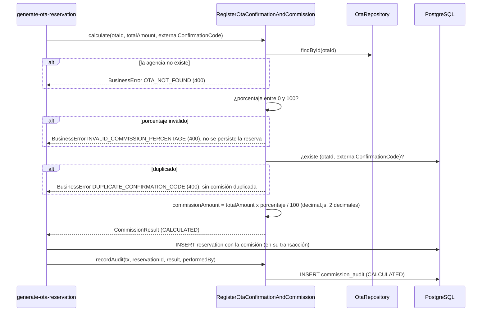
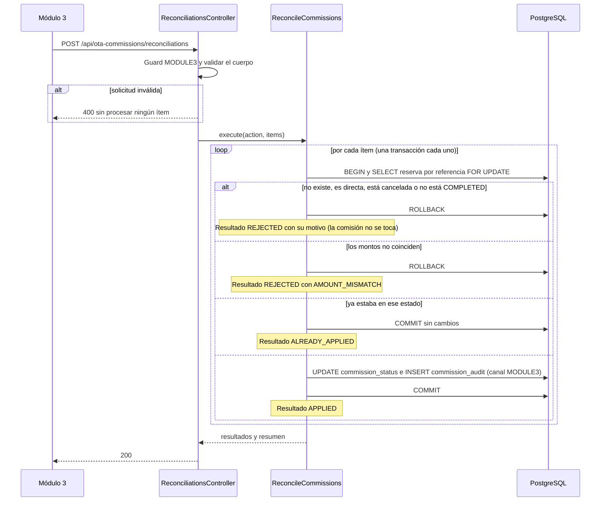
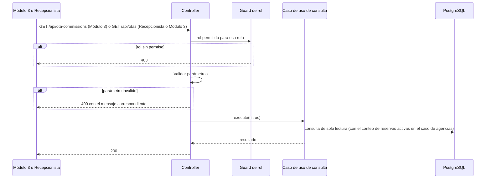

# Implementation Plan: Registrar confirmación y comisión de OTA (`register-ota-information-commission`)

**Plan base**: [../base/plan.md](../base/plan.md)
**Spec**: [./spec.md](spec.md)
**Guía**: [../base/guia-planes-por-caso-de-uso.md](../base/guia-planes-por-caso-de-uso.md)

## Summary

Cada reserva de una OTA trae una obligación con la agencia: una comisión pactada sobre el valor bruto de
la estadía. Este caso de uso hace cuatro cosas:

1. **Calcula y registra la comisión** de cada reserva OTA nueva, al registrarla
   (`generate-ota-reservation` lo llama): `commissionAmount = totalAmount × commissionPercentage / 100`,
   con precisión decimal exacta, y estado inicial `CALCULATED`. Rechaza un código de confirmación repetido
   para la misma agencia y un porcentaje fuera de 0 a 100.
2. **Concilia comisiones con el Módulo 3** (finanzas): el Módulo 3 consulta las comisiones de un periodo y
   le indica al Módulo 2 cuáles pasan a `RECONCILED` o `PAID`. La Recepcionista no concilia.
3. **Consulta de agencias** (solo lectura): `GET /api/otas` y `GET /api/otas/{otaId}` para la pantalla de
   agencias de la Recepcionista y para el Módulo 3.
4. **Registro y estado de la OTA**: nombre, cuenta del hotel, comisión pactada, `connectionStatus` y
   `lastSyncAt`, que los administra el sistema a partir de los mensajes de la OTA.

**Alcance del punto 4**: el plan base deja para un caso de uso futuro, **"Configurar OTA"**, definir por
qué rutas la OTA se registra, actualiza sus datos y avisa su desvinculación. Este plan implementa las
**reglas y los servicios internos** de esa historia (validaciones, estados, `lastSyncAt`), pero **no
define las rutas** que la OTA usará para llamarlos.

La comisión de una reserva **cancelada por la OTA no se toca** (FR-007): la agencia ya sabe que no la
cobrará.

## Resumen técnico e identificación

| Dato | Valor |
|---|---|
| Caso de uso | Registrar confirmación y comisión de OTA (`register-ota-information-commission`) |
| Spec | [spec.md](./spec.md), historias 1 a 3 y FR-001 a FR-010 |
| Actores | `generate-ota-reservation` (calcula la comisión); Módulo 3 (concilia y consulta); Recepcionista (consulta agencias); la OTA (sus datos y su conexión, a través del caso de uso futuro "Configurar OTA") |
| Naturaleza | Escribe `reservation` (campos de comisión), `ota` y `commission_audit`; lee para las consultas |

| # | Capacidad | Disparador | Actor | Contrato |
|---|---|---|---|---|
| 1 | Calcular la comisión de una reserva nueva | Llamada interna (puerto de entrada) | `generate-ota-reservation` | B1 |
| 2 | Consultar comisiones de un periodo | REST `GET /api/ota-commissions` | Módulo 3 | A1 |
| 3 | Conciliar comisiones | REST `POST /api/ota-commissions/reconciliations` | Módulo 3 | A2 |
| 4 | Consultar agencias | REST `GET /api/otas` y `GET /api/otas/{otaId}` | Recepcionista y Módulo 3 | A3 |
| 5 | Registrar o actualizar una OTA y su conexión | Llamada interna (puerto de entrada) | Caso de uso futuro "Configurar OTA" | B2 |
| 6 | Actualizar `lastSyncAt` con cada mensaje de la OTA | Llamada interna | Interceptor de la API de la OTA | B3 |

## Technical Context

El stack, la arquitectura hexagonal y el manejo de errores son los del [plan base](../base/plan.md).
Lo propio de este caso de uso:

- **Dependencias nuevas**: ninguna. El dinero y los porcentajes usan `decimal.js` (plan base).
- **Almacenamiento**: `ota`, `reservation` (campos de comisión) y `commission_audit` (plan base).
- **Configuración**: `RECONCILIATION_MAX_ITEMS` (por defecto `500`).
- **Performance**: cálculo y registro de la comisión en menos de 1 s (NFR-001, SC-005).

## Contratos

### A. REST del Módulo 2

Roles: `RECEPTIONIST`, `MODULE3` (servicio a servicio) y `OTA`. **Cabeceras**:
`Authorization: Bearer <JWT>`, `Content-Type: application/json`. Sin token, 401; con un rol sin permiso, 403.

**A1. `GET /api/ota-commissions`** (solo `MODULE3`): comisiones de las reservas OTA de un periodo.

| Parámetro | Tipo | Obligatorio | Regla |
|---|---|---|---|
| `dateFrom`, `dateTo` | `AAAA-MM-DD` | Sí, ambos | Rango inclusivo sobre la **`endDate`** de la reserva; máximo 366 días |
| `commissionStatus` | `CALCULATED` \| `RECONCILED` \| `PAID` \| `DISPUTED` | No | Sin valor: todos |
| `reservationStatus` | `ReservationStatus` | No | Por ejemplo `COMPLETED` |
| `otaId` | id | No | Una agencia |
| `page` | entero ≥ 1 | No | Por defecto `1`; tamaño fijo de 100 |

**Respuesta 200**

```json
{
  "items": [
    {
      "reservationRef": "RSV-8D02E5A4",
      "otaId": "uuid",
      "otaName": "Booking.com",
      "externalConfirmationCode": "4417829013",
      "status": "COMPLETED",
      "startDate": "2026-10-10",
      "endDate": "2026-10-12",
      "grossAmount": { "amount": "400.00", "currency": "COP" },
      "commissionPercentage": "15.00",
      "commissionAmount": { "amount": "60.00", "currency": "COP" },
      "commissionStatus": "CALCULATED"
    }
  ],
  "page": 1,
  "pageSize": 100,
  "totalItems": 1,
  "totalPages": 1
}
```

- Solo reservas de canal `OTA`. Sin resultados: `200` con `items: []`.
- Los importes van como **texto decimal**; los porcentajes, de `0.00` a `100.00`.

**A2. `POST /api/ota-commissions/reconciliations`** (solo `MODULE3`): el Módulo 3 le indica al Módulo 2 qué
comisiones pasan a `RECONCILED` o `PAID`.

```json
{
  "action": "RECONCILED",
  "items": [
    {
      "reservationRef": "RSV-8D02E5A4",
      "grossAmount": "400.00",
      "commissionAmount": "60.00"
    }
  ]
}
```

- `action`: `RECONCILED` o `PAID`.
- `items`: entre 1 y `RECONCILIATION_MAX_ITEMS`. Cada uno trae la referencia y los importes que el
  Módulo 3 concilió. **El Módulo 2 confirma la coincidencia de montos** con los guardados antes de cambiar
  el estado.

**Respuesta 200** (cada ítem se procesa por separado):

```json
{
  "action": "RECONCILED",
  "results": [
    { "reservationRef": "RSV-8D02E5A4", "result": "APPLIED", "commissionStatus": "RECONCILED", "reason": null },
    { "reservationRef": "RSV-1A2B3C4D", "result": "REJECTED", "commissionStatus": "CALCULATED", "reason": "AMOUNT_MISMATCH" }
  ],
  "summary": { "applied": 1, "alreadyApplied": 0, "rejected": 1 }
}
```

`result` es `APPLIED`, `ALREADY_APPLIED` (la comisión ya estaba en ese estado: reenvío idempotente) o
`REJECTED` con su `reason`:

| `reason` | Cuándo |
|---|---|
| `RESERVATION_NOT_FOUND` | La referencia no existe |
| `NOT_OTA_RESERVATION` | La reserva es de canal directo |
| `RESERVATION_CANCELLED` | La reserva está `CANCELLED`: su comisión no se toca (FR-007) |
| `RESERVATION_NOT_COMPLETED` | La reserva no está `COMPLETED` (solo se concilian las que finalizaron su estadía) |
| `AMOUNT_MISMATCH` | El `grossAmount` o el `commissionAmount` enviados no coinciden con los guardados |
| `INVALID_TRANSITION` | La transición de `commissionStatus` no está permitida |

**Transiciones de `commissionStatus` permitidas**: `CALCULATED → RECONCILED`, `CALCULATED → PAID` y
`RECONCILED → PAID`. `DISPUTED` no tiene flujo definido en el spec (ver "Puntos abiertos").

**Errores 400 de la solicitud completa** (no se procesa ningún ítem):

| `errorCode` | Cuándo | `message` |
|---|---|---|
| `INVALID_RECONCILIATION_REQUEST` | Cuerpo vacío, `items` vacío o con más de `RECONCILIATION_MAX_ITEMS` | "La solicitud de conciliación no es válida." |
| `INVALID_RECONCILIATION_ACTION` | `action` distinta de `RECONCILED` o `PAID` | "La acción de conciliación no es válida." |
| `INVALID_AMOUNT` | Importe con formato inválido o negativo | "El importe no es válido." |
| `INVALID_RESERVATION_CODE` | `reservationRef` con formato inválido | "Debe proveer un código de reserva válido para la consulta." |

**Errores de A1** (`400`): `INVALID_DATE` ("La fecha indicada no es válida."), `INCOMPLETE_DATE_RANGE`
("Debe completar ambas fechas del rango."), `INVALID_DATE_RANGE` ("La fecha inicial no puede ser posterior a
la fecha final."), `DATE_RANGE_TOO_LARGE` ("El rango de fechas no puede superar 366 días."),
`INVALID_COMMISSION_STATUS` ("El estado de la comisión no es válido.") e `INVALID_STATUS` ("El estado
indicado no es válido.").

**A3. Consulta de agencias** (solo lectura): `GET /api/otas` y `GET /api/otas/{otaId}`, para `RECEPTIONIST`
y `MODULE3`.

```json
{
  "items": [
    {
      "id": "uuid",
      "name": "Booking.com",
      "hotelAccountId": "Hotel ID 8841207",
      "commissionPercentage": "15.00",
      "connectionStatus": "CONNECTED",
      "linkedAt": "2026-03-02T09:14:00-05:00",
      "lastSyncAt": "2026-10-09T07:58:00-05:00",
      "activeReservations": 3
    }
  ],
  "total": 1
}
```

- `GET /api/otas/{otaId}` devuelve un solo objeto con esos mismos campos.
- `activeReservations`: reservas de esa agencia en `PENDING`, `ACTIVE` o `IN_PROGRESS`.
- Una `Ota` desconectada **sigue apareciendo**, con `connectionStatus: DISCONNECTED`.
- No hay rutas de alta, edición ni borrado para la Recepcionista (plan base): solo lectura.
- Agencia inexistente: `400` `OTA_NOT_FOUND`, "La agencia no existe." (regla del plan base: los recursos
  inexistentes son 400).

### B. Puertos de entrada internos

**B1. Calcular la comisión de una reserva nueva** (`RegisterOtaConfirmationAndCommission`, lo usa
`generate-ota-reservation` dentro de su transacción):

```typescript
interface CommissionInput {
  otaId: string;
  totalAmount: Money;                  // valor bruto de toda la reserva, recibido de la OTA
  externalConfirmationCode: string;
}

interface CommissionResult {
  otaId: string;
  commissionPercentage: string;        // el de la agencia en este momento, de 0 a 100
  commissionAmount: Money;             // totalAmount × commissionPercentage / 100, 2 decimales, ROUND_HALF_UP
  commissionStatus: 'CALCULATED';
}

interface RegisterOtaConfirmationAndCommission {
  calculate(input: CommissionInput): Promise<CommissionResult>;
  recordAudit(tx: Transaction, reservationId: string, result: CommissionResult, performedBy: string): Promise<void>;
}
```

- `calculate` **no persiste**: valida y calcula. La reserva con sus campos de comisión la inserta quien
  llama en su transacción, y luego llama a `recordAudit`.
- **Validaciones** (en este orden): la `Ota` existe; su `commissionPercentage` está entre 0 y 100; el
  `externalConfirmationCode` no está ya registrado para esa `Ota` (FR-005).
- La reserva guarda **su propia copia** del porcentaje y del importe: un cambio posterior del porcentaje de
  la agencia **no afecta** a las reservas ya registradas.

**B2. Registrar o actualizar una OTA** (`ManageOta`, lo usará "Configurar OTA"):

```typescript
interface OtaRegistration { name: string; hotelAccountId: string; commissionPercentage: string }

interface ManageOta {
  register(data: OtaRegistration, at: Date): Promise<Ota>;                 // nace CONNECTED, linkedAt = lastSyncAt = at
  update(otaId: string, data: Partial<OtaRegistration>, at: Date): Promise<Ota>;
  markDisconnected(otaId: string, at: Date): Promise<Ota>;                  // CONNECTED → DISCONNECTED
  markConnected(otaId: string, at: Date): Promise<Ota>;                     // DISCONNECTED → CONNECTED; no cambia linkedAt
}
```

- **Validaciones** (`400`, indicando los campos inválidos): `name` o `hotelAccountId` vacíos,
  `commissionPercentage` fuera de 0 a 100, o `name` ya usado por otra `Ota`.
- Una `Ota` **nace en `CONNECTED`**, con `lastSyncAt` igual a la hora del mensaje. Volver a vincular **no
  crea** una `Ota` nueva ni cambia `linkedAt`.
- Un nuevo `commissionPercentage` **aplica solo a las reservas futuras**.
- Desvincular **no borra** la `Ota` ni modifica sus reservas (`status`, `commissionAmount` y
  `commissionStatus` se conservan).

**B3. Última sincronización** (`TouchOtaSync.touch(otaId, at)`): cada mensaje de la OTA por su API
(reserva, cambio, cancelación o aviso de conexión) actualiza `lastSyncAt` y **ningún otro dato**. Lo llama
un interceptor de la API de la OTA, no el controlador.

**Errores de B2** (cuando lo llame "Configurar OTA"; el spec pide "especificando los campos inválidos"):

| `errorCode` | Cuándo | `message` |
|---|---|---|
| `INVALID_OTA_DATA` | `name` o `hotelAccountId` vacío, o porcentaje fuera de 0 a 100 | "Datos de la agencia inválidos: {campos}." |
| `OTA_NAME_ALREADY_EXISTS` | El `name` coincide con el de otra `Ota` | "Ya existe una agencia con ese nombre." |
| `OTA_ACCOUNT_ALREADY_EXISTS` | El `hotelAccountId` ya está registrado | "Ya existe una agencia con esa cuenta del hotel." |

**Errores de B1** (llegan al cliente a través de `generate-ota-reservation`):

| `errorCode` | Cuándo | `message` |
|---|---|---|
| `INVALID_COMMISSION_PERCENTAGE` | El porcentaje de la agencia es menor que 0 o mayor que 100 | "El porcentaje de comisión no es válido." |
| `DUPLICATE_CONFIRMATION_CODE` | El `externalConfirmationCode` ya existe para esa `Ota` | "El código de confirmación ya está registrado para esta agencia." |
| `OTA_NOT_FOUND` | La `Ota` no existe | "La agencia no existe." |

## Reglas de negocio

1. **Fórmula**: `commissionAmount = totalAmount × commissionPercentage / 100`, con `decimal.js`, **dos
   decimales y redondeo `ROUND_HALF_UP`**; el valor queda positivo (el signo lo aplica el Módulo 3).
   Se calcula **una sola vez por reserva**, sobre el `totalAmount` completo, no por habitación.
   Ejemplo: `400 × 15 / 100 = 60.00`.
2. **Estado inicial** `CALCULATED`, desde el momento del registro de la reserva.
3. **Conciliación**: solo reservas OTA en `COMPLETED`, solo con los montos que coinciden, y con las
   transiciones permitidas. Cada cambio deja un registro en `commission_audit`.
4. **Reservas canceladas**: la cancelación por la OTA solo cambia `Reservation.status` a `CANCELLED`; este
   caso de uso **nunca** modifica `commissionAmount` ni `commissionStatus` por eso, y una conciliación las
   rechaza con `RESERVATION_CANCELLED`.
5. **Duplicados**: un `externalConfirmationCode` repetido para la misma `Ota` se rechaza antes de crear
   la reserva y no genera una comisión duplicada; la restricción única `(ota_id,
   external_confirmation_code)` es el respaldo ante solicitudes simultáneas.
6. **Auditoría** (FR-010): cada comisión calculada o conciliada deja una fila **inmutable** en
   `commission_audit` con la acción, el estado anterior, los importes, el canal (`OTA_API` para el cálculo
   y `MODULE3` para la conciliación), quién la hizo y cuándo.
7. **Concurrencia**: dos actualizaciones de la misma reserva se procesan en secuencia con
   `SELECT … FOR UPDATE` de la reserva, de modo que el `commissionStatus` final refleje la versión más
   reciente.

## Diagramas de secuencia

### D1. Cálculo de la comisión al registrar una reserva OTA (historia 1)



### D2. Conciliación del Módulo 3 (historia 2)



### D3. Consulta de comisiones y de agencias



### D4. Registro y conexión de una OTA (servicios internos, historia 3)

```mermaid
sequenceDiagram
    participant X as Configurar OTA (caso de uso futuro)
    participant M as ManageOta
    participant DB as PostgreSQL

    X->>M: register / update / markDisconnected / markConnected
    M->>M: Validar nombre, cuenta del hotel y porcentaje (0 a 100)
    alt datos ausentes o inválidos, o nombre repetido
        M-->>X: BusinessError con los campos inválidos (400)
    end
    M->>DB: INSERT o UPDATE ota (nace CONNECTED; linkedAt no cambia al reconectar)
    M->>DB: last_sync_at = hora del mensaje
    M-->>X: Ota
    Note over M,DB: Desvincular no borra la Ota ni toca sus reservas
```

## Modelo de datos y entidades involucradas

**No se crean tablas.** Se usan las del plan base:

| Tabla | Qué cambia este caso de uso |
|---|---|
| `ota` | `name`, `hotel_account_id`, `commission_percentage`, `connection_status`, `linked_at`, `last_sync_at` (únicos `name` y `hotel_account_id`) |
| `reservation` | Campos de comisión de las reservas OTA: `gross_amount`, `currency`, `commission_percentage`, `commission_amount`, `commission_status`, `external_confirmation_code` (los inserta `generate-ota-reservation`; la conciliación actualiza `commission_status`) |
| `commission_audit` | Una fila inmutable por cada comisión calculada o conciliada |

- `commission_percentage` es `numeric(5,2)` de 0 a 100 y los importes `numeric(14,2)`: la exactitud
  decimal (NFR-002) la dan `decimal.js` y las columnas `numeric`, nunca `number`.
- La restricción única `(ota_id, external_confirmation_code)` respalda FR-005.
- Las restricciones `CHECK` del canal `OTA` del plan base obligan a que la reserva OTA lleve
  `gross_amount`, `currency`, `commission_status` y el código.
- Índices que usa la consulta de comisiones: `(status, start_date)` y `(end_date)` de `reservation`, y
  `(ota_id)`.

**Estados de `commissionStatus`**:

```text
CALCULATED --conciliación--> RECONCILED --pago--> PAID
CALCULATED --pago----------> PAID
(CANCELLED por la OTA: la comisión no cambia)        DISPUTED: sin flujo definido
```

**`connectionStatus` de la `Ota`**: `CONNECTED` (nace así) ⇄ `DISCONNECTED`, solo por mensajes de la OTA.

## Reglas de validación y manejo de errores

Todo error REST sale con `{ "errorCode", "message", "timestamp", "path" }` y **siempre 4xx**; nunca 500.

| Situación | HTTP | `errorCode` |
|---|---|---|
| Errores de las tablas de A1, A2, A3, B1 y B2 | 400 | Los de cada tabla |
| Sin token o token inválido | 401 | `UNAUTHENTICATED` |
| Rol sin permiso para la ruta | 403 | `FORBIDDEN` |
| Excepción inesperada o fallo de integración | 400 | `REQUEST_NOT_PROCESSED` |

- **Un porcentaje inválido o un código duplicado impiden crear la reserva**: el error se lanza antes de
  insertar, y la transacción de `generate-ota-reservation` no se confirma.
- **La conciliación procesa cada ítem por separado**: el rechazo de uno no impide el resto, y el resultado
  de cada ítem va en la respuesta (no es un error HTTP).
- La conciliación **repetida** no cambia nada y devuelve `ALREADY_APPLIED`.
- Los fallos de infraestructura se informan sin detalles.

## Integraciones externas

| Módulo | Dirección | Mecanismo | Contrato | Fallo |
|---|---|---|---|---|
| Módulo 3 | M3 → M2 | REST `GET /api/ota-commissions` y `POST /api/ota-commissions/reconciliations` | A1 y A2 | Errores 4xx controlados; el Módulo 2 no llama al Módulo 3 en este caso de uso |
| Módulo 3 | M3 → M2 | REST `GET /api/otas` y `GET /api/otas/{otaId}` ("Consultar % de comisión OTA") | A3 | Idem |
| OTA | OTA → M2 | Sus mensajes actualizan `lastSyncAt`; el registro y la conexión llegarán por "Configurar OTA" | B2 y B3 | Idem |

- Este caso de uso **no llama a ningún módulo** de forma síncrona y **no usa colas**.
- **Autenticación**: el Módulo 3 y la OTA llaman con su credencial (JWT de servicio, plan base).

## Arquitectura (capas del plan base)

| Capa | Piezas de este caso de uso |
|---|---|
| `domain/ota/` | `Ota`, regla de comisión (`calculateCommission`), transiciones de `commissionStatus` y de `connectionStatus` |
| `application/use-cases/register-ota-information-commission/` | **Entrada**: `RegisterOtaConfirmationAndCommission`, `ReconcileCommissions`, `ListOtaCommissions`, `ListOtas`, `GetOta`, `ManageOta`, `TouchOtaSync` |
| `application/ports/out/` | `OtaRepository`, `CommissionAuditRepository`, `Clock` |
| `infrastructure/in/rest/` | `OtaCommissionsController` y `OtasController` |
| `infrastructure/out/persistence/` | Repositorios y las consultas de A1 y A3 |

```text
backend/src/
├── domain/ota/
│   ├── ota.ts
│   ├── commission.ts                    # fórmula con decimal.js y transiciones de commissionStatus
│   └── connection-status.ts
├── application/use-cases/register-ota-information-commission/
│   ├── ports/in/
│   ├── register-ota-confirmation-and-commission.service.ts
│   ├── reconcile-commissions.service.ts
│   ├── list-ota-commissions.service.ts
│   ├── list-otas.service.ts
│   ├── manage-ota.service.ts
│   └── touch-ota-sync.service.ts
├── infrastructure/in/rest/
│   ├── ota-commissions.controller.ts
│   └── otas.controller.ts
└── infrastructure/out/persistence/
    ├── ota.repository.ts
    └── commission-audit.repository.ts
backend/test/
├── unit/register-ota-information-commission/    # fórmula, redondeo, transiciones, validaciones
├── integration/register-ota-information-commission/ # Testcontainers: cálculo, conciliación, consulta
└── contract/                                       # forma de A1, A2 y A3
frontend/src/pages/otas/                            # pantalla "Agencias OTA" (solo lectura)
```

## Phase 1: Setup

- [ ] T001 Variable `RECONCILIATION_MAX_ITEMS` en la configuración validada

## Phase 2: Foundational

- [ ] T002 [P] Entidad `Ota` y funciones de dominio `calculateCommission` (decimal.js, 2 decimales, `ROUND_HALF_UP`), con pruebas de exactitud (por ejemplo `400 × 15 / 100 = 60.00`, redondeos en `.005`)
- [ ] T003 [P] Transiciones de `commissionStatus` y de `connectionStatus` en el dominio
- [ ] T004 `OtaRepository` y `CommissionAuditRepository`
- [ ] T005 Códigos de error y mensajes de las tablas de A1, A2, A3, B1 y B2

## Phase 3: User Story 1 - Cálculo y registro de la comisión (P1)

**Goal**: toda reserva OTA nueva queda con su comisión exacta y `CALCULATED`.
**Independent Test**: `totalAmount` de 400 y 15 % dan 60 y `CALCULATED`; un porcentaje inválido se rechaza.

- [ ] T006 [US1] `RegisterOtaConfirmationAndCommission.calculate`: agencia, porcentaje de 0 a 100, código duplicado y fórmula
- [ ] T007 [US1] `recordAudit` y la inserción de `commission_audit` dentro de la transacción de quien llama
- [ ] T008 [US1] Prueba de que la comisión se calcula una sola vez sobre el total completo y de que un cambio posterior del porcentaje de la agencia no afecta a las reservas existentes
- [ ] T009 [US1] Pruebas de integración de los escenarios 1 y 2 y de los casos borde (duplicado y simultaneidad)
- [ ] T010 [US1] Coordinar con el plan de `generate-ota-reservation` la llamada dentro de su transacción

## Phase 4: User Story 2 - Conciliación con el Módulo 3 (P2)

- [ ] T011 [US2] `ListOtaCommissions` y `GET /api/ota-commissions` (A1) con sus filtros y validaciones
- [ ] T012 [US2] `ReconcileCommissions` y `POST /api/ota-commissions/reconciliations` (A2): una transacción por ítem, comprobación de montos y resultados por ítem
- [ ] T013 [US2] Rechazo de reservas `CANCELLED`, no `COMPLETED`, directas o inexistentes, e idempotencia (`ALREADY_APPLIED`)
- [ ] T014 [US2] Pruebas de integración de los escenarios 1 y 2, incluida la conservación de la comisión de una reserva cancelada por la OTA

## Phase 5: User Story 3 - Registro y estado de la OTA (P3)

- [ ] T015 [US3] `ManageOta` (`register`, `update`, `markDisconnected`, `markConnected`) con las validaciones y los códigos de error
- [ ] T016 [US3] `TouchOtaSync` e interceptor de la API de la OTA que actualiza `lastSyncAt` en cada mensaje
- [ ] T017 [US3] `ListOtas`, `GetOta` y `GET /api/otas` y `/{otaId}` (A3) con `activeReservations`
- [ ] T018 [US3] Pruebas de los escenarios 1 a 6 y de los casos borde (nace `CONNECTED`, desvincular y revincular, porcentaje nuevo solo para reservas futuras)
- [ ] T019 [P] [US3] Frontend: pantalla "Agencias OTA" (solo lectura)

## Phase N: Polish

- [ ] T020 Prueba de tiempo: cálculo y registro de la comisión en menos de 1 s (NFR-001)
- [ ] T021 Documentar A1, A2 y A3 en OpenAPI (`@nestjs/swagger`)

## Pruebas por escenario

| Historia | Escenario | Qué se verifica |
|---|---|---|
| US1 | 1 registro exitoso | `totalAmount` 400 y 15 %: `commissionAmount` 60.00, `commissionStatus` `CALCULATED`, fila en `commission_audit` |
| US1 | 2 porcentaje inválido | Menor que 0 o mayor que 100: `400` `INVALID_COMMISSION_PERCENTAGE` y la reserva no se persiste |
| US2 | 1 conciliación | Reservas `COMPLETED` y `CALCULATED` pasan a `RECONCILED` cuando los montos coinciden; queda auditoría con el canal `MODULE3` |
| US2 | 2 cancelada por la OTA | Su `commissionAmount` y `commissionStatus` no cambian, ni al cancelar ni al conciliar (`RESERVATION_CANCELLED`) |
| US3 | 1 registro | Una `Ota` nueva nace `CONNECTED`, con `linkedAt` y `lastSyncAt` de ese mensaje |
| US3 | 2 actualización | Un nuevo porcentaje se guarda y solo aplica a reservas futuras |
| US3 | 3 datos inválidos | `name` o `hotelAccountId` vacío, o porcentaje fuera de rango: `400` con los campos inválidos |
| US3 | 4 desvinculación | `DISCONNECTED`, `lastSyncAt` actualizado, la `Ota` y sus reservas se conservan y sigue visible en la pantalla |
| US3 | 5 revinculación | `CONNECTED`, `lastSyncAt` actualizado, sin `Ota` nueva ni cambio de `linkedAt` |
| US3 | 6 `lastSyncAt` | Cualquier mensaje de la OTA lo actualiza sin tocar otro dato |
| Casos borde | Código duplicado | Mismo `externalConfirmationCode` para la misma `Ota`: `400` y sin comisión duplicada; mismo código en otra `Ota`: se acepta |
| Casos borde | Simultaneidad | Dos solicitudes con el mismo código a la vez: una se crea y la otra falla por la restricción única |
| Casos borde | Dos actualizaciones de la misma reserva | Se procesan en secuencia con el bloqueo de fila |
| FR-006 | Conciliación repetida | `ALREADY_APPLIED` sin cambios |
| NFR-002 | Exactitud decimal | Una batería de importes con redondeo exacto; nunca `number` |
| NFR-001 | Tiempo | El cálculo en menos de 1 s |
| Contrato | REST | Forma exacta de A1, A2 y A3 |

## Dependencies & Execution Order

- **Depende de**: el plan base (tablas `ota`, `reservation` y `commission_audit`, roles, `decimal.js`).
- **Necesitan de este caso de uso**: `generate-ota-reservation` (calcula la comisión al registrar la
  reserva) y `cancel-reservation` (no debe tocar la comisión de una reserva OTA).
- **Orden**: T001–T005 → US1 (T006–T010) → US2 (T011–T014) → US3 (T015–T019) → Polish. Va **antes de
  `generate-ota-reservation`**.

## Trazabilidad: requisito → componente → tarea

| Requisito | Componente | Tarea |
|---|---|---|
| FR-001 | `calculateCommission` | T002, T006 |
| FR-002 | Lectura del porcentaje de la `Ota` | T006 |
| FR-003 | Estado inicial `CALCULATED` | T006 |
| FR-004 | Validación del porcentaje de 0 a 100 | T006, T009 |
| FR-005 | Código duplicado y restricción única | T006, T009 |
| FR-006 | `ReconcileCommissions` (A2) | T012, T013 |
| FR-007 | Rechazo de reservas canceladas | T013, T014 |
| FR-008, FR-008a, FR-008b | `ManageOta`, `TouchOtaSync` y las consultas de agencias | T015–T017 |
| FR-009 | Mapeo a 400 | T005 |
| FR-010 | `commission_audit` | T007, T012 |
| NFR-001 | Prueba de tiempo | T020 |
| NFR-002 | `decimal.js` y columnas `numeric` | T002 |
| SC-001 a SC-005 | Pruebas por escenario | T009, T014, T018 |

## Puntos que este plan propone (el spec no los dice)

1. **Dos rutas nuevas para el Módulo 3**: `GET /api/ota-commissions` (el spec dice que el Módulo 2 "pone a
   su disposición esos datos", sin ruta) y el cuerpo de `POST /api/ota-commissions/reconciliations`.
2. **El periodo** de la consulta de comisiones se filtra por la **`endDate`** de la reserva (el cierre de
   su estadía).
3. **La conciliación procesa cada ítem por separado** y devuelve el resultado de cada uno; un ítem
   rechazado no impide los demás.
4. **Comprobación de montos**: el Módulo 3 envía el `grossAmount` y el `commissionAmount` que concilió y el
   Módulo 2 los compara con los guardados.
5. **Transiciones permitidas**: `CALCULATED → RECONCILED`, `CALCULATED → PAID` y `RECONCILED → PAID`.
6. **Solo se concilian reservas `COMPLETED`.**
7. **La reserva guarda su propio porcentaje y su importe**, así que un cambio posterior del porcentaje de
   la agencia no cambia lo ya registrado.
8. **`GET /api/otas` devuelve más campos que el plan base** (`hotelAccountId`, `linkedAt`, `lastSyncAt` y
   `activeReservations`), porque la pantalla de agencias los muestra.
9. **Los servicios de registro y conexión** (`ManageOta`, `TouchOtaSync`) se implementan ya, sin rutas; las
   define "Configurar OTA".

## Puntos abiertos

| # | Pendiente | Con quién |
|---|---|---|
| 1 | **Rutas de la OTA** para registrarse, actualizar sus datos y avisar su conexión: el spec (historia 3) las pide, pero el plan base las deja para el caso de uso futuro "Configurar OTA" | Equipo del Módulo 2 |
| 2 | **`DISPUTED`** aparece en el enumerado y en la auditoría pero ningún spec define cuándo se usa ni cómo se sale de él. Hoy un desajuste de montos solo rechaza el ítem | Equipo del Módulo 2 y Módulo 3 |
| 3 | Estructura exacta de la conciliación que enviará el Módulo 3 (periodo, identificador del cierre, montos) y de la consulta de comisiones | Módulo 3 |
| 4 | Cómo expresa el Módulo 3 el porcentaje de comisión (0 a 100) | Módulo 3 |
| 5 | Qué pasa con la comisión de una reserva OTA que queda en `NO_SHOW`: el spec solo trata `COMPLETED` y `CANCELLED` | Equipo del Módulo 2 |
| 6 | Una OTA `DISCONNECTED` que envía una reserva nueva: el spec no lo define (lo resuelve `generate-ota-reservation`) | Equipo del Módulo 2 |
| 7 | El wireframe muestra "Agencias OTA" con un botón de crear y editar agencias que el spec ya no permite; se alinea cuando se retome | Equipo del Módulo 2 |

## Notes

- `[P]` marca tareas paralelizables; `[US1]`, `[US2]` y `[US3]` las ligan a su historia de usuario.
- Commit por tarea o grupo lógico, con Gitflow.
- Este plan no modifica el spec ni el plan base.
