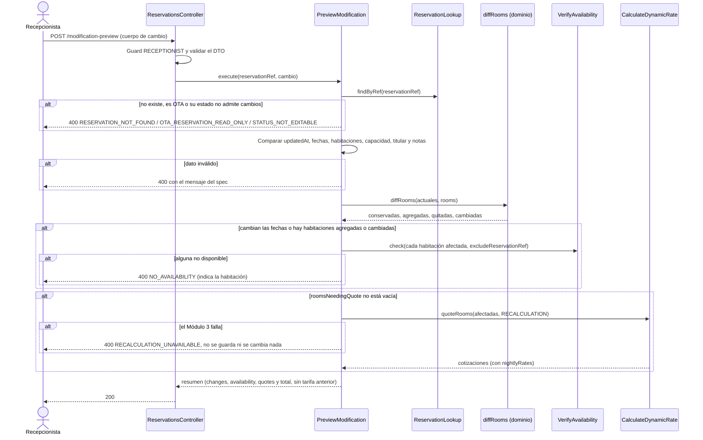
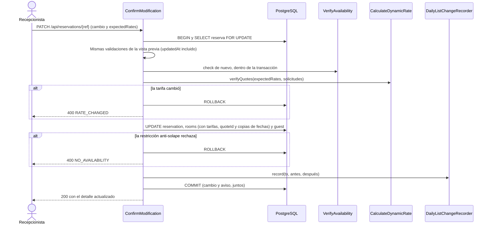
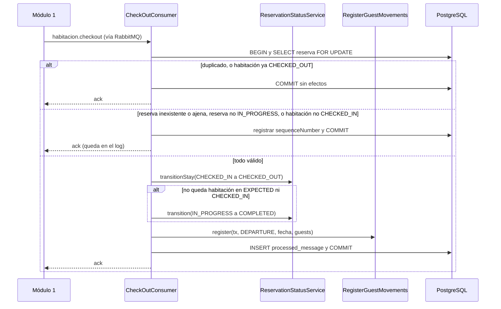
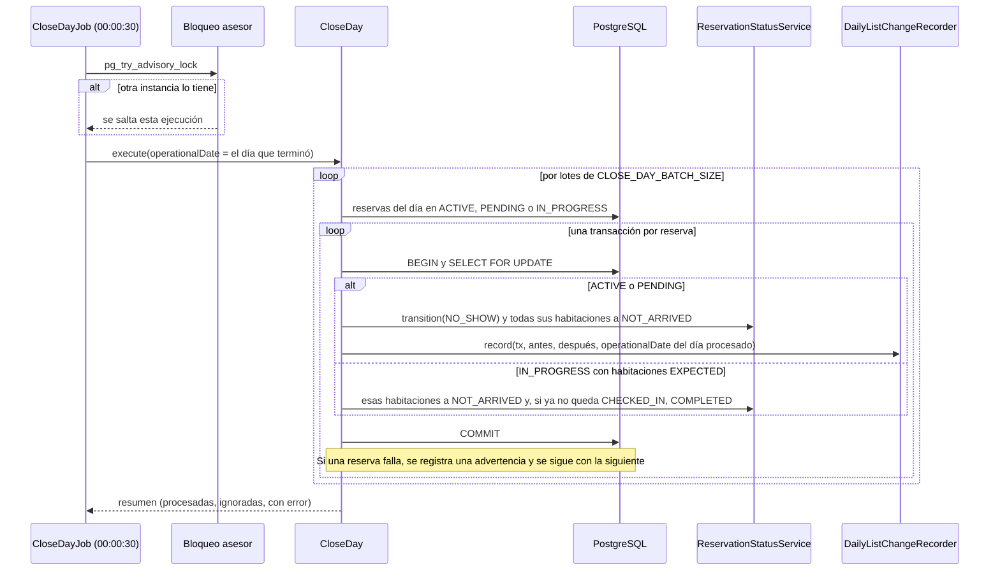

# Implementation Plan: Actualizar reservación (`update-reservation`)

**Plan base**: [../base/plan.md](../base/plan.md)
**Spec**: [./spec.md](spec.md)
**Guía**: [../base/guia-planes-por-caso-de-uso.md](../base/guia-planes-por-caso-de-uso.md)

## Summary

Este caso de uso es **el único punto donde cambia el estado de una reserva** (`Reservation.status`) y el
de cada una de sus habitaciones (`ReservationRoom.stayStatus`), y donde se modifica una reserva directa.
Tiene cuatro capacidades:

1. **Modificar una reserva directa** (Recepcionista): fechas, habitaciones (agregar, quitar, cambiar),
   personas por habitación, datos del titular y observaciones. Es una API en **dos pasos**: una vista
   previa que no guarda nada y una confirmación que sí (decisión D8 del plan base).
2. **Procesar el Check-In y el Check-Out** que notifica el Módulo 1 por cola, una notificación por
   habitación: cambia el `stayStatus`, la reserva y registra a los huéspedes (llamando a
   `process-guest-data`).
3. **Cerrar el día** (No-Show): una tarea programada marca `NO_SHOW` las reservas que no se presentaron
   y `NOT_ARRIVED` las habitaciones que no ingresaron.
4. **Aplicar las transiciones de estado** que piden otros casos de uso (confirmación OTA, cancelación,
   creación) con las mismas reglas de transición y de concurrencia, mediante `ReservationStatusService`.

El Módulo 2 **no le ordena nada al Módulo 1**: cada cambio que afecta la lista del día se avisa con
`DailyListChangeRecorder` (`check-view-reservation`) y el Módulo 1 decide qué hace con sus habitaciones.
El Check-In y el Check-Out los ejecuta el Módulo 1: este caso de uso **no tiene pantallas** para ellos
(FR-013).

## Resumen técnico e identificación

| Dato | Valor |
|---|---|
| Caso de uso | Actualizar reservación (`update-reservation`) |
| Spec | [spec.md](./spec.md), historias 1 a 3 y FR-001 a FR-023 |
| Actores | Recepcionista (modificación de reservas directas); Módulo 1 (Check-In y Check-Out por cola); sistema (cierre del día); `generate-ota-reservation`, `cancel-reservation` y `generate-direct-reservation` (transiciones de estado) |
| Naturaleza | Escribe `reservation`, `reservation_room`, `guest` y `processed_message`; lee y avisa por `DailyListChangeRecorder` |

| # | Capacidad | Disparador | Actor | Contrato |
|---|---|---|---|---|
| 1 | Vista previa de una modificación | REST `POST /api/reservations/{reservationRef}/modification-preview` | Recepcionista | B1 |
| 2 | Confirmar una modificación | REST `PATCH /api/reservations/{reservationRef}` | Recepcionista | B2 |
| 3 | Check-In de una habitación | Cola `m2.habitacion.checkin.queue` | Módulo 1 | A |
| 4 | Check-Out de una habitación | Cola `m2.habitacion.checkout.queue` | Módulo 1 | A |
| 5 | Cierre del día (No-Show) | Tarea programada `CloseDayJob` | Sistema | D |
| 6 | Cambio de estado | Llamada interna `ReservationStatusService` | Otros casos de uso | C |

La modificación de una reserva de **OTA** la hace la propia agencia por su API; sus rutas las definirá el
caso de uso futuro "Configurar OTA" (plan base). Este plan no las define.

## Technical Context

El stack, la arquitectura hexagonal, la mensajería y el manejo de errores son los del
[plan base](../base/plan.md). Lo propio de este caso de uso:

- **Dependencias nuevas**: ninguna.
- **Almacenamiento**: `reservation`, `reservation_room`, `guest`, `processed_message` (todas del plan
  base).
- **Configuración**: `CLOSE_DAY_BATCH_SIZE` (por defecto `100`).
- **Performance**: recotización de hasta 10 habitaciones en menos de 3 s (NFR-001); cada notificación de
  Check-In o Check-Out en menos de 500 ms (NFR-002); cierre del día de 1000 reservas en menos de 1 minuto
  (NFR-003).

## Contratos

### A. Notificaciones de Check-In y Check-Out (Módulo 1 → Módulo 2)

Contrato **ya acordado con el equipo del Módulo 1** (borrador de este plan).

| Cola | Routing key | Contenido |
|---|---|---|
| `m2.habitacion.checkin.queue` | `habitacion.checkin` | `messageId`, `sequenceNumber`, `reservationRef`, `roomId`, `movementType` (`ENTRY`), `movementDate` (`checkInDate`) y la lista `guests` con todos los huéspedes de la habitación |
| `m2.habitacion.checkout.queue` | `habitacion.checkout` | `messageId`, `sequenceNumber`, `reservationRef`, `roomId`, `movementType` (`DEPARTURE`), `movementDate` (`checkOutDate`) y la lista `guests` con todos los huéspedes de la habitación |

- El `movementType` y el `movementDate` van a nivel de mensaje y valen para todos los huéspedes de la
  lista.
- Cada huésped de `guests` trae `firstName`, `lastName`, `documentType` (`RC`, `TI`, `CC`, `CE`, `PAS`
  o `NIT`), `documentNumber`, `birthDate` y `nationality` (nombre del país; un colombiano se escribe
  exactamente `Colombia`). `originPlace` y `destinationPlace` solo son obligatorios para extranjeros.
- La lista `guests` la registra "Procesar datos de huéspedes" (`process-guest-data`).
- El `sequenceNumber` del Módulo 1 es creciente por cola y nunca se reinicia (FR-023 de la spec).

**Check-In:**

```json
{
  "messageId": "UUIDv4",
  "sequenceNumber": 123,
  "reservationRef": "RSV-8D02E5A4",
  "roomId": "uuid",
  "movementType": "ENTRY",
  "movementDate": "2026-10-09",
  "guests": [
    {
      "firstName": "Ana",
      "lastName": "Pérez",
      "documentType": "CC",
      "documentNumber": "123",
      "birthDate": "1995-03-20",
      "nationality": "Colombia"
    },
    {
      "firstName": "John",
      "lastName": "Smith",
      "documentType": "PAS",
      "documentNumber": "X99",
      "birthDate": "1990-05-12",
      "nationality": "Estados Unidos",
      "originPlace": "Miami, Estados Unidos",
      "destinationPlace": "Cartagena, Colombia"
    }
  ]
}
```

**Check-Out:** misma estructura, con `movementType` `DEPARTURE`, la fecha de salida y los mismos datos
de cada huésped que en el Check-In.

```json
{
  "messageId": "UUIDv4",
  "sequenceNumber": 124,
  "reservationRef": "RSV-8D02E5A4",
  "roomId": "uuid",
  "movementType": "DEPARTURE",
  "movementDate": "2026-10-12",
  "guests": [
    {
      "firstName": "Ana",
      "lastName": "Pérez",
      "documentType": "CC",
      "documentNumber": "123",
      "birthDate": "1995-03-20",
      "nationality": "Colombia"
    },
    {
      "firstName": "John",
      "lastName": "Smith",
      "documentType": "PAS",
      "documentNumber": "X99",
      "birthDate": "1990-05-12",
      "nationality": "Estados Unidos",
      "originPlace": "Miami, Estados Unidos",
      "destinationPlace": "Cartagena, Colombia"
    }
  ]
}
```

Los valores de los ejemplos son ilustrativos. El comportamiento del consumidor ante duplicados,
errores y fallos está en el plan base ("Traducción de respuestas HTTP a cola") y se detalla en
"Reglas de validación y manejo de errores".

### B. REST del Módulo 2: modificación de una reserva directa (decisión D8)

Rol `RECEPTIONIST`. **Cabeceras**: `Authorization: Bearer <JWT>`, `Content-Type: application/json`.
Sin token, 401; con otro rol, 403.

**Cuerpo de cambio** (el mismo en B1 y B2). Todo es opcional salvo `updatedAt`; lo que no se envía
queda igual:

```json
{
  "updatedAt": "2026-10-08T15:42:10.123456-05:00",
  "startDate": "2026-10-12",
  "endDate": "2026-10-15",
  "rooms": [
    { "roomId": "uuid-201", "guestCount": 2 },
    { "roomId": "uuid-305", "guestCount": 1 }
  ],
  "guest": {
    "firstName": "Ana", "lastName": "Pérez", "documentType": "CC",
    "documentNumber": "123", "contactPhone": "+57 300 000 0000", "contactEmail": "ana@correo.com"
  },
  "notes": "Llegada tarde"
}
```

- `updatedAt`: el que la pantalla leyó de la reserva; es el control de concurrencia (FR-008).
- `rooms`: cuando viene, es la **lista completa** de habitaciones que quedan en la reserva, cada una por su
  `roomId` y con su `guestCount`. El sistema la compara con la actual para saber cuáles se **conservan**,
  **agregan**, **quitan** o **cambian**.
- `guest`: los datos del titular, **sin `nationality`**: la nacionalidad se fija al crear la reserva.
- `notes`: máximo 500 caracteres.

**B1. `POST /api/reservations/{reservationRef}/modification-preview`**: **no guarda nada**. Valida todo,
verifica disponibilidad, cotiza lo que corresponda y devuelve el resumen.

```json
{
  "reservationRef": "RSV-3F9A1C7B",
  "changes": {
    "dates": true,
    "roomsAdded": ["uuid-305"],
    "roomsRemoved": [],
    "roomsSwapped": [],
    "guestCountChanged": true,
    "guestChanged": false,
    "notesChanged": false
  },
  "requiresConfirmation": true,
  "availability": {
    "rooms": [
      { "roomId": "uuid-201", "roomNumber": "201", "available": true, "reason": null },
      { "roomId": "uuid-305", "roomNumber": "305", "available": true, "reason": null }
    ]
  },
  "quotes": {
    "rooms": [
      {
        "key": "uuid-305",
        "categoryRoom": "SUITE",
        "nights": 3,
        "nightlyRates": [
          { "date": "2026-10-12", "rate": { "amount": "480000.00", "currency": "COP" } }
        ],
        "lodgingAmount": { "amount": "1440000.00", "currency": "COP" }
      }
    ],
    "total": { "amount": "2130000.00", "currency": "COP" }
  },
  "reservation": { "startDate": "2026-10-12", "endDate": "2026-10-15", "guestCount": 3 }
}
```

- `quotes` solo trae las **habitaciones recotizadas** (las que dicta `roomsNeedingQuote` de
  `calculate-dynamic-rate`), con el mismo detalle que al crear la reserva. **Sin tarifa anterior ni
  diferencia.** Si el cambio no recotiza (solo personas, datos o notas, o una habitación por otra de la
  misma categoría), `quotes` es `null`.
- `total` es la suma de los `lodgingAmount` de **todas** las habitaciones que quedarían (las que se
  conservan y las cotizadas); no se guarda (`calculate-dynamic-rate`, B3).
- `requiresConfirmation` es `true` solo cuando hay cotizaciones que el solicitante debe aceptar.
- `availability` trae la disponibilidad de las habitaciones verificadas (las que cambian de fechas o se
  agregan).
- La vista previa devuelve **el mismo error 400** que la confirmación si algo no es válido o no hay
  disponibilidad.

**B2. `PATCH /api/reservations/{reservationRef}`**: confirma y guarda. Cuerpo = el de cambio más las
tarifas que el solicitante vio:

```json
{
  "updatedAt": "2026-10-08T15:42:10.123456-05:00",
  "startDate": "2026-10-12",
  "endDate": "2026-10-15",
  "rooms": [ { "roomId": "uuid-201", "guestCount": 2 }, { "roomId": "uuid-305", "guestCount": 1 } ],
  "expectedRates": [ { "roomId": "uuid-305", "lodgingAmount": "1440000.00" } ]
}
```

- `expectedRates`: el `lodgingAmount` de cada habitación recotizada que vio el solicitante. Es obligatorio
  cuando la vista previa tuvo `requiresConfirmation: true`.
- El servidor **vuelve a validar y cotizar** y compara con `expectedRates` (decisión D1). Si difieren,
  400 `RATE_CHANGED`. **Nunca se guarda un monto enviado por el cliente.**
- **Respuesta 200**: el detalle de la reserva actualizada, con la forma de `check-view-reservation`
  (C3). El `updatedAt` nuevo viene ahí.

**Errores 400** (los mismos para B1 y B2; el mensaje es el literal del spec cuando existe):

| `errorCode` | Cuándo | `message` |
|---|---|---|
| `RESERVATION_NOT_FOUND` | La reserva no existe | "La reserva no existe." |
| `OTA_RESERVATION_READ_ONLY` | La Recepcionista modifica una reserva `OTA` | "Las reservas de OTA solo las modifica la agencia por su API." |
| `STATUS_NOT_EDITABLE` | La reserva está en `IN_PROGRESS`, `COMPLETED`, `CANCELLED` o `NO_SHOW` | "El estado actual de la reserva no admite modificaciones." |
| `CONCURRENT_UPDATE` | `updatedAt` no coincide (otra persona la modificó) | "La reserva fue modificada por otra persona. Recargue la información e intente de nuevo." |
| `INVALID_STAY_DATES` | Fechas vacías o salida no posterior a la entrada | "La fecha de salida debe ser posterior a la de entrada." |
| `START_DATE_IN_PAST` | Entrada anterior al día operativo en curso | "La fecha de entrada no puede ser anterior a hoy." |
| `ROOM_ALREADY_IN_RESERVATION` | Una habitación repetida en `rooms` | "La habitación ya forma parte de la reserva." |
| `INVALID_ROOM_COUNT` | Menos de 1 o más de 10 habitaciones | "Una reserva lleva entre 1 y 10 habitaciones." |
| `LAST_ROOM_CANNOT_BE_REMOVED` | `rooms` dejaría la reserva sin habitaciones | "La reserva debe conservar al menos una habitación." |
| `GUEST_COUNT_EXCEEDS_CAPACITY` | `guestCount` mayor que el `maxCapacity` | "La cantidad de personas supera la capacidad de la habitación." |
| `GUEST_COUNT_TOO_LOW` | `guestCount` menor que 1 | "Cada habitación debe tener al menos una persona." |
| `NO_AVAILABILITY` | Una habitación no está disponible | "La habitación {roomNumber} no está disponible en las fechas solicitadas: {motivo}." |
| `NATIONALITY_NOT_EDITABLE` | El cuerpo trae `guest.nationality` | "La nacionalidad no se puede modificar." |
| `NOTES_TOO_LONG` | `notes` de más de 500 caracteres | "Las observaciones no pueden superar 500 caracteres." |
| `INVALID_CHARACTERS` | Caracteres no válidos en datos del titular o `notes` | "El formato de los datos contiene caracteres no válidos." |
| `RECALCULATION_UNAVAILABLE` | El Módulo 3 no responde al recotizar | "No se pudo calcular la nueva tarifa en este momento. Intente más tarde." |
| `RATE_CHANGED` | La tarifa cambió entre la vista previa y la confirmación | "La tarifa cambió, vuelva a cotizar." |
| `INVENTORY_UNAVAILABLE`, `MAINTENANCE_CHECK_UNAVAILABLE`, `INVALID_ROOM_ID` | Fallos del Módulo 1 o `roomId` inexistente | Los de `consult-room-inventory` y `consult-maintenance-calendar` |

### C. Puertos de entrada internos

**C1. `ReservationStatusService`** (único lugar con las transiciones; lo usan este caso de uso,
`generate-direct-reservation`, `generate-ota-reservation` y `cancel-reservation`):

```typescript
interface ReservationStatusService {
  // Cambia el status de la reserva. Lanza INVALID_STATUS_TRANSITION si no está permitido.
  transition(tx: Transaction, reservation: Reservation, target: ReservationStatus, reason: StatusReason): Reservation;
  // Cambia el stayStatus de una habitación y recalcula blocks_inventory.
  transitionStay(tx: Transaction, reservation: Reservation, roomId: string, target: StayStatus): Reservation;
}
```

**Transiciones permitidas** (las vive el dominio; cualquier otra se rechaza):

| De | A | Lo pide |
|---|---|---|
| (nueva) | `ACTIVE` | `generate-direct-reservation` |
| (nueva) | `PENDING` | `generate-ota-reservation` |
| `PENDING` | `ACTIVE` | `generate-ota-reservation` (confirmación de pago o garantía) |
| `ACTIVE` | `IN_PROGRESS` | Check-In de la primera habitación |
| `IN_PROGRESS` | `COMPLETED` | Check-Out o cierre del día, cuando no queda habitación en `EXPECTED` ni `CHECKED_IN` |
| `ACTIVE` o `PENDING` | `NO_SHOW` | Cierre del día |
| `ACTIVE` o `PENDING` | `CANCELLED` | `cancel-reservation` |

| `stayStatus` de la habitación | A | Lo pide |
|---|---|---|
| `EXPECTED` | `CHECKED_IN` | Check-In de la habitación |
| `CHECKED_IN` | `CHECKED_OUT` | Check-Out de la habitación |
| `EXPECTED` | `NOT_ARRIVED` | Cierre del día |

- `StatusReason` (columna `status_reason`, D6): `CHECK_IN`, `CHECK_OUT`, `DAY_CLOSE_NO_SHOW`,
  `DAY_CLOSE_PARTIAL`, `OTA_CONFIRMED`, `CANCELLED_BY_RECEPTION` y `CANCELLED_BY_OTA`.
- Cada transición **recalcula `reservation_room.blocks_inventory`**: `true` mientras la reserva está en
  `PENDING`, `ACTIVE` o `IN_PROGRESS` y la habitación en `EXPECTED` o `CHECKED_IN` (D3).
- Control de concurrencia: `UPDATE … WHERE id = :id AND updated_at = :expected`; sin filas afectadas,
  `CONCURRENT_UPDATE`.

**C2. Aviso de la lista del día**: este caso de uso llama a `DailyListChangeRecorder.record(tx, antes,
después, operationalDate?)` (de `check-view-reservation`) **dentro de su transacción**. Lo hace en la
modificación y en el No-Show total. No lo llama en el Check-In ni en el Check-Out (FR-017 de ese caso de
uso).

**C3. Registro de huéspedes**: llama a `RegisterGuestMovements.register(tx, …)` de `process-guest-data`
en el Check-In y en el Check-Out.

### D. Cierre del día

`CloseDayJob` (`@nestjs/schedule`, `America/Bogota`, con bloqueo asesor): se ejecuta **a las 00:00:30**
y procesa **el día operativo que acaba de terminar** (`operationalDate` explícito). Detalle en "Reglas
de negocio".

## Reglas de negocio

### Modificación

1. **Quién y cuándo**: solo reservas `DIRECT` en `ACTIVE` (las `PENDING` son siempre de OTA). Otro estado,
   `STATUS_NOT_EDITABLE`; una `OTA`, `OTA_RESERVATION_READ_ONLY`.
2. **Qué cambia** (`diffRooms`, función pura del dominio) comparando `rooms` con las actuales:

| Resultado | Cuándo |
|---|---|
| **Conservada** | El mismo `roomId`: se actualiza solo su `guestCount` |
| **Agregada** | Un `roomId` nuevo sin habitación de la misma categoría que se quite |
| **Quitada** | Un `roomId` actual que ya no está |
| **Cambiada de la misma categoría** | Una quitada y una agregada de la misma categoría: la nueva **hereda** la tarifa (`roomGrossAmount`, `quoteId` y `currency`) de la quitada, sin recotizar, si las fechas no cambian |
| **Cambiada de categoría** | Una quitada y una agregada de distinta categoría: la nueva se cotiza |

3. **Qué se valida y en qué orden** (la primera falla responde):
   1. Reserva existente, `DIRECT` y `ACTIVE`.
   2. `updatedAt` coincide.
   3. Fechas: entrada no anterior al día operativo en curso (Clock, no una fecha fija) y salida posterior.
   4. Habitaciones: entre 1 y 10, sin repetidas, al menos una conservada o agregada; cada `roomId` existe en
      el Módulo 1 (`ConsultRoomInventory.byRoomId`).
   5. `guestCount` de cada habitación: al menos 1 y no mayor que su `maxCapacity` (la de la reserva es la
      suma).
   6. Titular sin `nationality`, y datos y `notes` con caracteres válidos y `notes` de máximo 500.
   7. Disponibilidad (`VerifyAvailability`, con `excludeReservationRef`): de **todas las habitaciones que
      quedan** si cambian las fechas, y solo de las **agregadas o cambiadas** en los demás casos. Si una
      falla, se rechaza el cambio completo.
   8. Cotización (`CalculateDynamicRate.quoteRooms`, contexto `RECALCULATION`) de lo que dicta
      `roomsNeedingQuote`, todo o nada.
4. **Sin recotizar ni verificar disponibilidad** cuando solo cambian `guestCount`, datos del titular o
   `notes` (FR-004).
5. **Persistencia** (en una sola transacción, con `SELECT … FOR UPDATE` de la reserva y el control de
   `updatedAt`): actualiza fechas, `guest_count` (la suma), `notes`; inserta, borra y actualiza
   habitaciones con sus tarifas y copias de fechas (D3); actualiza el titular; y llama a
   `DailyListChangeRecorder`. Una violación de la restricción anti-solape se traduce en `NO_AVAILABILITY`.
6. **Titular**: corrige el `guest` de **esta** reserva (cada reserva tiene su propio titular, plan base),
   con todos sus datos salvo `nationality`. No afecta a otras reservas ni a `guest_data`: la modificación
   solo se permite antes del Check-In.

### Check-In (FR-015)

Orden de las verificaciones, dentro de una transacción con `SELECT … FOR UPDATE` de la reserva:

| # | Verificación | Si falla |
|---|---|---|
| 1 | `messageId` ya procesado (`processed_message`) | Duplicado: se confirma sin efectos |
| 2 | La reserva existe | Log "La reserva notificada no existe en el sistema de reservas." y se confirma |
| 3 | El `roomId` pertenece a la reserva | Log "La habitación notificada no pertenece a la reserva." y se confirma |
| 4 | La habitación ya está `CHECKED_IN` | Duplicado idempotente: se confirma sin efectos |
| 5 | La reserva está en `ACTIVE` o `IN_PROGRESS` | Log "La reserva no admite un Check-In en su estado actual." y se confirma |
| 6 | La habitación está en `EXPECTED` (no `NOT_ARRIVED` ni `CHECKED_OUT`) | Log con el estado y se confirma |

Si pasa todo: `EXPECTED → CHECKED_IN`; si es la primera, reserva `ACTIVE → IN_PROGRESS`;
`RegisterGuestMovements`; inserta el `messageId` en `processed_message`. **No** avisa a la lista del día.

### Check-Out (FR-017)

Mismas verificaciones 1 a 4 (con `CHECKED_OUT` como duplicado), y luego:

| # | Verificación | Si falla |
|---|---|---|
| 5 | La reserva está en `IN_PROGRESS` | Log "La reserva aún no registra un ingreso." y se confirma |
| 6 | La habitación está en `CHECKED_IN` | Log "La habitación notificada aún no registra un ingreso." y se confirma |

Si pasa todo: `CHECKED_IN → CHECKED_OUT`; si ya no queda ninguna habitación en `EXPECTED` ni en
`CHECKED_IN`, reserva `IN_PROGRESS → COMPLETED`; `RegisterGuestMovements`; inserta el `messageId`. **No**
modifica el estado de la `Room`: es del Módulo 1.

Un Check-In para una reserva `CANCELLED`, `NO_SHOW`, `PENDING` o `COMPLETED`, o para una habitación
`NOT_ARRIVED`, y un Check-Out de una reserva `CANCELLED` o `NO_SHOW`, se rechazan **sin cambiar nada** y
quedan en el log: el efecto físico ya ocurrió en el Módulo 1 y la Recepcionista decide qué hacer. Un
Check-In antes de la fecha de inicio se procesa con normalidad (el Módulo 1 valida las fechas de ingreso).

**Salto de secuencia** (FR-023): se compara el `sequenceNumber` con el mayor ya procesado de esa cola; si
hay un salto, se **registra una advertencia y se sigue procesando**. El Módulo 2 no reordena.

### Cierre del día

Para el `operationalDate` que acaba de terminar, en lotes de `CLOSE_DAY_BATCH_SIZE`, **una transacción por
reserva** (así un registro corrupto no interrumpe el lote, FR-022):

| Reserva | Qué hace |
|---|---|
| `ACTIVE` o `PENDING` con `startDate` = día procesado | `NO_SHOW` (cualquier canal, sin `Cancellation`, FR-021), todas sus habitaciones `NOT_ARRIVED`, y `DailyListChangeRecorder` con `REMOVED` motivo `NO_SHOW` **del día procesado** |
| `IN_PROGRESS` con habitaciones en `EXPECTED` | Esas habitaciones pasan a `NOT_ARRIVED`; la reserva sigue `IN_PROGRESS`, o pasa a `COMPLETED` si ya no queda ninguna `CHECKED_IN`; no avisa a la lista |
| `IN_PROGRESS` con todas las habitaciones ingresadas | Se ignora |
| Cualquier estado final | Se ignora |

- **Idempotente**: ignora reservas que ya no están en `ACTIVE`, `PENDING` ni `IN_PROGRESS` y habitaciones
  que ya no están en `EXPECTED` (NFR-003).
- **Recuperación al arrancar**: la aplicación ejecuta el cierre del día anterior si está pendiente (es
  idempotente), para cubrir un reinicio o una caída a las 00:00.
- **Zona horaria**: usa siempre el `Clock` del hotel (`America/Bogota`). Si la zona del servidor no
  coincide, **emite una alerta de negocio** y sigue con la del hotel.
- **Pérdida de la base de datos**: el cierre se detiene con una alerta sin detalles de infraestructura;
  como cada reserva es su propia transacción, no queda ninguna a medias.

## Diagramas de secuencia

### D1. Vista previa de una modificación (B1)



### D2. Confirmación de una modificación (B2)



### D3. Check-In de una habitación (A)

```mermaid
sequenceDiagram
    participant M1 as Módulo 1
    participant Q as RabbitMQ
    participant K as CheckInConsumer
    participant S as ReservationStatusService
    participant G as RegisterGuestMovements
    participant DB as PostgreSQL

    M1->>Q: habitacion.checkin
    Q->>K: mensaje
    K->>K: Validar estructura del mensaje
    alt payload inutilizable
        K->>Q: dead-letter queue (log sin datos personales)
    end
    K->>DB: BEGIN y SELECT reserva por reservationRef FOR UPDATE
    K->>DB: ¿messageId ya procesado?
    alt duplicado o habitación ya CHECKED_IN
        K->>DB: COMMIT sin efectos
        K-->>Q: ack
    else reserva inexistente, habitación ajena, estado inválido o habitación no EXPECTED
        K->>DB: registrar sequenceNumber y COMMIT
        K-->>Q: ack (queda en el log, sin reintento)
    else todo válido
        K->>S: transitionStay(EXPECTED a CHECKED_IN)
        K->>S: transition(ACTIVE a IN_PROGRESS) si es la primera habitación
        K->>G: register(tx, ENTRY, fecha, guests)
        K->>DB: INSERT processed_message y COMMIT
        K-->>Q: ack
    end
    Note over K,DB: Fallo temporal: sin commit; reintento con espera creciente y, agotados, dead-letter queue
```

### D4. Check-Out de una habitación (A)



### D5. Cierre del día (D)



## Modelo de datos y entidades involucradas

**No se crean tablas.** Se usan las del plan base:

| Tabla | Qué cambia este caso de uso |
|---|---|
| `reservation` | `start_date`, `end_date`, `guest_count` (suma), `notes`, `status`, `status_reason`, `updated_at` |
| `reservation_room` | Alta, baja y cambio de habitaciones; `guest_count`; `stay_status`; tarifas (`room_gross_amount`, `quote_id`, `currency`, solo `DIRECT`); copias de fechas y `blocks_inventory` (D3) |
| `guest` | Datos del titular, salvo `nationality` |
| `processed_message` | Una fila por mensaje de Check-In o Check-Out atendido (idempotencia y control de secuencia) |
| `daily_list_message`, `daily_sequence` | Los escribe `DailyListChangeRecorder` dentro de la misma transacción |
| `guest_data`, `migratory_movement` | Los escribe `process-guest-data` desde el Check-In y el Check-Out |

- **No hay `Cancellation` por un No-Show** (FR-021).
- **Control de concurrencia**: `reservation.updated_at` con microsegundos, más `SELECT … FOR UPDATE` para
  serializar la modificación con una notificación de Check-In o Check-Out de la misma reserva.
- **`processed_message`** se inserta en la misma transacción que el cambio. Para no marcar saltos falsos,
  también se inserta el `sequenceNumber` de las notificaciones rechazadas que se confirman (ver "Puntos
  que este plan propone").
- Índice que necesita el control de secuencia: `processed_message(queue, sequence_number)`.

**Máquina de estados** (la implementa `ReservationStatusService`):

```text
Reservation:  PENDING --OTA confirma--> ACTIVE --1.er Check-In--> IN_PROGRESS --último Check-Out--> COMPLETED
              ACTIVE | PENDING --cierre del día--> NO_SHOW        ACTIVE | PENDING --cancelar--> CANCELLED
Habitación:   EXPECTED --Check-In--> CHECKED_IN --Check-Out--> CHECKED_OUT
              EXPECTED --cierre del día--> NOT_ARRIVED
```

## Reglas de validación y manejo de errores

Todo error REST sale con `{ "errorCode", "message", "timestamp", "path" }` y **siempre 4xx**; nunca 500.

### REST (modificación)

Los errores de B1 y B2 están en el contrato B. Además:

| Situación | HTTP | `errorCode` |
|---|---|---|
| Sin token o token inválido | 401 | `UNAUTHENTICATED` |
| Rol distinto de `RECEPTIONIST` | 403 | `FORBIDDEN` |
| Excepción inesperada | 400 | `REQUEST_NOT_PROCESSED` |
| Transición de estado no permitida (la lanza `ReservationStatusService`) | 400 | `INVALID_STATUS_TRANSITION`, "La transición de estado no está permitida." |

### Colas (Check-In y Check-Out)

El spec habla de "HTTP 200 / 400". Como el Módulo 1 publica por cola y no espera respuesta, se aplica la
traducción del plan base:

| Caso del spec | Comportamiento del consumidor |
|---|---|
| Notificación válida (200) | Aplica el cambio, registra el `messageId` y confirma el mensaje |
| Duplicado: mismo `messageId`, o habitación ya en `CHECKED_IN` (Check-In) o `CHECKED_OUT` (Check-Out) (200 idempotente) | Confirma sin efectos |
| Reserva inexistente, estado que no admite el evento, habitación ajena, `NOT_ARRIVED`, sin ingreso (400) | **Confirma sin cambiar nada**, deja el caso en el log (sin datos personales) con el mensaje del spec y **no reintenta** |
| Payload ilegible, sin `reservationRef` o `roomId`, o con caracteres maliciosos (400 de payload inválido) | **Dead-letter queue**, sin procesar; log "El payload de notificación es inválido. Falta el identificador de la reserva o de la habitación." |
| Fallo temporal (base de datos caída) | Sin `commit`, reintento con espera creciente y, agotados los reintentos, dead-letter queue |
| Salto de `sequenceNumber` | Advertencia en el log; se sigue procesando |

Mensajes del log (literales del spec): Check-In, "La reserva notificada no existe en el sistema de
reservas.", "La habitación notificada no pertenece a la reserva." y que "la reserva no admite un Check-In en
su estado actual"; Check-Out, "Referencia de reserva no encontrada", "La habitación notificada aún no
registra un ingreso." y que "la reserva aún no registra un ingreso".

### Cierre del día

| Situación | Comportamiento |
|---|---|
| Una reserva con datos corruptos | Advertencia controlada y se continúa con el resto (FR-022) |
| Ejecución repetida el mismo día | Sin errores ni cambios (idempotente) |
| Zona horaria del servidor distinta de la del hotel | Alerta de negocio; sigue con la del hotel |
| Pérdida de conexión a la base de datos | Se detiene, alerta controlada, sin reservas a medias; la recuperación al arrancar lo completa |

## Integraciones externas

| Módulo | Dirección | Mecanismo | Contrato | Fallo o tiempo agotado |
|---|---|---|---|---|
| Módulo 1 | M1 → M2 | Colas `m2.habitacion.checkin.queue` y `m2.habitacion.checkout.queue` | A | Reintentos y dead-letter queue; sin respuesta al Módulo 1 |
| Módulo 1 | M2 → M1 | Inventario y mantenimientos (vía `VerifyAvailability`) | Planes de `consult-room-inventory` y `consult-maintenance-calendar` | `INVENTORY_UNAVAILABLE` o `MAINTENANCE_CHECK_UNAVAILABLE` (400) |
| Módulo 1 | M2 → M1 | Lista del día (vía `DailyListChangeRecorder`) | Plan de `check-view-reservation` | Mensaje `PENDING` con reintento en orden |
| Módulo 3 | M2 → M3 | `POST /pricing/quotes`, por habitación (vía `CalculateDynamicRate`) | Plan de `calculate-dynamic-rate` | `RECALCULATION_UNAVAILABLE` (400); no se aplica ningún cambio |

- **No se le ordena nada al Módulo 1**: ni apartar ni liberar habitaciones (FR-009, FR-020).
- La modificación **nunca** cambia el estado de una `Room`, que es del Módulo 1.

## Arquitectura (capas del plan base)

| Capa | Piezas de este caso de uso |
|---|---|
| `domain/reservation/` | Transiciones de `status` y `stayStatus`, `diffRooms`, `blocks_inventory`, reglas de capacidad y de número de habitaciones |
| `application/use-cases/update-reservation/` | **Entrada**: `PreviewModification`, `ConfirmModification`, `ProcessCheckIn`, `ProcessCheckOut`, `CloseDay`, `ReservationStatusService` |
| `application/ports/out/` | Repositorios, `Clock`, `DailyListChangeRecorder`, `RegisterGuestMovements`, `VerifyAvailability`, `CalculateDynamicRate` (puertos de otros casos de uso) |
| `infrastructure/in/rest/` | `ReservationsController` (B1 y B2) |
| `infrastructure/in/messaging/` | `CheckInConsumer` y `CheckOutConsumer` |
| `infrastructure/in/jobs/` | `CloseDayJob` |

```text
backend/src/
├── domain/reservation/
│   ├── reservation-transitions.ts       # tablas de transición de status y stayStatus
│   ├── diff-rooms.ts
│   ├── blocks-inventory.ts
│   └── reservation-rules.ts             # 1 a 10 habitaciones, capacidad, fechas
├── application/use-cases/update-reservation/
│   ├── ports/in/
│   ├── reservation-status.service.ts
│   ├── preview-modification.service.ts
│   ├── confirm-modification.service.ts
│   ├── process-check-in.service.ts
│   ├── process-check-out.service.ts
│   ├── close-day.service.ts
│   └── modification-request.validator.ts
├── infrastructure/in/
│   ├── rest/reservations.controller.ts          # compartido con los otros casos de uso de reservas
│   ├── messaging/check-in.consumer.ts
│   ├── messaging/check-out.consumer.ts
│   └── jobs/close-day.job.ts
backend/test/
├── unit/update-reservation/            # transiciones, diffRooms, reglas, validadores
├── integration/update-reservation/     # Testcontainers: modificación, Check-In y Check-Out, cierre del día
└── contract/                           # forma de los mensajes y de los DTO REST
frontend/src/pages/reservations/modify/ # pantalla Modificar (vista previa y confirmación)
```

## Phase 1: Setup

- [ ] T001 Variable `CLOSE_DAY_BATCH_SIZE` e índice `processed_message(queue, sequence_number)`

## Phase 2: Foundational

- [ ] T002 [P] Tablas de transición de `status` y `stayStatus` en el dominio, con una prueba por fila permitida y por cada rechazo
- [ ] T003 [P] `blocks_inventory` recalculado en cada transición (D3)
- [ ] T004 [P] `diffRooms` (conservadas, agregadas, quitadas y cambiadas) con pruebas
- [ ] T005 [P] Reglas de reserva: 1 a 10 habitaciones sin repetidas, capacidad, fechas (día operativo), `notes`
- [ ] T006 `ReservationStatusService` con control de concurrencia por `updated_at` y `status_reason`
- [ ] T007 Códigos de error y mensajes literales de B y de C (incluidos `INVALID_STATUS_TRANSITION` y `CONCURRENT_UPDATE`)

## Phase 3: User Story 1 - Modificación de datos de la reserva (P1)

**Goal**: la Recepcionista modifica una reserva directa y solo se guarda lo confirmado.
**Independent Test**: una reserva `ACTIVE`: cambio de fechas con recotización, datos personales sin
recálculo, y bloqueo en `IN_PROGRESS`, `COMPLETED`, `CANCELLED` y `NO_SHOW`.

- [ ] T008 [US1] Validador del cuerpo de cambio (formatos, `notes`, sin `nationality`, caracteres válidos)
- [ ] T009 [US1] `PreviewModification` y `POST …/modification-preview` (B1), con disponibilidad y cotización de lo que corresponda
- [ ] T010 [US1] `ConfirmModification` y `PATCH …/{reservationRef}` (B2) en una transacción con `SELECT … FOR UPDATE`, `verifyQuotes` y comparación de `updatedAt`
- [ ] T011 [US1] Herencia de la tarifa en un cambio de habitación de la misma categoría, y recotización solo de lo afectado
- [ ] T012 [US1] Llamada a `DailyListChangeRecorder` dentro de la transacción y traducción de la violación anti-solape a `NO_AVAILABILITY`
- [ ] T013 [US1] Pruebas de integración de los escenarios 1 a 12 y de todos los casos borde de modificación
- [ ] T014 [P] [US1] Frontend: pantalla "Modificar" con vista previa de tarifas y disponibilidad

## Phase 4: User Story 2 - Check-In y Check-Out (P2)

**Goal**: el estado de la habitación y de la reserva sigue lo que notifica el Módulo 1.
**Independent Test**: reserva de dos habitaciones: Check-In de ambas y Check-Out de ambas con sus estados.

- [ ] T015 [US2] `CheckInConsumer` y `ProcessCheckIn` con el orden de verificaciones y la traducción a cola
- [ ] T016 [US2] `CheckOutConsumer` y `ProcessCheckOut` (incluido el paso a `COMPLETED`)
- [ ] T017 [US2] Idempotencia por `messageId` y por estado de la habitación, y detección de saltos de secuencia
- [ ] T018 [US2] Llamada a `RegisterGuestMovements` en el Check-In y en el Check-Out (con `process-guest-data`)
- [ ] T019 [US2] Pruebas de los escenarios 1 a 11 (incluido el 3a) y de los casos borde, y de los mensajes con su forma exacta y repetidos
- [ ] T020 [US2] Prueba de concurrencia: una modificación y un Check-In sobre la misma reserva

## Phase 5: User Story 3 - Cierre del día (P2)

- [ ] T021 [US3] `CloseDay`: No-Show total, habitaciones `NOT_ARRIVED` y paso a `COMPLETED`, con una transacción por reserva
- [ ] T022 [US3] `CloseDayJob` a las 00:00:30 con bloqueo asesor, recuperación al arrancar y alerta por zona horaria
- [ ] T023 [US3] `DailyListChangeRecorder` con `operationalDate` del día procesado (ajuste en el plan de `check-view-reservation`)
- [ ] T024 [US3] Pruebas de los escenarios 1, 3, 4 y 5, de la idempotencia y de la pérdida de conexión

## Phase 6: Estados para otros casos de uso

- [ ] T025 Exponer `ReservationStatusService` a `generate-direct-reservation`, `generate-ota-reservation` y `cancel-reservation`, y coordinar con sus planes

## Phase N: Polish

- [ ] T026 Pruebas de tiempo: recotización de 10 habitaciones en menos de 3 s, Check-In con 10 huéspedes en menos de 500 ms y cierre del día de 1000 reservas en menos de 1 minuto
- [ ] T027 Verificar que ningún log escribe datos personales de los huéspedes
- [ ] T028 Documentar B1 y B2 en OpenAPI (`@nestjs/swagger`)

## Pruebas por escenario

| Historia | Escenario | Qué se verifica |
|---|---|---|
| US1 | 1 recotización exitosa | Cambio de fechas o categoría: se muestran las tarifas de las habitaciones afectadas y, tras confirmar, se guarda |
| US1 | 2 datos personales | Sin llamar al Módulo 3 ni verificar disponibilidad |
| US1 | 3 cambio de estado interno | Las transiciones permitidas se aplican y las demás se rechazan |
| US1 | 4 sin disponibilidad | `400` `NO_AVAILABILITY` indicando la habitación; no se aplica ningún cambio parcial |
| US1 | 5 estado no editable | `IN_PROGRESS`, `COMPLETED`, `CANCELLED` y `NO_SHOW`: `400` `STATUS_NOT_EDITABLE` |
| US1 | 6 y 7 cambio de habitación | Con llegada hoy: aviso `UPDATED`; con llegada futura: sin aviso |
| US1 | 8 y 9 agregar y quitar | Habitación nueva en `EXPECTED` con su tarifa y total recalculado; quitada con su tarifa y personas |
| US1 | 10 única habitación | `400` con "La reserva debe conservar al menos una habitación." |
| US1 | 11 solo personas | Sin Módulo 3 ni disponibilidad; con llegada hoy, aviso `UPDATED` |
| US1 | 12 capacidad | 3 personas: "La cantidad de personas supera la capacidad de la habitación."; 0: "Cada habitación debe tener al menos una persona."; nada se guarda |
| US1 | Casos borde | Módulo 3 caído, fechas inválidas, fecha de entrada pasada (con "hoy" cambiando), caracteres extraños, `notes` de más de 500, habitación repetida, más de 10 habitaciones, una sola habitación no disponible, edición simultánea (`CONCURRENT_UPDATE`), fechas que hacen entrar o salir la reserva de la lista del día |
| US2 | 1 y 2 Check-In | Primera habitación: `CHECKED_IN` y `IN_PROGRESS`; otra habitación: la reserva sigue `IN_PROGRESS` |
| US2 | 3 y 3a huéspedes | Un `ENTRY` y un `DEPARTURE` por huésped mediante `process-guest-data`, sin modificar el `ENTRY` |
| US2 | 4 y 11 duplicados | Mismo `messageId` o habitación ya en el estado: se confirma sin efectos |
| US2 | 5 y 10 estado inválido | `PENDING`, `COMPLETED`, `CANCELLED`, `NO_SHOW` o sin ingreso: no cambia nada, queda en el log y no se reintenta |
| US2 | 6 y 9 habitación | Ajena a la reserva o sin ingreso: rechazo con el mensaje del spec en el log |
| US2 | 7 y 8 Check-Out | Última habitación: `COMPLETED`; parcial: la reserva sigue `IN_PROGRESS` |
| US2 | Casos borde | Payload vacío o sin identificadores: dead-letter queue; reserva inexistente; Check-In anticipado; Check-Out retrasado; salto de secuencia (advertencia, sigue); `NOT_ARRIVED` |
| US3 | 1 No-Show | `ACTIVE` y `PENDING` de cualquier canal: `NO_SHOW`, habitaciones `NOT_ARRIVED`, `REMOVED` `NO_SHOW` con la fecha operativa del día cerrado y sin `Cancellation` |
| US3 | 3 llegada parcial | La habitación sin ingreso pasa a `NOT_ARRIVED` y la reserva sigue `IN_PROGRESS` |
| US3 | 4 todo ingresó | Se ignora |
| US3 | 5 fallo aislado | Una reserva corrupta no detiene el lote |
| NFR-003 | Idempotencia | El cierre dos veces el mismo día no cambia nada |
| US3 | Casos borde del cierre | Zona horaria del servidor distinta de `America/Bogota`: se usa la del hotel y se emite la alerta de negocio; pérdida de la conexión a la base de datos a mitad del lote: el cierre se detiene con una alerta sin detalles de infraestructura, ninguna reserva queda a medias y la recuperación al arrancar lo completa |
| Contrato | Mensajes | Forma exacta de Check-In y Check-Out y mensaje repetido con el mismo `messageId` |

## Dependencies & Execution Order

- **Depende de**: el plan base (esquema, mensajería, `processed_message`, roles, bloqueo asesor),
  `check-view-reservation` (`ReservationLookup`, `DailyListChangeRecorder`), `check-room-availability`,
  `calculate-dynamic-rate`, `consult-room-inventory` y `process-guest-data`.
- **Necesitan de este caso de uso** (`ReservationStatusService`): `generate-direct-reservation`,
  `generate-ota-reservation` y `cancel-reservation`.
- **Orden**: T001–T007 → US1 (T008–T014) → US2 (T015–T020) → US3 (T021–T024) → T025 → Polish. Va antes
  de las reservas y de la cancelación porque ellas usan sus transiciones.

## Trazabilidad: requisito → componente → tarea

| Requisito | Componente | Tarea |
|---|---|---|
| FR-001, FR-001a | Reglas de edición y `OTA_RESERVATION_READ_ONLY` | T005, T009, T010 |
| FR-002 | `VerifyAvailability` con `excludeReservationRef` | T009, T010 |
| FR-003, FR-004 | `roomsNeedingQuote` y vista previa sin tarifa anterior | T004, T009, T011 |
| FR-004a | Fechas contra el día operativo (Clock) | T005, T013 |
| FR-005 | Reglas de habitaciones y capacidad | T005 |
| FR-006, FR-007 | `ReservationStatusService` y tablas de transición | T002, T006, T025 |
| FR-008 | `updated_at` y `SELECT … FOR UPDATE` | T006, T010, T020 |
| FR-009, FR-011, FR-012 | `DailyListChangeRecorder` dentro de la transacción | T012, T023 |
| FR-010 | Mapeo a 400 y a dead-letter queue | T007, T015 |
| FR-013 | Sin interfaz de Check-In ni Check-Out; solo consumidores | T015, T016 |
| FR-014, FR-015, FR-017 | Consumidores y orden de verificaciones | T015, T016 |
| FR-016 | `RegisterGuestMovements` | T018 |
| FR-018 a FR-022 | `CloseDay` y `CloseDayJob` | T021, T022 |
| FR-023 | `processed_message` y control de secuencia | T017 |
| NFR-001 a NFR-003 | Pruebas de tiempo | T026 |
| SC-001 a SC-008 | Pruebas por escenario | T013, T019, T024 |

## Puntos que este plan propone (el spec no los dice)

1. **Cierre del día a las 00:00:30**, procesando el día que acaba de terminar con su `operationalDate`
   explícito. El plan base dice "al terminar las 23:59". Así el cierre no compite con una notificación de
   las 23:59 y el aviso `REMOVED` lleva la fecha del día cerrado.
2. **`rooms` como lista completa por `roomId`**, y la herencia de tarifa en un cambio de habitación de la
   misma categoría (la nueva toma la tarifa de la quitada).
3. **Códigos y mensajes** de los errores que el spec no da literales (`OTA_RESERVATION_READ_ONLY`,
   `STATUS_NOT_EDITABLE`, `CONCURRENT_UPDATE`, `NATIONALITY_NOT_EDITABLE`, `INVALID_STATUS_TRANSITION`,
   `NO_AVAILABILITY` con el número de habitación).
4. **La vista previa devuelve 400** si no hay disponibilidad, igual que la confirmación, porque el spec
   dice que intentar modificar sin disponibilidad responde 400.
5. **El total** de la reserva se muestra en la vista previa (la suma de lo que quedaría) sin tarifa
   anterior ni diferencia, porque el spec habla de "actualizar el total".
6. **Se registra el `sequenceNumber` de las notificaciones rechazadas que se confirman** en
   `processed_message` para no marcar saltos falsos.
7. **`status_reason` con códigos** (`CHECK_IN`, `CHECK_OUT`, `DAY_CLOSE_NO_SHOW`, …); el plan base lo deja
   como texto libre.
8. **Recuperación del cierre al arrancar** sin una tabla de control: se vuelve a ejecutar (es idempotente).

## Puntos abiertos

| # | Pendiente | Con quién |
|---|---|---|
| 1 | **Modificación por la OTA**: el spec la menciona ("la Ota por su API") pero las rutas las definirá el caso de uso futuro "Configurar OTA". Hasta entonces este plan solo cubre la modificación de la Recepcionista | Equipo del Módulo 2 |
| 2 | **Hora del cierre del día**: 00:00:30 contra "23:59" del plan base | Equipo del Módulo 2 |
| 3 | **Habitaciones `NOT_ARRIVED` en una reserva `IN_PROGRESS`**: el spec dice que se quitan de la lista del día, pero la reserva ya no está en la lista (está `IN_PROGRESS`), así que no hay aviso. Confirmar que es lo esperado | Módulo 1 |
| 4 | El Módulo 1 debería conservar el mismo `messageId` en los reintentos y no reiniciar el `sequenceNumber` (FR-023); confirmar | Módulo 1 |
| 5 | El spec menciona en FR-003 un texto confuso ("sin mostrar la tarifa nueva"): se interpretó como "sin mostrar la tarifa anterior", coherente con el resto del spec y con `calculate-dynamic-rate` | Equipo del Módulo 2 |
| 6 | `reservation_audit` aparecía en versiones anteriores del plan base y ya no está; este spec no pide una auditoría de las modificaciones | Equipo del Módulo 2 |

## Notes

- `[P]` marca tareas paralelizables; `[US1]`, `[US2]` y `[US3]` las ligan a su historia de usuario.
- Commit por tarea o grupo lógico, con Gitflow.
- Este plan no modifica el spec ni el plan base.
